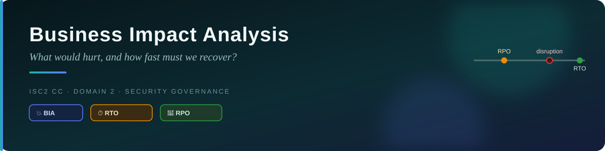

# 💥 Business Impact Analysis (BIA) — Caveman Style

---

BIA stands for:

> **Business Impact Analysis**

The key exam question is:

> "What does a BIA produce, and why does it happen before recovery/continuity plans?"

## 🧠 What is a BIA?

Imagine Grog's tribe has several important activities:

- 🥩 Getting food
- 💧 Getting water
- 🏥 Taking care of injured tribe members
- 🔥 Keeping fire
- 🏠 Protecting the cave

One day, the tribe asks:

> "If something stops working, what would hurt us the most?"

That's what a Business Impact Analysis helps determine.

### Simple definition

> **A BIA identifies critical business functions and analyzes the impacts of their disruption
> over time.**

## 🪨 Caveman Example

Imagine Grog's tribe loses access to its cave. 🏠❌

What happens?

**After 1 hour** — 😐 Annoying, but everyone can survive.

**After 1 day** — 😟 Problems become serious.

**After 3 days** — 😨 Food may be gone.

**After 1 week** — 💀 The tribe could be in serious danger.

The BIA helps determine how quickly the disruption becomes unacceptable and which activities are
most important to recover.

---

## 📦 What does a BIA produce?

This is the part you should memorize for the exam.

A BIA typically produces information about:

### 1 · ⭐ Critical business functions

It identifies:

> **Which business processes are most important?**

Example:

- Payment processing ⭐⭐⭐
- Customer support ⭐⭐
- Marketing ⭐

### 2 · 💥 Business impact

It determines what happens if each function is unavailable.

Possible impacts:

- 💰 Financial loss
- ⚖️ Legal/regulatory consequences
- 👥 Customer impact
- ⭐ Reputation damage
- 🏢 Operational disruption

### 3 · ⏱️ Recovery priorities

It helps determine:

> **What needs to be restored first?**

For example:

1. 🥇 Payment system
2. 🥈 Customer database
3. 🥉 Email system

### 4 · ⏳ RTO — Recovery Time Objective

A BIA commonly helps establish the RTO.

> **RTO = How quickly must the system/process be restored after disruption?**

Example: "The payment system must be restored within 2 hours." That's an RTO.

**Caveman version:** "How long can we survive without it?"

### 5 · 📦 RPO — Recovery Point Objective

A BIA can also help establish the RPO.

> **RPO = How much data loss can the organization tolerate, measured in time?**

Example: RPO = 1 hour. That means the organization aims to recover data to a point no more than
about 1 hour before the disruption, depending on the recovery design.

**Caveman version:** "How much of our recent food/data can we afford to lose?"

---

## ⏱️ RTO vs RPO

This is very commonly tested.

**RTO** — How FAST do we need to recover? Think: 🏃 TIME TO RECOVER

**RPO** — How much DATA can we lose? Think: 💾 DATA LOSS

### 🎯 Example

Suppose a company's database has:

> RTO = 4 hours, and RPO = 30 minutes

That means:

**RTO** — The database should be restored within approximately: ⏱️ 4 hours

**RPO** — The organization can tolerate losing approximately: 💾 30 minutes of data

---

## 🧠 Why does BIA come BEFORE the plans?

This is the most important concept.

Imagine Grog says:

> "Let's build a recovery plan!"

But he doesn't know:

- Which systems are important
- Which systems need to recover first
- How quickly they need to recover
- How much data loss is acceptable
- What the consequences of downtime are

That's like building a rescue plan without knowing what you're rescuing. 🪨🤦

### 🏗️ BIA → Plans

The BIA gives you the requirements.

Then you use those requirements to create the plans.

Think:

> **BIA = "WHAT do we need?"**
> ↓
> **Continuity/Recovery Plans = "HOW will we do it?"**

---

## 🏢 Real-World Example

Imagine an online store.

The BIA determines:

- 🛒 Order processing is critical.
- 💰 Every hour of downtime costs approximately $100,000.
- ⏱️ RTO = 2 hours.
- 💾 RPO = 15 minutes.

Now the organization can design a recovery strategy.

For example:

- Backup systems
- Redundant servers
- Replicated databases
- Disaster recovery site
- Recovery procedures

Without the BIA, they wouldn't know what recovery capabilities they actually need.

---

## 🛡️ BIA vs Disaster Recovery Plan

Don't confuse these.

**💥 BIA** — Analyzes the business impact of disruption. It tells us: "This process is critical."
"It can tolerate only 2 hours of downtime." "We can tolerate only 15 minutes of data loss."

**🛠️ Disaster Recovery Plan** — Explains how to restore IT systems after a disruption. It says
things like: "Fail over to the backup server." "Restore the database." "Verify the application."

## 🔄 BIA vs Business Continuity Plan

**BIA** — Analyze the impact and establish priorities/requirements.

**Business Continuity Plan (BCP)** — Explain how the organization will continue critical
operations during a disruption.

**Disaster Recovery Plan (DRP)** — Explain how systems/infrastructure will be recovered.

### 🪨 Caveman Flow

Remember this sequence:

> 💥 **BIA** — What happens if something stops?
> ↓
> ⭐ **Identify critical functions** — What's most important?
> ↓
> ⏱️ **Determine recovery requirements** — How quickly must it return?
> ↓
> 💾 **Determine data-loss requirements** — How much data can we lose?
> ↓
> 🛠️ **Create continuity/recovery strategies and plans** — How will we recover?

---

## 🎯 Exam-Ready Answer

If the exam asks:

> "What does a BIA produce?"

Say:

> **A BIA identifies critical business functions and the impacts of their disruption, establishes
> recovery priorities, and helps define requirements such as RTO and RPO.**

If it asks:

> "Why does BIA come before the plans?"

Say:

> **Because the BIA determines what is critical, how severe disruption would be, and the required
> recovery time and data-loss limits. Those requirements are needed to design appropriate business
> continuity and disaster recovery strategies and plans.**

### 🧠 One-line memory

💥 **BIA** = "What would hurt, what's most important, and how quickly must we recover?"

🛠️ **Plans** = "Now that we know what we need, HOW are we going to recover?"

---

<a href="../README.md">← Back to 02 · Security Governance</a>

