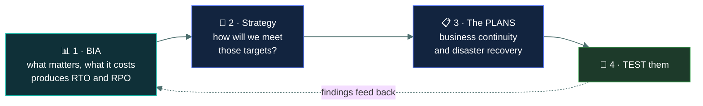
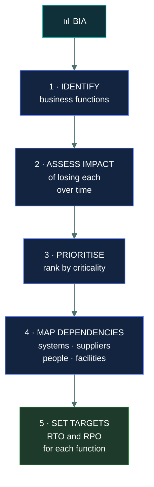
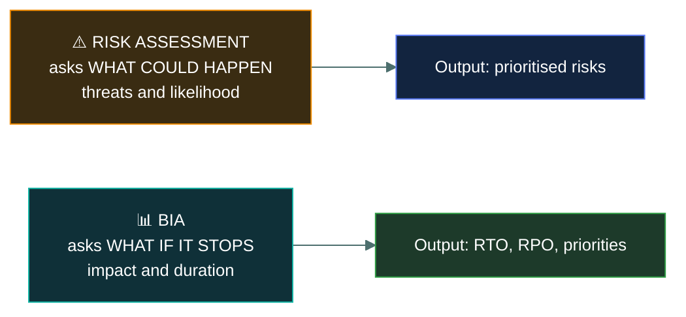

# 📊 Business impact analysis

### *Working out what actually matters before deciding how to protect it*

📌 *The BIA comes FIRST — before the continuity plan and before the recovery plan. It produces the RTO and RPO figures those plans are built to meet.*

---

## 🧸 The big idea

Before you can plan how to survive a disruption, you have to know **what a disruption would
actually cost you** — and which parts of the business would hurt first.

A **business impact analysis** answers that. It identifies the organisation's critical functions,
works out what happens if each stops, and produces the numbers that every later plan is built
around.

> **The BIA comes first. The plans come after, and are built to meet what the BIA found.**

That ordering is the most examined fact in this topic. Writing a recovery plan before the BIA
means guessing at what to recover and how quickly — which reliably produces expensive protection
for unimportant systems and none for the critical ones.

**What the BIA produces:**

- Which business functions are **critical**, ranked
- What the **impact** of losing each one would be, over time
- The **RTO** and **RPO** for each — the recovery targets
- The **dependencies** each function relies on

---

## 📖 Words you will keep seeing

| Word | What it means on this exam |
|---|---|
| **BIA** — Business Impact Analysis | The process of identifying critical functions and the impact of losing them. |
| **Critical business function** | A function the organisation cannot operate without for long. |
| **Criticality** | How essential a function or system is. |
| **Impact** | The harm resulting from a disruption — financial, operational, reputational, legal. |
| **RTO** — Recovery Time Objective | How quickly a function must be restored. |
| **RPO** — Recovery Point Objective | How much data loss is acceptable. |
| **MTD** — Maximum Tolerable Downtime | The longest a function can be down before unacceptable harm. |
| **Dependency** | Something a function relies on — a system, a supplier, a person, a facility. |
| **Single point of failure** | A dependency whose loss stops the function entirely. |
| **Risk assessment** | Identifies **threats** and their likelihood. Different from a BIA. |

---

## 🔄 Where the BIA sits

Read it as a sentence: **find out what matters, decide how to protect it, write the plans, then
test them — and feed what you learn back in.**

> 🎯 **If a question asks what comes FIRST in business continuity planning, the answer is the
> BIA.** You cannot plan recovery for functions you have not identified or prioritised.

---

## 🔍 What a BIA does

### Impact grows over time

A key idea: **the harm from an outage is not constant.** An hour without email is an
inconvenience; a week without it is a crisis. The BIA captures impact **as a function of
duration**, which is what allows sensible prioritisation.

| Downtime | Impact on order processing |
|---|---|
| 1 hour | Minor — orders queue |
| 4 hours | Customers notice, some go elsewhere |
| 1 day | Significant revenue loss, reputational damage |
| 1 week | Severe — contractual penalties, customers lost permanently |

**Impact is assessed across several dimensions:**

| Dimension | Examples |
|---|---|
| **Financial** | Lost revenue, penalties, recovery costs |
| **Operational** | Inability to deliver, backlog |
| **Reputational** | Customer confidence, press coverage |
| **Legal and regulatory** | Breached obligations, fines |
| **Safety** | Where systems affect physical safety |

> ⚠️ **The BIA is a business exercise, not a technical one.** The information comes from business
> function owners who know what their processes cost when they stop. IT cannot answer it alone.

### Dependencies are where surprises live

A function depends on more than its main application: upstream systems, suppliers, specific
people, facilities, network connectivity, and other functions.

> 🎯 **Dependency mapping finds single points of failure**, and it routinely finds ones nobody
> knew about — a critical process that depends on one spreadsheet, one supplier, or one person
> with undocumented knowledge.

---

## ⚖️ BIA versus risk assessment

A reliable exam distinction, because both are analytical exercises producing prioritised lists.

| | **Risk assessment** | **BIA** |
|---|---|---|
| Asks | What could happen, and how likely? | What if this function stops? |
| Focus | **Threats** and likelihood | **Impact** and duration |
| Cares about the cause? | **Yes** — the threat matters | **No** — a fire, a flood and a failed disk all mean "it's down" |
| Produces | Prioritised risks and treatments | Critical functions, RTO, RPO, dependencies |

> [!IMPORTANT]
> **The BIA is cause-agnostic.** It does not care *why* the function stopped, only what happens
> when it does. That is what distinguishes it from a risk assessment, where the threat is central.

---

## ⚖️ Told apart

| | Means | Not to be confused with |
|---|---|---|
| **BIA** | Identifies critical functions and the **impact** of losing them. Cause-agnostic. | **Risk assessment**, which identifies **threats** and their likelihood. |
| **BIA** | Comes **first**, before the plans. | The **continuity plan**, which is built from the BIA's findings. |
| **Criticality** | How essential a function is — drives **availability**. | **Sensitivity**, how damaging disclosure would be — drives confidentiality. |
| **Impact** | The harm from a disruption. | **Likelihood**, which the BIA does not assess. |
| **RTO / RPO** | Targets **produced by** the BIA. | Inputs to it. The BIA determines them. |
| **Dependency** | Something a function relies on. | A **single point of failure**, a dependency with no alternative. |

---

## ⚠️ Where your instinct is wrong

> [!WARNING]
> **In the job:** IT decides what the recovery priorities are, because IT knows which systems
> matter.
>
> **On the exam:** the BIA is a **business** exercise. Function owners state the impact; IT maps
> the systems those functions depend on. Options placing the decision with IT alone are wrong.

> [!WARNING]
> **In the job:** you would start business continuity work by designing the recovery architecture.
>
> **On the exam:** **the BIA comes first.** Designing recovery before knowing what must be
> recovered, and how fast, means protecting the wrong things.

> [!WARNING]
> **In the job:** you assess what is likely to go wrong and plan for that.
>
> **On the exam:** the BIA is **cause-agnostic** — it asks what happens if the function stops, not
> what stopped it. Assessing likelihood is the risk assessment's job.

---

## 🧠 How to remember it

🧠 **BIA first, plans second.** You cannot plan recovery for something you have not prioritised.

🧠 **Risk assessment asks "what could happen?" The BIA asks "what if it stops?"**

🧠 **The BIA doesn't care why it broke.** Fire, flood or failed disk — it is down either way.

🧠 **The BIA produces RTO and RPO.** The plans are built to meet them.

---

## ✅ Check you actually got it

Answer all five before expanding anything.

**Q1.** What is the FIRST step in developing a business continuity programme?

- **A.** Selecting an alternate recovery site
- **B.** Conducting a business impact analysis
- **C.** Writing the disaster recovery plan
- **D.** Purchasing backup infrastructure

<b>Answer</b>

**B — conducting a business impact analysis.** It identifies which functions are critical, what
losing them costs, and the RTO and RPO targets everything else is built to meet.

- **A** is a strategy decision that must be informed by the BIA's targets. Choosing a site type
  without knowing the RTO means guessing.
- **C** cannot be written sensibly without knowing what must be recovered and how quickly.
- **D** commits spending before establishing what needs protecting, which reliably produces
  expensive protection for unimportant systems.

**Q2.** What distinguishes a business impact analysis from a risk assessment?

- **A.** A BIA identifies threats; a risk assessment identifies impacts
- **B.** A BIA focuses on the impact of disruption regardless of cause; a risk assessment focuses on threats and their likelihood
- **C.** They are the same process under different names
- **D.** A BIA is technical; a risk assessment is financial

<b>Answer</b>

**B — a BIA focuses on impact regardless of cause; a risk assessment focuses on threats and
likelihood.** The BIA asks what happens if a function stops; it does not matter whether a fire, a
flood or a failed disk stopped it.

- **A** reverses the two.
- **C** loses a distinction the exam tests directly. They complement each other and answer
  different questions.
- **D** invents a split. The BIA is a **business** exercise, and both consider financial impact.

**Q3.** Which outputs does a BIA produce?

- **A.** A list of threats ranked by likelihood
- **B.** Critical business functions, impact over time, RTO and RPO targets, and dependencies
- **C.** A completed disaster recovery plan
- **D.** An inventory of all hardware assets

<b>Answer</b>

**B — critical functions, impact over time, RTO and RPO targets, and dependencies.** These are the
inputs every later continuity and recovery decision depends on.

- **A** is the output of a **risk assessment**.
- **C** is written afterwards, using the BIA's findings. The BIA informs the plan; it is not the
  plan.
- **D** is an asset inventory — useful, and a different exercise. The BIA maps dependencies, which
  is about relationships rather than a catalogue.

**Q4.** Who should provide the impact information during a BIA?

- **A.** The IT department, since it understands the systems
- **B.** Business function owners, who understand what their processes cost when they stop
- **C.** External auditors, for independence
- **D.** The information security team

<b>Answer</b>

**B — business function owners.** Only the people running a process can say what happens to the
business when it stops, over what timescale, and at what cost.

- **A** knows which systems support which functions and cannot state the business impact of losing
  them. IT's contribution is dependency mapping.
- **C** assesses whether the process was done properly; providing the input would compromise that
  independence.
- **D** facilitates and coordinates the exercise rather than supplying the business impact figures.

**Q5.** A BIA determines that order processing can tolerate at most four hours of downtime. What
does this figure primarily inform?

- **A.** The data classification level of order records
- **B.** The recovery time objective and the recovery strategy chosen to meet it
- **C.** The password policy for the order system
- **D.** The likelihood of an outage occurring

<b>Answer</b>

**B — the recovery time objective and the strategy chosen to meet it.** A four-hour tolerance
drives an RTO inside that window, which in turn determines whether a warm or hot site is needed
and what it will cost.

- **A** concerns sensitivity of disclosure, which is a confidentiality question. This figure is
  about availability.
- **C** is an access control matter, unrelated to downtime tolerance.
- **D** is likelihood, which the BIA does not assess — that belongs to the risk assessment.

---

## 🎓 The grown-up version

<b>Extra depth — open this on a second read, never needed for the pass</b>

**Everyone says their function is critical.** The predictable failure mode of a BIA is that every
department declares a one-hour RTO, which is unaffordable and useless for prioritisation. Good
practice forces trade-offs explicitly: present the cost of each recovery tier and ask function
owners to justify their tier against it, or require a forced ranking across the organisation.
Criticality only means something if some functions are less critical than others.

**Dependency mapping is where the value actually is.** Most organisations can guess their critical
functions. What they cannot do without the exercise is trace what those functions quietly depend
on — an authentication service, a single supplier, a database nobody documented, one person who
knows how the month-end process works. These hidden single points of failure are the findings that
change architecture, and they are why the exercise is worth doing even where the priorities seem
obvious.

**Concentration risk emerged as a theme.** Organisations that carefully diversified their own
infrastructure discovered during major cloud and CDN outages that a large share of their
dependencies terminated at the same provider. A dependency map stopping at "our cloud provider"
misses that several apparently independent services share a region or a control plane. This is the
common mode failure idea from defence in depth, applied to continuity.

**The BIA has a shelf life.** Business processes change, systems are replaced, suppliers change,
and a BIA more than a year or two old describes an organisation that no longer exists. It should
be refreshed periodically and after significant change — a merger, a major system replacement, a
restructure — which is why the cycle in the diagram feeds back.

**Impact is easier to estimate than likelihood, which is the BIA's quiet advantage.** Asking "how
likely is a data centre fire" produces a guess. Asking "what does it cost us if order processing
stops for a day" produces a figure a finance team can actually defend. This is part of why
continuity planning is often more tractable than risk quantification, and why the two exercises
are kept separate.

---

## 📝 Cram lines

Destined for [`EXAM-DAY.md`](../../EXAM-DAY.md):

- **The BIA comes FIRST** — before the continuity plan and the recovery plan.
- **BIA asks "what if this STOPS?"** It is **cause-agnostic** — fire, flood or failed disk, it's down either way.
- **Risk assessment asks "what could HAPPEN?"** — threats and **likelihood**. The BIA doesn't assess likelihood.
- **BIA outputs: critical functions · impact over time · RTO and RPO · dependencies.**
- **Impact GROWS with duration** — an hour is an inconvenience, a week is a crisis.
- **The BIA is a BUSINESS exercise.** Function owners supply the impact; IT maps dependencies.
- **Dependency mapping finds SINGLE POINTS OF FAILURE** nobody knew about.
- **Criticality → availability. Sensitivity → confidentiality.**

---

<a href="../README.md">← back to 02 · Security Governance</a> &nbsp;·&nbsp; <a href="../rto-rpo-mtd/">next: RTO, RPO and MTD →</a>

