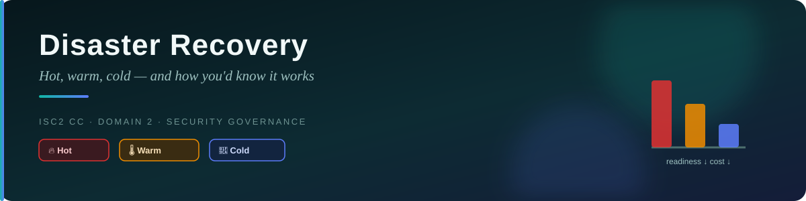

# 🏢 Disaster Recovery — Caveman Style

---

**Disaster Recovery (DR)** is about restoring IT systems, infrastructure, and services after a
disruption.

Think:

> 💥 **Cave destroyed → Grog needs another cave and a way to get the tribe back to normal.**

Your exam focus has **two comparisons**:

1. 🏢 **DR site types** — compare by **cost and readiness**
2. 🧪 **DR testing types** — compare by **how realistic/disruptive they are**

---

## 🏢 Part 1: Disaster Recovery Site Types

The three classic site types are:

1. 🟢 **Hot site**
2. 🟡 **Warm site**
3. 🔴 **Cold site**

The easiest rule:

> **More ready = More expensive**

### 🟢 1. Hot Site — "Ready NOW"

A **hot site** is a fully or highly equipped alternate location that can support rapid recovery.

Think:

> 🏠 **Grog has a second cave that's already set up.**

It may have:

- Servers
- Network equipment
- Power
- Connectivity
- Data replication/backups
- Operational infrastructure

If the main site goes down:

> 💥 Main cave destroyed

Grog says:

> **"Go to the backup cave!"**

**Cost:** Highest · **Readiness:** Highest · **Recovery:** Fastest

**Memory:** HOT = Ready to GO

### 🟡 2. Warm Site — "Partially Ready"

A **warm site** has some equipment and infrastructure already available, but it isn't fully ready
to immediately take over everything.

Think:

> 🏠 Grog has a second cave with some tools and supplies.

But he still needs to:

- Configure systems
- Restore data
- Complete setup
- Bring additional equipment online

**Cost:** Medium · **Readiness:** Medium · **Recovery:** Slower than hot

**Memory:** WARM = Some preparation needed

### 🔴 3. Cold Site — "Empty Cave"

A **cold site** provides basic facilities such as space, power, or environmental infrastructure,
but much of the IT equipment and setup must be brought in or restored.

Think:

> 🪨 Grog has another empty cave.

He says:

> "Good. Now we need to bring everything here." 😐

**Cost:** Lowest · **Readiness:** Lowest · **Recovery:** Slowest

**Memory:** COLD = Empty / needs setup

---

## 🎯 Site Comparison

| Site | 💰 Cost | ⚡ Readiness | ⏱️ Recovery |
| --- | --- | --- | --- |
| 🟢 **Hot** | Highest | Highest | Fastest |
| 🟡 **Warm** | Medium | Medium | Medium |
| 🔴 **Cold** | Lowest | Lowest | Slowest |

### 🧠 Golden rule

> **HOT → expensive but fast**
> **WARM → middle**
> **COLD → cheap but slow**

Think of a campfire:

🔥 **Hot** → already burning

🌡️ **Warm** → partially ready

🧊 **Cold** → start from scratch

---

## 🧪 Part 2: Disaster Recovery Testing

Having a DR plan isn't enough.

You need to test whether it actually works.

There are several common testing methods.

The key idea is:

> **More realistic/involved testing generally requires more time, effort, cost, and disruption.**

### 📋 1. Checklist / Documentation Review

People review the DR documentation.

They ask:

> "Do we have the correct contact numbers?"
> "Are the recovery steps documented?"
> "Are responsibilities assigned?"

This is the **least disruptive** type of testing.

**Cost:** Low · **Realism:** Low

**Caveman version:** 📜 "Read the plan."

### 🗣️ 2. Tabletop Exercise

People sit around a table and **talk through a disaster scenario**.

Example:

> "The main data center is on fire. What do we do first?"

Someone answers:

> "Call the DR team."

Another:

> "Fail over to the backup site."

Nobody necessarily shuts down the real systems.

**Cost:** Low–medium · **Realism:** Medium

**Caveman version:** 🗣️ "Pretend the cave broke and talk about what we'd do."

### 🧪 3. Simulation

A simulation creates a more realistic exercise without necessarily causing a full real-world
outage.

Teams practice their responses to a simulated disaster.

**Cost:** Medium · **Realism:** Higher than a tabletop

**Caveman version:** 🎭 "Pretend the cave is actually under attack."

### 🔄 4. Parallel Test

The organization activates the recovery environment **while normal production continues**.

Think:

> 🏢 Main cave keeps operating.

At the same time:

> 🏠 Backup cave is activated and tested.

The goal is to verify that the alternate environment can operate without taking down production.

**Cost:** Higher · **Realism:** High

**Caveman version:** "Keep old cave running while testing the new cave."

### 💥 5. Full Interruption Test

This is the most aggressive type.

The organization actually interrupts normal operations and attempts to operate using the recovery
environment.

Think:

> 💥 **Main cave stops.**

Then:

> 🏠 **Backup cave takes over.**

This provides a highly realistic test, but it can be risky and disruptive.

**Cost:** Highest · **Realism:** Highest

**Caveman version:** "Actually leave the old cave and use the backup cave."

---

## 📊 Testing Comparison

A useful exam-oriented progression is:

**Exact terminology and ordering can vary somewhat by framework or organization**, but the exam
principle is:

> **The more you actually exercise the recovery environment, the greater the cost, effort, and
> operational risk.**

---

## 🧠 Don't Mix Up Sites and Tests

These are two separate questions.

**🏢 Site question** — "Where will we recover?" Answer: Hot · Warm · Cold. Think: 💰 Cost vs
readiness

**🧪 Testing question** — "How do we verify the recovery plan works?" Answer: Review/checklist ·
Tabletop · Simulation · Parallel · Full interruption. Think: 💰 Cost/effort vs realism

---

## 🎯 Exam Scenarios

**Scenario 1** — A company has a fully equipped backup data center with replicated data that can
take over quickly. **Answer:** 🟢 **Hot site** — Why? High readiness + high cost.

**Scenario 2** — A company has an alternate facility with some equipment, but additional
configuration and restoration are required. **Answer:** 🟡 **Warm site**

**Scenario 3** — A company has an alternate building with basic infrastructure but no
ready-to-run IT environment. **Answer:** 🔴 **Cold site**

**Scenario 4** — The DR team sits together and discusses what they would do if ransomware
destroyed the main data center. **Answer:** 🗣️ **Tabletop exercise**

**Scenario 5** — The backup environment is activated while production continues. **Answer:** 🔄
**Parallel test**

**Scenario 6** — The organization deliberately shuts down the production environment and attempts
to operate from the recovery environment. **Answer:** 💥 **Full interruption test**

---

## 🪨 Ultimate Caveman Cheat Sheet

### 🏢 Sites

> 🔥 **HOT** = expensive + ready + fast
> 🌡️ **WARM** = medium + partially ready
> 🧊 **COLD** = cheap + not ready + slow

### 🧪 Tests

> 📋 **Review** = read the plan
> 🗣️ **Tabletop** = talk through the disaster
> 🎭 **Simulation** = simulate the disaster
> 🔄 **Parallel** = test recovery while production continues
> 💥 **Full interruption** = actually switch over

### 🎯 The two rules to memorize

> **Site: More readiness = more cost.**
> **Testing: More realism = more cost, effort, and potential disruption.**

---

<a href="../README.md">← Back to 02 · Security Governance</a>

