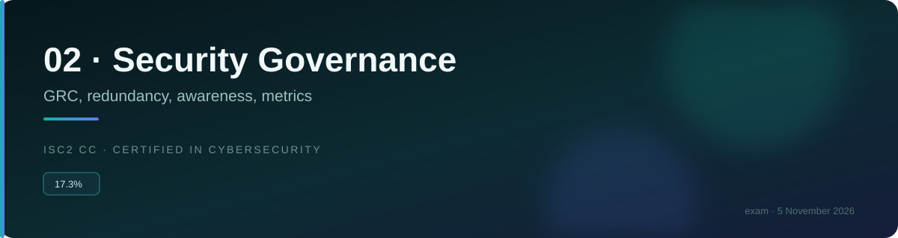
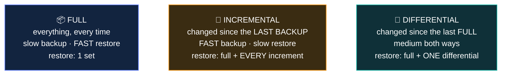

# 🔧 Disaster recovery

### *Getting back to normal — and the site types that decide how fast*

📌 *Two tables carry this topic: the site types ranked by cost and readiness, and the testing types ranked by rigour and disruption.*

---

## 🧸 The big idea

Say the tribe keeps a backup cave in the next valley, in case the main one ever collapses. How
ready that backup cave is depends entirely on how much they've invested in it beforehand.

An empty cave — bare rock, nothing inside — takes **weeks** to become usable: haul in tools,
carry over grain, rebuild everything from nothing. That's **cold.**

A cave already stocked with tools and empty storage shelves, but no actual food in it yet, is
faster — carry the grain over and you're working within **days.** That's **warm.**

A cave kept fully stocked, with fresh grain carried over regularly so it's never far out of
date, is ready almost **immediately.** That's **hot.**

And two caves, both fully stocked and both actually in use side by side at the same time, so
losing one barely slows the tribe down at all — that's a **mirrored** site, and it's the most
expensive option of the four by far.

That's the whole idea. **Disaster recovery restores normal operations after a disruption.** It
is the technical, systems-focused subset of business continuity — where continuity asks "how do
we keep working", recovery asks "how do we get the systems back".

Two things carry almost all the marks:

- **Recovery sites**, ranked cold → warm → hot, trading **cost against readiness**.
- **Testing types**, ranked read-through → full interruption, trading **rigour against
  disruption**.

Both are ordered lists, and both are asked as "which one for this scenario" questions. The
organising insight is the same in each: **faster and more rigorous costs more and disrupts more.**

> 🎯 **The site type is chosen to meet the RTO.** A four-hour RTO cannot be met by a cold site,
> and a hot site for a function that can be down a week is wasted money.

---

## 📖 Words you will keep seeing

| Word | What it means on this exam |
|---|---|
| **Disaster recovery (DR)** | Restoring systems and operations after a disruption. |
| **DRP** — Disaster Recovery Plan | The documented process for doing so. |
| **Cold site** | A facility with space and utilities. **No equipment, no data.** |
| **Warm site** | Space **and equipment**, with data restored when needed. |
| **Hot site** | Fully equipped, **data current**, ready almost immediately. |
| **Mirrored site** | A fully redundant duplicate running in parallel. Near-instant. |
| **Reciprocal agreement** | An arrangement to use another organisation's facilities. Cheap, unreliable. |
| **Full backup** | Everything, every time. |
| **Incremental backup** | Only what changed **since the last backup of any kind**. |
| **Differential backup** | Only what changed **since the last full backup**. |
| **Read-through / checklist test** | Reviewing the plan on paper. |
| **Walkthrough / tabletop** | Talking through a scenario as a team. |
| **Simulation** | Acting out a scenario without affecting production. |
| **Parallel test** | Bringing up the recovery site while production keeps running. |
| **Full interruption test** | Switching production off and running from recovery. |

---

## 🏢 Recovery sites

This is the backup-cave story, formalised.

| Site | Has | Time to operate | Cost |
|---|---|---|---|
| **Cold** | Space, power, cooling, connectivity. **Nothing else** | **Weeks** | **Lowest** |
| **Warm** | Space **and hardware**; data must be restored | **Hours to days** | Medium |
| **Hot** | Fully equipped, **data kept current** | **Minutes to hours** | High |
| **Mirrored** | Complete duplicate running in parallel | **Near instant** | **Highest** |

> 🧠 **Temperature = readiness.** Cold is an empty room; hot is ready to go; mirrored is already
> running.

> ⚠️ **A cold site is an empty building.** No servers, no data — just space, power and
> connectivity. Candidates over-estimate what a cold site provides.

**A reciprocal agreement** is a deal with another organisation to use each other's facilities. It
is cheap and generally considered **unreliable**: the partner may be affected by the same regional
event, may lack capacity, and may have changed their environment since the agreement. Enforcement
is also difficult.

> 🎯 **Match the site to the RTO.** Short RTO → hot or mirrored. Long RTO → warm or cold. If a
> question gives an RTO and asks which site, that is the calculation.

---

## 💾 Backup types

| | Backs up | Backup speed | Restore needs |
|---|---|---|---|
| **Full** | Everything | Slowest | **The full backup only** |
| **Incremental** | Changed since the **last backup of any type** | **Fastest** | Full + **every** incremental since |
| **Differential** | Changed since the **last full backup** | Medium, growing | Full + **the latest** differential |

> [!IMPORTANT]
> **The distinction is what each measures "since".**
> **Incremental** = since the **last backup of any kind** — so they are small, and you need them
> all.
> **Differential** = since the **last full** — so they grow, and you need only the most recent one.

> 🎯 **Incremental is fastest to back up and slowest to restore. Differential is the reverse
> trade.** Questions describe one property and ask which type it is.

> ⚠️ **A backup that has never been test-restored is an assumption.** Media fails, jobs silently
> skip files, and restore procedures go out of date. **Backups must be tested by restoring them.**

---

## 🧪 Testing the plan

Before trusting the backup cave, the tribe rehearses. Someone reads the plan aloud and checks it
makes sense (**read-through**). The elders sit by the fire and talk through what each person
would do (**walkthrough**). A few hunters actually walk the escape route, without touching any
real grain (**simulation**). Then they genuinely move some grain into the backup cave *while the
main cave keeps operating normally* (**parallel**). And, rarest of all, they empty the main cave
completely for a day and run entirely out of the backup one, to prove it really works (**full
interruption**) — risky, because if the backup cave fails too, the tribe has nowhere left to
turn.

Ranked by rigour and by how much they disrupt the business.

| Test | What happens | Disruption | Confidence |
|---|---|---|---|
| **Read-through / checklist** | Individuals review the plan for accuracy | **None** | Lowest |
| **Walkthrough / tabletop** | The team talks through a scenario together | None | Low–medium |
| **Simulation** | The scenario is acted out; production untouched | Low | Medium |
| **Parallel** | Recovery systems brought up **while production runs** | Medium | High |
| **Full interruption** | **Production switched off**; run from recovery | **Highest** | **Highest** |

> [!CAUTION]
> **A full interruption test can cause a real outage.** It gives the strongest assurance and
> carries genuine risk, which is why it needs management approval and careful planning — and why
> many organisations never do one.

> 🎯 **Parallel versus full interruption is the tested pair.** In a **parallel** test production
> **keeps running** alongside the recovery environment. In a **full interruption** test production
> is **switched off**. That is the whole distinction.

---

## ⚖️ Told apart

| | Means | Not to be confused with |
|---|---|---|
| **Disaster recovery** | Restoring systems **after**. Mainly IT. | **Business continuity**, keeping the business running **during**. DR is a subset of BC. |
| **Cold site** | Space and utilities. **No equipment.** | **Warm site**, which has equipment but not current data. |
| **Warm site** | Equipment, data restored when needed. | **Hot site**, where data is already current. |
| **Hot site** | Ready in minutes to hours. | **Mirrored site**, already running in parallel. |
| **Incremental** | Since the **last backup of any kind**. Fast backup, slow restore, needs **all** of them. | **Differential**, since the **last full**. Slower backup, faster restore, needs **only the latest**. |
| **Parallel test** | Recovery brought up, **production keeps running**. | **Full interruption**, where production is **switched off**. |
| **Walkthrough** | The team **talks** through a scenario. | **Simulation**, where it is **acted out**. |
| **Reciprocal agreement** | Using another organisation's facilities. Cheap, unreliable. | A contracted commercial recovery site. |

---

## ⚠️ Where your instinct is wrong

> [!WARNING]
> **In the job:** a cold site sounds like a basic data centre you could bring up in a day.
>
> **On the exam:** a cold site is an **empty room with power**. Procuring, installing and
> configuring equipment and restoring data takes **weeks**.

> [!WARNING]
> **In the job:** your backups are fine because the jobs report success.
>
> **On the exam:** **backups must be tested by restoring them.** A successful job report is not
> evidence that the data is recoverable.

> [!WARNING]
> **In the job:** nobody runs a full interruption test — the risk is unacceptable.
>
> **On the exam:** it is the **most rigorous** test and the correct answer where the question asks
> for the highest confidence. Its risk is acknowledged, not disqualifying.

---

## 🧠 How to remember it

🧠 **Temperature = readiness.** Cold = empty room. Warm = kit, no data. Hot = ready. Mirrored =
already running.

🧠 **Incremental = since the last backup of ANY kind. Differential = since the last FULL.**
*Incremental: fast to make, slow to restore, need them all.*
*Differential: slower to make, fast to restore, need only the newest.*

🧠 **Testing ladder: Read · Talk · Act · Parallel · Interrupt.** Rigour and risk rise together.

🧠 **Parallel keeps production running. Full interruption turns it off.**

---

## ✅ Check you actually got it

Answer all five before expanding anything.

**Q1.** An organisation needs to resume operations within four hours of a disaster. Which recovery
site type is MOST appropriate?

- **A.** Cold site
- **B.** Warm site
- **C.** Hot site
- **D.** Reciprocal agreement

<b>Answer</b>

**C — a hot site.** Fully equipped with current data, it can be operational within minutes to
hours, which is what a four-hour RTO requires.

- **A** is an empty facility with power. Procuring equipment and restoring data takes weeks.
- **B** has hardware but requires data restoration and configuration, typically hours to days —
  which may exceed four hours and is the strongest distractor here.
- **D** is cheap and unreliable, with no guarantee of capacity or availability, and unsuitable
  where a firm RTO must be met.

**Q2.** Which backup type requires the fewest backup sets to perform a full restore, after the last
full backup?

- **A.** Incremental, because each set is small
- **B.** Differential, because only the most recent differential is needed
- **C.** Both require the same number
- **D.** Full backups only, because incremental and differential cannot be restored

<b>Answer</b>

**B — differential, because only the most recent differential is needed.** A differential contains
everything changed since the last **full**, so restoring needs the full plus one differential —
two sets.

- **A** confuses backup speed with restore simplicity. Incrementals are small and fast to create,
  and a restore needs the full **plus every incremental since**, which could be many sets.
- **C** is wrong — the difference in restore complexity is the defining trade-off between them.
- **D** is false. Both types are restorable; they simply need different combinations.

**Q3.** During which type of test does production continue running while recovery systems are
brought online?

- **A.** Walkthrough
- **B.** Simulation
- **C.** Parallel test
- **D.** Full interruption test

<b>Answer</b>

**C — a parallel test.** Recovery systems are brought up and validated **alongside** production,
which continues serving the business — giving high confidence without risking an outage.

- **A** is a discussion exercise; no systems are involved.
- **B** acts out a scenario without bringing recovery systems into real operation.
- **D** is the opposite: **production is switched off** and the business runs from the recovery
  environment.

**Q4.** What does a cold site provide?

- **A.** Fully configured systems with current data, ready immediately
- **B.** Hardware installed but requiring data restoration
- **C.** Space, power, cooling and connectivity, but no equipment or data
- **D.** A duplicate environment running in parallel with production

<b>Answer</b>

**C — space, power, cooling and connectivity, but no equipment or data.** It is essentially an
empty, serviced room, which is why it is cheapest and takes weeks to bring into use.

- **A** describes a **hot** site.
- **B** describes a **warm** site.
- **D** describes a **mirrored** site.

**Q5.** Why must backups be periodically test-restored?

- **A.** To comply with data retention regulations
- **B.** Because a successful backup job does not prove the data can actually be recovered
- **C.** To reduce the storage space backups consume
- **D.** Because backups expire after a fixed period

<b>Answer</b>

**B — a successful backup job does not prove the data can actually be recovered.** Media fails,
jobs silently skip locked or missed files, encryption keys go missing, and restore procedures go
out of date. The only proof is a restore.

- **A** concerns how long data is kept, not whether it is recoverable.
- **C** is unrelated — testing a restore consumes resources rather than saving them.
- **D** is not generally true, and would not be why testing matters.

The principle generalises: **an untested control is an assumption**, whether it is a backup, a
plan or a failover.

---

## 🎓 The grown-up version

<b>Extra depth — open this on a second read, never needed for the pass</b>

**The 3-2-1 rule.** A widely used backup guideline: **three** copies of the data, on **two**
different media types, with **one** off-site. Ransomware has pushed many organisations to extend
it — 3-2-1-1-0, adding one **immutable or offline** copy and **zero** errors on verified restores.
The immutability matters because modern ransomware operators deliberately seek out and encrypt
backups first, and a backup an attacker can delete is not a backup.

**Replication is not backup.** Replication copies changes to another location quickly, which
protects against site loss. It also faithfully replicates deletion, corruption and encryption —
so if ransomware encrypts the primary, the replica is encrypted moments later. Backups provide a
point in time to go back **to**; replication provides a copy of **now**. Serious programmes have
both, and the distinction is one of the more expensive lessons organisations have learned.

**Cloud has largely displaced the traditional site model.** Infrastructure as code plus cloud
capacity means a recovery environment can be defined in a repository and instantiated on demand,
giving something close to warm-site readiness at near cold-site cost. What has to be maintained is
the **automation**, tested regularly — because a deployment template that has drifted from
production will fail at the worst moment. The temperature vocabulary persists on exams and
describes a world of leased facilities that is steadily receding.

**Testing frequency and honesty.** Annual tabletop exercises are common; parallel tests less so;
full interruption tests rare outside regulated sectors that mandate them. There is a real argument
that organisations which never test under realistic conditions do not have a recovery capability,
they have a recovery document. The counter-argument — that a test causing a genuine outage is a
self-inflicted incident — is also real, which is why parallel testing occupies the practical sweet
spot.

**The DR plan must survive the disaster.** Storing the recovery plan, the system documentation, the
credentials and the encryption keys only in the environment being recovered is a failure mode that
occurs repeatedly. So is having the only copy of the backup encryption key in a password vault
hosted on the infrastructure that is down.

---

## 📝 Cram lines

Destined for [`EXAM-DAY.md`](../../EXAM-DAY.md):

- **DR restores systems AFTER. It is a SUBSET of business continuity.**
- **Sites — temperature = readiness: COLD** (space + power only, **weeks**, cheapest) → **WARM** (equipment, data restored, hours–days) → **HOT** (equipped + current data, minutes–hours) → **MIRRORED** (running duplicate, near instant, dearest).
- **A cold site is an EMPTY ROOM.**
- **Reciprocal agreement** = use another org's facilities. Cheap and **unreliable**.
- **Match the site to the RTO.**
- **INCREMENTAL = since the last backup of ANY kind.** Fast backup, **slow restore**, need **full + ALL increments**.
- **DIFFERENTIAL = since the last FULL.** Slower backup, **fast restore**, need **full + ONLY the latest**.
- **Testing ladder: read-through → walkthrough → simulation → PARALLEL → FULL INTERRUPTION.**
- **PARALLEL keeps production RUNNING. FULL INTERRUPTION switches production OFF** (most rigorous, most risky).
- **Backups must be TEST-RESTORED.** A successful job report proves nothing.

---

<a href="../README.md">← back to 02 · Security Governance</a> &nbsp;·&nbsp; <a href="../security-awareness-training/">next: Security awareness training →</a>

