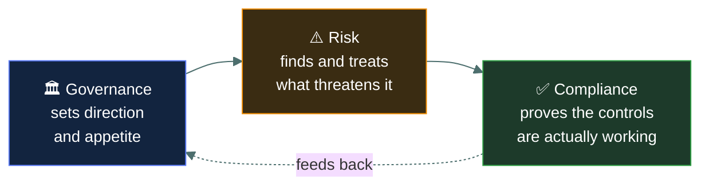
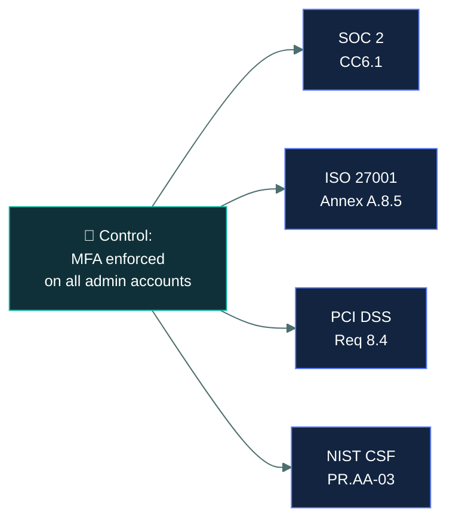

# 🧭 GRC fundamentals

### *Governance, risk and compliance — the three-legged stool the rest of this domain sits on*

📌 *What GRC means, why organisations formalise it, and the frameworks and tools ISC2 expects you to recognise by name.*

---

## 🧸 The big idea

The chief sets the tribe's direction: *"We will store enough food for winter, and keep the cave
safe."* That's **governance** — deciding what matters and who's accountable for it.

The hunters go out, spot the wolves near the cave from Domain 1, and decide to build a fence
over the gap. That's **risk management** — finding what threatens the chief's goal and treating
it.

Once a season, the tribe elder walks the cave himself: *is the fence actually built? Is the food
actually stored?* He doesn't set direction and he doesn't build fences — he just checks, with his
own eyes, that what was promised is actually happening. That's **compliance.** And if he finds
the chief ordered a fence that nobody ever built, that gap between promise and reality is exactly
what compliance exists to catch.

That's the whole idea. **GRC stands for Governance, Risk, and Compliance** — three activities
organisations run together because they constantly inform one another. Governance sets direction
and accountability. Risk management identifies and treats what could go wrong. Compliance proves
the organisation is meeting the rules it committed to, whether self-imposed or externally
required.

The reason CC tests GRC as its own idea, separate from Domain 1's governance-documents page,
is *purpose*: this page is about **why an organisation runs a GRC programme at all**, and what
frameworks and tools it reaches for to do it — not the individual document types (policy,
standard, procedure) that Domain 1 already covers.

---

## 📖 Words you will keep seeing

| Word | What it means on this exam |
|---|---|
| **Governance** | The system of direction and accountability — who decides, who is answerable, and how decisions get made. |
| **Risk management** | The ongoing process of identifying, assessing and treating risk (covered in depth in Domain 1). |
| **Compliance** | Demonstrating that the organisation meets its legal, regulatory, contractual and internal obligations. |
| **GRC framework** | A structured, published approach to running governance, risk and compliance together — e.g. **COBIT** (IT governance) or **NIST CSF** (cybersecurity risk). |
| **GRC tool / platform** | Software used to track controls, risks, policies and compliance evidence in one place, rather than in scattered spreadsheets. |
| **Audit** | An independent check of whether stated controls and obligations are actually being met. |

---

## 🔍 Why GRC is run as one programme, not three

If the chief, the hunters, and the elder never talked to each other, the elder might inspect a
fence nobody told him was supposed to exist, or the hunters might build defences against a
danger the chief never actually cared about. Treating governance, risk and compliance as
separate silos produces exactly that duplicated, disconnected work: an auditor asks for evidence
the risk team already produced, and a compliance deadline drives a decision governance never
actually approved. Running them together means:

- **Governance** sets the policies and risk appetite.
- **Risk management** finds what threatens those objectives and decides how to treat it.
- **Compliance** confirms, with evidence, that the controls governance and risk agreed on are
  actually operating.

**Frameworks and tools, at CC depth.** You are not expected to implement a GRC programme —
only to recognise that named frameworks exist for this purpose (governance/IT frameworks like
**COBIT**, risk-focused frameworks like **NIST CSF**, and the standards named in Domain 1 such
as **ISO** and **CIS**) and that organisations use dedicated **GRC tools** to track policies,
risks and evidence centrally rather than manually.

---

## 🔬 How one control satisfies five regulations at once

The grown-up section mentions that a GRC platform maps one piece of evidence to multiple
frameworks. Here's what that actually looks like for a single, ordinary control.

One real, technical fact — "MFA is enforced for every admin login" — is simultaneously evidence
for a SOC 2 audit, an ISO 27001 certification, PCI DSS compliance, and a NIST CSF maturity
assessment, because all four frameworks independently require some version of strong
authentication. A GRC platform stores this **cross-mapping** once: screenshot the admin console
showing MFA enforced, upload it to the platform, and it auto-populates as satisfied evidence
against all four requirements simultaneously — instead of a security engineer being asked for
the same screenshot four separate times a year by four separate auditors. This is the concrete,
practical reason organisations invest in GRC tooling rather than tracking compliance in
spreadsheets: the framework count keeps growing, but the underlying controls don't multiply at
the same rate.

---

## ⚖️ Told apart

| | Means | Not to be confused with |
|---|---|---|
| **Governance** | Setting direction and accountability. | **Compliance**, which proves those directions are actually being followed. Governance decides; compliance verifies. |
| **GRC (this page)** | The organisational programme and its frameworks/tools. | **Governance documents** (Domain 1) — the actual policy, standard, procedure and guideline artefacts a GRC programme produces and manages. |
| **Audit** | An independent check of whether obligations are met. | **Risk assessment**, which asks what could go wrong, not whether a specific rule is being followed. |

---

## ⚠️ Where your instinct is wrong

> [!WARNING]
> **In the job:** governance, risk and compliance often feel like three different teams with
> three different deadlines and three different sets of evidence requests.
>
> **On the exam:** they are tested as one integrated purpose — GRC — precisely because that
> fragmentation is the problem a mature programme solves. If a question describes duplicated
> evidence requests or misaligned priorities, the textbook answer is usually "integrate the
> GRC programme," not "add more staff to each silo."

---

## 🧠 How to remember it

🧠 **"Set it, risk it, prove it."** Governance sets direction, risk management works out what
threatens it, compliance proves it's actually happening.

---

## ✅ Check you actually got it

Answer all five before expanding anything.

**Q1.** What is the PRIMARY purpose of running governance, risk, and compliance as an
integrated programme rather than as separate functions?

- **A.** To reduce the total number of staff required
- **B.** To ensure direction-setting, risk treatment and verification stay aligned rather than duplicating effort
- **C.** To eliminate the need for external audits
- **D.** To transfer accountability entirely to the compliance team

<b>Answer</b>

**B — to keep the three aligned.** GRC integration exists to prevent the same duplicated
evidence requests and misaligned priorities that come from running the three as silos.

- **A** may be a side effect in some organisations, but it is not the purpose.
- **C** is wrong; compliance work, including audits, still needs to happen — GRC organises it,
  not eliminates it.
- **D** misunderstands the model. Accountability stays distributed; GRC coordinates it.

**Q2.** Which best describes the relationship between governance and compliance?

- **A.** They are the same activity under different names
- **B.** Governance sets direction; compliance verifies that direction is being followed
- **C.** Compliance sets direction; governance verifies it
- **D.** They are unrelated activities that happen to share a department

<b>Answer</b>

**B — governance sets direction, compliance verifies it.** This is the core division of labour
inside a GRC programme.

- **A** collapses a meaningful distinction the exam tests directly.
- **C** reverses the relationship.
- **D** ignores the entire reason GRC is run as one integrated programme.

**Q3.** A GRC tool is best described as which of the following?

- **A.** A firewall configuration management system
- **B.** Software used to centrally track controls, risks, policies and compliance evidence
- **C.** A single mandatory framework required by ISC2
- **D.** An automated risk-treatment decision engine

<b>Answer</b>

**B — centralised tracking of controls, risks, policies and evidence.** This replaces
scattered spreadsheets and disconnected records across teams.

- **A** confuses a GRC tool with a network security device.
- **C** invents a mandatory-framework requirement that does not exist; multiple frameworks and
  tools coexist across organisations.
- **D** overstates automation — a GRC tool tracks and reports; treatment decisions remain
  human ones.

**Q4.** Which of the following is an example of a governance/IT framework an organisation
might adopt as part of its GRC programme?

- **A.** COBIT
- **B.** SAST
- **C.** RAID
- **D.** VLAN

<b>Answer</b>

**A — COBIT.** It is a named governance/IT management framework relevant to GRC programmes.

- **B** is an application security testing technique, unrelated to governance frameworks.
- **C** is a storage redundancy technology.
- **D** is a network segmentation technology.

**Q5.** An organisation's audit repeatedly finds that risk assessments identify controls that
governance never formally approved. What does this MOST likely indicate?

- **A.** The compliance function is unnecessary
- **B.** Governance, risk and compliance are not adequately integrated
- **C.** The risk assessments are invalid and should be discarded
- **D.** The organisation should stop performing audits

<b>Answer</b>

**B — inadequate integration.** This is the exact failure mode GRC integration is meant to
prevent: risk-identified controls that were never actually sanctioned by governance.

- **A** and **D** both discard the mechanism that surfaced the problem in the first place.
- **C** blames the diagnostic tool rather than the underlying misalignment it correctly
  revealed.

---

## 🎓 The grown-up version

<b>Extra depth — open this on a second read, never needed for the pass</b>

**Why GRC platforms exist as a software category.** As organisations grow, the number of
controls, policies, risks and pieces of compliance evidence outgrows what a spreadsheet or
shared drive can track reliably — especially once multiple regulations (each with overlapping
but not identical control requirements) apply at once. A GRC platform maps controls to
multiple frameworks simultaneously, so one piece of evidence can satisfy several obligations at
once rather than being collected repeatedly.

**Three lines of defence.** A related model, common in mature GRC programmes, assigns
operational management as the first line (owns and manages risk day to day), risk and
compliance functions as the second line (oversight and policy-setting), and internal audit as
the third (independent assurance). CC does not test this model by name, but it explains why
compliance and audit are kept organisationally separate from the teams whose controls they
review.

---

## 📝 Cram lines

Destined for [`EXAM-DAY.md`](../../EXAM-DAY.md):

- **GRC = Governance, Risk, Compliance** — run together to stay aligned, not as three silos.
- **Governance sets direction. Risk treats threats to it. Compliance proves it's happening.**
- **GRC frameworks:** e.g. **COBIT** (IT governance), **NIST CSF** (risk), plus the standards
  from Domain 1 (**ISO**, **CIS**).
- A **GRC tool** centrally tracks controls, risks, policies and evidence.

---

<a href="../README.md">← back to 02 · Security Governance</a> &nbsp;·&nbsp; <a href="../business-impact-analysis/">next: Business impact analysis →</a>

</content>
