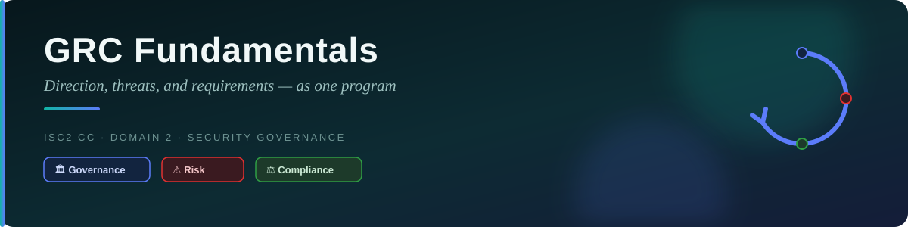

# 🏛️ GRC Fundamentals — Caveman Style

---

**GRC** stands for:

- **G** = Governance
- **R** = Risk
- **C** = Compliance

The important exam idea is:

> **Governance, Risk, and Compliance are connected, so organizations manage them together as one
> coordinated program.**

Think of Grog's tribe. 🪨

---

## 🏛️ 1. Governance — "What are our rules?"

Governance is about direction, leadership, policies, responsibilities, and decision-making.

The tribe leader says:

> 🗣️ "We must protect our food, people, and cave."

The leader establishes:

- Rules
- Policies
- Responsibilities
- Security objectives
- Decision-making authority

### Simple definition

> **Governance = How the organization is directed and controlled.**

---

## ⚠️ 2. Risk — "What could go wrong?"

Once the tribe has its goals, it asks:

> 🧐 "What could stop us from achieving them?"

Grog discovers:

- 🕳️ A hole in the cave
- 🐻 A dangerous bear nearby
- 🔥 Fire could destroy the food
- 👹 Another tribe could attack

Those are risks.

The tribe then decides:

> "Which risks matter most, and what should we do about them?"

### Simple definition

> **Risk = Identifying and managing things that could prevent the organization from achieving its
> objectives.**

---

## ⚖️ 3. Compliance — "Are we following the rules?"

Now imagine the tribe has agreed to certain rules.

The chief says:

> "Everyone must protect the food storage."

An outside tribal council also has a rule:

> "Every tribe must maintain safe food storage."

Grog needs to make sure the tribe follows those requirements.

That's compliance.

In an organization, compliance can involve:

- Laws
- Regulations
- Contracts
- Industry requirements
- Internal policies
- Standards

### Simple definition

> **Compliance = Meeting applicable requirements.**

---

## 🔗 Why do they work together?

This is the most important part.

Imagine they operate separately.

**Governance without Risk** — The chief creates rules: "Protect the cave!" But nobody asks: "What
are the biggest dangers?" ❌ The organization might protect the wrong things.

**Risk without Governance** — Grog identifies 100 risks. But nobody has authority to decide:
"Which ones should we fix first?" ❌ There is no direction or accountability.

**Compliance without Governance or Risk** — Grog follows hundreds of rules. But he doesn't
consider which risks actually threaten the tribe. ❌ He may spend huge amounts of resources simply
checking boxes.

---

## 🧩 Put them together

GRC creates a cycle:

> 🏛️ Governance → sets direction
> ↓
> ⚠️ Risk → identifies and prioritizes threats
> ↓
> ⚖️ Compliance → ensures requirements are met
> ↓
> 📊 Results/reporting → inform management
> ↓
> 🏛️ Governance → adjusts direction

And the cycle continues.

## 🪨 Caveman Example

Suppose the tribe stores 100 pieces of meat in its cave.

**🏛️ Governance** — The chief says: "Protect our food supply." That's the organization's
objective and direction.

**⚠️ Risk** — Grog discovers: 🔥 Fire could destroy the food. He determines: "High likelihood +
high impact = High risk."

**🛡️ Treatment** — The tribe installs a safer fire area and separates the food from the fire.

**⚖️ Compliance** — The tribe also has a rule requiring food to be stored safely. Grog checks:
"Are we following the required food-storage rules?"

**📊 Governance gets the results** — The chief receives a report: "Food-storage risk has been
reduced and required rules are being followed." The chief can now make better decisions.

That's GRC working as one program.

---

## 🏢 Real-World Cybersecurity Example

Imagine a company stores customer information.

**🏛️ Governance** — Management says: "Customer information must be protected." They establish:

- Security policies
- Responsibilities
- Security objectives
- Risk appetite

**⚠️ Risk** — The security team identifies: "Customer data could be stolen through a vulnerable
web application." They assess:

- Likelihood
- Impact
- Existing controls

They determine: 🔴 High risk. Management decides to prioritize fixing it.

**⚖️ Compliance** — The company also has legal, regulatory, contractual, or internal requirements
for protecting customer information. The organization checks: "Are we meeting the requirements
that apply to us?"

**🔄 Together** — Management can now see:

- What are we trying to achieve? 🏛️ Governance
- What could prevent us from achieving it? ⚠️ Risk
- Are we meeting our obligations? ⚖️ Compliance

This gives management a complete picture.

---

## 🎯 Why run them as ONE programme?

There are several important reasons.

### 1 · 🔗 They use the same information

A risk assessment can reveal that a particular legal requirement is difficult to meet.

That information should go to governance.

Governance can then decide what resources or changes are needed.

### 2 · 💰 Avoid duplicated work

Without coordination, different teams might separately:

- Assess the same risk
- Test the same control
- Collect the same evidence
- Produce separate reports

GRC combines these activities where appropriate.

### 3 · 🎯 Align security with business goals

Security shouldn't exist just to create more security rules.

GRC helps connect:

> **Business objectives → Risks → Controls → Compliance**

### 4 · 👑 Clear accountability

GRC helps establish:

> **Who is responsible for the decision?**

For example:

- Management → governance
- Risk owner → risk decisions
- Compliance team → compliance monitoring
- Security team → security controls

### 5 · 📊 Better decision-making

Management can see:

> "Here are our objectives."
> "Here are our biggest risks."
> "Here are our compliance obligations."
> "Here are our controls."

Now management can make informed decisions about:

- 💰 Budget
- 🛡️ Security controls
- ⚠️ Risk acceptance
- 📋 Policies
- 👥 Staffing
- 🔧 Improvements

---

## 🧠 The Ultimate GRC Memory Trick

Imagine the tribe leader asking three questions:

> [!NOTE]
> **🏛️ GOVERNANCE** — "WHAT are we trying to achieve, and WHO makes the rules?"
>
> **⚠️ RISK** — "WHAT could go wrong?"
>
> **⚖️ COMPLIANCE** — "ARE we following the rules and requirements?"

Put them together:

- 🏛️ **Governance** = Direction
- ⚠️ **Risk** = Uncertainty/threats
- ⚖️ **Compliance** = Requirements

---

## 🎯 Exam-Ready Answer

If the exam asks:

> "Why do governance, risk, and compliance run as one program?"

A strong answer is:

> **GRC is managed as one coordinated program because governance establishes organizational
> objectives and accountability, risk management identifies and prioritizes threats to those
> objectives, and compliance ensures applicable laws, regulations, standards, contracts, and
> internal requirements are met. Integrating them reduces duplicated effort, improves visibility
> and accountability, aligns security activities with business objectives, and enables better
> risk-based decision-making.**

**Caveman version:**

> 🪨 Governance says where the tribe is going.
> Risk says what could hurt the tribe.
> Compliance says whether the tribe is following the rules.
>
> Together, they help the tribe make good decisions and stay protected.

---

<a href="../README.md">← Back to 02 · Security Governance</a>

