# 🏛️ GRC Fundamentals

### *Governance sets it, risk management protects it, compliance proves it*

📌 *Know what each of the three does, why they're run as ONE programme, and recognise COBIT / NIST CSF / ISO / CIS and GRC tools.*

---

## 🧸 The big idea

Think of a restaurant:

- The **owner** decides what standard the restaurant must meet and who's responsible for it. That's
  **governance** — setting direction and accountability.
- The **manager** spots that undercooked chicken could make customers sick, and adds temperature
  checks. That's **risk management** — finding what threatens the goals and treating it.
- The **health inspector** checks the fridge temperatures are actually being logged. That's
  **compliance** — proving, with evidence, the rules are really being followed.

**GRC = Governance, Risk and Compliance** — three activities run together because each constantly
feeds the others.

---

## 📖 Words you will keep seeing

| Word | What it means on this exam |
|---|---|
| **Governance** | The system of direction and accountability — who decides, who's answerable, how decisions get made. |
| **Risk management** | The ongoing process of identifying, assessing and treating risk. |
| **Compliance** | Demonstrating that the organisation meets its legal, regulatory, contractual and internal obligations. |
| **GRC framework** | A published approach for running GRC — e.g. **COBIT** (IT governance), **NIST CSF** (cybersecurity risk). |
| **GRC tool / platform** | Software that tracks controls, risks, policies and compliance evidence in one place. |
| **Audit** | An **independent** check of whether obligations and controls are really being met. |

---

## 🔍 The explanation

### Why one programme, not three

Run separately, the three trip over each other — the same evidence is requested again and again,
and controls appear that nobody in charge ever approved:

Run together:

- **Governance** sets the policies and the risk appetite.
- **Risk management** finds what threatens those objectives and decides how to treat it.
- **Compliance** confirms, with evidence, that the agreed controls are actually operating.

### Frameworks and tools

You don't need to implement a GRC programme for CC — only to recognise the names:

| Name | What it's for |
|---|---|
| **COBIT** | Governance and management of enterprise IT |
| **NIST CSF** | Managing cybersecurity risk |
| **ISO/IEC 27001** | Requirements for an information security management system |
| **CIS Controls / Benchmarks** | Prioritised safeguards and platform hardening guides |

A **GRC tool** replaces scattered spreadsheets. Its big win: **one control can count as evidence for
many frameworks at once**:

Collect the evidence once, and it's reused for every audit that asks.

---

## ⚖️ Told apart

| | Means | Not to be confused with |
|---|---|---|
| **Governance** | **Decides** direction and accountability. | **Compliance** — **verifies** the direction is followed. |
| **GRC programme** | The organisational programme, its frameworks and tools. | **Governance documents** — the policies, standards and procedures the programme produces. |
| **Audit** | Is a specific obligation actually being met? | **Risk assessment** — what *could* go wrong? |

---

## ⚠️ Where your instinct is wrong

> [!WARNING]
> **In the job:** governance, risk and compliance feel like three teams with three deadlines and
> three sets of evidence requests.
>
> **On the exam:** that fragmentation is the **problem**. If a question describes duplicated evidence
> requests or misaligned priorities, the answer is usually "**integrate the GRC programme**" — not
> "add staff to each silo".

---

## 🧠 How to remember it

**"Set it, risk it, prove it."** Governance sets, risk management treats, compliance proves.

**Governance decides; compliance verifies.**

---

## ✅ Check you actually got it

Answer all five before expanding anything.

**Q1.** What is the PRIMARY purpose of running governance, risk and compliance as one integrated
programme?

- **A.** To reduce the total number of staff required
- **B.** To ensure direction-setting, risk treatment and verification stay aligned rather than duplicating effort
- **C.** To eliminate the need for external audits
- **D.** To transfer accountability entirely to the compliance team

<b>Answer</b>

**B.** Integration prevents duplicated evidence requests and misaligned priorities.

- **A** may be a side effect, not the purpose.
- **C** — audits still happen; GRC organises them.
- **D** — accountability stays distributed.

**Q2.** Which best describes the relationship between governance and compliance?

- **A.** They are the same activity under different names
- **B.** Governance sets direction; compliance verifies that direction is being followed
- **C.** Compliance sets direction; governance verifies it
- **D.** They are unrelated activities that happen to share a department

<b>Answer</b>

**B.**

- **A** collapses the distinction.
- **C** reverses it.
- **D** ignores why GRC is integrated at all.

**Q3.** A GRC tool is best described as:

- **A.** A firewall configuration management system
- **B.** Software used to centrally track controls, risks, policies and compliance evidence
- **C.** A single mandatory framework required by ISC2
- **D.** An automated risk-treatment decision engine

<b>Answer</b>

**B.**

- **A** is a network security tool.
- **C** — no single mandatory framework exists.
- **D** — the tool tracks and reports; treatment decisions stay human.

**Q4.** Which is a governance/IT framework an organisation might adopt in its GRC programme?

- **A.** COBIT
- **B.** SAST
- **C.** RAID
- **D.** VLAN

<b>Answer</b>

**A — COBIT.**

- **B** is application security testing.
- **C** is storage redundancy.
- **D** is network segmentation.

**Q5.** Audits keep finding that risk assessments introduce controls governance never formally
approved. What does this MOST likely indicate?

- **A.** The compliance function is unnecessary
- **B.** Governance, risk and compliance are not adequately integrated
- **C.** The risk assessments are invalid and should be discarded
- **D.** The organisation should stop performing audits

<b>Answer</b>

**B.** Exactly the failure GRC integration prevents.

- **A** and **D** throw away the mechanism that found the problem.
- **C** blames the diagnostic instead of the misalignment it revealed.

---

## 🎓 The grown-up version

<b>Extra depth — open this on a second read, never needed for the pass</b>

**Why GRC platforms exist.** As controls, policies, risks and evidence grow — and several
regulations apply at once with overlapping requirements — spreadsheets break. Platforms
(ServiceNow GRC, Archer, Vanta, Drata) cross-map each control to every framework it satisfies.

**Three lines of defence.** Operational management owns risk day to day (first line); risk and
compliance functions oversee and set policy (second line); internal audit gives independent
assurance (third line). It explains why audit is kept organisationally separate from the teams it
reviews.

---

## 📝 Cram lines

Destined for [`EXAM-DAY.md`](../../EXAM-DAY.md):

- **GRC = Governance, Risk, Compliance** — run as one programme, not three silos.
- **Governance SETS direction. Risk TREATS threats to it. Compliance PROVES it's happening.**
- **Frameworks:** COBIT (IT governance), NIST CSF (risk), ISO 27001, CIS.
- **A GRC tool** centrally tracks controls, risks, policies and evidence — one control, many frameworks.

---

<a href="../README.md">← back to 02 · Security Governance</a> &nbsp;·&nbsp; <a href="../business-impact-analysis/">next: Business impact analysis →</a>

