# 📈 Measuring Cybersecurity Effectiveness

### *KRIs warn, KPIs grade — and the audience decides the format*

📌 *Tell a KRI from a KPI, and match dashboard / scorecard / report to the right audience.*

---

## 🧸 The big idea

Your car shows two very different kinds of number:

- The **fuel warning light** comes on **before** you run out — it warns that trouble is building.
  That's like a **KRI** (Key **Risk** Indicator).
- Your **lap time against a target** tells you how well you're driving right now. That's like a
  **KPI** (Key **Performance** Indicator).

A security programme that can't show whether it's working is running on faith. **Measuring
effectiveness** means choosing numbers that really track security, then presenting them in the
format each audience needs. It's governance content because *deciding what to measure and who sees
it* is a leadership decision.

---

## 📖 Words you will keep seeing

| Word | What it means on this exam |
|---|---|
| **Metric** | Any value measured over time — e.g. mean time to detect, patch compliance rate. |
| **KRI** — Key Risk Indicator | Signals **rising exposure** to risk **before** it becomes a loss. |
| **KPI** — Key Performance Indicator | Shows how well a process or control performs **against a target**. |
| **Dashboard** | Live, visual view of operational metrics — for **practitioners**. |
| **Scorecard** | Periodic summary grading performance against targets — for **management**. |
| **Report** | Formal, often narrative document covering a period — for **executives, boards, regulators**. |

---

## 🔍 The explanation

### KRI warns, KPI grades

| KRI examples (warn) | KPI examples (grade) |
|---|---|
| Growing count of overdue critical patches | % of systems patched within SLA |
| Rising rate of *failed* phishing simulations | % of staff completing training on time |
| More accounts with no access review | Mean time to detect / respond |

### Same data, three formats — the audience decides

| Format | Audience | Cadence |
|---|---|---|
| **Dashboard** | Practitioners, operations | Real-time / continuous |
| **Scorecard** | Management, steering committees | Monthly / quarterly |
| **Report** | Executives, board, regulators | Periodic, formal, narrative |

---

## ⚖️ Told apart

| | Means | Not to be confused with |
|---|---|---|
| **KRI** | Forward-looking warning of rising exposure. | **KPI** — grades current performance against a target. |
| **Dashboard** | Continuous, technical audience. | **Scorecard** — periodic, for management. |
| **Metric** | Any tracked value. | **KRI / KPI** — metrics *chosen* because they signal risk or performance. |

---

## ⚠️ Where your instinct is wrong

> [!WARNING]
> **In the job:** the dashboard is the source of truth and everything else is a summary of it.
>
> **On the exam:** dashboards, scorecards and reports are **deliberate choices matched to
> audience**. A board needing periodic, digestible output wants a **scorecard or report** — not
> "give them dashboard access".

---

## 🧠 How to remember it

**"KRI warns, KPI grades."**

**Analysts get dashboards. Managers get scorecards. Boards get reports.**

---

## ✅ Check you actually got it

Answer all five before expanding anything.

**Q1.** A rising count of overdue critical patches, tracked over several months, is an example of:

- **A.** A key performance indicator (KPI)
- **B.** A key risk indicator (KRI)
- **C.** A compliance report
- **D.** A governance document

<b>Answer</b>

**B — a KRI.** It warns of growing exposure before any loss.

- **A** would grade the patching *process* against a target (e.g. % patched within SLA).
- **C** is a formal periodic document.
- **D** is a policy or standard.

**Q2.** Which BEST describes a KPI?

- **A.** A metric warning that risk exposure is increasing
- **B.** A metric that grades how well a process or control is performing against a target
- **C.** A one-time audit finding
- **D.** A list of unpatched vulnerabilities

<b>Answer</b>

**B.**

- **A** describes a KRI.
- **C** is an audit output.
- **D** is raw data, not a metric.

**Q3.** A board needs a periodic, non-technical summary of the security programme. What is the
MOST appropriate format?

- **A.** Direct access to the SOC's live dashboard
- **B.** A scorecard or report tailored to executive audiences
- **C.** The raw vulnerability scan output
- **D.** No reporting, since boards are not a security audience

<b>Answer</b>

**B.**

- **A** — a live technical view for an audience that needs a periodic digest.
- **C** — raw data, not a governance communication.
- **D** — boards are explicitly an audience.

**Q4.** What is the PRIMARY purpose of measuring cybersecurity effectiveness?

- **A.** To satisfy an audit requirement only
- **B.** To demonstrate, with evidence, whether the security programme is actually achieving its goals
- **C.** To generate content for marketing materials
- **D.** To replace the need for governance documents

<b>Answer</b>

**B.**

- **A** — audits are one consumer, not the only reason.
- **C** — not a governance purpose.
- **D** — measurement reports *against* the documents; it doesn't replace them.

**Q5.** An organisation tracks "percentage of employees completing phishing awareness training on
time." This is:

- **A.** A KRI
- **B.** A KPI
- **C.** A disaster recovery metric
- **D.** A business impact analysis output

<b>Answer</b>

**B — a KPI.** It grades a process against a target.

- **A** would be something like a rising rate of *failed* simulations.
- **C** and **D** belong to continuity planning, not programme measurement.

---

## 🎓 The grown-up version

<b>Extra depth — open this on a second read, never needed for the pass</b>

**Where the numbers come from.** Nobody stopwatches incidents. **MTTD** = ticket opened − alert
fired; **MTTR** = ticket resolved − ticket opened — timestamps that already exist in the SIEM and
ticketing system, pulled on a schedule into Grafana or Power BI. Patch-SLA % is a scheduled query
against the vulnerability scanner. A number nobody can trace to a source system is just a claim.

**Vanity vs decision-useful metrics.** "Total alerts generated" is easy and useless. "Mean time to
detect" and "% of critical assets monitored" change decisions.

**Metrics drift.** A target set for an on-premises estate may not fit a cloud-native one — revisit
*which* metrics still matter, not just how well you hit them.

---

## 📝 Cram lines

Destined for [`EXAM-DAY.md`](../../EXAM-DAY.md):

- **KRI warns of rising risk. KPI grades performance against a target.**
- **Dashboard = continuous, practitioners. Scorecard = periodic, management. Report = formal, board/regulators.**
- **Measurement exists to prove, with evidence, the programme is working.**

---

<a href="../README.md">← back to 02 · Security Governance</a>

