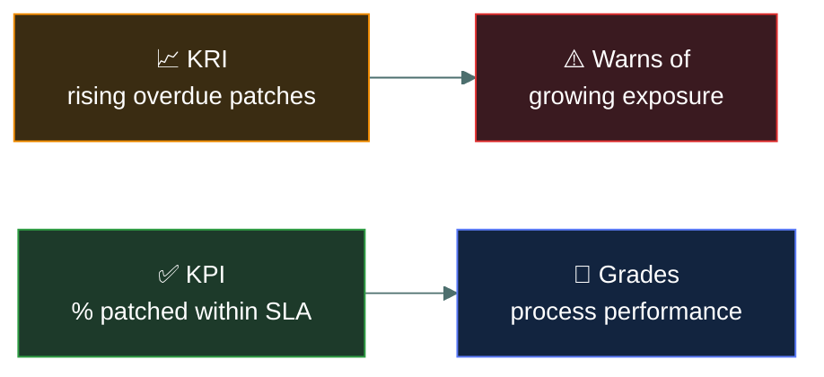
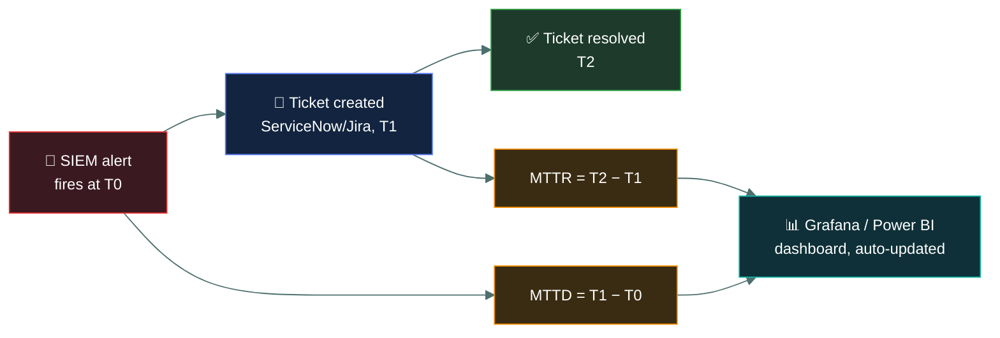

# 📊 Measuring cybersecurity effectiveness

### *How an organisation knows its security programme is actually working*

📌 *Key metrics, key risk indicators, dashboards, scorecards and reports — the vocabulary of proving a security programme is doing its job.*

---

## 🧸 The big idea

The tribe built a fence over the gap and posted a guard. But how do they actually know it's
working, rather than just hoping?

Two very different numbers matter. *"The guard has fallen asleep at his post three nights this
week, and it's getting worse."* That number is climbing **before** any wolf has actually gotten
in — it's a warning of trouble building. *"Of the twelve nights he was on duty, he successfully
spotted and scared off every approaching wolf."* That number grades how well the guard is
actually doing his job against what's expected of him.

A security programme that cannot show whether it is working is a programme running on faith.
**Measuring effectiveness** means picking numbers that actually track security posture, then
presenting them to the right audience in the right format — a technical dashboard for
practitioners, a scorecard or report for leadership.

The exam tests this as governance content because *deciding what to measure and how to report
it* is a leadership and accountability activity, not a purely technical one.

---

## 📖 Words you will keep seeing

| Word | What it means on this exam |
|---|---|
| **Key metric** | Any measured value tracked over time to gauge performance — e.g. mean time to detect, patch compliance rate. |
| **KRI (Key Risk Indicator)** | A metric that signals *rising exposure to risk* before it becomes a loss — e.g. a growing count of overdue critical patches. |
| **KPI (Key Performance Indicator)** | A metric that shows how well a process or control is performing against a target — e.g. percentage of phishing tests passed. |
| **Dashboard** | A real-time or near-real-time visual display of operational metrics, aimed at practitioners. |
| **Scorecard** | A structured, often periodic summary that grades performance against targets, aimed at management. |
| **Report** | A formal, often narrative document summarising performance, incidents or compliance status over a period, for stakeholders or regulators. |

---

## 🔍 KRI versus KPI, and who reads what

The sleeping-guard count from the big idea is a **KRI** — it looks forward and warns. A rising
KRI (unpatched critical vulnerabilities, overdue access reviews) means risk is building even
though nothing bad has happened yet.

The wolves-successfully-spotted count is a **KPI** — it looks at performance against a target
and grades. A KPI (percentage of systems patched within SLA, phishing simulation click rate)
tells you how well a control or process is actually operating.

**Audience decides format.** The guard himself checks fresh wolf tracks by the fence every
single night — that running, live view is a **dashboard.** Once a month, the hunt-leader gets a
one-page summary grading how well the fence held up — that's a **scorecard** for the people
overseeing the guards. Once a season, the chief receives a full, formal account of every wolf
incident to present to the council of elders — that's a **report.** Same underlying facts, three
different audiences, three different shapes.

The same underlying data becomes a **dashboard** for a SOC analyst watching it live, a
**scorecard** summarising the month for a steering committee, or a **report** documenting the
quarter for a board or a regulator.

| Format | Audience | Cadence |
|---|---|---|
| **Dashboard** | Practitioners, operations teams | Real-time / continuous |
| **Scorecard** | Management, steering committees | Periodic (monthly/quarterly) |
| **Report** | Executives, board, regulators | Periodic, often formal and narrative |

---

## 🔬 Where these numbers actually come from

Nobody manually stopwatches an incident. Real metrics get computed automatically from
timestamps that already exist in other systems.

**MTTD (Mean Time to Detect)** and **MTTR (Mean Time to Respond/Remediate)** are two of the
most-quoted security KPIs, and both are just subtraction between timestamps that already exist:
when the SIEM's alert fired, when a human actually opened a ticket for it, and when that ticket
closed. A dashboarding tool (Grafana, Power BI, or the SIEM's own reporting module) queries the
ticketing system's API on a schedule and recalculates the averages automatically — nobody is
manually timing incidents with a stopwatch. This is also exactly how **patch-SLA compliance
percentage** gets computed: the vulnerability scanner already knows when a CVE was found and
when it was last seen as unpatched, so "percentage patched within 30 days" is a scheduled query,
not a spreadsheet someone updates by hand. The reason this matters for governance is that a
metric nobody can independently query and verify is just a claim — a real KRI/KPI programme can
point at the exact source system and timestamp behind every number on the scorecard.

---

## ⚖️ Told apart

| | Means | Not to be confused with |
|---|---|---|
| **KRI** | A forward-looking warning that risk exposure is rising. | **KPI**, which grades current performance against a target rather than warning of future exposure. |
| **Dashboard** | Continuous, operational, technical audience. | **Scorecard**, which is periodic and aimed at management, not real-time operations. |
| **Metric** | Any tracked measured value. | **KRI/KPI**, which are specific *categories* of metric chosen because they signal risk or performance, not just any number that happens to be tracked. |

---

## ⚠️ Where your instinct is wrong

> [!WARNING]
> **In the job:** you probably think of "the dashboard" as the one true source of truth, and
> everything else as a derivative summary of it.
>
> **On the exam:** dashboards, scorecards and reports are treated as **distinct, intentional
> choices matched to audience**, not a hierarchy of accuracy. A question describing a board
> needing periodic, digestible, non-technical output wants "scorecard" or "report" — not
> "give them dashboard access."

---

## 🧠 How to remember it

🧠 **"KRI warns, KPI grades."** One looks forward at rising risk; the other looks at how well
something is already performing.

---

## ✅ Check you actually got it

Answer all five before expanding anything.

**Q1.** A rising count of overdue critical patches, tracked over several months, is an example
of which of the following?

- **A.** A key performance indicator (KPI)
- **B.** A key risk indicator (KRI)
- **C.** A compliance report
- **D.** A governance document

<b>Answer</b>

**B — a KRI.** It signals growing exposure to risk before any loss has occurred.

- **A** would instead measure how well the patching *process* is performing against a target,
  such as percentage patched within SLA.
- **C** is a periodic formal document, not a single tracked metric.
- **D** describes a policy or standard, not a measurement.

**Q2.** Which of the following BEST describes a KPI?

- **A.** A metric warning that risk exposure is increasing
- **B.** A metric that grades how well a process or control is performing against a target
- **C.** A one-time audit finding
- **D.** A list of unpatched vulnerabilities

<b>Answer</b>

**B — grading performance against a target.** That is precisely what distinguishes a KPI from
a KRI.

- **A** describes a KRI, not a KPI.
- **C** describes an audit output, a different governance activity.
- **D** is raw data that could feed a metric, not the metric itself.

**Q3.** A board of directors needs a periodic, non-technical summary of the security
programme's status. What is the MOST appropriate format?

- **A.** Direct access to the SOC's live dashboard
- **B.** A scorecard or report tailored to executive audiences
- **C.** The raw vulnerability scan output
- **D.** No reporting, since boards are not a security audience

<b>Answer</b>

**B — a scorecard or report.** These are the formats matched to a periodic, non-technical,
leadership audience.

- **A** gives a technical, continuous view to an audience that needs a periodic, digestible
  summary instead.
- **C** is unfiltered operational data, not a governance communication.
- **D** ignores that boards are explicitly an intended audience for security reporting.

**Q4.** What is the PRIMARY purpose of measuring cybersecurity effectiveness?

- **A.** To satisfy an audit requirement only
- **B.** To demonstrate, with evidence, whether the security programme is actually achieving
  its goals
- **C.** To generate content for marketing materials
- **D.** To replace the need for governance documents

<b>Answer</b>

**B — to demonstrate, with evidence, whether the programme works.** Metrics, KRIs, KPIs,
dashboards, scorecards and reports all serve this single purpose.

- **A** is too narrow — audits are one consumer of this data, not the only reason to measure.
- **C** is not a security governance purpose.
- **D** confuses measurement with the documents (policy, standard, procedure) that measurement
  reports against.

**Q5.** An organisation tracks "percentage of employees completing phishing awareness training
on time." This is an example of which of the following?

- **A.** A KRI
- **B.** A KPI
- **C.** A disaster recovery metric
- **D.** A business impact analysis output

<b>Answer</b>

**B — a KPI.** It measures how well a process (training completion) is performing against a
target, not a forward-looking warning of rising risk.

- **A** would instead be something like a rising rate of *failed* phishing simulations,
  signalling growing exposure.
- **C** and **D** both belong to the redundancy sub-area of this domain, unrelated to
  measuring programme effectiveness.

---

## 🎓 The grown-up version

<b>Extra depth — open this on a second read, never needed for the pass</b>

**Vanity metrics versus decision-useful metrics.** A mature programme resists tracking numbers
just because they are easy to collect (total alerts generated) in favour of numbers that
actually change a decision (mean time to detect, percentage of critical assets covered by
monitoring). CC does not test this distinction by name, but it is the practical skill behind
"measuring effectiveness" as a discipline.

**Metrics drift.** A KPI that was meaningful when set can stop reflecting reality as the
environment changes — a patch-SLA target set for an on-premises estate may not fit a
cloud-native one. Effective measurement programmes periodically revisit which metrics still
matter, not just how well the organisation is hitting them.

---

## 📝 Cram lines

Destined for [`EXAM-DAY.md`](../../EXAM-DAY.md):

- **KRI warns of rising risk. KPI grades current performance against a target.**
- **Dashboard = continuous, technical audience. Scorecard/report = periodic, leadership audience.**
- Effectiveness measurement exists to show, with evidence, that the programme is working.

---

<a href="../README.md">← back to 02 · Security Governance</a> &nbsp;·&nbsp; <a href="../../03-access-control/README.md">next domain: 03 · IAM Concepts →</a>

</content>
