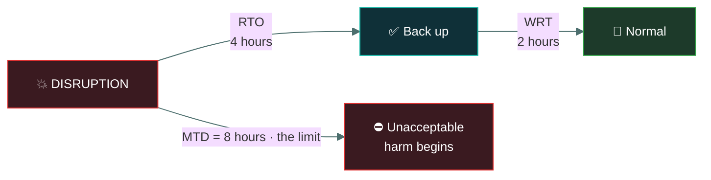
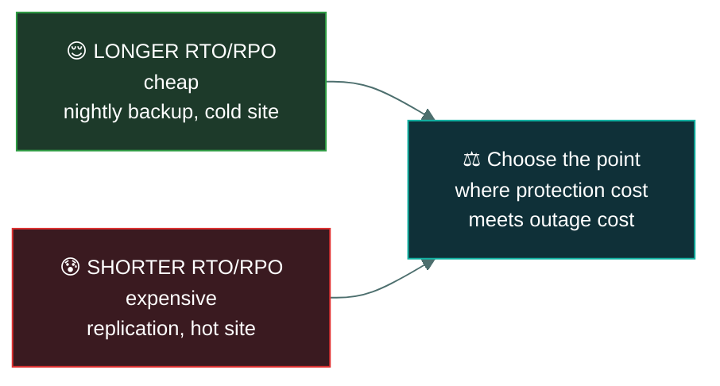

# ⏱️ RTO, RPO and MTD

### *Three time metrics, and the two the exam swaps constantly*

📌 *The highest-value page in this domain. RTO looks forward to recovery; RPO looks backward to your last good data.*

---

## 🧸 The big idea

The tribe keeps a grain-count tally stick, carving a fresh notch every morning. They copy it
onto a second stick at dawn each day, just in case. At midday, the hut holding both sticks
burns down.

**How far back does the surviving record actually go?** The last copy was made at dawn, so
everything counted between dawn and the fire — half a day's notches — is gone forever. That gap,
looking *backward* into what's lost, is the **RPO.**

**How long until the tribe has a working tally again?** Say it takes three days to carve a new
stick and get the count going. That's the **RTO** — looking *forward* to being back up.

**How long could the tribe survive with no grain count at all** before they ration so badly that
people actually go hungry? Say that's seven days. That's the **MTD** — the hard ceiling. Since
the three-day RTO comfortably fits inside the seven-day MTD, the plan works. If rebuilding the
tally always took ten days, no plan could ever satisfy what the tribe can actually tolerate.

That's the whole idea. Three numbers, all measured in time, all describing a different thing
about an outage.

> **RTO — Recovery Time Objective.** How long until we are **back up**? Looks **forward**.
> **RPO — Recovery Point Objective.** How much **data** can we afford to lose? Looks **backward**.
> **MTD — Maximum Tolerable Downtime.** The longest we can be down before **unacceptable harm**.

The distinction that earns marks:

**RTO is about time to restore. RPO is about data loss.** They are measured in the same units and
they point in opposite directions from the moment of the disruption.

> 🧠 **RPO = Point in the past you recover *to*. RTO = Time it Takes to get back.**
> The **P** in RPO is a **point** you go back to. The **T** in RTO is the **time** going forward.

And one relationship: **RTO must be less than or equal to MTD.** If your recovery target exceeds
the maximum the business can tolerate, the plan does not work by definition.

---

## 📖 Words you will keep seeing

| Word | What it means on this exam |
|---|---|
| **RTO** — Recovery Time Objective | The target time to restore a function after a disruption. |
| **RPO** — Recovery Point Objective | The maximum acceptable amount of data loss, expressed as time. |
| **MTD** — Maximum Tolerable Downtime | The longest a function can be unavailable before unacceptable harm. Also **MTO** or **MAD**. |
| **WRT** — Work Recovery Time | Time after systems are restored to get data and processes back to a usable state. |
| **MTBF** — Mean Time Between Failures | Average operating time between failures. A **reliability** measure. |
| **MTTR** — Mean Time To Repair | Average time to fix a failed component. A **maintainability** measure. |
| **Backup frequency** | How often backups run. **Determines the achievable RPO.** |
| **SLA** | A contractual commitment that may express recovery targets. |

---

## 📉 The timeline

This is the tally-stick story, drawn as a line. Everything becomes clear once these are placed
on one line.

**Read left to right through the moment of disruption:**

- **To the left of the disruption is RPO** — the gap back to your last good data. Anything created
  in that gap is **lost**.
- **To the right is RTO** — how long until service returns.
- **MTD is the outer limit** on the whole right-hand side. RTO + WRT must fit inside it.

**RTO 4 hours + WRT 2 hours = 6 hours, inside an MTD of 8.** The plan works. Had RTO been 10
hours, it would not.

---

## ⏳ RTO in detail

**How long until the function is back.**

| | |
|---|---|
| Measures | **Downtime** |
| Direction | **Forward** from the disruption |
| Driven by | How fast you can restore or fail over |
| Shortened by | Warm or hot standby sites, replication, automated failover |
| Cost | **Shorter RTO costs more** — standby capacity sits idle |

An RTO of four hours means the business has agreed that four hours without the function is
survivable, and the recovery arrangements must deliver inside that.

---

## 💾 RPO in detail

**How much data you can afford to lose**, expressed as a period of time.

| | |
|---|---|
| Measures | **Data loss** |
| Direction | **Backward** from the disruption |
| Driven by | **Backup or replication frequency** |
| Shortened by | More frequent backups, continuous replication |
| Cost | **Shorter RPO costs more** — more frequent copying, more storage, more bandwidth |

> [!IMPORTANT]
> **RPO is determined by backup frequency.** Nightly backups mean up to 24 hours of data can be
> lost, so the RPO cannot be better than 24 hours. **If a question gives a backup schedule and
> asks for the achievable RPO, the answer is the interval between backups.**

| Backup frequency | Best achievable RPO |
|---|---|
| Continuous replication | Near zero |
| Every 15 minutes | 15 minutes |
| Hourly | 1 hour |
| Nightly | **24 hours** |
| Weekly | 7 days |

---

## ⛔ MTD in detail

**The longest the function can be unavailable before the harm becomes unacceptable** — customers
lost permanently, regulatory breach, the business genuinely threatened.

MTD comes from the **BIA**, and it is a **business** judgement, not a technical one.

> 🎯 **RTO must be ≤ MTD.** MTD is the constraint the business sets; RTO is the target the plan
> commits to. An RTO longer than the MTD is an invalid plan, and questions test exactly this.

---

## 🔀 The metrics that are not these

Two similar-looking acronyms appear as distractors.

| | Means | Measures |
|---|---|---|
| **MTBF** — Mean Time Between Failures | Average operating time between failures | **Reliability** — how often it breaks |
| **MTTR** — Mean Time To Repair | Average time to fix it | **Maintainability** — how fast it is fixed |

> ⚠️ **MTBF and MTTR are hardware reliability metrics, not recovery objectives.** MTBF describes
> how often a component fails; RTO is a target the business sets for restoring a function. If both
> appear in a recovery-objective question, MTBF is the distractor.

---

## 💰 The cost relationship

**Shorter objectives cost more, on both axes.** Near-zero RPO needs continuous replication;
near-zero RTO needs a fully running standby environment.

The correct target is where the **cost of protection** balances the **cost of the outage** — which
is the same cost-benefit logic as risk treatment, and the reason the BIA's impact figures matter.

> ⚠️ **"Zero RTO and zero RPO" is not an answer.** Both are asymptotic and enormously expensive to
> approach. Objectives are business decisions about acceptable loss, not aspirations to
> perfection.

---

## ⚖️ Told apart

| | Means | Not to be confused with |
|---|---|---|
| **RTO** | **Time to restore** the service. Forward-looking. | **RPO**, which is **data loss**. The most swapped pair in the domain. |
| **RPO** | **Data loss** tolerance, as a period. Backward-looking. | **RTO**. RPO looks back to your last good copy. |
| **RPO** | Determined by **backup frequency**. | RTO, determined by how fast you can restore or fail over. |
| **MTD** | The **maximum** the business can tolerate. A limit. | **RTO**, a target that must fit **inside** the MTD. |
| **WRT** | Catching up work **after** systems are back. | **RTO**, which ends when systems are restored. |
| **MTBF** | How often hardware fails. **Reliability.** | **RTO**, a business recovery target. |
| **MTTR** | How long a repair takes. **Maintainability.** | **RTO**, which covers the whole function's restoration. |

---

## ⚠️ Where your instinct is wrong

> [!WARNING]
> **In the job:** RTO and RPO are used loosely and often interchangeably in conversation.
>
> **On the exam:** they are strictly separate and deliberately swapped in distractors.
> **RTO = downtime. RPO = data loss.** Read which the question is asking for.

> [!WARNING]
> **In the job:** you would say the RPO is whatever the business asked for.
>
> **On the exam:** **RPO is constrained by backup frequency.** A business asking for a one-hour
> RPO while running nightly backups has a plan that cannot deliver, and that gap is what the
> question is testing.

> [!WARNING]
> **In the job:** shorter recovery objectives are straightforwardly better.
>
> **On the exam:** shorter objectives **cost more**, and the right target balances protection cost
> against outage cost. Zero is never the answer.

---

## 🧠 How to remember it

🧠 **RPO looks backwards. RTO looks forwards.**
The disruption is in the middle; RPO is the data behind you, RTO is the recovery ahead of you.

🧠 **The P in RPO is the Point you go back to. The T in RTO is the Time it Takes.**

🧠 **RPO = backup frequency.** Nightly backups → 24-hour RPO.

🧠 **RTO ≤ MTD.** The target must fit inside the limit.

🧠 **MTBF and MTTR are hardware.** RTO, RPO and MTD are business objectives.

---

## ✅ Check you actually got it

Answer all five before expanding anything.

**Q1.** An organisation performs full backups every night at midnight. A failure occurs at 4pm.
What is the maximum data loss, and which metric does this describe?

- **A.** 8 hours, describing the RTO
- **B.** 16 hours, describing the RPO
- **C.** 24 hours, describing the MTD
- **D.** 4 hours, describing the WRT

<b>Answer</b>

**B — 16 hours, describing the RPO.** The last good backup was midnight; the failure was at 4pm;
everything created in those sixteen hours is lost. Data loss measured as a period of time is the
RPO.

- **A** has the wrong figure and the wrong metric. RTO is time to **restore**, not data lost.
- **C** has the wrong figure — 24 hours is the backup *interval*, not the loss in this incident —
  and MTD is the maximum tolerable downtime, a different concept entirely.
- **D** describes catching up work after systems return, which the stem says nothing about.

**Q2.** Which statement correctly distinguishes RTO from RPO?

- **A.** RTO measures data loss; RPO measures downtime
- **B.** RTO measures how long restoration takes; RPO measures how much data can be lost
- **C.** They measure the same thing from different perspectives
- **D.** RTO applies to hardware; RPO applies to software

<b>Answer</b>

**B — RTO measures how long restoration takes; RPO measures how much data can be lost.** RTO looks
forward from the disruption; RPO looks backward to the last good copy.

- **A** is exactly reversed, and it is the most common error on this topic.
- **C** loses the distinction. They measure genuinely different things in opposite directions.
- **D** invents a hardware/software split that does not exist.

**Q3.** A BIA determines that a function's maximum tolerable downtime is 6 hours. The proposed
recovery strategy has an RTO of 8 hours. What is the problem?

- **A.** Nothing — the RTO exceeds the MTD, which provides a safety margin
- **B.** The RTO exceeds the MTD, so the strategy cannot meet the business requirement
- **C.** The RPO has not been specified
- **D.** The MTD should be increased to match the RTO

<b>Answer</b>

**B — the RTO exceeds the MTD, so the strategy cannot meet the business requirement.** MTD is the
point at which harm becomes unacceptable, and a recovery arriving two hours after that has failed
by definition. **RTO must be ≤ MTD.**

- **A** inverts the relationship. Exceeding the limit is not a safety margin; it is a shortfall.
- **C** is true as an observation and is not the problem the stem describes.
- **D** is the tempting wrong answer — adjusting the business requirement to fit the technical
  capability. MTD is determined by business impact, not by what the recovery strategy happens to
  achieve.

**Q4.** An organisation needs an RPO of 15 minutes. What does this require?

- **A.** A recovery site that can be operational within 15 minutes
- **B.** Backups or replication occurring at least every 15 minutes
- **C.** An MTD of no more than 15 minutes
- **D.** Staff available to restore systems within 15 minutes

<b>Answer</b>

**B — backups or replication at least every 15 minutes.** RPO is bounded by how frequently data is
copied; you cannot recover to a point you never captured.

- **A** describes an **RTO** requirement — how fast the service comes back.
- **C** confuses the metrics. MTD is the tolerable downtime limit, unrelated to data loss.
- **D** again addresses restoration speed, which is RTO.

**Q5.** Which pair describes hardware reliability rather than recovery objectives?

- **A.** RTO and RPO
- **B.** MTD and WRT
- **C.** MTBF and MTTR
- **D.** RPO and MTD

<b>Answer</b>

**C — MTBF and MTTR.** Mean Time Between Failures measures reliability; Mean Time To Repair
measures maintainability. Both are engineering characteristics of components.

- **A** are the two core recovery objectives.
- **B** are both recovery concepts — the tolerable downtime limit and the work catch-up period.
- **D** are both recovery concepts too.

These acronyms appear as distractors precisely because they look like the others.

---

## 🎓 The grown-up version

<b>Extra depth — open this on a second read, never needed for the pass</b>

**RTO is routinely optimistic.** Stated RTOs are usually derived from how long a restore takes in
ideal conditions, and real recoveries include discovering the backup is corrupt, finding the
restore documentation is out of date, waiting for someone with the right credentials, and
rebuilding dependencies in the correct order. This is why testing matters: an untested RTO is a
hypothesis, and organisations regularly discover their four-hour RTO is a two-day reality.

**WRT is the part everyone forgets.** Systems being back is not the business being back. After a
restore there is often a backlog to re-enter, reconciliation to perform, and data from the loss
window to reconstruct from paper or email. A function with a four-hour RTO and an eight-hour work
recovery time is not usable within four hours, and the MTD applies to the whole span.

**Near-zero RPO is achievable and has a subtlety.** Synchronous replication gives effectively zero
data loss by confirming each write at both sites before acknowledging it — at the cost of latency,
which limits how far apart the sites can be, and with the risk that replication faithfully copies
corruption and ransomware encryption to the standby. This is why replication is not a backup:
replication protects against site loss, and backups protect against bad data. The distinction has
become important with ransomware, and immutable backups exist because of it.

**Objectives should be set per function, not per organisation.** A single organisation-wide RTO
either over-protects unimportant systems or under-protects critical ones. Tiering — a handful of
functions at near-zero, most at hours, the remainder at days — is what makes the cost defensible,
and it is the whole reason the BIA prioritises rather than simply listing.

**Cloud has moved the cost curve, not removed it.** Standby capacity that can be provisioned on
demand is far cheaper than a physical idle data centre, which makes short RTOs attainable for
organisations that could never previously afford them. What remains expensive is the engineering:
automated failover that actually works, tested regularly, with data replication and dependency
ordering correct. The hardware got cheap; the discipline did not.

---

## 📝 Cram lines

Destined for [`EXAM-DAY.md`](../../EXAM-DAY.md):

- **RTO = TIME TO RESTORE. Looks FORWARD** from the disruption. Measures **downtime**.
- **RPO = DATA LOSS tolerance, as a period. Looks BACKWARD** to the last good copy.
- **The P in RPO is the POINT you go back to. The T in RTO is the TIME it takes.**
- **RPO is determined by BACKUP FREQUENCY.** Nightly backups → RPO of up to 24 hours.
- **Backup at midnight, failure at 4pm → 16 hours of data lost = the RPO for that incident.**
- **MTD = the longest the business can tolerate** before unacceptable harm. Comes from the **BIA**.
- **RTO ≤ MTD.** An RTO longer than the MTD is an invalid plan.
- **WRT** = catching up the work **after** systems are back. **RTO + WRT must fit inside MTD.**
- **MTBF** (how often it fails — reliability) and **MTTR** (how fast it's fixed — maintainability) are **hardware metrics**, not recovery objectives.
- **Shorter RTO/RPO costs more.** Zero is never the answer.

---

<a href="../README.md">← back to 02 · Security Governance</a> &nbsp;·&nbsp; <a href="../business-continuity/">next: Business continuity →</a>

