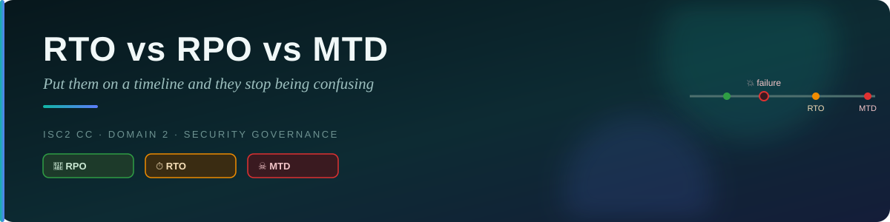
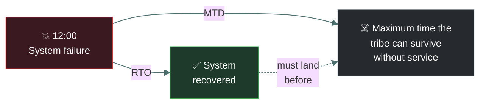
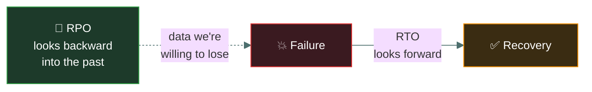
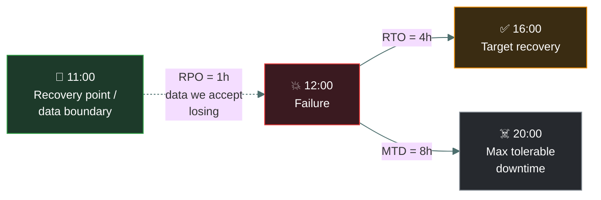
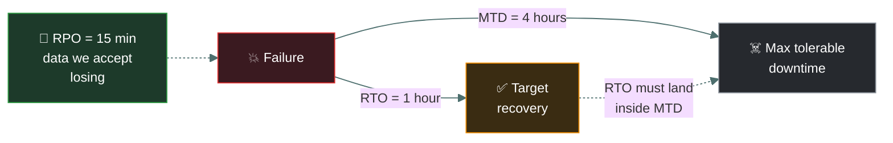

# ⏱️ RTO vs RPO vs MTD — Caveman Style

---

These three are **very commonly confused**, especially **RTO and RPO**.

The easiest way to learn them is to put them on a **timeline**.

## 🪨 First: Imagine the cave breaks

Grog's computer system suddenly stops working at:

> 💥 **12:00 — SYSTEM FAILURE**

Now the tribe needs to recover.

## ⏱️ The Timeline

But **RPO is different** because it looks **backward from the failure point**:

This is the key:

> 🔵 **RPO looks BACKWARD.**
> 🟢 **RTO looks FORWARD.**
> 🔴 **MTD is the maximum acceptable total downtime.**

---

## 💾 1. RPO — Recovery Point Objective

### Think: DATA

RPO asks:

> **"How much data can we afford to lose?"**

It is measured in **time**.

Suppose:

> **RPO = 1 hour**

The system fails at:

> 💥 12:00

The organization wants recovery to use data from approximately:

> 🕚 11:00 or later

So it is prepared to lose approximately **up to 1 hour of data**, depending on the recovery setup.

**Caveman question:** "How much of my recent food/data can I afford to lose?"

**Memory:** 💾 **RPO = DATA LOSS**

---

## 🏃 2. RTO — Recovery Time Objective

Now ask a different question:

> **"How quickly must the system be restored?"**

Suppose:

> **RTO = 4 hours**

System fails: 💥 12:00

The target is to recover by approximately: 🕓 **16:00**

**Caveman question:** "How quickly do I need my cave working again?"

**Memory:** ⏱️ **RTO = RECOVERY TIME**

---

## ☠️ 3. MTD — Maximum Tolerable Downtime

MTD asks:

> **"What is the maximum amount of time the business can tolerate being unavailable before the
> consequences become unacceptable?"**

Suppose:

> **MTD = 8 hours**

If the system fails at: 💥 12:00

The organization must not allow the disruption to continue beyond approximately: ☠️ **20:00**

After that point, the consequences become unacceptable.

**Caveman question:** "How long can my tribe survive without this before things become
unacceptable?"

**Memory:** ☠️ **MTD = MAXIMUM DOWNTIME**

---

## 🎯 Put all three on one timeline

Suppose:

- **RPO = 1 hour**
- **RTO = 4 hours**
- **MTD = 8 hours**

The system fails at **12:00**.

So:

**💾 RPO** — Looks **BACKWARD** from the failure. "How much data can we lose?"

**⏱️ RTO** — Moves **FORWARD** from the failure. "How quickly should we recover?"

**☠️ MTD** — Also moves **FORWARD**, representing the **absolute maximum tolerable duration of
the disruption**. "How long can we tolerate this?"

---

## ⚠️ The Golden Rule: RTO ≠ RPO

This is where exam questions try to trick you.

❌ **Wrong:** RPO = how quickly to recover. No!

✅ **Correct:** **RPO = how much data loss is acceptable**

❌ **Wrong:** RTO = how much data can be lost. No!

✅ **Correct:** **RTO = how quickly the system should be restored**

---

## 🧠 Easy Memory Trick

Look at the letters:

**RPO → P = Point** — 💾 **Recovery Point Objective** — Think: "What point in time do I need to
recover my data to?"

**RTO → T = Time** — ⏱️ **Recovery Time Objective** — Think: "How much time do I have to
recover?"

**MTD → Maximum Time** — ☠️ **Maximum Tolerable Downtime** — Think: "What's the longest we can
tolerate being down?"

---

## 🏢 Real-World Example

Imagine an online bank.

The bank determines:

> **RPO = 15 minutes**

It can tolerate losing at most about **15 minutes of recent transaction data**.

Then:

> **RTO = 1 hour**

The bank wants the service restored within **1 hour**.

And:

> **MTD = 4 hours**

The bank absolutely cannot tolerate the service being unavailable for more than **4 hours**.

The recovery target should be **inside the maximum tolerable downtime**.

A common relationship is:

> **RTO ≤ MTD**

If your target recovery time is longer than the maximum time the business can tolerate, your
recovery strategy isn't meeting the business requirement.

---

## 🎯 Exam Cheat Sheet

| Metric | Question | Direction | Remember |
| --- | --- | --- | --- |
| 💾 **RPO** | How much data can we lose? | ⬅️ Backward from failure | **DATA** |
| ⏱️ **RTO** | How quickly must we recover? | ➡️ Forward | **TIME TO RECOVER** |
| ☠️ **MTD** | How long can we tolerate the outage? | ➡️ Maximum forward limit | **MAX DOWNTIME** |

## 🪨 Final Caveman Memory

> 💾 **RPO:** "How much DATA can Grog lose?"
>
> ⏱️ **RTO:** "How FAST must Grog recover?"
>
> ☠️ **MTD:** "How LONG can Grog survive without it?"

### The one rule you should never forget

> **RPO = data loss. RTO = recovery time. MTD = maximum tolerable downtime.**

---

<a href="../README.md">← Back to 02 · Security Governance</a>

