# 📢 Security Awareness Training

### *People are the attack surface you can't patch — so you teach them*

📌 *Tell awareness / training / education apart, know training is THE answer to phishing, and that simulations teach — they don't punish.*

---

## 🧸 The big idea

A scammer phones your grandmother pretending to be her bank. No firewall, no antivirus, no
encryption can stop her reading her card number out loud. The only defence is **her knowing the
trick exists**.

That's why awareness training matters: **every technical control can be bypassed by persuading a
person.** An employee who hands over their password has walked the attacker past every firewall in
one move — without any of them failing.

The vulnerability is human, so the control has to be human too. Awareness training is an
**administrative, preventive** control — and the exam's standing answer to phishing and social
engineering.

---

## 📖 Words you will keep seeing

| Word | What it means on this exam |
|---|---|
| **Security awareness** | Keeping security in people's minds. Continuous, for **everyone**. |
| **Training** | Teaching **specific skills** needed to do a role securely. |
| **Education** | Building deep understanding of **why** — for security professionals. |
| **Social engineering** | Manipulating **people** rather than technology. |
| **Phishing simulation** | A controlled fake phishing exercise to measure and teach. |
| **Security culture** | Shared attitude that makes secure behaviour normal. |
| **Reporting culture** | People report mistakes and suspicions **without fear**. |
| **Role-based training** | Training tailored to what a particular role actually does. |

---

## 🔍 The explanation

### Three levels — the exam separates them deliberately

Think of a kitchen: a **"wash your hands" poster** (awareness), a **food-safety course for the chefs**
(training), a **food-science degree** (education).

| | **Awareness** | **Training** | **Education** |
|---|---|---|---|
| **Audience** | Everyone | Specific roles | Security practitioners |
| **Goal** | Recognise and stay alert | Do a task securely | Understand principles |
| **Depth** | Shallow | Practical | Theoretical |
| **Example** | A phishing poster | A course on handling classified data | A degree or certification |

> ⚠️ **Awareness is not training.** A poster reminds you phishing exists; a course teaches you how
> to examine a message and what to do next.

### What programmes cover

| Topic | Why |
|---|---|
| **Phishing and social engineering** | The most common way in |
| **Passwords** | Strong, unique, never shared |
| **Physical security** | Tailgating, challenging visitors, clean desk |
| **Data handling** | What can be shared, where |
| **Incident reporting** | **How and when to report — the single most valuable behaviour** |
| **Acceptable use** | What the AUP requires |
| **Removable media / remote working** | USB risks, public Wi-Fi, shoulder surfing |

> 🎯 **Nobody spots every attack.** What decides the damage is how fast someone **reports** it —
> minutes instead of months.

### Phishing simulations — teach, don't punish

> [!IMPORTANT]
> **Punishing clickers teaches people to hide mistakes — and hidden mistakes become breaches.** The
> goal is a rising **reporting rate**, not just a falling click rate. Track the **trend**, not one
> campaign.

### Culture is the end goal

What builds it:

- **Visible senior-management support** — if leaders ignore the rules, nobody follows them.
- **No blame for honest mistakes.**
- **Relevance** — examples from people's real work.
- **Repetition** — onboarding alone fades; refreshers and ongoing reminders keep it alive.
- **Make the secure path the easy path.**

---

## ⚖️ Told apart

| | Means | Not to be confused with |
|---|---|---|
| **Awareness** | Keeps security **in mind**. Everyone. | **Training** — **how** to do something specific. |
| **Training** | Role-specific **skills**. | **Education** — **why**, for professionals. |
| **Awareness training** | **Administrative, preventive** control. | A technical control. |
| **Phishing simulation** | Teaching and measuring. | A test people "fail" and get punished for. |
| **Click rate** | How many fell for it. | **Reporting rate** — the more valuable measure. |

---

## ⚠️ Where your instinct is wrong

> [!WARNING]
> **In the job:** awareness training is a compliance tick-box.
>
> **On the exam:** it's an **administrative, preventive control** and the **expected answer** to
> phishing and social-engineering questions.

> [!WARNING]
> **In the job:** the fix for people falling for phishing is better email filtering.
>
> **On the exam:** filtering reduces volume, but some phishing always arrives. What the person does
> next is the vulnerability — and the answer is **training**.

> [!WARNING]
> **In the job:** repeat clickers get named and escalated.
>
> **On the exam:** simulations **teach**. Punishment drives mistakes underground.

---

## 🧠 How to remember it

**Awareness → NOTICE. Training → HOW. Education → WHY.**

**Human vulnerability → human control.**

**The goal is the reporting rate, not the click rate.**

---

## ✅ Check you actually got it

Answer all five before expanding anything.

**Q1.** An organisation suffers repeated successful phishing attacks. Which control MOST directly
addresses the underlying vulnerability?

- **A.** Upgrading the email filtering platform
- **B.** Security awareness training for all staff
- **C.** Implementing full-disk encryption on laptops
- **D.** Increasing password complexity requirements

<b>Answer</b>

**B.** Phishing exploits human judgement; the control has to address human judgement.

- **A** is a good layer and the strongest distractor — but some phishing always gets through.
- **C** protects stolen devices, unrelated to phishing.
- **D** doesn't help when someone types a complex password into a fake page.

**Q2.** What distinguishes security awareness from security training?

- **A.** Awareness is for executives; training is for technical staff
- **B.** Awareness keeps security in mind generally; training teaches specific skills for a role
- **C.** Awareness is mandatory; training is optional
- **D.** They are the same thing with different names

<b>Answer</b>

**B.**

- **A** invents a seniority split — awareness is for everyone.
- **C** invents an optionality split.
- **D** — the three-level distinction is exactly what's tested.

**Q3.** In a phishing simulation, several employees click the link. What is the BEST response?

- **A.** Issue formal warnings to everyone who clicked
- **B.** Provide immediate targeted teaching and track the trend over time
- **C.** Publish the names of those who clicked to encourage vigilance
- **D.** Remove email access from repeat offenders

<b>Answer</b>

**B.** Teach at the moment of the mistake; measure improvement over time.

- **A** turns an exercise into discipline — people learn to hide mistakes.
- **C** destroys the reporting culture that catches real incidents.
- **D** punishes without improving judgement.

**Q4.** How is security awareness training classified?

- **A.** Technical, preventive
- **B.** Administrative, preventive
- **C.** Administrative, detective
- **D.** Physical, deterrent

<b>Answer</b>

**B.** Delivered through people and process (administrative); aims to stop incidents (preventive).

- **A** — right function, wrong type.
- **C** — right type, wrong function.
- **D** — wrong on both.

**Q5.** Which behaviour is MOST valuable for an awareness programme to produce?

- **A.** Employees never clicking any link in any email
- **B.** Employees promptly reporting suspicious messages and their own mistakes
- **C.** Employees memorising the security policy
- **D.** Employees choosing longer passwords

<b>Answer</b>

**B.** Nobody spots every attack; fast reporting is what contains it.

- **A** is impossible — work needs links.
- **C** is rote learning that doesn't survive pressure.
- **D** is useful but narrow.

---

## 🎓 The grown-up version

<b>Extra depth — open this on a second read, never needed for the pass</b>

**Annual training alone changes little.** Improvement lasts weeks, then decays. What works: short,
frequent nudges at the moment of risk — a banner on external mail, a 30-second explanation right
after a simulated click.

**Click rate is easy to game** (send easy simulations). **Reporting rate** and **time to first
report** predict how fast a real incident surfaces.

**Design for human error.** If security depends on everyone spotting every expert fraud, the design
is unrealistic. Phishing-resistant authentication (passkeys bound to a site's address) means a
deceived user *still* can't hand over a usable credential.

**What "Report Phish" really does:** forwards the email **with full headers** so automated triage
can check SPF, DKIM and DMARC. Lookalike domains (`paypaI.com` with a capital I) pass those checks
because the attacker really owns the domain — which is why human judgement still matters.

---

## 📝 Cram lines

Destined for [`EXAM-DAY.md`](../../EXAM-DAY.md):

- **AWARENESS = notice** (everyone) · **TRAINING = how** (roles) · **EDUCATION = why** (professionals).
- **Awareness training = ADMINISTRATIVE + PREVENTIVE** — the answer to phishing / social engineering.
- **The most valuable behaviour is REPORTING**, including your own mistakes.
- **Simulations TEACH, not punish.** Measure the **reporting rate** and the trend.
- **Repeat it; senior management must visibly support it.**

---

<a href="../README.md">← back to 02 · Security Governance</a> &nbsp;·&nbsp; <a href="../measuring-cybersecurity-effectiveness/">next: Measuring cybersecurity effectiveness →</a>

