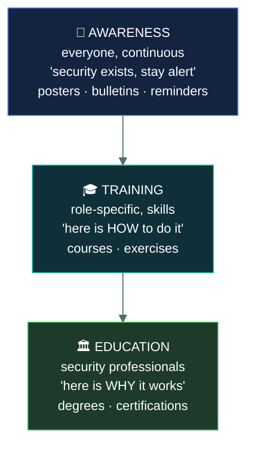
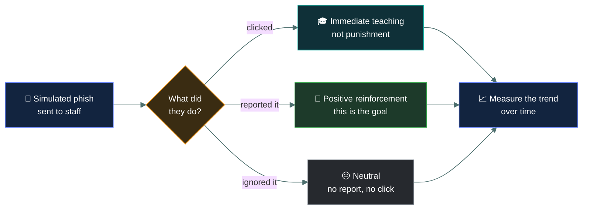
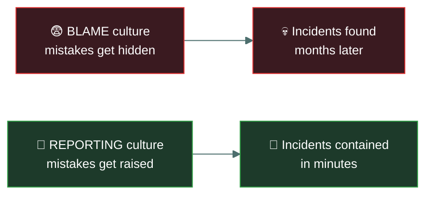
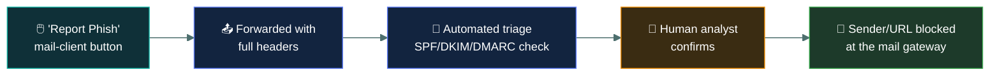

# 🎓 Security awareness training

### *The control for the vulnerability you cannot patch*

📌 *Awareness, training and education are three different things with three different purposes. And this is the standing answer to social engineering.*

---

## 🧸 The big idea

Remember the caveman guard from Domain 1, who demands the secret whistle before letting anyone
in? A clever stranger doesn't bother trying to guess the whistle. He just says, *"I'm carrying
an urgent message from the chief's own sister — quick, let me through, there's no time!"* Panic
and urgency, not the whistle, gets him past the wall.

That's the trick. Every technical control in this repo can be defeated by a person being
persuaded to do something. An employee who hands over their password has bypassed the firewall,
the encryption and the access control in one move, without any of them failing.

The tribe's answer isn't a stronger wall — walls don't stop tricks. It's making sure every guard,
everywhere, already knows this trick exists. **People are the attack surface you cannot patch.**
The control is to teach them — which makes awareness training an **administrative, preventive**
control, and the standing answer to social engineering.

> 🎯 **When a question asks how to reduce susceptibility to phishing or social engineering, the
> answer is security awareness training.** The vulnerability is human, so the control must be too.

The distinction the exam tests is that **awareness, training and education are three different
things**:

| | Purpose | Depth |
|---|---|---|
| **Awareness** | Keeps security **in mind** — reminders, posters, bulletins | Shallowest, continuous, everyone |
| **Training** | Teaches **specific skills** for a role — how to do the thing | Deeper, role-specific |
| **Education** | Builds **understanding of why** — the underlying principles | Deepest, for security professionals |

> 🧠 **Awareness makes you notice. Training teaches you what to do. Education explains why.**

Every tribe member hears the reminder, repeated often: *"strangers sometimes lie about who they
are — stay alert."* That's **awareness.** The guards specifically get drilled on exactly how to
verify a stranger's claim before ever opening the gate. That's **training.** And the wisest elder
studies *why* the urgency trick works on people at all, across many tribes, so she can design the
whole defence from first principles. That's **education.**

---

## 📖 Words you will keep seeing

| Word | What it means on this exam |
|---|---|
| **Security awareness** | Keeping security present in people's minds. Continuous, for everyone. |
| **Training** | Teaching specific skills needed to perform a role securely. |
| **Education** | Developing deeper understanding of security principles. |
| **Social engineering** | Manipulating people rather than technology. |
| **Phishing simulation** | A controlled fake phishing exercise to measure and teach. |
| **Security culture** | The shared attitude that makes secure behaviour normal. |
| **Role-based training** | Training tailored to what a particular role actually does. |
| **Onboarding training** | Security training given when someone joins. |
| **Refresher training** | Periodic repetition, typically annual. |
| **Reporting culture** | An environment where people report mistakes and suspicions without fear. |

---

## 🔺 The three levels

| | **Awareness** | **Training** | **Education** |
|---|---|---|---|
| **Audience** | Everyone | People in specific roles | Security practitioners |
| **Goal** | Recognise and stay alert | Perform a task securely | Understand principles |
| **Depth** | Shallow | Practical | Theoretical |
| **Frequency** | Continuous | Periodic | Extended |
| **Example** | A poster about phishing | A course on handling classified data | A degree or certification |

> ⚠️ **Awareness is not training.** A poster reminds you phishing exists; a course teaches you how
> to examine a message and what to do with it. Questions distinguish these deliberately.

---

## 📚 What awareness programmes cover

| Topic | Why |
|---|---|
| **Phishing and social engineering** | The most common entry point for attackers |
| **Password practice** | Strong, unique credentials; never shared |
| **Physical security** | Tailgating, visitor challenge, clean desk |
| **Data handling** | Classification, what may be shared and where |
| **Incident reporting** | **How and when to report** — the single most valuable behaviour |
| **Acceptable use** | What the AUP requires |
| **Removable media** | Risks of USB devices |
| **Remote and mobile working** | Public wi-fi, device security, shoulder surfing |

> 🎯 **Knowing how to report is the highest-value behaviour a programme can produce.** Staff will
> not spot every attack. Reporting quickly turns an incident discovered in minutes into one
> contained before it spreads, rather than one found months later.

---

## 🎣 Phishing simulations

Controlled, fake phishing messages sent to staff to measure susceptibility and provide teaching
at the moment of the mistake.

> [!IMPORTANT]
> **Simulations should teach, not punish.** Punishing people for clicking produces a culture where
> mistakes are hidden, and hidden mistakes are how a contained incident becomes a breach. The goal
> is to raise the **reporting rate**, not merely to lower the click rate.

**Measure the trend, not a single result.** One campaign is a snapshot; the value is whether
susceptibility falls and reporting rises over time.

---

## 🏛️ Security culture

The end state a programme is aiming at: an environment where **secure behaviour is normal** and
people raise concerns without hesitation.

**What builds it:**

- **Visible support from senior management** — if leaders ignore the rules, nobody follows them
- **No blame for honest mistakes**, so people report rather than hide
- **Relevance** — examples from people's actual work, not generic slides
- **Repetition** — annual training alone does not change behaviour
- **Making the secure path the easy path**, so people do not need to work around it

> ⚠️ **Training must be repeated.** A single session at onboarding fades. Periodic refreshers and
> continuous awareness activity are what keep it present.

---

## 🔬 What actually happens when someone clicks "Report Phish"

Training teaches people to report. Here's the real pipeline that report travels through.

That "Report Phish" button (built into Outlook/Gmail via platforms like KnowBe4 or Proofpoint)
isn't just a delete key — it forwards the message **with its full technical headers** to a
security mailbox or SOAR platform, which is exactly what a human forwarding a screenshot loses.
Automated triage then checks three real authentication signals: **SPF** (does the sending
server match who the domain says is allowed to send its mail?), **DKIM** (is there a valid
cryptographic signature proving the message wasn't altered in transit?), and **DMARC** (the
policy tying the two together, telling receiving servers what to do when they fail). A
failure on any of these is a strong, checkable technical signal — far more reliable than "the
logo looked slightly off." This is also the concrete mechanism behind lookalike-domain attacks:
`micros0ft-support.com` or `paypaI.com` (a capital I standing in for a lowercase l) will pass
SPF/DKIM/DMARC perfectly, because they genuinely own that domain — which is exactly why the
awareness training content still matters even with all this automation running underneath it.

---

## ⚖️ Told apart

| | Means | Not to be confused with |
|---|---|---|
| **Awareness** | Keeps security **in mind**. Everyone, continuous, shallow. | **Training**, which teaches **how** to do something specific. |
| **Training** | Role-specific **skills**. | **Education**, which builds understanding of **why** — for professionals. |
| **Awareness training** | An **administrative, preventive** control. | A technical control. The vulnerability is human. |
| **Phishing simulation** | A teaching and measurement exercise. | A test people fail. Punishment defeats the purpose. |
| **Click rate** | How many fell for it. | **Reporting rate**, which is the more valuable measure. |
| **Security culture** | Secure behaviour is normal and concerns are raised. | Completion statistics for a training course. |

---

## ⚠️ Where your instinct is wrong

> [!WARNING]
> **In the job:** awareness training is a compliance tick-box, and you would not call it a real
> security control.
>
> **On the exam:** it is an **administrative, preventive control**, and it is the **expected answer**
> to social engineering and phishing questions. Take it seriously.

> [!WARNING]
> **In the job:** the fix for people falling for phishing is better email filtering.
>
> **On the exam:** filtering helps and is not the answer to the *human* vulnerability. Some
> phishing always arrives, and the answer to what the person then does is **training**.

> [!WARNING]
> **In the job:** repeat clickers get named and escalated to their manager.
>
> **On the exam:** simulations **teach**; punishment drives mistakes underground, and hidden
> mistakes become breaches. The aim is to raise the **reporting rate**.

---

## 🧠 How to remember it

🧠 **Awareness makes you NOTICE. Training teaches you HOW. Education explains WHY.**

🧠 **People are the attack surface you cannot patch.**

🧠 **Human vulnerability → human control.** Social engineering is answered by training.

🧠 **The goal is the reporting rate, not the click rate.**

---

## ✅ Check you actually got it

Answer all five before expanding anything.

**Q1.** An organisation experiences repeated successful phishing attacks. Which control MOST
directly addresses the underlying vulnerability?

- **A.** Upgrading the email filtering platform
- **B.** Security awareness training for all staff
- **C.** Implementing full-disk encryption on laptops
- **D.** Increasing password complexity requirements

<b>Answer</b>

**B — security awareness training.** Phishing exploits human judgement, so the control must address
human judgement. This is the exam's standing answer for social engineering.

- **A** is a worthwhile technical layer that reduces volume, and it is the strongest distractor.
  Some phishing always gets through, and what the recipient then does is the vulnerability being
  asked about.
- **C** protects data on a stolen device and has nothing to do with phishing.
- **D** does not help when the user types their complex password into a convincing fake page.

**Q2.** What distinguishes security awareness from security training?

- **A.** Awareness is for executives; training is for technical staff
- **B.** Awareness keeps security in mind generally; training teaches specific skills for a role
- **C.** Awareness is mandatory; training is optional
- **D.** They are the same thing with different names

<b>Answer</b>

**B — awareness keeps security in mind generally; training teaches specific skills for a role.**
Awareness is continuous, shallow and for everyone; training is deeper, practical and role-specific.

- **A** invents an audience split by seniority. Awareness is for everyone including executives, and
  training is for anyone whose role requires specific skills.
- **C** invents a mandatory/optional distinction. Both are typically required.
- **D** is wrong, and the three-level distinction is exactly what this topic tests.

**Q3.** During a phishing simulation, several employees click the link. What is the BEST response?

- **A.** Issue formal warnings to everyone who clicked
- **B.** Provide immediate targeted teaching and track the trend over time
- **C.** Publish the names of those who clicked to encourage vigilance
- **D.** Remove email access from repeat offenders

<b>Answer</b>

**B — immediate targeted teaching, tracking the trend.** The simulation exists to teach at the
moment of the mistake, and the measure that matters is improvement over time.

- **A** treats an exercise as a disciplinary matter, which teaches people to hide mistakes rather
  than report them.
- **C** is worse still — public shaming reliably destroys the reporting culture that catches real
  incidents early.
- **D** removes a business function as a punishment and does nothing to improve judgement.

The underlying principle: **people who fear punishment hide mistakes, and hidden mistakes become
breaches.**

**Q4.** How should security awareness training be classified?

- **A.** Technical, preventive
- **B.** Administrative, preventive
- **C.** Administrative, detective
- **D.** Physical, deterrent

<b>Answer</b>

**B — administrative, preventive.** It is delivered through process and human activity rather than
technology, which makes it administrative, and it aims to stop incidents occurring, which makes it
preventive.

- **A** has the function right and the type wrong. Nothing is implemented in hardware or software.
- **C** has the type right and the function wrong. Training does not detect anything that has
  already happened.
- **D** is wrong on both axes.

**Q5.** Which behaviour is MOST valuable for an awareness programme to produce?

- **A.** Employees never clicking any link in any email
- **B.** Employees promptly reporting suspicious messages and their own mistakes
- **C.** Employees memorising the security policy
- **D.** Employees choosing longer passwords

<b>Answer</b>

**B — promptly reporting suspicious messages and their own mistakes.** Nobody spots every attack,
so the decisive factor is how fast the organisation finds out. Prompt reporting turns a potential
breach into a contained incident.

- **A** is unachievable and would stop normal business. Some links must be clicked for work to
  happen.
- **C** is rote learning that does not translate into behaviour under pressure.
- **D** is a useful outcome and a narrow one, addressing only credentials rather than the whole
  category of human-targeted attack.

---

## 🎓 The grown-up version

<b>Extra depth — open this on a second read, never needed for the pass</b>

**Annual training changes very little on its own.** Research into behaviour change consistently
finds that a single yearly session produces measurable improvement for a few weeks and then
decays. What works is frequent, short, contextual interventions — a brief prompt at the moment of
risk, a simulation followed immediately by a thirty-second explanation, a warning banner on
external mail. The compliance model of one course a year exists because it is auditable, not
because it is effective.

**Click rate is a poor headline metric.** It is easily gamed by sending easy simulations, it
varies enormously with the pretext used, and a low click rate tells you nothing about whether
anyone would report a real attack. **Reporting rate** and **time to first report** are far better
measures, because they predict how quickly a genuine incident surfaces. Mature programmes measure
both and treat a rising reporting rate as the primary success signal.

**There is a serious argument that blaming users is a design failure.** If an organisation's
security depends on every employee correctly identifying every sophisticated fraudulent message,
every time, the design is unrealistic. Attackers are professional, well resourced, and only need
one success. This is why phishing-resistant authentication matters so much: passkeys bound to a
site's origin mean that a user who is successfully deceived *still* cannot hand over a usable
credential. Training remains valuable and works best alongside controls that make human error
survivable.

**Culture is set at the top, visibly.** If executives request exemptions from MFA, share
credentials with assistants, or treat training as beneath them, no programme recovers from it.
Conversely, a leader who publicly reports their own near-miss does more for the reporting culture
than a year of campaigns. This is why the exam's insistence on senior management support is not
merely bureaucratic.

**Role-based training is where real value sits.** Generic awareness has a low ceiling. Teaching
developers about secure coding, finance staff about payment fraud and invoice redirection, and
administrators about credential handling produces changes that generic content cannot, because the
content matches decisions those people actually make.

---

## 📝 Cram lines

Destined for [`EXAM-DAY.md`](../../EXAM-DAY.md):

- **AWARENESS makes you notice** (everyone, continuous, shallow). **TRAINING teaches you how** (role-specific skills). **EDUCATION explains why** (professionals, principles).
- **Awareness training = ADMINISTRATIVE + PREVENTIVE control.**
- **It is the standing answer to SOCIAL ENGINEERING and PHISHING.** Human vulnerability → human control.
- **People are the attack surface you cannot patch.**
- **The most valuable behaviour is REPORTING** — quickly, including your own mistakes.
- **Phishing simulations TEACH, they don't punish.** Punishment hides mistakes; hidden mistakes become breaches.
- **Measure the REPORTING rate, not just the click rate.** Track the trend, not one campaign.
- **Training must be REPEATED.** Onboarding alone fades.
- **Culture needs visible senior management support** and no blame for honest mistakes.

---

<a href="../README.md">← back to 02 · Security Governance</a> &nbsp;·&nbsp; <a href="../measuring-cybersecurity-effectiveness/">next: Measuring cybersecurity effectiveness →</a>

