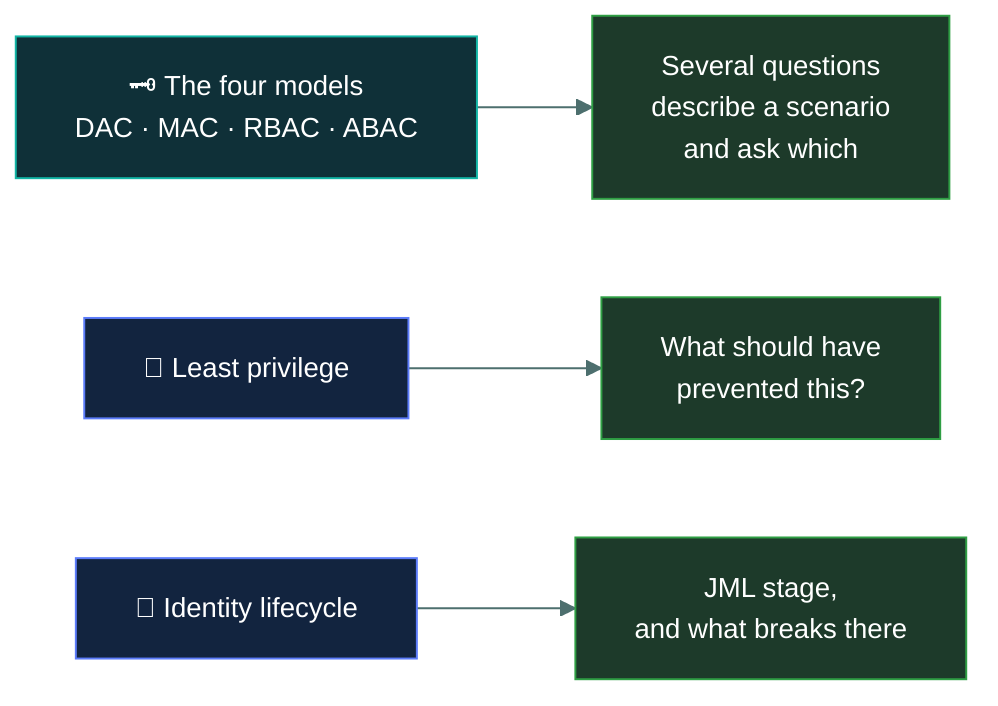

# 🚪&nbsp; 03 · IAM Concepts

### *Who gets in, to what, and on whose authority.*

---

## 👋 01 · Read this first

**20% of the paper** under the live outline, and renamed from "Access Control Concepts" to
**IAM Concepts** — Identity and Access Management. Two sub-areas only, but each is deep:

- **Identity life cycle management** — roles definition, provisioning, review, deprovisioning,
  and the frameworks and tools involved.
- **Logical access controls** — the principle of least privilege, separation of duties, and
  the access control models: DAC, MAC, RBAC, ABAC.

Most of the marks concentrate in one place: **the four access control models.** Expect several
questions describing a scenario and asking which model it is. Getting DAC and MAC the right way
round is worth real marks on its own — the names actively mislead. **Discretionary** means the
*owner* decides; **Mandatory** means the *system* decides and the owner cannot override it.

A second thread runs through every topic: **least privilege**. When a question asks what
should have prevented something, "the user had more access than they needed" is very often the
answer.

> [!NOTE]
> **Physical access control is no longer a named objective in this domain.** Under the old
> outline it was a full Domain 3 topic; under the live one, the physical thread survives only
> as physical penetration *testing* under Domain 5's security testing sub-area. If you're
> looking for badges, mantraps and CCTV, they live at
> [`05-security-operations/physical-penetration-testing/`](../05-security-operations/physical-penetration-testing/README.md).
> **Defence in depth** also moved — it's now architecture content under
> [`04-network-security/defence-in-depth/`](../04-network-security/defence-in-depth/README.md).

---

## 📂 02 · The 6 topics

Work top to bottom. The first topic establishes the vocabulary the rest depend on.

| | Topic | What you will be able to do afterwards |
|:--:|---|---|
| &#9745; | 🎟️ [`access-control-fundamentals/`](access-control-fundamentals/) | Use subject, object and rule correctly, and describe any access decision in those terms. |
| &#9745; | 💻 [`logical-access-controls/`](logical-access-controls/) | Separate logical from physical, and place controls that look like both. |
| &#9745; | 🗝️ [`dac-mac-rbac-abac/`](dac-mac-rbac-abac/) | Identify any of the four models from a scenario, without hesitating over DAC and MAC. |
| &#9745; | 🔻 [`least-privilege-and-sod/`](least-privilege-and-sod/) | Apply least privilege, need to know and segregation of duties to the right situations. |
| &#9745; | 👑 [`privileged-access/`](privileged-access/) | Say what makes an account privileged and which controls the exam expects on it. |
| &#9745; | 🔄 [`identity-lifecycle/`](identity-lifecycle/) | Walk joiner, mover and leaver, name the frameworks/tools involved, and explain what goes wrong at each stage. |

---

## 🎯 03 · Where the marks are

If you run short of time in this domain, the model comparison in
[`dac-mac-rbac-abac/`](dac-mac-rbac-abac/) is the page to know cold.

---

## ⏭️ 04 · Where to go next

When all six boxes are ticked, go to
[`04-network-security/`](../04-network-security/README.md) — 21.3%, and the second-heaviest
domain.

---

<a href="../README.md">← back to the repo index</a>

</content>
