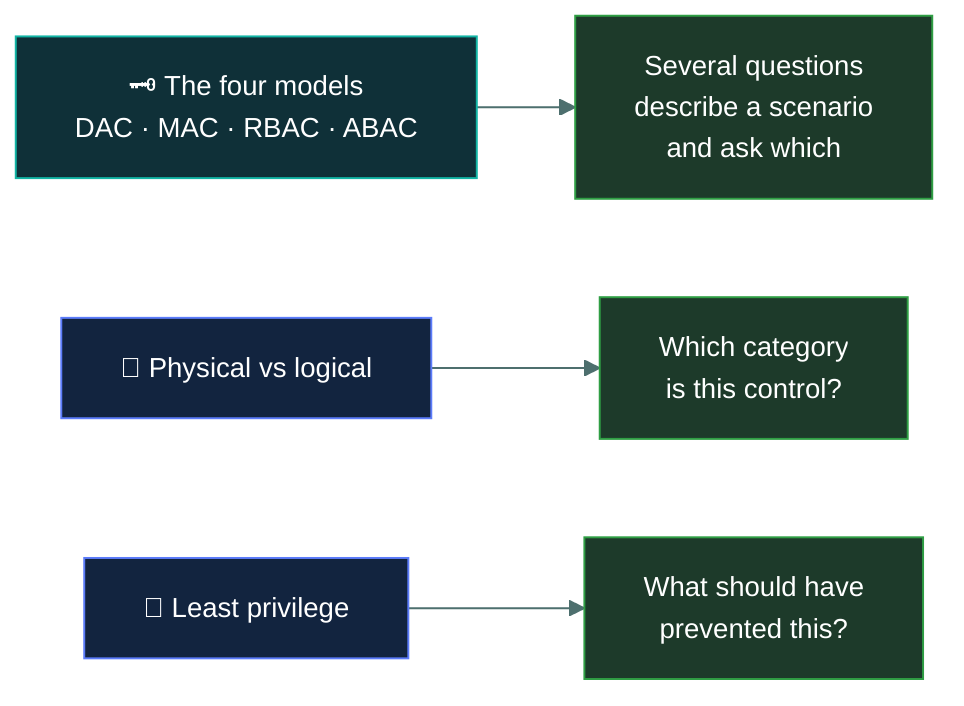

# 🚪&nbsp; 03 · Access Control Concepts

### *Who gets in, to what, and on whose authority.*

---

## 👋 01 · Read this first

22% of the paper, and **the most definition-dense domain on it**.

Where Domain 4 tested recall of facts, this domain tests whether you can tell four
near-identical models apart and put a given control in the right category. It is almost
entirely conceptual — there is nothing to configure and nothing to compute.

Two things carry most of the marks:

- **The four access control models.** DAC, MAC, RBAC and ABAC. Expect several questions
  describing a scenario and asking which model it is. Getting DAC and MAC the right way round
  is worth real marks on its own, and the names actively mislead — **Discretionary** means the
  *owner* decides, **Mandatory** means the *system* decides and the owner cannot override it.
- **Physical versus logical.** A large share of questions simply ask which category a control
  belongs to. The boundary is less obvious than it looks, because several controls have both a
  physical and a logical form.

A third thread runs through every topic: **least privilege**. It is the most frequently correct
principle in this domain, and when a question asks what should have prevented something, "the
user had more access than they needed" is very often the answer.

---

## 📂 02 · The 8 topics

Work top to bottom. The first topic establishes the vocabulary the rest depend on.

| | Topic | What you will be able to do afterwards |
|:--:|---|---|
| &#9745; | 🎟️ [`access-control-fundamentals/`](access-control-fundamentals/) | Use subject, object and rule correctly, and describe any access decision in those terms. |
| &#9745; | 🏢 [`physical-access-controls/`](physical-access-controls/) | Name the physical controls and say what each one actually stops. |
| &#9745; | 💻 [`logical-access-controls/`](logical-access-controls/) | Separate logical from physical, and place controls that look like both. |
| &#9744; | 🗝️ [`dac-mac-rbac-abac/`](dac-mac-rbac-abac/) | Identify any of the four models from a scenario, without hesitating over DAC and MAC. |
| &#9744; | 🔻 [`least-privilege-and-sod/`](least-privilege-and-sod/) | Apply least privilege, need to know and segregation of duties to the right situations. |
| &#9744; | 👑 [`privileged-access/`](privileged-access/) | Say what makes an account privileged and which controls the exam expects on it. |
| &#9744; | 🔄 [`identity-lifecycle/`](identity-lifecycle/) | Walk joiner, mover and leaver, and explain what goes wrong at each stage. |
| &#9744; | 🛡️ [`defence-in-depth/`](defence-in-depth/) | Explain layered control strategy as ISC2 defines it, and why layers must be independent. |

---

## 🎯 03 · Where the marks are

If you run short of time in this domain, the model comparison in
[`dac-mac-rbac-abac/`](dac-mac-rbac-abac/) is the page to know cold.

---

## ⏭️ 04 · Where to go next

When all eight boxes are ticked, go to
[`05-security-operations/`](../05-security-operations/README.md) — 18%, and the last of the
larger domains.

---

<a href="../README.md">← back to the repo index</a>

