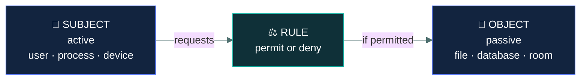
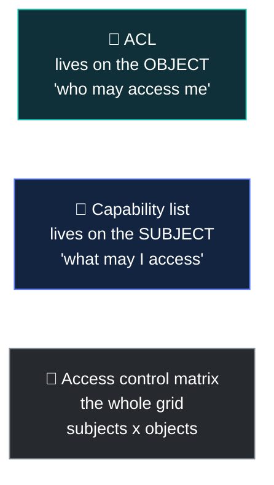

# 🎟️ Access control fundamentals

### *Subject, object, rule — the three words every access decision is described in*

📌 *Short, and everything else in this domain is written in its vocabulary. Get subject and object the right way round and the rest follows.*

---

## 🧸 The big idea

Every access decision, anywhere, has the same three parts:

> **A subject requests access to an object, and a rule decides.**

- The **subject** is the active thing doing the asking — a person, a process, a device.
- The **object** is the passive thing being asked for — a file, a database, a room, a printer.
- The **rule** is the logic that permits or denies it.

That is the entire grammar of access control. "Priya opens the payroll file" is subject, action,
object. "The backup service reads the database" is the same shape, with a process as the subject.

The one thing worth pausing on: **subject and object are roles, not fixed identities.** A program
is a subject when it requests a file, and an object when a user launches it. What decides is
which end of the request it sits on.

---

## 📖 Words you will keep seeing

| Word | What it means on this exam |
|---|---|
| **Subject** | The **active** entity requesting access — user, process, device, program. |
| **Object** | The **passive** entity being accessed — file, database, room, device, record. |
| **Rule** | The logic deciding whether the access is permitted. |
| **Access control** | The selective restriction of access to a resource. |
| **Permission** | A specific right over a specific object — read, write, execute, delete. |
| **Privilege** | A system-level right, such as installing software or changing configuration. |
| **Entitlement** | The total set of access rights a subject holds. |
| **ACL** — Access Control List | A list attached to an **object**, stating which subjects may do what to it. |
| **Capability list** | A list attached to a **subject**, stating which objects it may access. |
| **Access control matrix** | A grid of subjects against objects, showing the permitted actions. |
| **Reference monitor** | The concept of a component that mediates **every** access request. |
| **Default deny** | Denying anything not explicitly permitted. |

---

## 🔍 The three parts

| | Subject | Object |
|---|---|---|
| Nature | **Active** — it acts | **Passive** — it is acted upon |
| Examples | User, process, service, device, program | File, folder, database, record, room, printer, network segment |
| In a sentence | The one doing | The one done to |

> 🎯 **Active versus passive is the test.** If it initiates the request, it is the subject. If it
> is the thing being requested, it is the object.

> ⚠️ **The same entity can be either.** An application is a **subject** when it reads a
> configuration file, and an **object** when a user runs it. Questions occasionally exploit this,
> so decide by which end of *this* request it is on.

---

## 📋 How rules get stored

Three ways of expressing the same information, and the exam wants them apart.

| | Attached to | Answers | Example |
|---|---|---|---|
| **Access control list (ACL)** | The **object** | "Who may access **me**?" | A file listing which users can read or write it |
| **Capability list** | The **subject** | "What may **I** access?" | A token listing everything a user may reach |
| **Access control matrix** | Neither — it is the whole grid | Both, at once | A table of every subject against every object |

> 🧠 **ACL is on the Object. Capability is on the Subject.** They are the same information read
> from opposite ends — a row of the matrix versus a column of it.

**An access control matrix** in miniature:

| | `payroll.xlsx` | `public-notice.pdf` | Server room |
|---|---|---|---|
| **Priya (HR)** | Read, Write | Read | — |
| **Sam (staff)** | — | Read | — |
| **Backup service** | Read | Read | — |
| **Facilities** | — | Read | Enter |

Read a **row** and you have a capability list. Read a **column** and you have an ACL.

---

## 🚫 Default deny

The expected posture throughout this domain: **anything not explicitly permitted is denied.**

| | Means | Result |
|---|---|---|
| **Default deny** (allow list) | Start with nothing; permit what is required | Secure by default; new things must be requested |
| **Default allow** (deny list) | Start with everything; block what is known bad | Anything not yet identified as bad gets through |

> 🎯 **Default deny is nearly always the correct answer.** If one option describes denying by
> default and permitting by exception, it is very likely right.

---

## 🔎 The reference monitor

A concept rather than a product: the component that mediates **every** access request between
subjects and objects.

To be trustworthy it must be:

- **Always invoked** — no access can bypass it
- **Tamper-proof** — it cannot be modified by what it controls
- **Small enough to be verified** — simple enough that it can be shown to be correct

> ⚠️ **"Always invoked" is the property that matters most.** A control that can be bypassed is not
> a control. This is why an access check performed only in the user interface, with an API that
> skips it, is a well-known failure pattern.

---

## ⚖️ Told apart

| | Means | Not to be confused with |
|---|---|---|
| **Subject** | The **active** requester. | **Object**, the passive thing requested. Active versus passive decides it. |
| **ACL** | Attached to the **object** — who may access this. | **Capability list**, attached to the **subject** — what may I access. |
| **Permission** | A right over a specific object. | **Privilege**, a system-level right such as installing software. |
| **Entitlement** | The **total** set of rights a subject holds. | A single permission. Entitlement is the whole collection. |
| **Default deny** | Permit only what is explicitly allowed. | **Default allow**, which blocks only what is known bad. |
| **Access control** | Restricting who may reach what. | **Authentication**, which establishes who someone is. Authentication comes first. |

---

## ⚠️ Where your instinct is wrong

> [!WARNING]
> **In the job:** "subject" and "object" are academic terms nobody uses in a change ticket.
>
> **On the exam:** they are the precise vocabulary the whole domain is written in, and questions
> use them directly. Know which is active.

> [!WARNING]
> **In the job:** a deny list is often the practical approach — block the known-bad and get on
> with it.
>
> **On the exam:** **default deny** is the expected posture almost every time. Allow-listing is
> the secure model; deny-listing lets through everything not yet identified as bad.

---

## 🧠 How to remember it

🧠 **Subjects act. Objects are acted upon.**
The subject is the one doing the verb.

🧠 **ACL on the Object, Capability on the Subject.**
*A row of the matrix is a capability; a column is an ACL.*

🧠 **Default deny: if it was not allowed, it is denied.**

---

## ✅ Check you actually got it

Answer all five before expanding anything.

**Q1.** A backup service reads files from a database server. In this transaction, what is the
backup service?

- **A.** The object, because it is a system component
- **B.** The subject, because it is actively requesting access
- **C.** The reference monitor, because it mediates access to data
- **D.** Neither — only human users can be subjects

<b>Answer</b>

**B — the subject, because it is actively requesting access.** Subjects are defined by being
active, and a subject can be a process or service just as readily as a person.

- **A** reverses it. Being a system component says nothing about which role it plays; what matters
  is that it initiated the request.
- **C** is wrong: the reference monitor is the component that *decides* whether access is
  permitted, not one of the parties to the request.
- **D** is the misconception this question targets. Processes, services and devices are all
  subjects when they request access.

**Q2.** A list is attached to a file specifying which users may read and write it. What is this?

- **A.** A capability list
- **B.** An access control list
- **C.** An access control matrix
- **D.** An entitlement

<b>Answer</b>

**B — an access control list.** An ACL is attached to the **object** and answers "who may access
me".

- **A** is attached to the **subject** and answers "what may I access" — the same information from
  the other end.
- **C** is the full grid of all subjects against all objects. A single file's list is one column
  of it, not the whole thing.
- **D** describes the total set of rights a subject holds, which is a property of a subject rather
  than a list on an object.

**Q3.** Which access control posture is MOST secure?

- **A.** Default allow, blocking known malicious activity
- **B.** Default deny, permitting only what is explicitly required
- **C.** Permitting all internal traffic and denying external traffic
- **D.** Permitting access based on the requester's seniority

<b>Answer</b>

**B — default deny, permitting only what is explicitly required.** Anything not anticipated is
denied, so new and unknown access attempts fail safely.

- **A** allows through everything not yet identified as bad, which by definition includes anything
  novel. It is the weaker model.
- **C** is the traditional perimeter assumption that internal means trustworthy, which fails as
  soon as an attacker gets inside or an insider acts.
- **D** grants access by rank rather than need. Senior staff frequently need *less* system access
  than the people doing the work, and this is a common real-world over-permissioning pattern.

**Q4.** Which property of a reference monitor ensures that no access request can bypass it?

- **A.** Tamper-proof
- **B.** Small enough to be verified
- **C.** Always invoked
- **D.** Default deny

<b>Answer</b>

**C — always invoked.** Every access request must pass through it; if any path avoids it, the
control is not a control.

- **A** ensures it cannot be modified by the things it controls — important, and a different
  property.
- **B** ensures it is simple enough to be verified as correct, which supports trust in it rather
  than its unavoidability.
- **D** is an access control posture, not one of the reference monitor's three properties.

**Q5.** Which pairing correctly describes the relationship?

- **A.** A permission is a system-level right; a privilege applies to a specific file
- **B.** A subject is passive; an object is active
- **C.** An entitlement is the total set of access rights a subject holds
- **D.** An ACL is attached to the subject; a capability list is attached to the object

<b>Answer</b>

**C — an entitlement is the total set of access rights a subject holds.** It is the aggregate, not
any individual right.

- **A** is reversed. A **permission** applies to a specific object; a **privilege** is a
  system-level right such as installing software.
- **B** is reversed. Subjects are active and objects are passive.
- **D** is reversed. The **ACL** hangs off the **object**; the **capability list** hangs off the
  **subject**.

Three of the four options are correct statements with their terms swapped — which is the standard
shape of a question in this domain, and why the direction of each pairing is worth learning
deliberately.

---

## 🎓 The grown-up version

<b>Extra depth — open this on a second read, never needed for the pass</b>

**Why the matrix is never implemented directly.** An access control matrix with ten thousand users
and a million objects has ten billion cells, almost all of them empty. Real systems store it
sparsely, which is exactly what ACLs and capability lists are — the matrix compressed by column or
by row respectively. The choice has practical consequences: ACLs make it easy to answer "who can
reach this file" and hard to answer "what can this user reach", and capability-based systems have
the opposite property. Most operating systems chose ACLs, which is why access reviews — a
subject-centred question — are so laborious in practice.

**The reference monitor and the trusted computing base.** The concept comes from 1970s security
research, where the reference monitor was the heart of the **trusted computing base**: the set of
components whose correctness the system's security depends on. The design goal was to keep that
set as small as possible, because a small amount of code can be verified and a large amount cannot.
Modern systems have enormous trusted computing bases, which is a substantial part of why operating
system security is hard.

**Where access checks go wrong in practice.** The "always invoked" property fails constantly in
real applications. A web interface checks a user's role before displaying a button; the underlying
API does not repeat the check, so anyone who calls it directly bypasses the control entirely.
This is insecure direct object reference, and it remains among the most common serious
vulnerabilities in web applications. The lesson is that the check belongs at the point of access,
not at the point of presentation.

**Default deny costs something real.** Allow-listing is more secure and more work: every legitimate
new requirement becomes a change request, and an incomplete allow list breaks business processes
in ways that generate pressure to loosen it. Organisations that adopt default deny without the
operational capacity to process exceptions quickly end up with broad permissive rules added in a
hurry — which is worse than a well-maintained deny list. The control and the process behind it are
inseparable.

---

## 📝 Cram lines

Destined for [`EXAM-DAY.md`](../../EXAM-DAY.md):

- **Subject requests, object is requested, rule decides.**
- **Subjects are ACTIVE** (user, process, device). **Objects are PASSIVE** (file, database, room).
- **The same thing can be either** — decide by which end of *this* request it's on.
- **ACL is attached to the OBJECT** ("who may access me"). **Capability list is attached to the SUBJECT** ("what may I access").
- **Access control matrix** = the whole grid. A row = capability list; a column = ACL.
- **Permission** = right over a specific object. **Privilege** = system-level right. **Entitlement** = the total set.
- **Default deny** — permit only what is explicitly required. Nearly always the right answer.
- **Reference monitor must be: always invoked · tamper-proof · small enough to verify.**

---

<a href="../README.md">← back to 03 · Access Control</a> &nbsp;·&nbsp; <a href="../physical-access-controls/">next: Physical access controls →</a>

