# 🚪 Access Control Fundamentals

### *A subject asks, an object is asked for, a rule decides*

📌 *Know subject (active) vs object (passive), ACL vs capability list, why default deny wins, and what a reference monitor must be.*

---

## 🧸 The big idea

At a library, you ask to borrow a rare book. The librarian checks a rule — *"only members with
special access may borrow rare books"* — and says yes or no.

- **You** — the one asking — are the **subject**. You're **active**.
- **The book** — the thing asked for — is the **object**. It's **passive**.
- **The library's rule** decides.

> **A subject requests access to an object, and a rule decides.**

That's the grammar of every access decision. "Priya opens the payroll file" and "the backup service
reads the database" have exactly the same shape — a process can be a subject just as easily as a
person.

---

## 📖 Words you will keep seeing

| Word | What it means on this exam |
|---|---|
| **Subject** | The **active** entity requesting access — user, process, device, program. |
| **Object** | The **passive** entity being accessed — file, database, room, record. |
| **Rule** | The logic deciding whether access is permitted. |
| **Permission** | A right over a **specific object** — read, write, execute, delete. |
| **Privilege** | A **system-level** right — install software, change configuration. |
| **Entitlement** | The **total** set of access rights a subject holds. |
| **ACL** | Access Control List — attached to the **object**: "who may access me?" |
| **Capability list** | Attached to the **subject**: "what may I access?" |
| **Access control matrix** | The whole grid of subjects × objects. |
| **Reference monitor** | The concept of a component that checks **every** access request. |
| **Default deny** | Deny anything not explicitly permitted. |

---

## 🔍 The explanation

### The three parts

> 🎯 **Active vs passive decides it.** Whatever *initiates* the request is the subject.

### Roles, not fixed identities

The same thing can be a subject in one request and an object in another:

Decide by which end of **this** request it sits on.

### How the rules are stored: ACL vs capability list

The same information, read from opposite ends:

Put every subject and object in one grid and you get the **access control matrix**:

| | `payroll.xlsx` | `notice.pdf` | Server room |
|---|---|---|---|
| **Priya (HR)** | Read, Write | Read | — |
| **Sam (staff)** | — | Read | — |
| **Backup service** | Read | Read | — |
| **Facilities** | — | Read | Enter |

**Read a row → a capability list. Read a column → an ACL.**

### Default deny

> 🎯 **Default deny is nearly always the correct answer.** If an option denies by default and
> permits by exception, it's very likely right.

### The reference monitor

A **concept**, not a product: the component that sits between every subject and every object and
checks every single request.

| Property | Why |
|---|---|
| **Always invoked** | No request can bypass it. **The most important one** — a bypassable control isn't a control. |
| **Tamper-proof** | What it controls can't modify it. |
| **Small enough to verify** | Simple enough to be proven correct. |

---

## ⚖️ Told apart

| | Means | Not to be confused with |
|---|---|---|
| **Subject** | The **active** requester. | **Object** — the passive thing requested. |
| **ACL** | On the **object** — who may access this. | **Capability list** — on the **subject** — what may I access. |
| **Permission** | Right over a specific object. | **Privilege** — system-level right. |
| **Entitlement** | The **total** set of rights. | A single permission. |
| **Default deny** | Permit only what's explicitly allowed. | **Default allow** — block only known-bad. |
| **Access control** | Restricting who may reach what. | **Authentication** — establishing who someone is (comes first). |

---

## ⚠️ Where your instinct is wrong

> [!WARNING]
> **In the job:** "subject" and "object" are academic words nobody writes in a change ticket.
>
> **On the exam:** they're the exact vocabulary this domain is written in. Know which is active.

> [!WARNING]
> **In the job:** a deny list is practical — block the known-bad and move on.
>
> **On the exam:** **default deny** is the expected posture. A deny list lets through everything
> not yet identified as bad.

---

## 🧠 How to remember it

**Subjects act. Objects are acted upon.**

**ACL on the Object. Capability on the Subject.** A row is a capability list; a column is an ACL.

**If it wasn't allowed, it's denied.**

---

## ✅ Check you actually got it

Answer all five before expanding anything.

**Q1.** A backup service reads files from a database server. In this transaction, what is the
backup service?

- **A.** The object, because it is a system component
- **B.** The subject, because it is actively requesting access
- **C.** The reference monitor, because it mediates access to data
- **D.** Neither — only human users can be subjects

<b>Answer</b>

**B.** It initiated the request, so it's the subject.

- **A** — being a system component doesn't decide the role.
- **C** — the reference monitor *decides*; it isn't a party to the request.
- **D** — processes, services and devices are subjects when they request access.

**Q2.** A list attached to a file specifies which users may read and write it. What is this?

- **A.** A capability list
- **B.** An access control list
- **C.** An access control matrix
- **D.** An entitlement

<b>Answer</b>

**B — an ACL.** Attached to the object.

- **A** is attached to the subject.
- **C** is the whole grid; one file's list is one column.
- **D** is a subject's total set of rights.

**Q3.** Which access control posture is MOST secure?

- **A.** Default allow, blocking known malicious activity
- **B.** Default deny, permitting only what is explicitly required
- **C.** Permitting all internal traffic and denying external traffic
- **D.** Permitting access based on the requester's seniority

<b>Answer</b>

**B.** Anything unanticipated fails safe.

- **A** lets through anything novel.
- **C** assumes "internal = trustworthy", which fails once an attacker is inside.
- **D** grants by rank, not need.

**Q4.** Which reference monitor property ensures no access request can bypass it?

- **A.** Tamper-proof
- **B.** Small enough to be verified
- **C.** Always invoked
- **D.** Default deny

<b>Answer</b>

**C — always invoked.**

- **A** stops it being modified — a different property.
- **B** supports trusting it's correct.
- **D** is a posture, not a reference-monitor property.

**Q5.** Which pairing is correct?

- **A.** A permission is a system-level right; a privilege applies to a specific file
- **B.** A subject is passive; an object is active
- **C.** An entitlement is the total set of access rights a subject holds
- **D.** An ACL is attached to the subject; a capability list is attached to the object

<b>Answer</b>

**C.**

- **A**, **B** and **D** are each correct statements with the terms **swapped** — the standard
  trap in this domain.

---

## 🎓 The grown-up version

<b>Extra depth — open this on a second read, never needed for the pass</b>

**The matrix is never stored whole** — 10,000 users × a million objects is ten billion mostly empty
cells. ACLs and capability lists are the matrix compressed by column and by row.

**You can see both in real systems.** `getfacl payroll.xlsx` on Linux prints the file's ACL;
Windows uses a DACL of allow/deny entries. An **AWS IAM policy** is a capability list — JSON
attached to a user or role naming what it may do — which is why "what can this role touch?" is
easier to answer in the cloud than "who can touch this folder?" on a file server.

**"Always invoked" fails constantly in web apps.** The UI hides a button from non-admins, but the
API behind it never re-checks — call it directly and you're in (insecure direct object reference).
The check belongs at the point of access, not presentation.

**Default deny needs a fast exception process.** Without one, people add broad "allow all" rules in
a hurry — worse than a well-kept deny list.

---

## 📝 Cram lines

Destined for [`EXAM-DAY.md`](../../EXAM-DAY.md):

- **Subject (ACTIVE) requests; object (PASSIVE) is requested; rule decides.** Same thing can be either.
- **ACL on the OBJECT; capability list on the SUBJECT.** Matrix row = capability; column = ACL.
- **Permission** = specific object · **Privilege** = system-level · **Entitlement** = the total.
- **Default deny** — nearly always right.
- **Reference monitor: always invoked · tamper-proof · verifiable.**

---

<a href="../README.md">← back to 03 · IAM Concepts</a> &nbsp;·&nbsp; <a href="../logical-access-controls/">next: Logical access controls →</a>

