# 🎟️ Access Control Fundamentals — Caveman Style

### *Subject, object, rule — the three words every access decision is described in*

📌 *Short, and everything else in this domain is written in its vocabulary. Get subject and object the right way round and the rest follows.*

---

Access control is basically:

> **"Who is allowed to do what to which thing?"**

The exam wants you to correctly identify **three things**:

1. 👤 **Subject**
2. 📄 **Object**
3. 📜 **Rule**

---

# 👤 1. Subject — "WHO?"

The **subject** is the person, process, or entity **requesting access**.

Think:

> 🪨 **Who wants to enter the cave?**

Examples:

- 👤 User
- 👨‍💼 Employee
- 🤖 Application/process
- 🖥️ Computer account
- 🔐 Service account

### Example

Alice wants to open a file.

> **Alice = Subject**

---

# 📄 2. Object — "WHAT?"

The **object** is the resource being accessed.

Think:

> 🪨 **What does Grog want to touch?**

Examples:

- 📄 File
- 🗄️ Database
- 📁 Folder
- 💻 Computer
- 🌐 Website
- 🖨️ Printer
- 🏦 Bank account

### Example

Alice wants to open:

> `Payroll.xlsx`

Then:

> **Payroll.xlsx = Object**

---

# 📜 3. Rule — "WHAT IS ALLOWED?"

The **rule** determines what the subject is allowed to do with the object.

Think:

> 🪨 **"Is Grog allowed to touch the food?"**

Possible permissions:

- 👀 Read
- ✏️ Write
- 🗑️ Delete
- ▶️ Execute
- 🔄 Modify
- 🚫 No access

---

# 🎯 Put the Three Together

Suppose:

> Alice wants to read the company's payroll file.

Break it down:

### 👤 Subject

**Alice**

> Who is requesting access?

### 📄 Object

**Payroll file**

> What is she trying to access?

### 📖 Rule

**Alice is allowed to read the payroll file.**

> What does the access-control policy allow?

Therefore:

> **Subject → Object → Allowed action**

**Alice → Payroll.xlsx → Read = ALLOW ✅**

---

# 🚫 Another Example

Bob wants to delete the payroll file.

The organization's rule says:

> Bob can read payroll information but cannot delete it.

So:

👤 **Subject:** Bob

📄 **Object:** Payroll file

🗑️ **Requested action:** Delete

📜 **Rule:** Bob cannot delete payroll files

### Decision:

> ❌ **DENY**

---

# 🧠 The Access Decision Formula

When you see an access-control scenario, ask:

> **WHO → WANTS TO DO WHAT → TO WHICH RESOURCE → WHAT DOES THE RULE SAY?**

More formally:

> **Subject + Action + Object + Rule → Access Decision**

For example:

> **Alice + Read + Payroll.xlsx + Rule allows read → ALLOW ✅**

or:

> **Bob + Delete + Payroll.xlsx + Rule denies delete → DENY ❌**

---

# 🪨 Caveman Example

Grog wants to take meat from the food cave.

### 👤 Subject

> **Grog**

Who wants access?

### 📦 Object

> **Food**

What is he trying to access?

### 🖐️ Action

> **Take/read/use**

What does he want to do?

### 📜 Rule

> **Only hunters may take food.**

If Grog is a hunter:

> ✅ **ALLOW**

If Grog isn't a hunter:

> ❌ **DENY**

---

# ⚠️ Don't Confuse Subject and Object

This is a common exam trap.

### ❌ Wrong

> "The file is the subject."

No.

The file is normally the **object**.

### ✅ Correct

> **User/process = Subject**

> **Resource being accessed = Object**

Think:

> 👤 **Subject acts on Object**

---

# 🎯 More Examples

| Scenario | Subject | Object | Action | Decision |
| --- | --- | --- | --- | --- |
| Alice reads HR file | Alice | HR file | Read | Allow |
| Bob deletes database | Bob | Database | Delete | Deny |
| Backup service writes backup | Backup service | Backup storage | Write | Allow |
| Guest accesses admin panel | Guest | Admin panel | Access | Deny |
| Web app reads customer DB | Web app | Customer database | Read | Allow |

---

# 🔐 Authentication vs Authorization

This connects directly to what you learned earlier.

### 🔑 Authentication

> **"WHO are you?"**

Example:

> "I am Alice."

The system verifies Alice's identity.

### 🎟️ Authorization

> **"WHAT are you allowed to do?"**

Example:

> "Alice is allowed to read this file."

So:

> **Authentication identifies the subject.**

> **Authorization applies rules to decide what that subject can do.**

---

# 🧠 The Exam Trick

If the question gives you a scenario, **don't start by looking for "allow" or "deny."**

First identify:

### 1️⃣ WHO?

→ **Subject**

### 2️⃣ WHAT RESOURCE?

→ **Object**

### 3️⃣ WHAT ACTION?

→ Read / Write / Delete / Execute / etc.

### 4️⃣ WHAT RULE?

→ What permission does the policy give that subject?

### 5️⃣ RESULT?

→ **Allow or Deny**

---

# 🪨 Ultimate Caveman Memory

Imagine Grog standing at a cave door:

> 👤 **GROG** → **SUBJECT**

> 🥩 **FOOD** → **OBJECT**

> ✋ **TAKE FOOD** → **ACTION**

> 📜 **ONLY HUNTERS MAY TAKE FOOD** → **RULE**

> ✅/❌ **ALLOW OR DENY** → **ACCESS DECISION**

### One sentence to memorize:

> **A subject requests an action on an object, and the applicable rule determines whether access is allowed or denied.**

---

# ✅ Check You Actually Got It

Answer all six before expanding anything.

**Q1.** A backup service reads files from a database server. In this transaction, what is the backup service?

- **A.** The object, because it is a system component
- **B.** The subject, because it is requesting access
- **C.** The rule, because it decides what gets copied
- **D.** Neither — only humans can be subjects

<b>Answer</b>

**B — the subject.** Whoever *requests* access is the subject, and that can be a process or service, not just a person.

- **A** reverses it. Being a system component doesn't make it the object; the database server is the object.
- **C** is wrong: the rule is the policy that says what is allowed, not a party to the request.
- **D** is the trap. Applications, services and computer accounts are all subjects when they ask for access.

**Q2.** Alice opens `Payroll.xlsx` to read it. What is `Payroll.xlsx`?

- **A.** The subject
- **B.** The object
- **C.** The action
- **D.** The rule

<b>Answer</b>

**B — the object.** It is the resource being accessed. Alice is the subject, reading is the action, and the policy is the rule.

**Q3.** A policy states: *"Contractors may read project documents but may not delete them."* In access-control terms, this statement is the:

- **A.** Subject
- **B.** Object
- **C.** Rule
- **D.** Authentication

<b>Answer</b>

**C — the rule.** It defines what a subject (contractors) may do with an object (project documents).

- **A** and **B** are *named inside* the rule but are not the rule itself.
- **D** is wrong: authentication proves who someone is; this statement decides what they may do — that's authorization.

**Q4.** Bob logs in successfully with his password and MFA, then tries to delete a database he only has read permission on. What happens?

- **A.** Allowed, because Bob authenticated successfully
- **B.** Denied, because authentication failed
- **C.** Denied, because authorization does not permit delete
- **D.** Allowed, because Bob already has read access

<b>Answer</b>

**C — denied by authorization.** Authentication proved *who* Bob is. It says nothing about *what* he may do. The rule only grants read, so delete is denied.

- **A** is the classic trap: logging in is not permission.
- **B** is wrong: authentication succeeded.
- **D** is wrong: read permission does not include delete.

**Q5.** Which step answers the question *"WHAT are you allowed to do?"*

- **A.** Identification
- **B.** Authentication
- **C.** Authorization
- **D.** Accounting

<b>Answer</b>

**C — authorization.** Authentication asks "WHO are you?"; authorization applies the rules to decide what that subject can do.

**Q6.** A web application queries the customer database to display order history. Which breakdown is correct?

- **A.** Subject: customer database · Object: web app · Action: read
- **B.** Subject: web app · Object: customer database · Action: read
- **C.** Subject: web app · Object: order history page · Action: write
- **D.** Subject: customer · Object: web app · Action: execute

<b>Answer</b>

**B.** The web app is the one requesting access (subject), the customer database is the resource (object), and querying data is a read.

- **A** swaps subject and object — the most common exam trap.
- **C** and **D** misidentify the resource and the action in *this* request.

