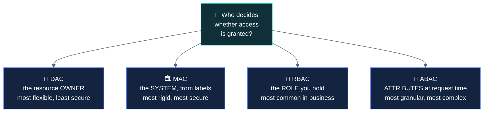
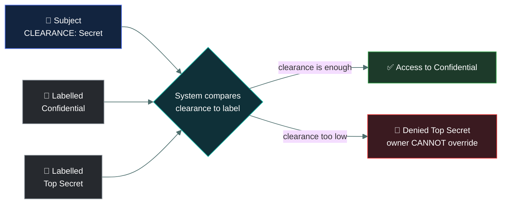
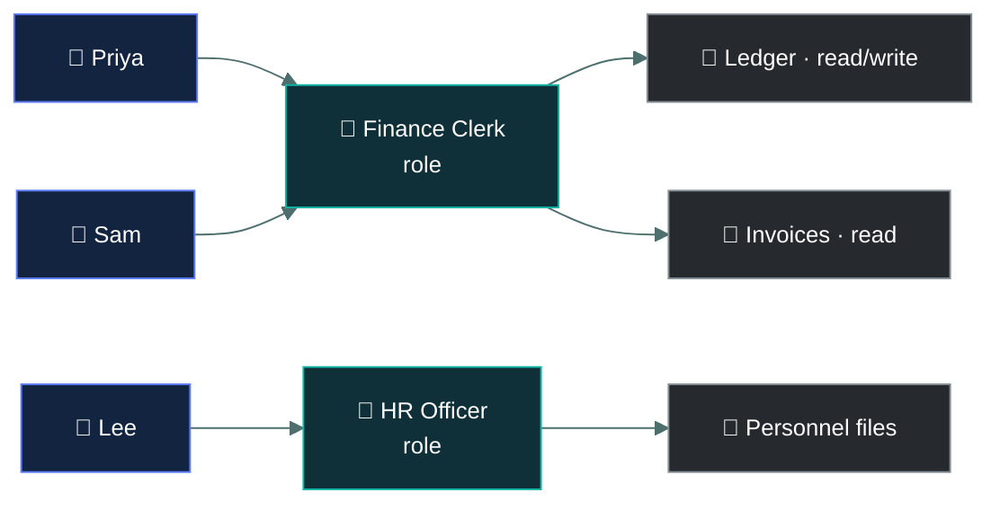
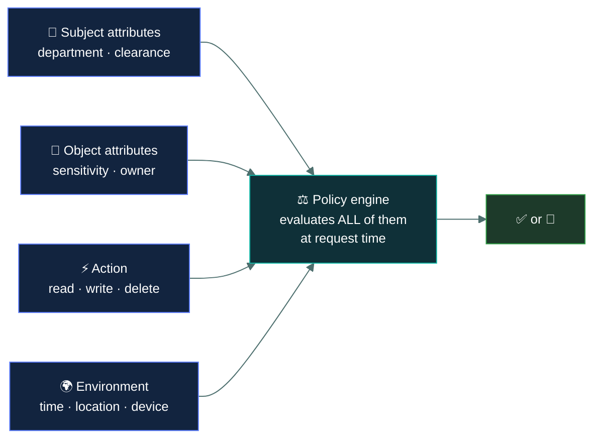
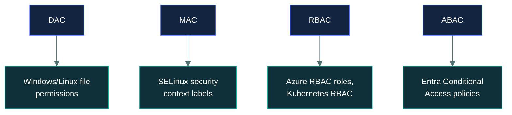

# 🗝️ DAC, MAC, RBAC and ABAC

### *The four access control models — and the two whose names mislead you*

📌 *The single highest-value page in Domain 3. Expect several questions that describe a scenario and ask which model it is.*

---

## 🧸 The big idea

Four different scenes at the cave, all answering the same question: **who decides whether
access is granted?**

A hunter personally owns a spear. He decides who borrows it — his call entirely, even if he
lends it to someone careless. That's **DAC**.

The sacred fire may only be tended by whoever the shaman has tattooed with the clearance mark.
Even the fire's own keeper can't let an untattooed friend near it — the tribe's law decided that,
not any one person. That's **MAC**.

Whoever holds the title "Hunter" automatically gets the weapons rack. Whoever holds "Healer"
automatically gets the herb store. The access comes from the *job*, not from asking anyone
individually. That's **RBAC**.

And the guard at the sacred fire on ceremony night checks several things about you *right now,
all at once*: are you a shaman, is it actually the ceremonial night, are you carrying the
ceremonial staff. Change any one of those and the answer changes, even for the exact same
person. That's **ABAC**.

All four models answer the same question — **who decides whether access is granted?** — and
they give four different answers.

| Model | **Who decides** | The tell |
|---|---|---|
| **DAC** | The **owner** of the resource | "The file's owner chose who could see it" |
| **MAC** | The **system**, from labels and clearances | "Classified · the user cannot override it" |
| **RBAC** | The **role** the user holds | "Because she is in Finance" |
| **ABAC** | **Attributes** evaluated at request time | "Manager, on a company device, during work hours" |

Learn that column and most questions on this topic are answered.

> [!IMPORTANT]
> **The two names actively mislead, and this is where marks are lost.**
> **Discretionary** does not mean "loose" — it means access is at the **owner's discretion**.
> **Mandatory** does not mean "strict rules" generally — it means the **system mandates** it and
> **nobody, including the owner, can override it**.

---

## 📖 Words you will keep seeing

| Word | What it means on this exam |
|---|---|
| **DAC** — Discretionary Access Control | The resource **owner** decides who gets access. |
| **MAC** — Mandatory Access Control | The **system** decides, from security labels and clearances. The owner cannot override it. |
| **RBAC** — Role-Based Access Control | Access is granted to **roles**; users get access by holding a role. |
| **ABAC** — Attribute-Based Access Control | Access is decided from **attributes** of the subject, object, action and environment. |
| **Rule-based access control** | Access decided by system-wide rules — for example firewall rules. Sometimes abbreviated RuBAC. |
| **Security label** | A classification attached to an object — Confidential, Secret, Top Secret. |
| **Clearance** | The level a subject is authorised for. |
| **Role** | A named job function with a defined set of permissions. |
| **Attribute** | Any property used in a decision — department, device, time, location, sensitivity. |
| **Role explosion** | Roles proliferating until there are nearly as many roles as users. |

---

## 🔍 The four models

### 👤 DAC — Discretionary Access Control

This is the hunter lending out his own spear to whoever he pleases. **The owner of the resource
decides who may access it, at their discretion.**

If you create a document and choose who to share it with, that is DAC. Windows file permissions,
Linux file permissions, shared drives and most consumer file-sharing services work this way.

| Strength | Weakness |
|---|---|
| Flexible — users manage their own data | **Least secure** of the four |
| No administrative bottleneck | Relies on every user making good decisions |
| Simple and familiar | Access spreads uncontrollably as owners share onward |

> ⚠️ **DAC's weakness is that discretion is delegated to individuals.** One owner who shares
> carelessly undermines the whole scheme, and nobody centrally knows it happened.

### 🏛️ MAC — Mandatory Access Control

This is the tattooed clearance mark at the sacred fire — not even the fire's own keeper can wave
someone through without it. **The system decides, by comparing the subject's clearance with the
object's label. The owner cannot override it.**

Used where the consequences of disclosure are severe: military, intelligence, government
classification schemes.

**Clearance alone is not enough — need to know also applies.** A Top Secret clearance does not
entitle you to every Top Secret document, only those relevant to your work.

| Strength | Weakness |
|---|---|
| **Most secure** of the four | Rigid and inflexible |
| Central, consistent enforcement | Administratively heavy |
| Users cannot undermine it | Poorly suited to ordinary commercial work |

### 👔 RBAC — Role-Based Access Control

This is the "Hunter" title carrying weapons-rack access automatically, no matter who wears it.
**Permissions are attached to roles; users receive access by being assigned a role.**

A new finance clerk is put in the "Finance Clerk" role and immediately has exactly the access
that role carries. When they move to marketing, the role changes and so does the access.

Read it as a sentence: **permissions hang off roles, and people hang off roles — so nobody is
granted anything directly.**

| Strength | Weakness |
|---|---|
| **Most common in business.** Scales well | **Role explosion** if roles are defined too finely |
| Simplifies joiners, movers and leavers | Coarse — users get everything the role has |
| Makes access reviews answerable | Exceptions are awkward to handle |

> 🎯 **RBAC is the model that makes least privilege practical at scale**, and it is the expected
> answer for a commercial organisation wanting manageable access.

### 🧮 ABAC — Attribute-Based Access Control

This is the ceremony-night guard checking shaman status, the date, and the ceremonial staff all
at once, fresh every time. **The decision is computed at request time from attributes** of the
subject, the object, the action and the environment.

> *Permit if the user's department is Finance, and their clearance is Confidential or higher, and
> the device is corporate-managed, and the time is within working hours, and the request comes
> from an approved country.*

| Strength | Weakness |
|---|---|
| **Most granular and flexible** | **Most complex** to design and maintain |
| Handles context — time, device, location | Hard to reason about or audit |
| Supports dynamic, risk-aware decisions | Policy conflicts are easy to create |

> 🎯 **If a scenario lists several different conditions that must all hold — role AND device AND
> time AND location — it is ABAC.** Multiple dissimilar factors is the tell.

---

## 📊 The comparison table

The one to know cold.

| | **DAC** | **MAC** | **RBAC** | **ABAC** |
|---|---|---|---|---|
| **Who decides** | The **owner** | The **system** | The **role** | **Attributes** |
| Based on | Owner's discretion | Labels and clearances | Job function | Multiple attributes |
| Owner can override? | ✅ Yes — they decide | ❌ **No** | No | No |
| Flexibility | High | **Lowest** | Medium | **Highest** |
| Security | **Lowest** | **Highest** | Good | Good |
| Complexity | Lowest | High | Medium | **Highest** |
| Typical use | File systems, shared drives | Military, government | **Most businesses** | Cloud, dynamic environments |
| Scenario tell | "the owner shared it" | "classified", "cannot override" | "because of her job" | "role AND device AND time" |

---

## 🔬 These four models, running in real products today

**The ABAC example above — "Finance department AND corporate device AND business hours AND
document classification" — is not a hypothetical.** It's a literal, working **Microsoft Entra
Conditional Access policy**: an administrator builds exactly that rule in a web console, naming
a group, a device-compliance requirement, a named location, and a time window, and Entra
evaluates all of it fresh on every single sign-in attempt. This is the most common real-world
place a CC candidate will actually meet ABAC on the job.

**SELinux is MAC, running on an ordinary Linux box, right now if it's enabled.** Every process
and file carries a **security context** — `user:role:type:level` — and the kernel checks a
loaded policy comparing the two contexts on every access, exactly like the clearance-versus-label
comparison in the diagram above. Critically, the file's own Linux owner **cannot override an
SELinux denial** by chmod-ing the file to 777 — that's the mandatory part in literal running
code, not just in theory.

**Azure RBAC and Kubernetes RBAC are named, real RBAC systems** — a role like "Contributor" or
"pod-reader" is defined once with a fixed permission set, and is assigned to users or service
accounts, exactly matching the Priya/Sam/Lee diagram above with cloud resources standing in for
the ledger and personnel files.

---

## ⚖️ Told apart

| | Means | Not to be confused with |
|---|---|---|
| **DAC** | The **owner** decides, at their discretion. | **MAC**, where the system decides and the owner cannot override. The names mislead — learn who decides. |
| **MAC** | **Mandatory** because the system mandates it. | Any strict rule set. Specifically labels and clearances, not overridable. |
| **RBAC** | Access via **role** — a job function. | **Rule-based** access control, which uses system-wide rules such as firewall rules. Confusingly similar names. |
| **ABAC** | **Multiple attributes** evaluated at request time. | **RBAC**, which uses one thing — the role. Several dissimilar conditions means ABAC. |
| **Clearance** | The level a subject is authorised for. | **Need to know**, which further restricts to what is relevant. Both are required under MAC. |
| **Role explosion** | Roles multiplying until they approach one per user. | A normal growth in users. It is a failure of role design. |

> [!CAUTION]
> **RBAC versus rule-based is a genuine trap.** **Role**-based grants by job function.
> **Rule**-based applies system-wide rules regardless of who you are — a firewall permitting port
> 443 from anywhere is rule-based. If a question offers both, look for whether a *person's job* is
> what decides.

---

## ⚠️ Where your instinct is wrong

> [!WARNING]
> **In the job:** "mandatory" sounds like any enforced policy, and "discretionary" sounds like
> something optional.
>
> **On the exam:** they name **who holds the discretion**. DAC = the owner has it. MAC = nobody
> has it, because the system decides from labels. Memorise this deliberately; intuition gets it
> wrong.

> [!WARNING]
> **In the job:** your cloud platform does attribute-based conditional access, and you would call
> that role-based because roles are involved.
>
> **On the exam:** if the decision uses role **plus device plus time plus location**, it is
> **ABAC**. RBAC decides on the role alone.

> [!WARNING]
> **In the job:** file permissions are just permissions.
>
> **On the exam:** ordinary file system permissions where the owner chooses who may read a file
> are the textbook example of **DAC**, and DAC is described as the **least secure** model.

---

## 🧠 How to remember it

🧠 **Who decides? Owner · System · Role · Attributes.**
**D**AC = **D**ecided by the owner. **M**AC = **M**achine decides. **R**BAC = **R**ole decides.
**A**BAC = **A**ttributes decide.

🧠 **Discretionary = the owner's discretion. Mandatory = the system mandates, nobody overrides.**

🧠 **One factor is RBAC. Many different factors is ABAC.**

🧠 **Security ranking: MAC highest, DAC lowest.** Flexibility runs the other way.

---

## ✅ Check you actually got it

Answer all five before expanding anything.

**Q1.** A user creates a document on a shared drive and chooses which colleagues may read it.
Which access control model is in use?

- **A.** MAC — Mandatory Access Control
- **B.** DAC — Discretionary Access Control
- **C.** RBAC — Role-Based Access Control
- **D.** ABAC — Attribute-Based Access Control

<b>Answer</b>

**B — DAC.** The owner of the resource is deciding who may access it, at their own discretion.
That is the definition, and it is how ordinary file systems work.

- **A** would have the system decide from security labels and clearances, with the owner unable to
  override it. Here the owner is doing the deciding.
- **C** would grant access based on job function, with no per-document choice by the creator.
- **D** would evaluate multiple attributes at request time. Only one thing decides here: what the
  owner chose.

**Q2.** In a military system, a user with Secret clearance is denied access to a Top Secret
document, and the document's author cannot grant an exception. Which model is this?

- **A.** DAC
- **B.** MAC
- **C.** RBAC
- **D.** Rule-based access control

<b>Answer</b>

**B — MAC.** Clearances compared against labels, with **no ability for the owner to override**,
is mandatory access control.

- **A** is contradicted by the stem. Under DAC the author could grant access, because discretion
  belongs to the owner.
- **C** would decide by job function rather than by clearance level against a classification label.
- **D** applies system-wide rules independent of clearance levels. The label-and-clearance
  comparison is specifically MAC.

The phrase **"cannot grant an exception"** is the tell. Whenever an owner is powerless, it is MAC.

**Q3.** An organisation grants access by assigning staff to job functions such as "Payroll
Administrator" and "Warehouse Operative". Which model is this?

- **A.** DAC
- **B.** MAC
- **C.** RBAC
- **D.** ABAC

<b>Answer</b>

**C — RBAC.** Permissions attach to named job functions, and users obtain access by holding the
role.

- **A** would have individual owners deciding per resource.
- **B** would use security labels and clearance levels, which a commercial payroll system does not.
- **D** would evaluate several dissimilar attributes at request time. Only one thing decides here:
  the role.

RBAC is the expected answer for a normal business wanting manageable access at scale.

**Q4.** A system grants access only if the user is in the Finance department, is using a
corporate-managed device, is connecting during business hours, and the document is classified
Internal or below. Which model is this?

- **A.** RBAC, because department membership is a role
- **B.** MAC, because document classification is involved
- **C.** ABAC, because multiple attributes are evaluated together
- **D.** DAC, because access is restricted

<b>Answer</b>

**C — ABAC.** Four dissimilar attributes — subject department, device state, time of day, and
object classification — are combined into a single decision at request time. Multiple different
factors is the defining feature.

- **A** notices one of the four attributes and ignores the rest. Pure RBAC would decide on the
  department alone and would not care about the device or the hour.
- **B** notices the classification and over-reads it. MAC requires clearances compared against
  labels as *the* mechanism, not classification as one input among several.
- **D** describes no mechanism at all — "access is restricted" is true of every model.

**Q5.** Which model is generally considered the LEAST secure, and why?

- **A.** MAC, because it is too rigid to apply correctly
- **B.** DAC, because access decisions are delegated to individual resource owners
- **C.** RBAC, because users inherit everything their role carries
- **D.** ABAC, because the policy logic is complex

<b>Answer</b>

**B — DAC, because decisions are delegated to individual owners.** Every user becomes a security
decision-maker, one careless share spreads access uncontrollably, and nothing centrally records
that it happened.

- **A** inverts the ranking. MAC is the **most** secure model; rigidity is its usability cost, not
  a security weakness.
- **C** describes a genuine RBAC limitation — coarse granularity — but role assignment remains
  centrally controlled and reviewable, which makes it far stronger than owner discretion.
- **D** describes a real maintainability problem with ABAC. Complexity creates risk of
  misconfiguration, but the model itself is not classed as the least secure.

---

## 🎓 The grown-up version

<b>Extra depth — open this on a second read, never needed for the pass</b>

**MAC comes from formal security models.** The label-and-clearance approach is grounded in the
Bell–LaPadula model, which defines two rules for confidentiality: **no read up** — a subject
cannot read data above its clearance — and **no write down** — a subject cannot write data to a
lower classification, which would leak it. The mirror-image **Biba** model protects integrity
instead, with no read down and no write up, so trusted data is never contaminated by less trusted
sources. Neither model is on the CC syllabus, and knowing that MAC descends from formal
mathematics explains why it is so rigid: it was designed to be provably correct, not convenient.

**Role explosion in practice.** RBAC degrades when roles are defined too finely. An organisation
starts with twelve roles, then needs "Finance Clerk (Northern Region, Read-Only, Contractor)",
and within a few years has more roles than employees — at which point the model provides none of
the simplification it exists for. The usual remedy is a small set of base roles plus attribute
conditions layered on top, which is a hybrid of RBAC and ABAC and is how most modern platforms
actually work.

**ABAC's real difficulty is auditability.** With RBAC you can answer "what can this person reach"
by listing their roles. With ABAC the answer is "it depends on the device, the time and the
network", which is more precise and much harder to review or to explain to an auditor. Policy
conflicts are also easy to create and hard to find, because two individually sensible rules can
combine to permit something neither author intended.

**Every real system is a hybrid.** Windows uses DAC for file permissions and layers group-based
RBAC over it. Cloud platforms use RBAC roles with attribute-based conditions attached. SELinux
adds MAC-style enforcement to a DAC operating system. The four models are analytical categories
for understanding what a system does, not product choices. Exam questions present them cleanly
because they are testing the concepts.

**Why DAC survives despite being least secure.** It puts the access decision with the person who
best understands the content, requires no central administration, and imposes no friction. For
low-sensitivity collaboration those are genuine virtues. The failure mode is that nobody
distinguishes low-sensitivity from high-sensitivity content, so the same discretionary sharing
gets applied to the customer database.

---

## 📝 Cram lines

Destined for [`EXAM-DAY.md`](../../EXAM-DAY.md):

- **Who decides? DAC = OWNER · MAC = SYSTEM (labels + clearances) · RBAC = ROLE · ABAC = ATTRIBUTES.**
- **"Discretionary" = at the OWNER's discretion. "Mandatory" = the SYSTEM mandates, owner CANNOT override.** The names mislead.
- **MAC tell:** classified / clearance / "cannot grant an exception".
- **DAC tell:** "the file's owner chose who could see it". Ordinary file permissions. **Least secure.**
- **RBAC tell:** "because of her job function". **Most common in business.** Risk = **role explosion**.
- **ABAC tell:** several DIFFERENT conditions together — role AND device AND time AND location. **Most granular, most complex.**
- **Security: MAC highest → DAC lowest. Flexibility runs the opposite way.**
- **RBAC (role, job function) ≠ Rule-based (system-wide rules, e.g. firewall).**
- **Under MAC, clearance alone isn't enough — need to know applies too.**

---

<a href="../README.md">← back to 03 · IAM Concepts</a> &nbsp;·&nbsp; <a href="../least-privilege-and-sod/">next: Least privilege and segregation of duties →</a>

