# 🔐 DAC, MAC, RBAC and ABAC

### *Four access control models — four different answers to "who decides?"*

📌 *Name the model from any scenario by asking who decides — and don't let the words "discretionary" and "mandatory" mislead you.*

---

## 🧸 The big idea

Four everyday scenes, one question — **who decides whether you get in?**

- You share **your own** streaming password with whoever you like. **You, the owner, decide.** → **DAC**
- In a government building, your **clearance** must match the document's **classification** — even
  the document's author can't wave you through. **The system decides.** → **MAC**
- In a hospital, **anyone with the "nurse" role** gets the medicine cabinet. **The job decides.** →
  **RBAC**
- Your bank only allows a big transfer if you're the owner **AND** on your registered phone **AND**
  in your home country **AND** it's daytime. **Several attributes decide, checked live.** → **ABAC**

> [!IMPORTANT]
> **The names mislead.** **Discretionary** doesn't mean "loose" — it means access is at the
> **owner's discretion**. **Mandatory** doesn't mean "strict" — it means the **system mandates it
> and nobody, not even the owner, can override it**.

---

## 📖 Words you will keep seeing

| Word | What it means on this exam |
|---|---|
| **DAC** | Discretionary Access Control — the resource **owner** decides. |
| **MAC** | Mandatory Access Control — the **system** decides from **labels and clearances**. Owner can't override. |
| **RBAC** | Role-Based Access Control — access comes from the **role** you hold. |
| **ABAC** | Attribute-Based Access Control — **multiple attributes** evaluated at request time. |
| **Rule-based access control** | System-wide rules applied to everyone — e.g. firewall rules. |
| **Security label** | A classification on an object — Confidential, Secret, Top Secret. |
| **Clearance** | The level a subject is authorised to see. |
| **Role explosion** | Roles multiplying until there are nearly as many roles as users. |

---

## 🔍 The explanation

### 👤 DAC — the owner decides

You create a document and choose who can read it. Ordinary Windows/Linux file permissions and shared
drives work this way.

| Strength | Weakness |
|---|---|
| Flexible, no admin bottleneck | **Least secure** — every user is a security decision-maker |
| Simple and familiar | Access spreads as people share onward; nobody centrally knows |

### 🏛️ MAC — the system decides, nobody overrides

Used where disclosure is catastrophic — military, intelligence, government. **Clearance alone isn't
enough — need to know still applies.**

| Strength | Weakness |
|---|---|
| **Most secure** — users can't undermine it | Rigid, administratively heavy |
| Central, consistent enforcement | Poor fit for ordinary business |

### 👔 RBAC — the role decides

Permissions hang off roles; people hang off roles — **nobody is granted anything directly.** A
mover just changes role and their access follows.

| Strength | Weakness |
|---|---|
| **Most common in business**, scales well | **Role explosion** if roles get too fine-grained |
| Joiners/movers/leavers become easy | Coarse — you get everything the role has |

> 🎯 **RBAC makes least privilege practical at scale** — the expected answer for a normal business.

### 🧮 ABAC — many attributes, checked live

| Strength | Weakness |
|---|---|
| **Most granular**, context-aware | **Most complex** to design and audit |

> 🎯 **Several DIFFERENT conditions that must all hold** — role AND device AND time AND location →
> **ABAC**.

### The comparison table — know it cold

| | **DAC** | **MAC** | **RBAC** | **ABAC** |
|---|---|---|---|---|
| **Who decides** | **Owner** | **System** | **Role** | **Attributes** |
| Based on | Owner's choice | Labels + clearances | Job function | Many attributes |
| Owner can override? | ✅ Yes | ❌ **No** | No | No |
| Security | **Lowest** | **Highest** | Good | Good |
| Flexibility | High | **Lowest** | Medium | **Highest** |
| Typical use | File shares | Military, government | **Most businesses** | Cloud, dynamic access |
| Scenario tell | "the owner shared it" | "classified", "can't override" | "because of her job" | "role AND device AND time" |

### The trap: role-based vs rule-based

---

## ⚖️ Told apart

| | Means | Not to be confused with |
|---|---|---|
| **DAC** | The **owner** decides. | **MAC** — the system decides; owner can't override. |
| **MAC** | Labels + clearances, not overridable. | "Any strict rule set". |
| **RBAC** | Access via **job role**. | **Rule-based** — system-wide rules like firewall rules. |
| **ABAC** | **Several** attributes at request time. | **RBAC** — one thing: the role. |
| **Clearance** | Level you're authorised for. | **Need to know** — further restricts to what's relevant. |

---

## ⚠️ Where your instinct is wrong

> [!WARNING]
> **In the job:** "mandatory" sounds like any enforced policy; "discretionary" sounds optional.
>
> **On the exam:** they name **who holds the discretion**. DAC = the owner. MAC = nobody — the
> system decides.

> [!WARNING]
> **In the job:** conditional access in your cloud platform involves roles, so you'd call it RBAC.
>
> **On the exam:** role **plus** device **plus** time **plus** location → **ABAC**.

> [!WARNING]
> **In the job:** file permissions are just permissions.
>
> **On the exam:** an owner choosing who reads a file is textbook **DAC** — the **least secure**
> model.

---

## 🧠 How to remember it

**Who decides? Owner · System · Role · Attributes.**
**D**AC = **D**ecided by owner · **M**AC = **M**achine decides · **R**BAC = **R**ole · **A**BAC =
**A**ttributes.

**One factor → RBAC. Many different factors → ABAC.**

**Security: MAC highest, DAC lowest.**

---

## ✅ Check you actually got it

Answer all five before expanding anything.

**Q1.** A user creates a document on a shared drive and chooses which colleagues may read it.
Which model is in use?

- **A.** MAC
- **B.** DAC
- **C.** RBAC
- **D.** ABAC

<b>Answer</b>

**B — DAC.** The owner decides.

- **A** — the system would decide from labels; the owner couldn't choose.
- **C** — access would come from job role, not per-document choice.
- **D** — multiple attributes would be evaluated; here only the owner's choice matters.

**Q2.** In a military system, a user with Secret clearance is denied a Top Secret document, and
the document's author cannot grant an exception. Which model is this?

- **A.** DAC
- **B.** MAC
- **C.** RBAC
- **D.** Rule-based access control

<b>Answer</b>

**B — MAC.** "Cannot grant an exception" is the tell.

- **A** — under DAC the author *could* grant access.
- **C** — decides by job function, not clearance vs label.
- **D** — system-wide rules, not clearances.

**Q3.** Staff get access by being assigned job functions like "Payroll Administrator" and
"Warehouse Operative". Which model is this?

- **A.** DAC
- **B.** MAC
- **C.** RBAC
- **D.** ABAC

<b>Answer</b>

**C — RBAC.**

- **A** — owners would decide per resource.
- **B** — would use labels and clearances.
- **D** — would combine several attributes; only the role decides here.

**Q4.** Access is granted only if the user is in Finance, on a corporate-managed device, during
business hours, and the document is classified Internal or below. Which model?

- **A.** RBAC, because department membership is a role
- **B.** MAC, because document classification is involved
- **C.** ABAC, because multiple attributes are evaluated together
- **D.** DAC, because access is restricted

<b>Answer</b>

**C — ABAC.** Four dissimilar attributes combined at request time.

- **A** spots one attribute and ignores three.
- **B** over-reads the classification — it's one input among several.
- **D** — "access is restricted" is true of every model.

**Q5.** Which model is generally the LEAST secure, and why?

- **A.** MAC, because it is too rigid to apply correctly
- **B.** DAC, because access decisions are delegated to individual resource owners
- **C.** RBAC, because users inherit everything their role carries
- **D.** ABAC, because the policy logic is complex

<b>Answer</b>

**B.** One careless share spreads access and nobody centrally knows.

- **A** inverts it — MAC is the **most** secure.
- **C** — coarse, but centrally controlled and reviewable.
- **D** — complexity risks misconfiguration, but it isn't ranked least secure.

---

## 🎓 The grown-up version

<b>Extra depth — open this on a second read, never needed for the pass</b>

**MAC comes from formal models.** **Bell–LaPadula** protects confidentiality: *no read up, no write
down*. **Biba** protects integrity: *no read down, no write up*. Built to be provably correct — hence
so rigid.

**You'll meet all four at work.** DAC: Windows/Linux file permissions. MAC: **SELinux** — a file's
owner can't override an SELinux denial with `chmod 777`. RBAC: Azure RBAC and Kubernetes RBAC roles.
ABAC: **Entra Conditional Access** — "Finance group AND compliant device AND trusted location"
evaluated on every sign-in.

**Every real system is a hybrid** — usually a few base roles plus attribute conditions, which is
also the cure for role explosion.

**ABAC's real cost is auditability.** "What can this person reach?" becomes "it depends on the
device, time and network" — precise, but hard to review.

---

## 📝 Cram lines

Destined for [`EXAM-DAY.md`](../../EXAM-DAY.md):

- **Who decides? DAC = OWNER · MAC = SYSTEM (labels + clearances) · RBAC = ROLE · ABAC = ATTRIBUTES.**
- **Discretionary = owner's discretion. Mandatory = system mandates, owner CANNOT override.**
- **DAC = least secure. MAC = most secure.** RBAC = most common in business (risk: role explosion).
- **ABAC tell: role AND device AND time AND location.**
- **RBAC (job role) ≠ rule-based (system-wide rules, e.g. firewall).** MAC also needs need to know.

---

<a href="../README.md">← back to 03 · IAM Concepts</a> &nbsp;·&nbsp; <a href="../least-privilege-and-sod/">next: Least privilege and segregation of duties →</a>

