<div align="center">


# 👤 Identity Lifecycle — Joiner, Mover, Leaver

### *Joiner, mover, leaver — and the stage almost everybody gets wrong*

[](../README.md)
[](../README.md)
[](#)

📌 *Access has a beginning, a middle and an end. The middle is where privilege creep happens and the end is where orphaned accounts come from.*

</div>

---

Think of an employee's identity as going through a **life cycle**:

> 🟢 **Joiner → 🔄 Mover → 🔴 Leaver**

The security goal is:

> **Give the right access when needed, change it when the job changes, and remove it when the person leaves.**

<p align="center"></p>

---

# 🟢 1. JOINER — "New person arrives"

Grog joins the tribe. 🪨

The organization needs to create his identity and give him the access required for his job.

### Typical process

<p align="center"></p>

### Example

Sarah joins as an accountant.

She may receive:

- 👤 Corporate identity/account
- 📧 Email
- 💻 Laptop
- 🔐 MFA
- 💰 Finance application access
- 📁 Appropriate file access

But she shouldn't automatically receive:

> ❌ Domain administrator<br>
> ❌ HR administrator<br>
> ❌ Database administrator

That's **least privilege**.

---

# 🧰 Frameworks/tools involved in Joiner

The exact tools vary by organization, but know these categories:

### 👥 HR system

The **HR system** is commonly the source of employee information.

> "Sarah has joined the company."

### 🔐 Identity and Access Management — IAM

IAM manages identities and access.

It can handle:

- Account creation
- Authentication
- Authorization
- Access assignment

### 🔄 Identity Governance / IGA

**IGA (Identity Governance and Administration)** helps govern:

- Who has access
- Why they have access
- Access requests
- Approvals
- Reviews
- Provisioning/deprovisioning

### 🔗 Directory services

Examples include:

- **Microsoft Active Directory**
- **Microsoft Entra ID**
- LDAP-based directories

These can store identities and support authentication/authorization.

### ⚙️ Provisioning

Automated provisioning can create accounts and assign access when the HR system says someone has joined.

<p align="center"></p>

---

# 💥 What goes wrong with Joiners?

### ❌ Account never created

Sarah can't work.

### ❌ Wrong access

Sarah gets access to systems she doesn't need.

> **Security problem: excessive privilege**

### ❌ Missing access

Sarah can't perform her actual job.

> **Business/availability problem**

### ❌ No MFA

Her account may be easier to compromise.

### ❌ Manual mistakes

Someone accidentally gives Sarah:

> 👑 Administrator access

when she only needs:

> 💰 Finance access.

### 🧠 Joiner problem

> **"New person gets NO access or TOO MUCH access."**

---

# 🔄 2. MOVER — "Person changes job"

Now Sarah changes from:

> 💰 Accountant

to:

> 👩‍💼 HR manager

This is a **mover**.

The important thing is:

> **Her old access must be changed to match her new job.**

---

# 🪨 Mover Process

<p align="center"></p>

For example:

### Before

Sarah has:

> 💰 Finance application access

### After

She needs:

> 👥 HR application access

So:

> ❌ Remove unnecessary Finance access

> ✅ Add required HR access

---

# ⚠️ The Big Mover Problem

This is called **privilege accumulation** or **permission creep**.

Sarah changes jobs several times:

<p align="center"></p>

If nobody removes old permissions:

> Finance access + HR access + Project access

Eventually Sarah has far more access than she needs.

😬

That's dangerous.

---

# 🧠 Mover Exam Clue

If you see:

> "Employee changes department."

> "Employee changes role."

> "Employee gets promoted."

> "Employee transfers to another team."

Think:

> 🔄 **MOVER**

Then ask:

> **"Was the old access removed?"**

---

# 🔴 3. LEAVER — "Person leaves"

Now Sarah leaves the company.

This is the most important security transition.

The organization needs to:

> **Disable/revoke her access promptly.**

---

# 🪨 Leaver Process

<p align="center"></p>

Depending on the organization, this can include:

- Disable account
- Revoke sessions
- Revoke tokens
- Remove group memberships
- Revoke application access
- Recover laptop
- Recover badges
- Change shared/privileged credentials if necessary
- Preserve required records

---

# 💥 What goes wrong with Leavers?

This is called an **orphaned account** when an account remains active after the user should no longer have access.

Imagine:

> Sarah leaves on Monday.

But her account remains active until Friday.

That's:

> 🚨 **Unauthorized access opportunity**

An attacker could potentially use the account if the credentials were compromised.

---

# ⚠️ Other Leaver Problems

### ❌ Account not disabled

Former employee can potentially authenticate.

### ❌ Sessions remain active

The account may be disabled, but existing sessions/tokens might need separate revocation depending on the system.

### ❌ VPN access remains

Former employee still has remote access.

### ❌ Cloud access remains

Former employee still has access to cloud applications.

### ❌ Physical badge remains active

Former employee can still enter the building.

### ❌ Privileged credentials aren't handled

Former administrator may still know sensitive credentials.

---

# 🔗 The Three Stages Together

Think:

```
🟢 JOINER
   ↓
"Give the right access."
   ↓
🔄 MOVER
   ↓
"Change the access."
   ↓
🔴 LEAVER
   ↓
"Remove the access."
```

### 🧠 Perfect memory:

> **Joiner = Provision**

> **Mover = Modify**

> **Leaver = Deprovision**

---

# 🧰 Frameworks & Tools You Should Know

The exact products aren't universal, but the exam may expect you to recognize the **technology categories** involved.

| Tool/framework | Purpose |
| --- | --- |
| 👥 **HRIS/HR system** | Source of employment/status information |
| 🔐 **IAM** | Manage identities and access |
| 🛡️ **IGA** | Govern, review, request, approve and provision access |
| 📁 **Directory service** | Stores/manages identities and groups |
| ⚙️ **Provisioning** | Creates/changes/removes accounts |
| 🔑 **SSO** | Centralized authentication to applications |
| 🔐 **MFA** | Stronger authentication |
| 👑 **PAM** | Controls privileged accounts/access |
| 📋 **Access reviews** | Verify users still need their access |

---

# 🌐 Protocols You May See

If the question gets more technical, you may encounter:

### **SCIM**

**System for Cross-domain Identity Management**

Used for automated identity provisioning/deprovisioning between systems.

Think:

> 🔄 **"Create/change/disable accounts automatically between identity systems and applications."**

---

### **SAML**

Often used for:

> 🔐 **SSO/federated authentication**

Think:

> **"Let my company identity authenticate me to another application."**

---

### **OAuth / OpenID Connect**

Commonly involved in modern application authorization/authentication flows.

For the lifecycle question, don't confuse these protocols with the **lifecycle process itself**.

The lifecycle is:

> **Join → Change → Leave**

The protocols/tools help implement parts of it.

---

# 🎯 Exam Scenarios

### Scenario 1

> HR adds a new employee, and an automated process creates their corporate account and assigns access based on their role.

**Answer: Joiner / provisioning**

---

### Scenario 2

> An employee moves from Finance to HR but retains access to the Finance database.

**Answer: Mover problem / privilege accumulation**

The old access wasn't removed.

---

### Scenario 3

> A terminated employee's account remains active.

**Answer: Leaver problem / orphaned account**

---

### Scenario 4

> A user changes departments and the system automatically removes old group memberships and adds new ones.

**Answer: Mover / automated deprovisioning and provisioning**

---

### Scenario 5

> An application automatically disables an account when HR marks the employee as terminated.

**Answer: Leaver / automated deprovisioning**

---

# 🧠 Ultimate Caveman Cheat Sheet

## 🟢 JOINER

> **New person → CREATE access**

Main danger:

> ❌ Wrong or excessive access

---

## 🔄 MOVER

> **Job changes → CHANGE access**

Main danger:

> ❌ **Privilege/permission creep**

---

## 🔴 LEAVER

> **Person leaves → REMOVE access**

Main danger:

> ❌ **Orphaned active accounts**

---

# 🪨 One Sentence to Memorize

> **Joiners need the right access provisioned, movers need old access removed and new access added, and leavers need access promptly disabled/revoked. HR commonly provides the lifecycle trigger, while IAM/IGA, directories, provisioning tools, SSO/MFA, and PAM help enforce it.**

---

# ✅ Check You Actually Got It

Answer all seven before expanding anything.

**Q1.** An employee has transferred through three departments over four years and still holds access from all of them. What is this called?

- **A.** Orphaned account
- **B.** Privilege accumulation (permission creep)
- **C.** Segregation of duties
- **D.** Account lockout

<details>
<summary><b>Answer</b></summary>

**B — privilege accumulation.** A mover problem: new access was added at each move, but old access was never removed.

- **A** is the leaver problem — an account still active after the person has left.

</details>

**Q2.** A contractor's engagement ended two months ago, but their account can still sign in to the VPN. What is the account, and which lifecycle stage failed?

- **A.** Privileged account — joiner
- **B.** Orphaned account — leaver
- **C.** Shared account — mover
- **D.** Service account — joiner

<details>
<summary><b>Answer</b></summary>

**B — orphaned account, leaver stage.** Access should have been disabled promptly when the engagement ended.

</details>

**Q3.** Which lifecycle stage carries the **highest** immediate security risk if it is done late or missed?

- **A.** Joiner
- **B.** Mover
- **C.** Leaver
- **D.** They are all equal

<details>
<summary><b>Answer</b></summary>

**C — leaver.** A still-active account belonging to someone who no longer works there is a direct unauthorized-access opportunity — especially if they left on bad terms.

</details>

**Q4.** In most organizations, what is the best **trigger** (source of truth) for joiner, mover and leaver events?

- **A.** The help desk ticketing system
- **B.** The HR system
- **C.** The firewall logs
- **D.** The employee's manager sending an email

<details>
<summary><b>Answer</b></summary>

**B — the HR system.** HR knows when someone joins, changes role or leaves, so identity systems use it to drive provisioning and deprovisioning automatically.

- **D** is manual and easy to forget — exactly how orphaned accounts happen.

</details>

**Q5.** Which protocol is designed for automated provisioning and deprovisioning of user accounts between an identity system and applications?

- **A.** SAML
- **B.** SCIM
- **C.** OAuth
- **D.** LDAP

<details>
<summary><b>Answer</b></summary>

**B — SCIM.** It creates, updates and disables accounts across systems.

- **A** (SAML) is for SSO/federated authentication — it logs you in, it doesn't create or remove your account.
- **C** (OAuth) is for delegated authorization.

</details>

**Q6.** An employee is terminated and their account is disabled, but they remain signed in to a cloud email app on their personal phone. What step was missed?

- **A.** MFA enrollment
- **B.** Revoking active sessions and tokens
- **C.** Access review
- **D.** Role assignment

<details>
<summary><b>Answer</b></summary>

**B — revoking sessions and tokens.** Disabling an account may not end sessions that are already established; those often need to be revoked separately.

</details>

**Q7.** A new finance hire is accidentally given domain administrator rights on day one. Which stage failed, and which principle was violated?

- **A.** Leaver — need-to-know
- **B.** Mover — segregation of duties
- **C.** Joiner — least privilege
- **D.** Joiner — mandatory access control

<details>
<summary><b>Answer</b></summary>

**C — joiner, least privilege.** New people should receive only the access their role requires. Excessive access at provisioning is the classic joiner failure.

</details>
