# 🔄 Identity Lifecycle

### *Joiner, mover, leaver — and why the middle one is where it breaks*

📌 *Know the three JML stages, why movers cause privilege creep, how leavers are handled, and who reviews access.*

---

## 🧸 The big idea

A student joins a school and gets a card that opens the library and the **Year 7 classroom**
(**joiner**). A year later they move up — the card now opens **Year 8**, but nobody removes Year 7
(**mover**). When they graduate, the card still opens the building unless someone cancels it
(**leaver**).

An identity has a life: it's **created**, it **changes**, and it must eventually be **removed**.

> 🎯 **The mover stage is where it breaks** — and it's the answer to "where does privilege creep
> come from?" The failure isn't granting the new access; it's **not revoking the old**.

---

## 📖 Words you will keep seeing

| Word | What it means on this exam |
|---|---|
| **Provisioning** | Creating an identity and granting its initial access. |
| **Deprovisioning** | Removing access and disabling or deleting the identity. |
| **Joiner / mover / leaver (JML)** | The three lifecycle stages. |
| **Orphaned account** | Active account with **no valid owner** — a leaver never disabled. |
| **Dormant account** | Account **with an owner**, unused for a long time. |
| **Privilege creep** | Access piling up across role changes. |
| **Access review / recertification** | Periodically confirming held access is still appropriate. |
| **Authoritative source** | The system of record for who works here — usually **HR**. |
| **IGA** | Identity Governance and Administration — platforms automating provisioning, reviews and deprovisioning. |

---

## 🔍 The explanation

### 🆕 Joiner — grant what the role needs

| Do | Don't |
|---|---|
| Provision from the **role definition** | **Copy an existing user's access** |
| Apply least privilege from day one | Grant broadly "so they can get started" |
| Trigger from HR (the authoritative source) | Rely on a manager emailing IT |
| Record who approved the access | Grant informally |

> ⚠️ **Cloning a colleague's access spreads their privilege creep** — and it compounds with every
> clone.

### 🔀 Mover — two actions, only one of them urgent

It's a **segregation of duties** problem too: someone who moves from *requesting* payments to
*approving* them, and keeps both, can now complete a fraudulent payment alone.

### 🚪 Leaver — promptly, everywhere, disable first

> [!IMPORTANT]
> **Hostile or high-risk departure → remove access BEFORE or DURING notification**, not after. The
> riskiest moment is the instant they learn of the decision.

> ⚠️ **Disable first, delete later.** Deleting straight away can destroy the audit trail and orphan
> the person's data.

### Orphaned and dormant accounts

### Access reviews

| | |
|---|---|
| **Who does it** | The **manager or data owner** — someone who knows what the person actually does |
| **What it finds** | Privilege creep, orphaned and dormant accounts, bad grants |
| **How often** | Periodically; **more often for privileged access** |
| **Function** | **Detective** — it finds access that already exists |

> ⚠️ **Not IT, not the user.** IT knows what access *exists*, not whether it's still *warranted* —
> and would be judging its own grants. Users can't judge their own access objectively.

### Automation: drive it from HR

Once there's real headcount, JML runs from the **HR system** through a **central directory** out to
every application — so a leaver's last day starts deprovisioning automatically:

---

## ⚖️ Told apart

| | Means | Not to be confused with |
|---|---|---|
| **Provisioning** | Creating and granting. | **Deprovisioning** — removing at departure. |
| **Mover** | Grant new **and revoke old**. | **Joiner** — only grants. |
| **Privilege creep** | Rights piling up (admin failure). | **Privilege escalation** — an attack. |
| **Orphaned** | **No** valid owner. | **Dormant** — has an owner, just unused. |
| **Disable** | Access stops; history stays. | **Delete** — can destroy the audit trail. |
| **Access review** | **Detective** — finds existing bad access. | **Provisioning approval** — preventive, at grant time. |

---

## ⚠️ Where your instinct is wrong

> [!WARNING]
> **In the job:** on a transfer you add the new access and leave the old — removing it might break a
> handover.
>
> **On the exam:** **the mover stage must revoke the old access.** Keeping it is privilege creep.

> [!WARNING]
> **In the job:** offboarding happens when HR's weekly report reaches IT.
>
> **On the exam:** remove access **promptly** — and for a hostile departure, **before or during**
> notification.

> [!WARNING]
> **In the job:** deleting a leaver's account is tidy.
>
> **On the exam:** **disable first.**

---

## 🧠 How to remember it

**Joiner · Mover · Leaver — the middle one fails.**

**A move is two actions: add AND remove.** Only one is ever urgent.

**Orphaned has no owner. Dormant has an owner who isn't looking.**

**Disable, then delete.**

---

## ✅ Check you actually got it

Answer all five before expanding anything.

**Q1.** An employee transfers from finance to marketing. Their finance access isn't removed. What
is the PRIMARY risk?

- **A.** The employee will be unable to perform their new role
- **B.** Privilege creep, and a possible segregation of duties conflict
- **C.** The finance system will have insufficient licences
- **D.** The employee's account will become dormant

<b>Answer</b>

**B.** Two roles' access — possibly enough to finish a sensitive process alone.

- **A** — too much access, not too little.
- **C** is a licensing issue.
- **D** — the account is active in the new role.

**Q2.** Which stage of the identity lifecycle is MOST commonly performed poorly?

- **A.** Joiner, because new starters are provisioned in a hurry
- **B.** Mover, because old access is rarely revoked when roles change
- **C.** Leaver, because departures are always documented by HR
- **D.** All three are performed equally well in most organisations

<b>Answer</b>

**B.** Nothing forces the revoke to happen.

- **A** — joiners complain on day one if access is missing, so it gets done.
- **C** — HR documentation gives leavers a trigger.
- **D** — contradicted by the whole pattern.

**Q3.** An employee is being dismissed for misconduct. When should their access be removed?

- **A.** At the end of the notice period, to allow handover
- **B.** Within 30 days, in line with standard offboarding
- **C.** Before or at the moment they are notified of the dismissal
- **D.** After the exit interview has been completed

<b>Answer</b>

**C.** Retaliation risk opens the instant they learn of it.

- **A** leaves a potentially hostile person with weeks of access.
- **B** is far too slow even for routine departures.
- **D** comes after notification.

**Q4.** Who should perform a periodic review of user access rights?

- **A.** The IT department, since it manages the systems
- **B.** The user themselves, since they know what they use
- **C.** The manager or data owner, who knows what the role requires
- **D.** The external auditor, for independence

<b>Answer</b>

**C.**

- **A** knows what exists, not what's warranted — and granted it.
- **B** approves their own access.
- **D** checks the review process; doing it would compromise independence.

**Q5.** What is the difference between an orphaned account and a dormant account?

- **A.** Orphaned accounts are disabled; dormant accounts are active
- **B.** An orphaned account has no valid owner; a dormant account has an owner but is unused
- **C.** Orphaned accounts are service accounts; dormant accounts belong to humans
- **D.** They are the same thing described differently

<b>Answer</b>

**B.**

- **A** — orphaned accounts are dangerous precisely because they're still **enabled**.
- **C** invents a split.
- **D** — the difference is what's tested.

---

## 🎓 The grown-up version

<b>Extra depth — open this on a second read, never needed for the pass</b>

**SCIM is the plumbing.** When HR (e.g. Workday) marks someone terminated, the identity provider
(Okta, Entra ID) sends a standard **SCIM** deactivate call to every connected SaaS app, which
deprovisions within minutes. Apps without SCIM are exactly where offboarding silently fails — which
is why "does this vendor support SCIM?" is now a procurement question.

**Time-boxed retention for movers.** Real handovers need the old access for a while. The mature
answer: keep it with a documented **expiry date and an owner**. A date and a name are the difference
between a managed exception and privilege creep.

**Review fatigue.** Four hundred cryptic entitlements get approved in one click — false assurance,
which is worse than none. Good reviews show a handful of business-meaningful items, prioritised by
risk.

**Shadow IT defeats offboarding** — local app accounts and department-bought SaaS sit outside the
directory. Most organisations honestly don't know everything a leaver could still reach.

**Orphaned service accounts are the worst case** — no owner, often privileged, never-rotated
credentials, nothing to notice misuse.

---

## 📝 Cram lines

Destined for [`EXAM-DAY.md`](../../EXAM-DAY.md):

- **Joiner · Mover · Leaver — the MOVER stage fails.** A move = grant new AND revoke old; skipping the revoke = **privilege creep** (and possible SoD conflict).
- **Provision from the ROLE, never by cloning a user.**
- **Leavers: promptly, every system, plus badges/keys/devices. Hostile → before or during notification. DISABLE first, delete later.**
- **Orphaned = no owner. Dormant = owner, unused.**
- **Access reviews are DETECTIVE, done by the manager or data owner** — not IT, not the user.

---

<a href="../README.md">← back to 03 · IAM Concepts</a>

