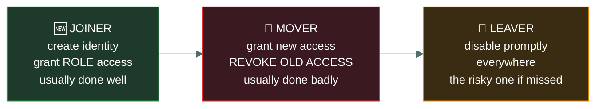
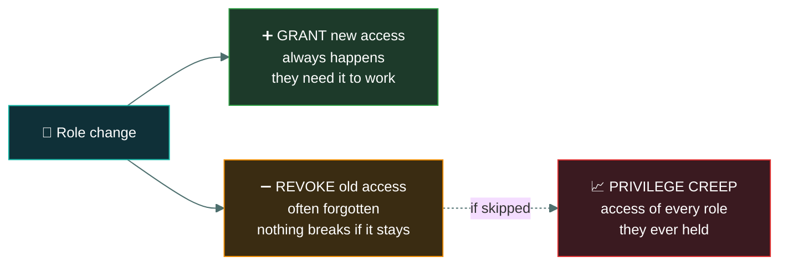
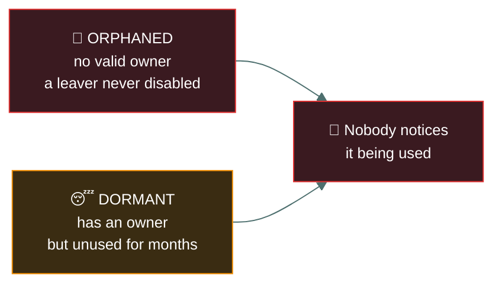

# 🔄 Identity lifecycle

### *Joiner, mover, leaver — and the stage almost everybody gets wrong*

📌 *Access has a beginning, a middle and an end. The middle is where privilege creep happens and the end is where orphaned accounts come from.*

---

## 🧸 The big idea

An identity has a life: it is **created**, it **changes**, and eventually it must be **removed**.
The whole discipline is usually called **joiner, mover, leaver**.

> **Joiner** — someone arrives and is given the access their role requires.
> **Mover** — their role changes, so access must change **in both directions**.
> **Leaver** — they depart, and all access must be removed **promptly**.

Two of the three are done reliably in most organisations. Joiners get access, because otherwise
they complain on day one. Leavers usually get disabled, because HR tells someone.

**The mover stage is where it breaks.** When somebody transfers from finance to marketing, the
new access gets granted because they need it to work — and the old access is quietly never
removed, because nothing breaks when it stays. Repeat across a career and you have **privilege
creep**: an employee holding the combined access of every role they have ever had.

> 🎯 **Mover is the answer to "where does privilege creep come from".** The failure is not
> granting new access — it is not revoking the old.

---

## 📖 Words you will keep seeing

| Word | What it means on this exam |
|---|---|
| **Provisioning** | Creating an identity and granting its initial access. |
| **Deprovisioning** | Removing access and disabling or deleting the identity. |
| **Joiner, mover, leaver (JML)** | The three stages of the identity lifecycle. |
| **Onboarding** | The joiner process, including provisioning. |
| **Offboarding** | The leaver process, including deprovisioning. |
| **Orphaned account** | An active account with no valid owner — a leaver never disabled. |
| **Dormant account** | An account not used for an extended period. |
| **Privilege creep** | Access accumulating across role changes. |
| **Access review / recertification** | Periodically confirming that held access is still appropriate. |
| **Authoritative source** | The system of record for who works here — usually HR. |
| **Automated provisioning** | Access changes driven automatically from the authoritative source. |

---

## 🔄 The three stages

### 🆕 Joiner

Create the identity and grant the access the **role** requires.

| Do | Do not |
|---|---|
| Provision from the **role definition** | **Copy an existing user's access** |
| Apply least privilege from day one | Grant broadly "so they can get started" |
| Trigger from the authoritative source (HR) | Rely on a manager emailing IT |
| Record who approved the access | Grant informally |

> ⚠️ **Cloning a colleague's access is the specific bad practice here.** It propagates whatever
> privilege creep that account accumulated, and it compounds with every clone.

### 🔀 Mover

The stage that fails. When a role changes, access must change **both ways**:

Read it as a sentence: **the grant always happens because the work demands it, and the revoke is
optional because nothing breaks — which is exactly why it gets skipped.**

The mover problem is also a **segregation of duties** problem. Someone who moves from requesting
payments to approving them, and keeps both, can now complete a fraudulent payment alone.

### 🚪 Leaver

Remove all access **promptly**. Every system, not just the main directory.

| Step | Why |
|---|---|
| **Disable rather than delete**, initially | Preserves data ownership, audit trail and evidence |
| Disable **on the last day**, ideally at the moment of departure | The gap is the risk |
| Cover **every** system, including cloud services and third parties | Directory disablement does not reach standalone applications |
| Revoke physical access too — badges, keys | Logical removal alone is incomplete |
| Recover devices and tokens | Possession factors must come back |
| Transfer data ownership | Otherwise files become inaccessible |

> [!IMPORTANT]
> **A hostile or high-risk departure should have access removed before or during notification**,
> not afterwards. This is a standard exam scenario, and the answer is always that access ends
> when the employment relationship ends — not when IT gets round to it.

> ⚠️ **Disable first, delete later.** Immediate deletion can destroy audit history and orphan data.
> Disabling stops access instantly while preserving what an investigation might need.

---

## 👻 Orphaned and dormant accounts

Both are dangerous for the same reason: **nobody is watching them.** An account whose owner has
left, or has not logged in for six months, can be used by an attacker without the legitimate
owner noticing anything unusual — because there is no legitimate owner paying attention.

**The control is the access review**, which finds both.

---

## 🔍 Access reviews

Periodic confirmation that the access people hold is still the access they should hold. Also
called **recertification** or **attestation**.

| | |
|---|---|
| **Who performs it** | The **manager or data owner** — someone who knows what the person actually does |
| **What it finds** | Privilege creep, orphaned accounts, dormant accounts, inappropriate grants |
| **How often** | Periodically; **more frequently for privileged access** |
| **Control function** | **Detective** — it finds access that already exists |

> 🎯 **An access review is DETECTIVE, not preventive.** It discovers what should not be there. The
> removal that follows is corrective. This classification is regularly tested.

> ⚠️ **IT should not be the reviewer.** IT knows what access exists; the manager or data owner
> knows whether it is still warranted. A review performed by the people who granted the access
> asks the wrong person.

---

## 🧰 Frameworks and tools

At CC depth, you only need to recognise that identity lifecycle management is rarely run by
hand once an organisation has any real headcount:

- **IGA (Identity Governance and Administration)** — the general name for platforms that
  automate provisioning, access reviews and deprovisioning against a defined policy, instead of
  relying on manual tickets.
- **A central directory** (an identity store such as an LDAP directory or a cloud directory
  service) — the authoritative source of accounts that provisioning, reviews and
  deprovisioning all act against.
- **HR-driven provisioning** — automatically triggering the joiner/mover/leaver process from
  changes in the HR system of record, so a leaver's last day automatically starts
  deprovisioning rather than depending on someone remembering to file a ticket.

None of this changes *what* the lifecycle stages are — it only automates *triggering and
enforcing* them reliably at scale.

---

## ⚖️ Told apart

| | Means | Not to be confused with |
|---|---|---|
| **Provisioning** | Creating an identity and granting initial access. | **Deprovisioning**, removing it at departure. |
| **Mover** | Role change — grant new **and revoke old**. | **Joiner**, which only grants. The revoke half is what gets missed. |
| **Privilege creep** | Access accumulating over role changes. An administrative failure. | **Privilege escalation**, an attacker gaining rights never granted. |
| **Orphaned account** | **No valid owner** — the person left. | **Dormant account**, which has an owner who is simply not using it. |
| **Disable** | Access stops; the account and its history remain. | **Delete**, which removes the account and can destroy audit trail and data ownership. |
| **Access review** | **Detective** — finds inappropriate existing access. | **Provisioning approval**, which is preventive and happens at grant time. |

---

## ⚠️ Where your instinct is wrong

> [!WARNING]
> **In the job:** when someone transfers internally, you add the new access and leave the rest
> alone — removing it risks breaking something during a handover.
>
> **On the exam:** **the mover stage must revoke the old access.** Retaining it is privilege creep,
> and it is the expected answer to how creep arises.

> [!WARNING]
> **In the job:** offboarding happens when HR's weekly report reaches IT.
>
> **On the exam:** access is removed **promptly**, and for a hostile departure **before or during**
> notification. Any delay is the vulnerability being tested.

> [!WARNING]
> **In the job:** deleting a leaver's account is tidy.
>
> **On the exam:** **disable first.** Deletion can destroy audit history and orphan the data the
> person owned.

---

## 🧠 How to remember it

🧠 **Joiner · Mover · Leaver** — and **the middle one is the one that fails.**

🧠 **A move is two actions: add AND remove.** Only one of them is ever urgent, which is the problem.

🧠 **Orphaned has no owner. Dormant has an owner who isn't looking.** Both are unwatched.

🧠 **Disable, then delete.** Never the other way round.

---

## ✅ Check you actually got it

Answer all five before expanding anything.

**Q1.** An employee transfers from the finance department to marketing. Their finance system
access is not removed. What is the PRIMARY risk?

- **A.** The employee will be unable to perform their new role
- **B.** Privilege creep, and a possible segregation of duties conflict
- **C.** The finance system will have insufficient licences
- **D.** The employee's account will become dormant

<b>Answer</b>

**B — privilege creep, and a possible segregation of duties conflict.** The employee now holds the
access of two roles, and the combination may let them complete a sensitive process alone.

- **A** is the opposite of the problem. They have too much access, not too little.
- **C** is a commercial and licensing concern, not a security one.
- **D** is wrong — the account remains actively used in the new role. It is over-privileged, not
  dormant.

**Q2.** Which stage of the identity lifecycle is MOST commonly performed poorly?

- **A.** Joiner, because new starters are provisioned in a hurry
- **B.** Mover, because old access is rarely revoked when roles change
- **C.** Leaver, because departures are always documented by HR
- **D.** All three are performed equally well in most organisations

<b>Answer</b>

**B — mover, because old access is rarely revoked.** Granting new access is driven by the
employee's need to work; revoking the old breaks nothing if skipped, so it is deprioritised
indefinitely.

- **A** has a grain of truth about haste, but joiners are the stage with the strongest feedback
  loop — a new starter without access raises it on day one.
- **C** contains its own contradiction: if departures are documented by HR, offboarding has a
  trigger. Leavers are often handled imperfectly, but mover is the stage with no natural pressure
  to complete it.
- **D** is contradicted by the pattern this topic exists to describe.

**Q3.** An employee is being dismissed for misconduct. When should their access be removed?

- **A.** At the end of the notice period, to allow handover
- **B.** Within 30 days, in line with standard offboarding
- **C.** Before or at the moment they are notified of the dismissal
- **D.** After the exit interview has been completed

<b>Answer</b>

**C — before or at the moment they are notified.** A hostile departure carries a real risk of
retaliation — data theft, sabotage, destruction — and the window of greatest risk opens the
instant the person learns of the decision.

- **A** leaves a potentially hostile individual with full access for weeks, which is the opposite
  of what the scenario requires.
- **B** applies a routine timescale to an exceptional circumstance, and 30 days is far too long
  even for a routine departure.
- **D** sequences removal after a conversation that itself takes place post-notification.

**Q4.** Who should perform a periodic review of user access rights?

- **A.** The IT department, since it manages the systems
- **B.** The user themselves, since they know what they use
- **C.** The manager or data owner, who knows what the role requires
- **D.** The external auditor, for independence

<b>Answer</b>

**C — the manager or data owner.** They know what the person's role actually requires, which is
the question a review has to answer.

- **A** knows what access **exists** and not whether it is still **warranted**. It also asks the
  people who granted the access to judge their own grants.
- **B** invites people to approve their own access, and users generally cannot tell which of their
  permissions they still need.
- **D** assesses whether the review process is operating. Performing the review would compromise
  the independence that makes the audit valuable.

**Q5.** What is the difference between an orphaned account and a dormant account?

- **A.** Orphaned accounts are disabled; dormant accounts are active
- **B.** An orphaned account has no valid owner; a dormant account has an owner but is unused
- **C.** Orphaned accounts are service accounts; dormant accounts belong to humans
- **D.** They are the same thing described differently

<b>Answer</b>

**B — an orphaned account has no valid owner; a dormant account has an owner but is unused.** Both
are risky for the same reason — nobody is watching them — but the causes differ.

- **A** is wrong: an orphaned account is dangerous precisely because it is still **enabled**. A
  disabled leaver account is a handled leaver.
- **C** invents a distinction. Either can belong to a human or a service.
- **D** is wrong, and the difference is what the question tests.

---

## 🎓 The grown-up version

<b>Extra depth — open this on a second read, never needed for the pass</b>

**Automation from the authoritative source.** The structural fix for all three stages is to drive
access from a system of record — usually HR — rather than from tickets. A new hire in HR triggers
provisioning against the role; a department change triggers both grant and revoke; a termination
triggers disablement everywhere. This removes the human step that gets skipped, and it is why
identity governance platforms exist. It also exposes how poor most HR data is: the automation only
works if job titles and departments in the HR system actually reflect what people do.

**Why revoking on transfer is genuinely contentious.** The exam's answer — remove old access
immediately — collides with real handover periods where the person is still finishing work in
their previous role. The mature compromise is time-boxed retention: the old access is kept with a
documented expiry date and an owner, rather than being retained indefinitely by default. The
difference between a managed exception and privilege creep is a date and a name.

**Access reviews fail through fatigue.** A manager sent a list of four hundred entitlements with
meaningless technical names will approve all of them in one click, and the review then provides
false assurance rather than none — which is worse. Effective reviews are scoped and readable: a
manager sees a handful of business-meaningful entitlements, prioritised by risk, with anomalies
highlighted. Reviewing everything equally is how organisations produce enormous evidence of a
control that does not work.

**Federated identity complicates offboarding.** When a disabled central account is the only
authentication path, disabling it closes everything. But many organisations have applications with
local accounts, shadow SaaS purchased by departments, and third-party systems outside the
directory — none of which the offboarding process reaches. Discovering what a leaver could still
access is a genuinely hard question, and the honest answer for most organisations is that they do
not fully know.

**Orphaned service accounts are the worst case.** They combine every problem in this topic: no
owner watching, often privileged, credentials that never rotate, and no business process that
would notice their misuse. They are a standard audit finding and a standard attacker objective.

---

## 📝 Cram lines

Destined for [`EXAM-DAY.md`](../../EXAM-DAY.md):

- **Joiner · Mover · Leaver. The MOVER stage is the one that fails.**
- **A move needs BOTH: grant new access AND revoke old.** Skipping the revoke = **privilege creep**.
- **Mover failures can create a segregation of duties conflict** (requester who becomes approver).
- **Provision from the ROLE, never by cloning an existing user** — cloning propagates creep.
- **Leavers: remove access PROMPTLY, from EVERY system**, plus badges, keys and devices.
- **Hostile departure → remove access BEFORE or DURING notification.**
- **DISABLE first, delete later** — deletion destroys audit trail and data ownership.
- **Orphaned = no valid owner. Dormant = has an owner, unused.** Both unwatched.
- **Access reviews are DETECTIVE**, performed by the **manager or data owner** — not IT, not the user.

---

<a href="../README.md">← back to 03 · IAM Concepts</a> &nbsp;·&nbsp; <a href="../../04-network-security/README.md">next domain: 04 · Networking and Cloud Security →</a>

