# ✂️ Least Privilege and Segregation of Duties

### *Limit how much one person can do — and what one person can finish alone*

📌 *Least privilege bounds the damage; segregation of duties forces collusion; dual control is a different thing; vacations and rotation are security controls.*

---

## 🧸 The big idea

In a hotel, the **cleaner's key card opens only the floor they clean**. If it's stolen, the thief
gets one floor — not the whole hotel. That's **least privilege**: grant only the access the job
needs.

At a shop till, **the cashier who processes a refund isn't the manager who approves it**. To steal
through refunds, two people would have to secretly cooperate. That's **segregation of duties**:
split a sensitive process so no one person can finish it alone.

| Principle | Limits | Protects against |
|---|---|---|
| **Least privilege** | **How much** one person can do | The **damage** from a misused or hacked account |
| **Segregation of duties** | **What one person can complete** alone | **Fraud** by forcing collusion |

> 🎯 **"The user had more access than they needed"** is the most frequently correct diagnosis in
> this domain.

---

## 📖 Words you will keep seeing

| Word | What it means on this exam |
|---|---|
| **Least privilege** | Only the access the role genuinely requires — nothing more. |
| **Need to know** | Only the **information** required for the task. |
| **Segregation of duties (SoD)** | Split a sensitive process so no one person completes it alone. Also **separation of duties**. |
| **Collusion** | Two or more people cooperating to defeat SoD. |
| **Dual control** | **Two people acting together** on the **same** single action. |
| **Job rotation** | Periodically moving staff between roles. |
| **Mandatory vacation** | Requiring leave so someone else performs the duties. |
| **Privilege creep** | Access piling up across role changes because old rights aren't removed. |

---

## 🔍 The explanation

### Least privilege bounds the blast radius

It doesn't stop the compromise — it limits what the compromise reaches. It also limits insider harm,
accidental damage and malware running with the user's rights.

**Least privilege vs need to know:** privilege is what you can **do**; need to know is what
information you can **see**. An investigator cleared for case files is still limited to *their*
cases. **Clearance alone never entitles you to everything at that level.**

Where least privilege goes wrong:

| Failure | What happens |
|---|---|
| **Privilege creep** | Old rights never removed after role changes |
| **Convenience grants** | Broad access given "to make it work", never revisited |
| **Cloning a user** | New starter gets a copy of someone else's access — and all their creep |
| **Standing admin rights** | Admin held permanently instead of only when needed |

### Segregation of duties forces collusion

| Process | Must be different people |
|---|---|
| Payments | Requester · approver · reconciler |
| System changes | Developer · tester · deployer |
| Access management | Requester · approver · provisioner |
| Audit | Auditor independent of what they audit |

> [!IMPORTANT]
> **SoD doesn't make fraud impossible — it requires collusion.** Two people conspiring can still
> beat it, but collusion is far riskier and far rarer than one person acting alone.

### SoD is not dual control

### Vacations and rotation are security controls

---

## ⚖️ Told apart

| | Means | Not to be confused with |
|---|---|---|
| **Least privilege** | Only the access the **role** needs — what you can **do**. | **Need to know** — what **information** you can see. |
| **Segregation of duties** | Different **steps**, different people. | **Least privilege** — how much one person holds. |
| **Segregation of duties** | Different steps, different people. | **Dual control** — two people for the **same action**. |
| **Privilege creep** | Rights piling up over role changes (admin failure). | **Privilege escalation** — an attack. |
| **Job rotation** | Moving people between roles. | **Mandatory vacation** — forced leave. Both expose hidden fraud. |
| **Collusion** | Several people defeating SoD. | A lone insider — whom SoD **does** stop. |

---

## ⚠️ Where your instinct is wrong

> [!WARNING]
> **In the job:** admins keep standing access because just-in-time elevation is friction.
>
> **On the exam:** **standing admin rights violate least privilege.** Grant access only when needed,
> for as long as needed.

> [!WARNING]
> **In the job:** mandatory vacation and job rotation are HR matters.
>
> **On the exam:** they're **security controls** — the answer to "how do we detect a long-running
> concealed fraud?"

> [!WARNING]
> **In the job:** setting up a new starter by copying a similar colleague is quick and normal.
>
> **On the exam:** it's **bad practice** — it spreads privilege creep. Provision from the role.

---

## 🧠 How to remember it

**Least privilege limits how MUCH. SoD limits what one person can FINISH.**

**Privilege = what you can DO. Need to know = what you can SEE.**

**SoD = different steps, different people. Dual control = same action, two people.**

**Vacation and rotation put somebody else in the chair.**

---

## ✅ Check you actually got it

Answer all five before expanding anything.

**Q1.** An accounts clerk can both create a new supplier and approve payments to that supplier.
Which principle is violated?

- **A.** Least privilege
- **B.** Segregation of duties
- **C.** Need to know
- **D.** Defence in depth

<b>Answer</b>

**B — SoD.** One person can invent a supplier and pay it — end to end.

- **A** is the strongest distractor — but the named failure is two conflicting steps held by one
  person.
- **C** is about seeing information.
- **D** is about layering controls generally.

**Q2.** A marketing assistant is given administrator rights on the finance system so they can
occasionally update one report. Which principle is violated?

- **A.** Segregation of duties
- **B.** Least privilege
- **C.** Dual control
- **D.** Job rotation

<b>Answer</b>

**B — least privilege.** Full admin for one report.

- **A** — no process is being completed alone.
- **C** — nothing needs two people.
- **D** — unrelated.

**Q3.** Why is mandatory vacation considered a security control?

- **A.** Rested employees make fewer security mistakes
- **B.** Another person performs the duties, which can expose ongoing concealed fraud
- **C.** It reduces the number of active accounts at any one time
- **D.** It allows security patching to be applied without disruption

<b>Answer</b>

**B.** Fraud needing daily concealment surfaces when someone else works the process.

- **A** is a wellbeing benefit, not the security purpose.
- **C** — accounts aren't usually disabled during leave.
- **D** — unrelated.

**Q4.** What distinguishes dual control from segregation of duties?

- **A.** Dual control applies to physical access; SoD applies to logical access
- **B.** Dual control requires two people to perform the same action; SoD splits a process into steps held by different people
- **C.** They are the same principle with different names
- **D.** Dual control applies only to privileged accounts

<b>Answer</b>

**B.**

- **A** invents a physical/logical split.
- **C** — the distinction is exactly what's tested.
- **D** — too narrow.

**Q5.** A new employee is set up by copying the access of a long-serving colleague in the same
team. What is the PRIMARY concern?

- **A.** Nothing — this ensures the new employee can do their job immediately
- **B.** The colleague may have accumulated privilege creep, which is now propagated
- **C.** It violates segregation of duties
- **D.** It prevents the new employee from being assigned a role

<b>Answer</b>

**B.**

- **A** is the convenience that makes the practice so common.
- **C** — no process is being completed by one person.
- **D** — factually wrong.

---

## 🎓 The grown-up version

<b>Extra depth — open this on a second read, never needed for the pass</b>

**Nobody really knows what a role needs** — requirements are discovered when something breaks. The
fix is evidence: start from deny, watch which permissions are actually used, remove the rest. AWS
IAM Access Analyzer mines CloudTrail history to propose a policy with only the 12 actions a role
really used out of 200.

**Just-in-time (JIT) access** (Azure PIM, CyberArk): zero standing admin; request elevation with a
reason → approval → role active for a fixed window (say 2 hours) → every action logged → access
**expires automatically**.

**SoD in small teams** often can't be done cleanly — use **compensating controls**: extra
monitoring, review by someone outside the process, external audit.

**Collusion is rarer than you'd think** — every extra conspirator is another person who might talk.
That's why SoD gives a big risk reduction despite not being absolute.

**Auditor independence is SoD applied to assurance** — which is why internal audit reports to the
board, not management.

---

## 📝 Cram lines

Destined for [`EXAM-DAY.md`](../../EXAM-DAY.md):

- **Least privilege = only what the ROLE needs** — bounds the blast radius. Standing admin rights violate it.
- **Need to know = only the INFORMATION needed.** Clearance alone is never enough.
- **SoD = no one person completes a sensitive process** (requester ≠ approver ≠ reconciler). Beating it needs **collusion**.
- **SoD = different STEPS. Dual control = SAME action, two people.**
- **Mandatory vacation and job rotation are SECURITY controls.** Cloning a user spreads privilege creep.

---

<a href="../README.md">← back to 03 · IAM Concepts</a> &nbsp;·&nbsp; <a href="../privileged-access/">next: Privileged access →</a>

