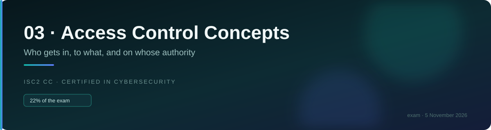
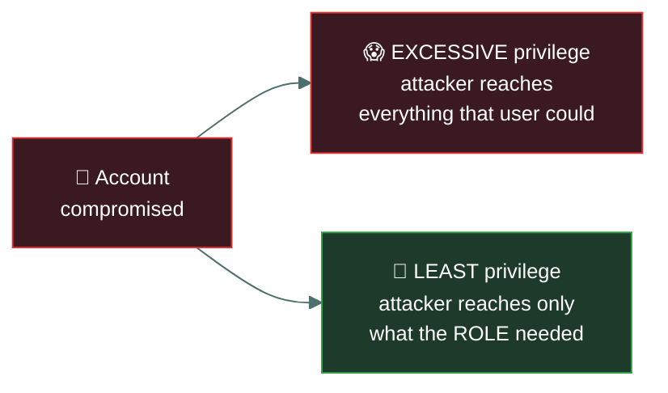
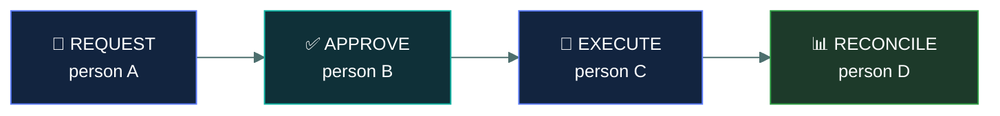
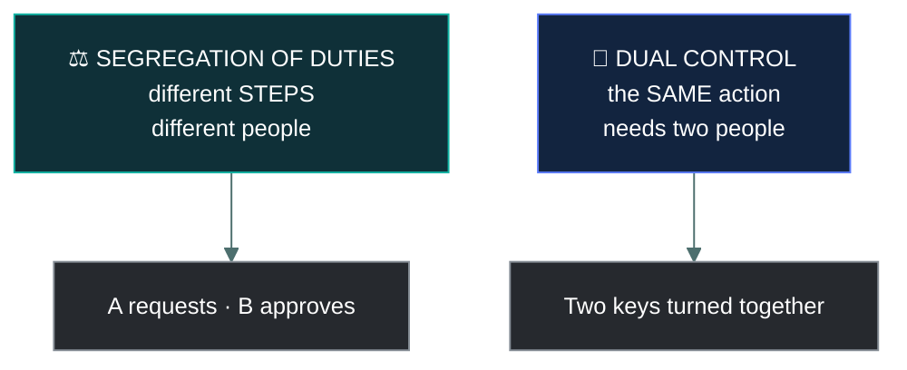

# 🔻 Least privilege and segregation of duties

### *Give people the minimum — and never let one person complete a sensitive process alone*

📌 *Least privilege is the most frequently correct principle in this domain. Segregation of duties is the specific answer to fraud.*

---

## 🧸 The big idea

Two principles, doing two different jobs.

**Least privilege** limits **how much** any one person can do:

> Grant only the access the role genuinely requires, and nothing more.

**Segregation of duties** limits **what one person can complete alone**:

> Split a sensitive process so that no single individual can carry it through unchecked.

The difference matters because they defend against different things. Least privilege limits the
**damage** when an account is misused or compromised. Segregation of duties makes **deliberate
fraud** require collusion, which is far riskier and far rarer.

> 🎯 **"The user had more access than they needed" is the most frequently correct diagnosis in
> this domain.** When a question asks what should have prevented an incident, least privilege is
> the first thing to consider.

---

## 📖 Words you will keep seeing

| Word | What it means on this exam |
|---|---|
| **Least privilege** | Granting only the access required to perform a role, and no more. |
| **Need to know** | Restricting access to the specific **information** required for a task. |
| **Segregation of duties (SoD)** | Dividing a sensitive process so no one person can complete it alone. Also called **separation of duties**. |
| **Collusion** | Two or more people cooperating to defeat segregation of duties. |
| **Dual control** | Requiring **two people acting together** to perform one action. |
| **Job rotation** | Periodically moving staff between roles. |
| **Mandatory vacation** | Requiring staff to take leave, so someone else performs their duties. |
| **Privilege creep** | Access accumulating as someone changes roles and old rights are never removed. |
| **Excessive privilege** | Holding more access than the role requires. |
| **Entitlement review** | Periodically confirming that held access is still appropriate. |

---

## 🔻 Least privilege

**Grant the minimum access the role requires.** Not what might be convenient, not what the
previous person had, not what the user asked for.

Least privilege does not stop the compromise. It **bounds the blast radius** — which is the same
logic as network segmentation, applied to identity instead of topology.

**What it protects against:**

- A compromised account reaching less
- An insider being able to do less harm
- Accidental damage from a mistaken command
- Malware running with the user's rights doing less

### The related idea: need to know

**Least privilege** is about **what you can do**. **Need to know** is about **what information
you can see**.

An investigator may have clearance for case files in general — that is privilege — and still be
restricted to the specific cases they are working on, which is need to know. The two are applied
together, and under MAC both are required.

> ⚠️ **Clearance alone never entitles you to everything at that level.** Need to know narrows it
> further, and this is a tested point.

### Where least privilege fails in practice

| Failure | Means |
|---|---|
| **Privilege creep** | Access accumulates across role changes because nothing is removed |
| **Convenience grants** | Broad access given to make a problem go away, then never revisited |
| **Copying an existing user** | New starters provisioned by cloning someone's access, inheriting everything |
| **Standing administrative rights** | Admin access held permanently rather than only when needed |

> 🎯 **Provisioning a new user by copying an existing account is a specific bad practice**, because
> it propagates whatever privilege creep that account had accumulated.

---

## ⚖️ Segregation of duties

**No single person should be able to complete a sensitive process from end to end.**

The classic example is payment: the person who **requests** a payment must not be the person who
**approves** it, and neither should be the person who **reconciles** the accounts afterwards.

Read it as a sentence: **four steps, four people, so committing fraud requires persuading at
least one other person to join in.**

**Other standard splits:**

| Process | Must be different people |
|---|---|
| Payments | Requester · approver · reconciler |
| System changes | Developer · tester · deployer |
| Access management | Requester · approver · provisioner |
| Audit | The auditor must be independent of what they audit |

> [!IMPORTANT]
> **Segregation of duties does not make fraud impossible — it requires collusion.** Two people
> conspiring can still defeat it. The point is that collusion is far riskier for the participants
> and far less likely, which is a large reduction in probability rather than an elimination.

### The supporting controls

Three controls exist mainly to **detect collusion or expose long-running fraud**, and the exam
expects you to know why they are security controls rather than HR policies.

| Control | Why it is a security control |
|---|---|
| **Mandatory vacation** | Someone else performs the duties, so an ongoing fraud requiring daily concealment surfaces |
| **Job rotation** | A fresh person sees the process and notices irregularities; also spreads knowledge |
| **Dual control** | Two people must act **together** for one action — not two steps, one action |

> ⚠️ **Dual control and segregation of duties are not the same.** SoD splits a process into
> **different steps** performed by different people. Dual control requires **two people for the
> same single action** — two keys turned at once, two approvals on one transaction.

---

## ⚖️ Told apart

| | Means | Not to be confused with |
|---|---|---|
| **Least privilege** | Only the access the **role** requires. Limits how much you can **do**. | **Need to know**, which limits what **information** you may see. Narrower and about data. |
| **Segregation of duties** | Splitting a process into steps held by different people. Prevents one person acting alone. | **Least privilege**, which limits how much any one person holds. Different goals. |
| **Segregation of duties** | Different people for different **steps**. | **Dual control**, which needs two people for the **same action**. |
| **Privilege creep** | Rights accumulating over role changes. An administrative failure. | **Privilege escalation**, an attacker gaining rights never granted. |
| **Job rotation** | Moving staff between roles periodically. | **Mandatory vacation**, forcing leave so duties are covered by another. Both expose concealed fraud. |
| **Collusion** | Two or more people cooperating to defeat SoD. | A single malicious insider, whom SoD does stop. |

---

## ⚠️ Where your instinct is wrong

> [!WARNING]
> **In the job:** administrators hold standing privileged access because the work requires it and
> just-in-time elevation is friction.
>
> **On the exam:** **standing administrative rights violate least privilege.** The expected answer
> is access granted only when needed and for the duration needed.

> [!WARNING]
> **In the job:** mandatory vacation and job rotation are HR matters.
>
> **On the exam:** both are **security controls** whose purpose is to expose fraud that depends on
> one person continuously concealing it. If a question asks how to detect a long-running
> concealment, these are the answers.

> [!WARNING]
> **In the job:** provisioning a new starter by copying a similar colleague is efficient and
> normal.
>
> **On the exam:** it is a **bad practice**, because it propagates accumulated privilege creep. New
> access should come from the role definition.

---

## 🧠 How to remember it

🧠 **Least privilege limits how MUCH one person can do. Segregation of duties limits what one
person can FINISH.**

🧠 **Privilege is what you can DO. Need to know is what you can SEE.**

🧠 **SoD = different steps, different people. Dual control = same action, two people.**

🧠 **Vacation and rotation exist so somebody else sits in the chair** — which is how concealed
fraud surfaces.

---

## ✅ Check you actually got it

Answer all five before expanding anything.

**Q1.** An accounts clerk can both create a new supplier and approve payments to that supplier.
Which principle is violated?

- **A.** Least privilege
- **B.** Segregation of duties
- **C.** Need to know
- **D.** Defence in depth

<b>Answer</b>

**B — segregation of duties.** One person can complete a fraudulent payment from end to end:
invent a supplier and pay it. The steps must be held by different people.

- **A** is the strongest distractor, and the clerk may well hold excessive access. But the specific
  failure named here is that **two conflicting steps of one process** sit with the same person,
  which is precisely what SoD addresses.
- **C** concerns restricting access to specific information. Nothing in the stem is about seeing
  data they should not see.
- **D** is about layering independent controls generally, not about splitting a process.

**Q2.** A marketing assistant is granted administrator rights on the finance system so they can
occasionally update a report. Which principle is violated?

- **A.** Segregation of duties
- **B.** Least privilege
- **C.** Dual control
- **D.** Job rotation

<b>Answer</b>

**B — least privilege.** The role requires the ability to update one report; it has been granted
full administrative rights. The access far exceeds the requirement.

- **A** would concern one person holding conflicting steps of a single process. Nothing here
  describes a process being completed alone.
- **C** concerns requiring two people for one action, which is not what is described.
- **D** concerns moving staff between roles periodically, which is unrelated.

**Q3.** Why is mandatory vacation considered a security control?

- **A.** Rested employees make fewer security mistakes
- **B.** Another person performs the duties, which can expose ongoing concealed fraud
- **C.** It reduces the number of active accounts at any one time
- **D.** It allows security patching to be applied without disruption

<b>Answer</b>

**B — another person performs the duties, which can expose ongoing concealed fraud.** A fraud
requiring continuous daily concealment tends to surface when its author is absent for a week and
somebody else works the process.

- **A** is genuinely true and is a wellbeing benefit rather than the control's security purpose.
- **C** is not the mechanism — accounts are typically not disabled during leave, and that is not
  why the policy exists.
- **D** describes maintenance scheduling, which has nothing to do with the control.

**Q4.** What distinguishes dual control from segregation of duties?

- **A.** Dual control applies to physical access; SoD applies to logical access
- **B.** Dual control requires two people to perform the same action; SoD splits a process into steps held by different people
- **C.** They are the same principle with different names
- **D.** Dual control applies only to privileged accounts

<b>Answer</b>

**B — dual control requires two people for the **same** action; SoD splits a process into
different steps.** Two keys turned simultaneously is dual control; requester and approver being
different people is SoD.

- **A** invents a physical/logical split. Both principles apply in either domain.
- **C** is wrong, and the distinction is exactly what the question tests.
- **D** is too narrow. Dual control applies to any sufficiently sensitive single action, whether or
  not privileged accounts are involved.

**Q5.** A new employee is provisioned by copying the access of a long-serving colleague in the
same team. What is the PRIMARY concern?

- **A.** Nothing — this ensures the new employee can do their job immediately
- **B.** The colleague may have accumulated privilege creep, which is now propagated
- **C.** It violates segregation of duties
- **D.** It prevents the new employee from being assigned a role

<b>Answer</b>

**B — the colleague may have accumulated privilege creep, which is now propagated.** A
long-serving employee has typically gathered access from previous roles and one-off projects.
Cloning them copies all of it, and it compounds with every future clone.

- **A** states the convenience that makes this practice so common, and ignores that the new
  employee almost certainly receives more than their role requires.
- **C** is not what is described — no single process is being completed by one person.
- **D** is factually wrong; cloning access does not prevent role assignment.

---

## 🎓 The grown-up version

<b>Extra depth — open this on a second read, never needed for the pass</b>

**Least privilege is easy to state and hard to operate.** The difficulty is that nobody reliably
knows what access a role actually needs. Requirements are discovered by something breaking, which
creates constant pressure to grant broadly and move on. The techniques that help are all about
evidence rather than intent: start from deny and add on request, monitor which permissions are
actually exercised, and remove what has gone unused for a defined period. Cloud platforms now
generate least-privilege policies automatically from observed access patterns, which is the first
genuinely practical approach to the problem at scale.

**Just-in-time access changes the shape of privilege.** Rather than holding administrative rights
permanently, an administrator requests elevation for a defined window, with a justification and
an approval, and the rights expire automatically. This converts standing privilege — an
attractive, permanently available target — into a short-lived, logged and reviewable event. It is
the practical answer to the standing-admin problem, and it is what privileged access management
platforms are built around.

**Segregation of duties conflicts with small teams.** In an organisation of eight people,
splitting a payment process across four individuals may be impossible, and rigid application
means nothing gets done. The recognised answer is **compensating controls**: heightened
monitoring, after-the-fact review by someone outside the process, mandatory dual sign-off by
whoever is available, and external audit. This is exactly what a compensating control is — the
primary control is not feasible, so an alternative provides comparable assurance.

**Collusion is rarer than intuition suggests.** It requires each participant to trust the others
not to confess, expand the number of people who must stay silent, and increase the chance of
discovery through any one of them. Fraud research consistently finds that collusive schemes,
while more damaging when they occur, are much less common than single-actor fraud — which is why
SoD delivers a genuine and large risk reduction despite not being absolute.

**Why auditors must be independent.** The requirement that an auditor not audit their own work is
segregation of duties applied to assurance itself. An auditor reviewing a control they designed
cannot be relied on to report its weaknesses, which is why internal audit reports to the board
rather than to management, and why external audit exists at all.

---

## 📝 Cram lines

Destined for [`EXAM-DAY.md`](../../EXAM-DAY.md):

- **Least privilege = only the access the ROLE needs.** Limits how much one person can **do**; bounds the blast radius.
- **"The user had more access than they needed" is the most common correct diagnosis in this domain.**
- **Need to know = only the INFORMATION required for the task.** Privilege = what you can do; need to know = what you can see.
- **Clearance alone is never enough under MAC — need to know applies too.**
- **Segregation of duties = no one person completes a sensitive process alone.** Requester ≠ approver ≠ reconciler.
- **SoD requires COLLUSION to defeat** — it reduces probability, it doesn't eliminate fraud.
- **SoD = different STEPS, different people. DUAL CONTROL = the SAME action needs two people.**
- **Mandatory vacation and job rotation are SECURITY controls** — someone else sits in the chair, so concealed fraud surfaces.
- **Privilege creep** = accumulated over role changes (admin failure). **Privilege escalation** = an attack.
- **Cloning an existing user's access to provision a new starter propagates privilege creep.**

---

<a href="../README.md">← back to 03 · IAM Concepts</a> &nbsp;·&nbsp; <a href="../privileged-access/">next: Privileged access →</a>

