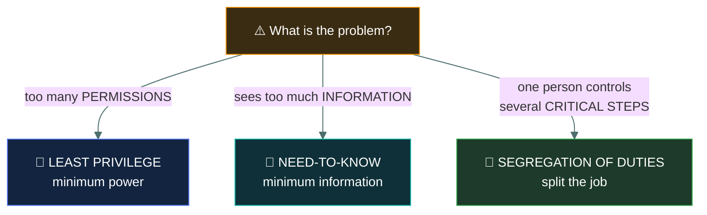
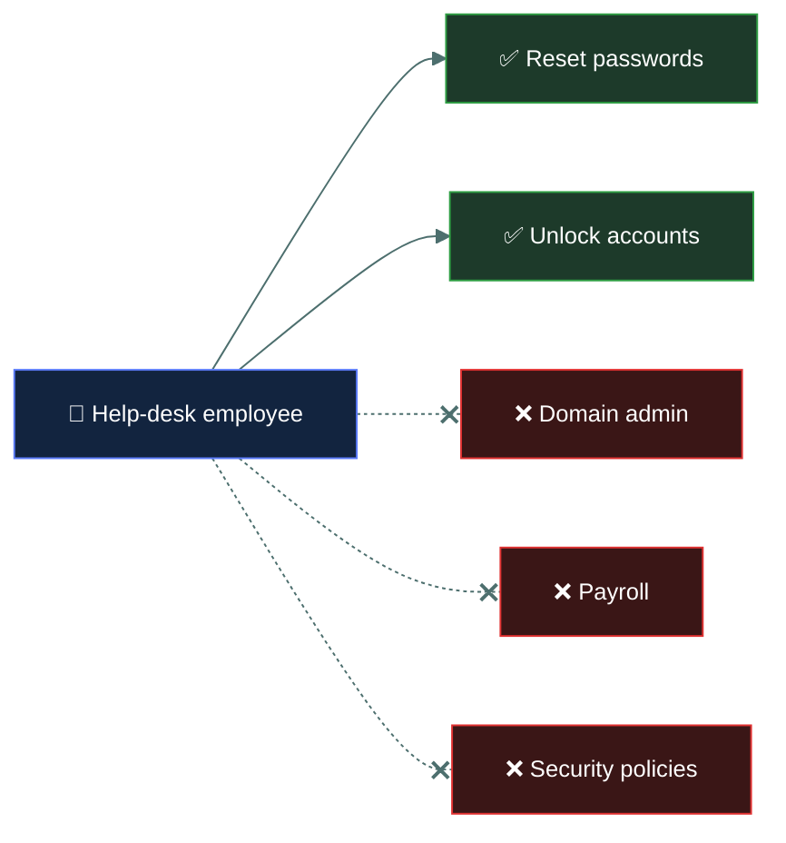
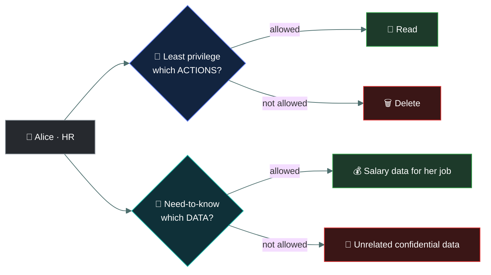
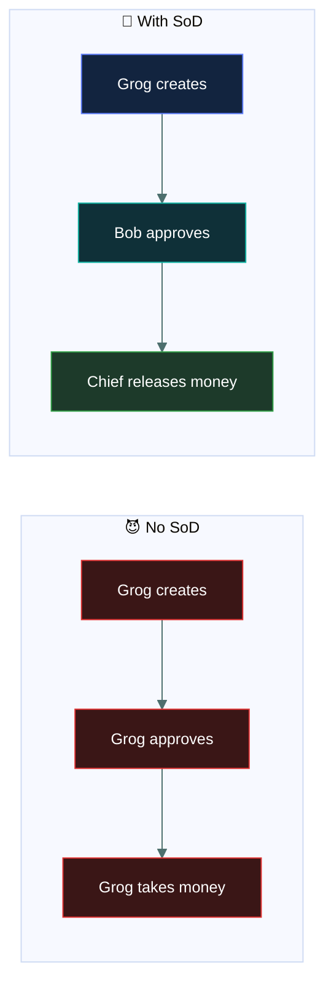

# 🔐 Least Privilege, Need-to-Know & Segregation of Duties

### *Give people the minimum — and never let one person complete a sensitive process alone*

📌 *Least privilege is the most frequently correct principle in this domain. Segregation of duties is the specific answer to fraud.*

---

These three concepts sound similar, but they solve **different problems**.

The easiest way to remember them:

> 🔑 **Least privilege = What CAN you do?** 
> 👀 **Need-to-know = What DO you need to see?** 
> 👥 **Segregation of duties = Who SHOULD do each part?**

---

# 1. 🔑 Least Privilege — "Give only the power needed"

**Least privilege** means:

> **Give a user, process, or system only the minimum permissions needed to perform its job.**

Grog is a hunter.

He needs:

> 🏹 Access to hunting tools.

He does **not** need:

> 💰 Access to the tribe's treasure.

So:

> 🏹 Hunter permissions → ✅ 
> 💰 Treasury permissions → ❌

That's **least privilege**.

---

## 💻 Cybersecurity example

A help-desk employee needs to:

- Reset passwords
- Unlock accounts

They don't need:

- ❌ Domain administrator privileges
- ❌ Access to payroll
- ❌ Ability to modify security policies

Give them only what their job requires.

### 🧠 Memory

> **Least privilege = Minimum POWER**

---

# 2. 👀 Need-to-Know — "Only see what you need"

**Need-to-know** means:

> **A person should have access to information only when they need that information to perform an authorized task.**

Grog might be a trusted tribe member.

But that doesn't mean he needs to know:

> 🗺️ Every secret hunting location.

He only needs to know:

> 🗺️ Today's hunting location.

So:

> **Need = Access**

No need?

> ❌ No access.

---

# 🔑 Least Privilege vs Need-to-Know

This is an important distinction.

### Least Privilege

Focuses on:

> **Permissions / capabilities**

"What actions can you perform?"

Examples:

- Read
- Write
- Delete
- Execute
- Administer

### Need-to-Know

Focuses on:

> **Information / data**

"What information are you allowed to see?"

---

# 🪨 Example

Alice works in HR.

She needs to **read employee salary information**.

### Least privilege

Give Alice:

> 👀 Read access

Don't give her:

> 🗑️ Delete access

### Need-to-know

Give her access to:

> 💰 Salary data she needs for her job.

Don't automatically give her access to:

> 🔐 Confidential information unrelated to her work.

---

# 3. 👥 Segregation of Duties — "Don't let one person control everything"

**Segregation of Duties (SoD)** means:

> **Separate critical responsibilities among different people so that one person cannot perform an entire sensitive process alone.**

Think:

> 🪨 **One caveman shouldn't control the entire treasure cave.**

---

# 💰 Caveman Example

Imagine Grog can:

1. Create a payment
2. Approve the payment
3. Take the money

😈

That's dangerous.

Grog could create a fake payment and approve it himself.

Instead:

### Grog

> Creates payment

### Bob

> Approves payment

### Chief

> Releases money

Now no single person controls everything.

That's:

> 👥 **Segregation of Duties**

---

# 💻 Real-World Example

Imagine an employee has access to the company's purchasing system.

You don't want the same person to be able to:

> 1. Create a new supplier
> 2. Approve the supplier
> 3. Approve the payment
> 4. Pay the supplier

That creates an opportunity for fraud.

Instead:

> 👤 Employee A → Creates request

> 👤 Employee B → Approves request

> 👤 Employee C → Processes payment

That's **SoD**.

---

# 🎯 When Should You Use Each?

## 🔑 Least Privilege

Use when the problem is:

> **"This person has too much access or too many permissions."**

Example:

> A receptionist has administrator access.

➡️ Apply **least privilege**.

---

## 👀 Need-to-Know

Use when the problem is:

> **"This person can see information they don't need for their job."**

Example:

> A sales employee can view confidential medical records even though their job doesn't require them.

➡️ Apply **need-to-know**.

---

## 👥 Segregation of Duties

Use when the problem is:

> **"One person can perform too many critical steps in a process."**

Example:

> One employee can create and approve their own purchase orders.

➡️ Apply **SoD**.

---

# 🧠 Exam Scenario Practice

### Scenario 1

> A junior developer has full administrator access to the production database, even though they only need to read application logs.

**Answer: 🔑 Least Privilege**

Why?

> They have **more permissions than necessary**.

---

### Scenario 2

> An employee can view confidential customer records that aren't required for their job.

**Answer: 👀 Need-to-Know**

Why?

> They can see information they **don't need**.

---

### Scenario 3

> One employee can create and approve their own expense payments.

**Answer: 👥 Segregation of Duties**

Why?

> One person controls **multiple critical stages**.

---

### Scenario 4

> A system administrator can modify the system but cannot approve their own changes.

**Answer: 👥 Segregation of Duties**

Different people handle different responsibilities.

---

### Scenario 5

> A user is given only read permission because their job doesn't require changing the files.

**Answer: 🔑 Least Privilege**

Minimum necessary permission.

---

# ⚠️ They Can Work Together

These principles aren't mutually exclusive.

Imagine an employee processes payroll.

You might apply all three:

### 🔑 Least Privilege

Give them only the permissions required to process payroll.

### 👀 Need-to-Know

Give them access only to payroll information they actually need.

### 👥 SoD

Don't let them both **create and approve** payroll payments.

---

# 🪨 One Big Caveman Story

Grog works in the tribe's treasure department.

### Problem 1

Grog has administrator powers even though he only needs to enter transactions.

> 🔑 **Least Privilege**

**Reduce his permissions.**

---

### Problem 2

Grog can see everyone's private information even though he only needs the information for his assigned accounts.

> 👀 **Need-to-Know**

**Limit the information he can access.**

---

### Problem 3

Grog can create a payment **and approve it himself**.

> 👥 **Segregation of Duties**

**Give approval to another person.**

---

# 🎯 Ultimate Cheat Sheet

| Concept | Main question | Key idea |
| --- | --- | --- |
| 🔑 **Least Privilege** | "How much power do you have?" | Minimum permissions |
| 👀 **Need-to-Know** | "What information do you need?" | Minimum necessary information |
| 👥 **Segregation of Duties** | "Who performs each step?" | Split critical responsibilities |

### 🧠 Memorize this:

> **Least privilege = MINIMUM POWER** 🔑 
> **Need-to-know = MINIMUM INFORMATION** 👀 
> **SoD = SPLIT THE JOB** 👥

If the scenario says **"too many permissions"** → **Least privilege**

If it says **"too much information"** → **Need-to-know**

If it says **"one person controls multiple critical steps"** → **Segregation of duties**.

---

# ✅ Check You Actually Got It

Answer all seven before expanding anything.

**Q1.** A marketing intern has been given local administrator rights on every workstation, though their job only involves editing social media posts. Which principle is being violated?

- **A.** Need-to-know
- **B.** Segregation of duties
- **C.** Least privilege
- **D.** Separation of privilege

<b>Answer</b>

**C — least privilege.** The problem is too much *power* (admin rights) for the job.

- **A** is about seeing information, not having capabilities.
- **B** is about one person controlling several critical steps — not the issue here.

**Q2.** A clerk in the billing department can open patients' full medical histories, although billing only needs invoice amounts. Which principle should be applied?

- **A.** Need-to-know
- **B.** Segregation of duties
- **C.** Defense in depth
- **D.** Job rotation

<b>Answer</b>

**A — need-to-know.** The clerk can *see information* that the job does not require.

**Q3.** An accounts-payable employee can add a new vendor to the system and also approve payments to that vendor. What is the main risk, and which control addresses it?

- **A.** Data leakage — need-to-know
- **B.** Fraud — segregation of duties
- **C.** Malware — least privilege
- **D.** Unauthorized login — MFA

<b>Answer</b>

**B — fraud, addressed by segregation of duties.** One person can create a fake vendor and pay it. Splitting creation and approval between two people stops that.

**Q4.** What is the key difference between least privilege and need-to-know?

- **A.** Least privilege applies to people; need-to-know applies to systems
- **B.** Least privilege limits permissions/actions; need-to-know limits information
- **C.** They are two names for the same principle
- **D.** Need-to-know only applies to military environments

<b>Answer</b>

**B.** Least privilege = minimum *power* (read, write, delete, admin). Need-to-know = minimum *information*.

- **A** is wrong: least privilege applies to users, processes and systems alike.
- **C** is the trap — they overlap but focus on different things.

**Q5.** A developer writes code changes, but a different team reviews and deploys them to production. Which principle is this?

- **A.** Least privilege
- **B.** Need-to-know
- **C.** Segregation of duties
- **D.** Mandatory access control

<b>Answer</b>

**C — segregation of duties.** A critical process (change to production) is split so no single person controls it end to end.

**Q6.** A service account used by a backup application is granted only read access to the file shares it backs up. Which principle does this demonstrate?

- **A.** Segregation of duties
- **B.** Least privilege
- **C.** Need-to-know
- **D.** Dual control

<b>Answer</b>

**B — least privilege.** It applies to processes and service accounts too: backup only needs to read, so it gets only read.

**Q7.** A payroll processor is given only the permissions needed to run payroll, sees only the payroll data for their assigned business unit, and cannot approve their own payment runs. Which principles are being applied?

- **A.** Least privilege only
- **B.** Need-to-know and segregation of duties only
- **C.** Least privilege, need-to-know and segregation of duties
- **D.** Segregation of duties only

<b>Answer</b>

**C — all three.** Minimum permissions (least privilege), minimum data (need-to-know), and approval split off (SoD). The principles work together.

