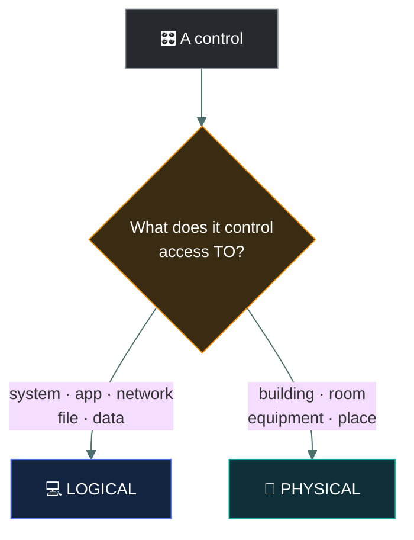
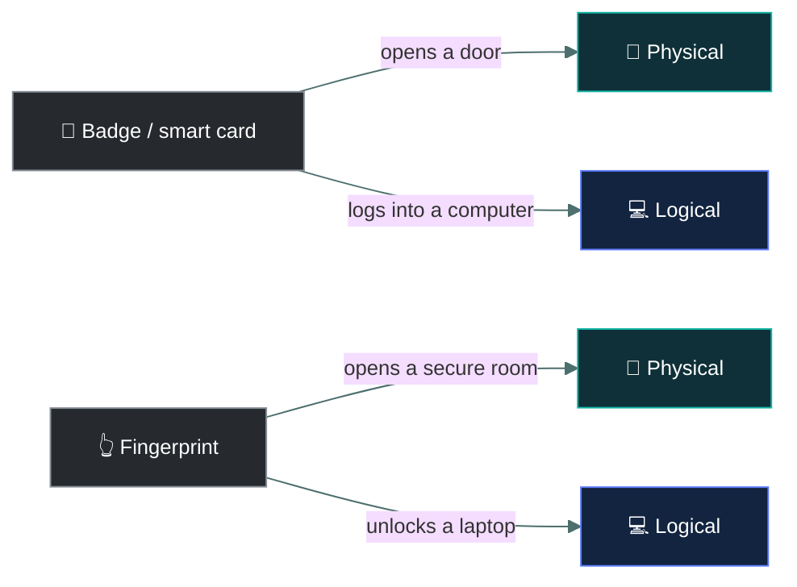
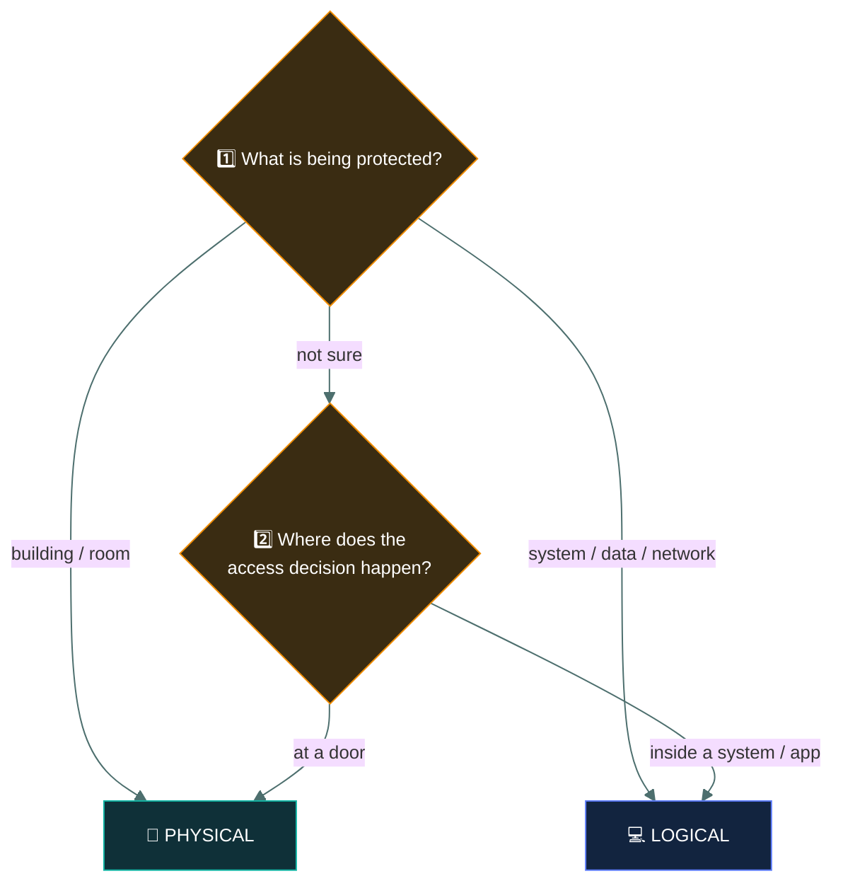

<div align="center">


# 🔐 Logical Access Controls

### *The technical side of access — and where it overlaps with the physical*

[](../README.md)
[](../README.md)
[](#)

📌 *Logical controls restrict access to systems and data. The examined skill is placing a control on the right side of the physical/logical line.*

</div>

---

The big exam question is:

> **"Is this control protecting a digital resource or a physical place?"**

That separates **logical access controls** from **physical access controls**.



---

# 💻 1. Logical Access Control

**Logical access controls** protect:

> 💻 **Systems, applications, networks, files, and data**

They use technology to decide **who can access digital resources**.

Think:

> 🪨➡️💻 **"Which caveman can enter the computer cave?"**

Examples:

- 🔑 Username and password
- 🔐 MFA
- 👤 User accounts
- 🎟️ Access permissions
- 🛡️ Firewall rules
- 📋 ACLs (Access Control Lists)
- 🔒 Encryption
- 🚫 Account lockout
- 👮‍♂️ Privileged access management

### Example

Alice logs into a database.

The system checks:

> "Is Alice allowed to access this database?"

That's **logical access control**.

---

# 🚪 2. Physical Access Control

**Physical access controls** protect:

> 🏢 **Buildings, rooms, equipment, and physical locations**

Think:

> 🪨➡️🚪 **"Which caveman can enter the real cave?"**

Examples:

- 🔒 Door locks
- 🎫 Physical access cards
- 👮 Security guards
- 📹 CCTV
- 🚧 Fences
- 🚪 Mantraps
- 🔑 Physical keys
- 💡 Security lighting
- 🔐 Biometric door scanners

### Example

Alice uses a badge to enter the company's server room.

That's **physical access control**.

---

# 🧠 The Easy Difference

Ask:

> **"What am I trying to get into?"**

### 💻 Computer/data?

→ **Logical**

### 🏢 Building/room/equipment?

→ **Physical**

---

# ⚠️ The Tricky Ones

Some controls **look like they could belong to both categories**.

The exam may deliberately give you one.

The trick is to look at **what the control is actually controlling**.



---

# 🎫 Access Card / Badge

This one can be confusing.

### Physical use

Alice taps her badge on a door.

🚪 → 🎫 → ✅

The badge unlocks the building.

That's:

> **Physical access control**

### Logical use

Alice uses a smart card to authenticate to a computer.

💻 → 🎫 → ✅

That's:

> **Logical access control**

### 🧠 Rule

> **Badge opens DOOR → Physical**

> **Badge authenticates to COMPUTER → Logical**

Same technology, different purpose.

---

# 👆 Biometrics

Biometrics can also be either.

### Physical

Alice uses her fingerprint to enter a secure room.

👆 → 🚪 → ✅

> **Physical access control**

### Logical

Alice uses her fingerprint to log into a laptop.

👆 → 💻 → ✅

> **Logical access control**

### 🧠 Rule

> **Fingerprint → Door = Physical**

> **Fingerprint → Computer = Logical**

---

# 📹 CCTV

CCTV is normally:

> **Physical access/security control**

Because it monitors a physical location.

📹 → 🏢

But remember something important:

A camera may use **digital technology**, but that doesn't automatically make it a logical access control.

The question is:

> **What is the camera controlling/protecting?**

If it's watching the building:

→ **Physical**

---

# 🔥 Firewall

A firewall is:

> **Logical**

It controls network traffic between digital systems.

💻 ↔️ 🔥 ↔️ 💻

Even though we call it a "firewall," it isn't a physical wall.

> **Firewall = Logical access/network control**

---

# 🛡️ Security Guard

A security guard standing at a door is:

> **Physical**

The guard controls entry into a physical location.

👮 → 🚪

---

# 🔑 Password

A password used to log into an account is:

> **Logical**

🔑 → 💻

It controls access to a digital resource.

---

# 🔐 Encryption

Encryption protects:

> **Data**

Therefore:

> **Logical**

It doesn't physically stop someone from entering a building.

---

# 📋 Access Control List (ACL)

An ACL specifies who can access a digital resource and what they can do.

For example:

```
Alice → Read
Bob   → Read + Write
Guest → Deny
```

That's:

> **Logical access control**

---

# 🧠 The Exam Method

When you see a control, ask:

### Question 1

> **What is being protected?**

🏢 Building/room → **Physical**

💻 System/data/network → **Logical**

---

### Question 2

> **Where does the access decision happen?**

At a **door**?

→ Physical

Inside a **computer/system/application**?

→ Logical



---

# 🎯 Scenario Practice

### Scenario 1

> An employee enters the server room using a proximity badge.

🎫 → 🚪

**Answer: Physical**

Why?

> The badge controls access to a physical room.

---

### Scenario 2

> An employee uses the same smart card to authenticate to their workstation.

🎫 → 💻

**Answer: Logical**

Why?

> It controls access to a computer.

---

### Scenario 3

> A firewall blocks unauthorized network connections.

🔥 → 🌐

**Answer: Logical**

---

### Scenario 4

> A security guard checks IDs before allowing people into the building.

👮 → 🏢

**Answer: Physical**

---

### Scenario 5

> A user needs a password to access the company's database.

🔑 → 🗄️

**Answer: Logical**

---

### Scenario 6

> A fingerprint scanner opens the door to the data center.

👆 → 🚪

**Answer: Physical**

---

### Scenario 7

> A fingerprint scanner allows a user to log into a database.

👆 → 🗄️

**Answer: Logical**

---

# 🪨 Ultimate Caveman Trick

Don't ask:

> ❌ **"Does this use technology?"**

That's not enough.

Instead ask:

> ✅ **"What does it control access TO?"**

### 🏢 Physical

> **Door, building, room, equipment**

### 💻 Logical

> **Account, computer, application, network, file, database**

---

# 🎯 Exam Cheat Sheet

| Control | Scenario | Classification |
| --- | --- | --- |
| 🔑 Password | Log into computer | **Logical** |
| 🔐 MFA | Access an application | **Logical** |
| 📋 ACL | File permissions | **Logical** |
| 🔥 Firewall | Network access | **Logical** |
| 🔒 Door lock | Enter room | **Physical** |
| 👮 Guard | Enter building | **Physical** |
| 📹 CCTV | Monitor building | **Physical** |
| 🎫 Badge | Open door | **Physical** |
| 🎫 Smart card | Log into computer | **Logical** |
| 👆 Fingerprint | Open secure door | **Physical** |
| 👆 Fingerprint | Log into laptop | **Logical** |

### 🧠 One sentence to memorize:

> **Logical access controls protect digital resources; physical access controls protect physical locations and assets. When a control could be either, classify it based on what it is actually controlling access to.**

---

# ✅ Check You Actually Got It

Answer all six before expanding anything.

**Q1.** An organization requires employees to insert a smart card into their laptop before they can sign in. What type of control is this?

- **A.** Physical, because the smart card is a physical object
- **B.** Logical, because it controls access to a computer
- **C.** Physical, because the laptop is hardware
- **D.** Administrative, because it is required by policy

<details>
<summary><b>Answer</b></summary>

**B — logical.** Classify by what the control grants access *to*. Signing into a laptop is access to a system.

- **A** is the trap: the card being a physical object doesn't matter — the same card on a door would be physical.
- **C** confuses the device with the resource being protected (the account and system).
- **D** — a policy may require it, but the control itself is a technical sign-in mechanism.

</details>

**Q2.** Which of the following is a **physical** access control?

- **A.** A firewall rule blocking port 23
- **B.** An ACL on a shared folder
- **C.** A mantrap at the data center entrance
- **D.** Account lockout after five failed logins

<details>
<summary><b>Answer</b></summary>

**C — a mantrap.** It controls entry to a physical location. The other three all control access to digital resources.

</details>

**Q3.** A company installs a fingerprint scanner on the door of its server room. How is this classified?

- **A.** Logical, because biometrics are digital
- **B.** Physical, because it controls entry to a room
- **C.** Logical, because the room contains servers
- **D.** Both, because biometrics are always both

<details>
<summary><b>Answer</b></summary>

**B — physical.** The scanner decides who gets through a door.

- **A** asks "does it use technology?" — the wrong question.
- **C** — the servers inside are protected *indirectly*; the control itself guards the room.
- **D** — a single control in a single scenario gets one classification, based on what it controls.

</details>

**Q4.** Which of these is a **logical** access control?

- **A.** Security guard
- **B.** Perimeter fence
- **C.** Encryption of a customer database
- **D.** Security lighting

<details>
<summary><b>Answer</b></summary>

**C — encryption.** It protects data. Guards, fences and lighting all protect physical locations.

</details>

**Q5.** Despite its name, a firewall is classified as what type of control?

- **A.** Physical, because it acts as a barrier
- **B.** Logical, because it controls network traffic between systems
- **C.** Physical, because it is a hardware appliance
- **D.** Neither — it is a detective control

<details>
<summary><b>Answer</b></summary>

**B — logical.** It decides which network traffic is allowed between digital systems.

- **A** falls for the name — it isn't a real wall.
- **C** confuses the box it runs on with what it controls access to.
- **D** — a firewall primarily *prevents* traffic; and detective vs preventive is a different classification anyway.

</details>

**Q6.** When a control could be either logical or physical, what is the best way to classify it?

- **A.** By whether it uses electronic technology
- **B.** By how much it costs
- **C.** By what it actually controls access to
- **D.** By which department manages it

<details>
<summary><b>Answer</b></summary>

**C — by what it actually controls access to.** Door, building or room → physical. Account, system, network or data → logical.

- **A** is the classic trap: CCTV and badge readers are electronic but still physical.
- **B** and **D** have nothing to do with the classification.

</details>
