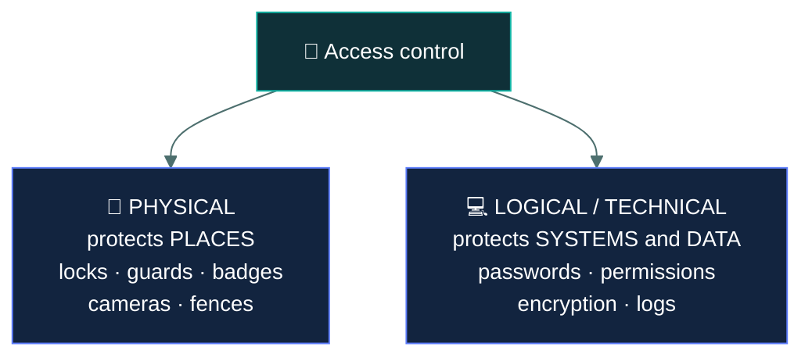
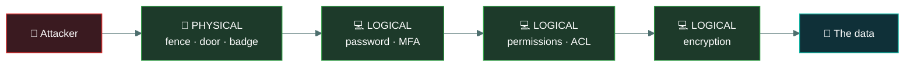
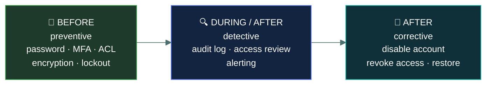

# 💻 Logical access controls

### *The technical side of access — and where it overlaps with the physical*

📌 *Logical controls restrict access to systems and data. The examined skill is placing a control on the right side of the physical/logical line.*

---

## 🧸 The big idea

The fence over the cave gap keeps wolves — and uninvited people — from ever setting foot inside.
That's a real, physical barrier. You either got past it or you didn't.

But even someone who's already standing *inside* the cave, past the fence, still can't just help
themselves to the winter grain. The grain-keeper won't hand any over unless you whisper the
correct word first. That word doesn't stop anyone from entering the cave — it stops them from
reaching the grain once they're already in.

**Physical controls keep people out of places. Logical controls keep identities out of systems
and data.** The fence is physical. The secret word is logical. Both protect the same cave, by
completely different means, and a clever thief only needs to beat one of them — getting past the
fence is worthless if he still can't get the grain.

A locked server room door is physical. The password on the server inside it is logical. Both
restrict access to the same machine, by completely different means, and an attacker only needs
to beat one of them.

> 🎯 **The test is simple: could you touch it?** A door, a lock, a guard, a camera — physical. A
> password, a permission, an encryption key, a log entry — logical.

Logical controls are also called **technical controls**, and the two words mean the same thing
on this exam. If both appear as options in one question, read the rest of the option rather than
the label.

---

## 📖 Words you will keep seeing

| Word | What it means on this exam |
|---|---|
| **Logical control** | A control implemented in software, hardware or firmware. Also called **technical**. |
| **Physical control** | A tangible control protecting places, equipment and people. |
| **Access control list (ACL)** | A list on an object stating which subjects may do what to it. |
| **Group** | A collection of users, so permissions are granted once rather than per person. |
| **Session** | An authenticated period of interaction between a subject and a system. |
| **Session timeout** | Ending an idle session automatically. |
| **Account lockout** | Disabling an account after repeated failed authentication attempts. |
| **Encryption** | Making data unreadable without the correct key. |
| **Audit log** | A record of what identities did. A **detective** logical control. |
| **Constrained interface** | A user interface that hides or disables functions the user may not use. |
| **Time-of-day restriction** | Permitting access only during defined hours. |
| **Location restriction** | Permitting access only from defined networks or places. |

---

## 🔍 The two categories

| Physical | Logical |
|---|---|
| Door lock | Password |
| Security guard | Account permissions |
| Badge reader **hardware** | The **permission check** the reader performs |
| CCTV camera | Audit log |
| Fence, bollard | Firewall rule |
| Safe, locked cabinet | Encryption |
| Mantrap | Session timeout |

> ⚠️ **A badge system is both.** The reader, the door and the card are physical. The database
> deciding whether that card may open that door at that hour is logical. If a question stresses the
> *decision*, it is logical; if it stresses the *barrier*, it is physical.

---

## 🛠️ The logical controls to know

### Account and session controls

| Control | Does |
|---|---|
| **Password requirements** | Enforce length and complexity at the system level |
| **Account lockout** | Disable an account after repeated failures. **Defeats brute force** |
| **Session timeout** | End idle sessions, so an unattended workstation stops being an open door |
| **Concurrent session limits** | Prevent one credential being used in several places at once |
| **Time-of-day restrictions** | Permit access only during working hours |
| **Location restrictions** | Permit access only from approved networks or countries |

> 🎯 **Session timeout is the logical counterpart of a clean desk policy.** Both stop an
> unattended, already-authenticated position being used by whoever walks past.

### Authorisation controls

| Control | Does |
|---|---|
| **Permissions and ACLs** | Define what each subject may do to each object |
| **Group membership** | Grant permissions to a role rather than to individuals |
| **Constrained interface** | Hide or grey out functions the user is not permitted to use |
| **Database views** | Show a user only the rows and columns they may see |

> ⚠️ **A constrained interface is not sufficient on its own.** Hiding a button stops a user
> clicking it; it does not stop anyone calling the underlying function directly. The check must
> happen where the access occurs, not where it is displayed.

### Detective controls

| Control | Does |
|---|---|
| **Audit logging** | Record who did what, when, to which object |
| **Access reviews** | Periodically confirm that existing access is still appropriate |
| **Alerting** | Notify on defined conditions — failed logins, privilege use |

---

## 🔗 How the layers work together

Read it as a sentence: **the attacker must get into the building, then into the account, then
past the permissions, then past the encryption — and each layer is a separate failure the others
survive.**

> [!IMPORTANT]
> **Physical access defeats most logical controls.** Someone holding the machine can boot from
> external media, remove the drive, or simply take it. **Full-disk encryption** is the logical
> control that makes physical theft survivable, which is why it appears in every laptop policy.

---

## ⏱️ Where each control sits in time

Most logical access controls are **preventive**. The important exceptions are **audit logs and
access reviews**, which are **detective** — they find problems that already exist rather than
stopping them arising.

> 🎯 **An access review is detective.** It discovers access that should not have been granted or
> should have been removed. Candidates routinely misclassify it as preventive.

---

## ⚖️ Told apart

| | Means | Not to be confused with |
|---|---|---|
| **Logical control** | Implemented in software or firmware. | **Physical control**, which is tangible. Could you touch it? |
| **Logical** | Same thing as **technical** on this exam. | A separate category. The two words are interchangeable here. |
| **Account lockout** | Disables after repeated failures. **Defeats brute force.** | **Session timeout**, which ends an idle authenticated session. |
| **Audit log** | **Detective** — records what happened. | A preventive control. Logging stops nothing. |
| **Access review** | **Detective** — finds inappropriate existing access. | Provisioning, which grants it in the first place. |
| **Constrained interface** | Hides functions from the user. | A real authorisation check, which must happen at the point of access. |
| **The badge reader** | Physical — the hardware and the door. | **The permission decision** it performs, which is logical. |

---

## ⚠️ Where your instinct is wrong

> [!WARNING]
> **In the job:** hiding a menu option from users who cannot use it is a reasonable way to enforce
> a rule.
>
> **On the exam:** a **constrained interface is not an access control on its own.** The check
> belongs where the access happens — in the API or the database — not in what is drawn on screen.

> [!WARNING]
> **In the job:** logging is infrastructure, not really a control.
>
> **On the exam:** audit logging is a **detective logical access control**, and it is the answer to
> any question about establishing what a user actually did.

> [!WARNING]
> **In the job:** an access review is a compliance chore that prevents access creeping.
>
> **On the exam:** it is **detective**, not preventive. It finds access that already exists and
> should not.

---

## 🧠 How to remember it

🧠 **Could you touch it?** Touchable is physical. Configured is logical.

🧠 **Locks keep bodies out. Passwords keep identities out.**

🧠 **Lockout stops guessing. Timeout stops loitering.**

🧠 **Logs and reviews look backwards** — both detective.

---

## ✅ Check you actually got it

Answer all five before expanding anything.

**Q1.** Which of the following is a logical access control?

- **A.** A mantrap at the data centre entrance
- **B.** An access control list on a file share
- **C.** A security guard checking identification
- **D.** A locked equipment cabinet

<b>Answer</b>

**B — an access control list on a file share.** It is implemented in software and governs which
identities may do what to which objects.

- **A** is a physical barrier restricting bodies, not identities.
- **C** is a physical control, and specifically the one capable of judgement.
- **D** is a physical control protecting equipment.

**Q2.** An organisation wants to prevent an unattended workstation being used by a passer-by while
the user is away. Which control addresses this?

- **A.** Account lockout after failed attempts
- **B.** Session timeout after a period of inactivity
- **C.** Password complexity requirements
- **D.** Full-disk encryption

<b>Answer</b>

**B — session timeout.** The user is already authenticated, so the risk is an open session rather
than a guessed credential. Ending idle sessions closes it.

- **A** defends against repeated guessing at the login prompt. Nobody is guessing here — the
  session is already open.
- **C** strengthens credentials against guessing, which again is not the described risk.
- **D** protects data if the device is stolen and powered off. A running, logged-in machine has
  already decrypted its disk.

**Q3.** How should a quarterly review of user access rights be classified by function?

- **A.** Preventive, because it stops inappropriate access
- **B.** Detective, because it identifies inappropriate access that already exists
- **C.** Corrective, because rights are removed as a result
- **D.** Deterrent, because users know their access is examined

<b>Answer</b>

**B — detective.** The review examines access that has already been granted and finds what should
not be there. It operates after the fact.

- **A** is the common misclassification. The review does not stop access being granted; it looks
  at what was granted and is still held.
- **C** describes the *remediation* that follows a finding. Removing the rights is corrective; the
  review that found them is detective.
- **D** has a grain of truth as a side effect, and it is not how the control is classified.

**Q4.** A web application hides an administrative button from ordinary users, but the underlying
API performs no authorisation check. What is the weakness?

- **A.** None — hiding the function prevents its use
- **B.** The constrained interface is not a substitute for an authorisation check at the point of access
- **C.** The application should use physical access controls instead
- **D.** The button should be greyed out rather than hidden

<b>Answer</b>

**B — the constrained interface is not a substitute for an authorisation check at the point of
access.** Anyone able to call the API directly bypasses the interface entirely, and doing so
requires no special skill.

- **A** confuses what is displayed with what is enforced. The check must live where the action
  occurs.
- **C** is irrelevant — physical controls do not govern API calls.
- **D** changes the presentation and leaves the actual flaw untouched. Greyed out or hidden, the
  API is equally callable.

**Q5.** A stolen laptop contains confidential data. Which logical control MOST directly limits the
impact?

- **A.** Account lockout policy
- **B.** Full-disk encryption
- **C.** Audit logging
- **D.** Session timeout

<b>Answer</b>

**B — full-disk encryption.** With the drive encrypted, the thief holds unreadable data even
though they physically possess the hardware. This is the standard answer to device theft.

- **A** governs failed login attempts against the operating system, which a thief can bypass by
  removing the drive and reading it in another machine.
- **C** records activity and does nothing to protect the data now in someone else's hands.
- **D** applies to an active session on a running system, not to a powered-off stolen device.

Note the pattern this question illustrates: **physical compromise defeats most logical controls,
and encryption is the exception.**

---

## 🎓 The grown-up version

<b>Extra depth — open this on a second read, never needed for the pass</b>

**Broken access control is the most common serious web vulnerability.** The failure described in
Q4 — a check in the interface but not at the point of access — appears year after year at or near
the top of industry vulnerability rankings. Its variants include insecure direct object
references, where changing an identifier in a URL retrieves someone else's record, and missing
function-level authorisation, where an administrative endpoint is simply not protected. The
underlying error is always the same: trusting that the client will only send requests the
interface permits.

**Why groups beat individual permissions.** Granting access to individuals produces an
unmaintainable sprawl: nobody can answer "what can this person reach", leavers keep access nobody
remembers, and reviews become archaeology. Granting to groups that correspond to job functions
means access is added and removed by changing group membership, and the review question becomes
"should this person be in this group", which a manager can actually answer. This is the practical
argument that leads to role-based access control.

**Time and location restrictions have limits.** They are genuinely useful — a finance clerk has no
business authorising payments at 3am from another continent — and they are also frustrating for
legitimate travel and shift work, and easily defeated by an attacker operating through a
compromised machine inside the permitted window and location. Modern systems treat time and
location as **risk signals** feeding an adaptive decision rather than hard allow/deny rules, which
is the zero trust approach applied to the same information.

**Logging is only a control if someone reads it.** An audit log nobody reviews provides
after-the-fact forensic value and no detection. This is the gap between a control being
*implemented* and being *effective*, and it is what audits examine — not whether logging is
enabled, but whether anything happens as a result of what it records.

---

## 📝 Cram lines

Destined for [`EXAM-DAY.md`](../../EXAM-DAY.md):

- **Physical keeps BODIES out of PLACES. Logical keeps IDENTITIES out of SYSTEMS.**
- **Could you touch it?** Touchable = physical. Configured = logical.
- **Logical and TECHNICAL mean the same thing** on this exam.
- **A badge system is both** — reader and door physical, permission decision logical.
- **Account lockout defeats brute force. Session timeout stops an unattended open session.**
- **Audit logs and access reviews are DETECTIVE.** Most other logical controls are preventive.
- **A constrained interface is NOT an access control** — the check must be at the point of access, not in the UI.
- **Physical access defeats most logical controls.** **Full-disk encryption** is what makes theft survivable.

---

<a href="../README.md">← back to 03 · IAM Concepts</a> &nbsp;·&nbsp; <a href="../dac-mac-rbac-abac/">next: DAC, MAC, RBAC and ABAC →</a>

