# 💻 Logical Access Controls

### *Locks keep bodies out of places — logical controls keep identities out of systems*

📌 *Tell logical from physical, lockout from timeout, and know logs and access reviews are detective and a hidden button is not a control.*

---

## 🧸 The big idea

At the office, the **front door lock and the security guard** stop strangers walking into the
building. That's **physical** access control — it keeps **bodies** out of **places**.

But once you're inside, you still can't open the payroll folder — your **login and folder
permissions** stop you. That's **logical** access control — it keeps **identities** out of
**systems and data**.

Both protect the same information, by completely different means. On this exam, **logical** and
**technical** mean the same thing.

> 🎯 **The test: could you touch it?** A door, a guard, a camera — physical. A password, a
> permission, an encryption key, a log entry — logical.

---

## 📖 Words you will keep seeing

| Word | What it means on this exam |
|---|---|
| **Logical control** | Implemented in software, hardware or firmware. Same as **technical**. |
| **Physical control** | Tangible protection of places, equipment and people. |
| **Account lockout** | Disable an account after repeated failed logins. **Stops brute force.** |
| **Session timeout** | End an idle, already-authenticated session automatically. |
| **Constrained interface** | A UI that hides or greys out functions the user may not use. |
| **Audit log** | Record of what identities did. **Detective.** |
| **Access review** | Periodic check that existing access is still appropriate. **Detective.** |
| **Time-of-day / location restriction** | Allow access only during set hours or from set places. |

---

## 🔍 The explanation

### Side by side

| Physical | Logical |
|---|---|
| Door lock | Password |
| Security guard | Account permissions |
| Badge reader **hardware** | The **decision** whether that badge opens that door |
| CCTV camera | Audit log |
| Fence | Firewall rule |
| Locked cabinet | Encryption |

> ⚠️ **A badge system is both.** The reader and door are physical; the database deciding whether the
> card may open that door at that hour is logical. Stress on the *barrier* → physical. Stress on the
> *decision* → logical.

### The logical controls to know

| Group | Controls |
|---|---|
| **Account & session** | Password rules · **account lockout** · **session timeout** · concurrent-session limits · time-of-day and location restrictions |
| **Authorisation** | Permissions and ACLs · group membership · constrained interfaces · database views |
| **Detective** | **Audit logging** · **access reviews** · alerting |

Two that get swapped:

### A hidden button is not a control

> ⚠️ **The check belongs where the access happens** — in the API or the database — not in what's
> drawn on screen.

### Layers — and why encryption matters most when things get physical

> [!IMPORTANT]
> **Physical access defeats most logical controls** — a thief holding the laptop can pull the drive.
> **Full-disk encryption** is the logical control that makes theft survivable:

### Most are preventive — except two

Most logical access controls **prevent**. **Audit logs and access reviews are detective** — they find
problems that already exist.

> 🎯 **An access review is detective.** It finds access that shouldn't be there. Removing that access
> afterwards is corrective.

---

## ⚖️ Told apart

| | Means | Not to be confused with |
|---|---|---|
| **Logical** | Software/firmware. Same as **technical**. | **Physical** — tangible. |
| **Account lockout** | After repeated failures. **Brute force.** | **Session timeout** — idle open session. |
| **Audit log** | **Detective** — records. | A preventive control. |
| **Access review** | **Detective** — finds bad existing access. | **Provisioning**, which grants it. |
| **Constrained interface** | Hides functions. | A real authorisation check at the point of access. |
| **Badge reader** | Physical hardware. | The logical **permission decision** it performs. |

---

## ⚠️ Where your instinct is wrong

> [!WARNING]
> **In the job:** hiding a menu option is a reasonable way to enforce a rule.
>
> **On the exam:** a **constrained interface is not an access control on its own.** The check must be
> at the point of access.

> [!WARNING]
> **In the job:** logging is infrastructure.
>
> **On the exam:** audit logging is a **detective logical control** — the answer to "what did this
> user actually do?"

> [!WARNING]
> **In the job:** an access review *prevents* access creep.
>
> **On the exam:** it's **detective**.

---

## 🧠 How to remember it

**Could you touch it?** Touchable = physical. Configured = logical.

**Lockout stops guessing. Timeout stops loitering.**

**Logs and reviews look backwards** — both detective.

---

## ✅ Check you actually got it

Answer all five before expanding anything.

**Q1.** Which of the following is a logical access control?

- **A.** A mantrap at the data centre entrance
- **B.** An access control list on a file share
- **C.** A security guard checking identification
- **D.** A locked equipment cabinet

<b>Answer</b>

**B.** Software governing which identities may do what.

- **A**, **C** and **D** are physical — they stop bodies, not identities.

**Q2.** An organisation wants to stop an unattended workstation being used by a passer-by while
the user is away. Which control addresses this?

- **A.** Account lockout after failed attempts
- **B.** Session timeout after a period of inactivity
- **C.** Password complexity requirements
- **D.** Full-disk encryption

<b>Answer</b>

**B.** The user is already logged in; the risk is the open session.

- **A** stops guessing at the login prompt — nobody is guessing.
- **C** also targets guessing.
- **D** protects a powered-off stolen device; a running logged-in machine is already unlocked.

**Q3.** How is a quarterly review of user access rights classified by function?

- **A.** Preventive, because it stops inappropriate access
- **B.** Detective, because it identifies inappropriate access that already exists
- **C.** Corrective, because rights are removed as a result
- **D.** Deterrent, because users know their access is examined

<b>Answer</b>

**B — detective.**

- **A** is the common misclassification — it looks at access already granted.
- **C** is the *remediation* afterwards.
- **D** is a side effect, not its classification.

**Q4.** A web app hides an admin button from ordinary users, but the API behind it has no
authorisation check. What is the weakness?

- **A.** None — hiding the function prevents its use
- **B.** The constrained interface is not a substitute for an authorisation check at the point of access
- **C.** The application should use physical access controls instead
- **D.** The button should be greyed out rather than hidden

<b>Answer</b>

**B.** Anyone can call the API directly.

- **A** confuses display with enforcement.
- **C** — physical controls don't govern API calls.
- **D** changes the look, not the flaw.

**Q5.** A stolen laptop holds confidential data. Which logical control MOST directly limits the
impact?

- **A.** Account lockout policy
- **B.** Full-disk encryption
- **C.** Audit logging
- **D.** Session timeout

<b>Answer</b>

**B.** The thief holds unreadable data.

- **A** — the thief removes the drive and reads it elsewhere.
- **C** records activity; protects nothing.
- **D** applies to a running session, not a powered-off device.

---

## 🎓 The grown-up version

<b>Extra depth — open this on a second read, never needed for the pass</b>

**Broken access control tops web vulnerability rankings year after year** — the Q4 flaw and its
cousin, insecure direct object references (change an ID in the URL, get someone else's record).
The root error: trusting the client to only send what the interface allows.

**Groups beat individual permissions.** Granting to people creates sprawl nobody can review.
Granting to job-function groups makes the review question "should this person be in this group?"
— one a manager can answer. That's the road to role-based access control.

**How full-disk encryption really works.** BitLocker and FileVault keep the key in a **TPM** chip
that only releases it if the boot looks untampered — so a pulled drive is unreadable in another
machine. Once the user logs in, the key is unsealed for the session.

**Time and location work better as risk signals** than hard rules — an attacker on a compromised
machine inside the permitted window passes a hard rule easily.

**A log nobody reads detects nothing.** Audits check whether anything happens because of the log.

---

## 📝 Cram lines

Destined for [`EXAM-DAY.md`](../../EXAM-DAY.md):

- **Physical keeps BODIES out of PLACES; logical keeps IDENTITIES out of SYSTEMS.** Could you touch it?
- **Logical = technical.** A badge system is both (hardware physical, decision logical).
- **Lockout stops brute force; session timeout stops an unattended open session.**
- **Audit logs and access reviews are DETECTIVE.**
- **A constrained interface is NOT a control** — check at the point of access.
- **Full-disk encryption makes device theft survivable** (when powered off).

---

<a href="../README.md">← back to 03 · IAM Concepts</a> &nbsp;·&nbsp; <a href="../dac-mac-rbac-abac/">next: DAC, MAC, RBAC and ABAC →</a>

