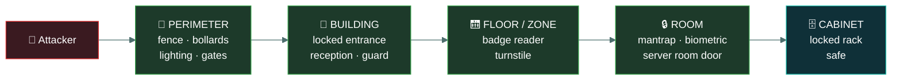
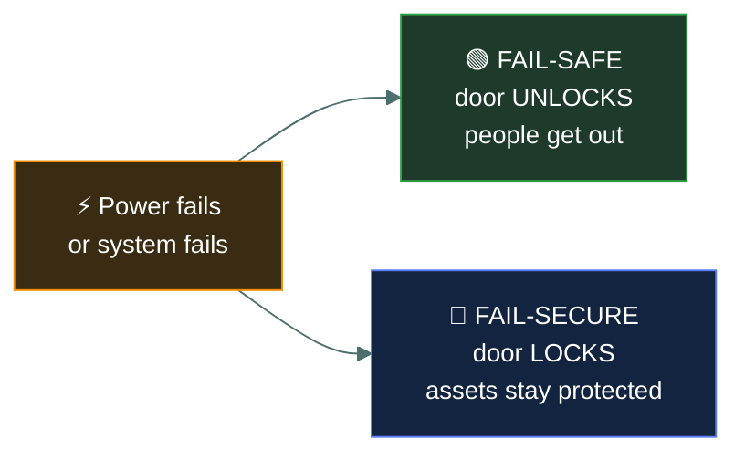

<div align="center">


# 🏢 Physical access controls

### *Keeping people out of places — and what each barrier actually stops*

[](../README.md)
[](../README.md)
[](#)

📌 *The control list, plus the two ideas the exam keeps returning to: layered rings of defence, and human safety overriding every other consideration.*

</div>

---

## 🧸 The big idea

All the logical access control in the world is irrelevant if someone can walk into the server
room and carry a machine out. **Physical access control is the first and last layer**, and the
exam treats it seriously.

The organising idea is **concentric rings**: layered barriers from the site boundary inward to
the most sensitive room, each one requiring more authorisation than the last.

```
Perimeter → Building → Floor / Zone → Room → Cabinet
```

An attacker must defeat each ring in turn, and every ring is an opportunity to stop, detect or
delay them.

Two things matter more here than anywhere else in the domain:

- **Human safety always wins.** Any physical security question involving fire, evacuation or an
  emergency has "protect people" as the answer, without exception.
- **Controls that fail need a safe failure direction.** A door lock that fails locked protects
  assets and can trap people. One that fails open protects people and exposes assets. Which is
  correct depends on whether a human could be inside.

---

## 📖 Words you will keep seeing

| Word | What it means on this exam |
|---|---|
| **Perimeter** | The outermost physical boundary of a site. |
| **Bollard** | A short post preventing vehicles reaching a building. |
| **Mantrap / access control vestibule** | A small space with two interlocking doors; only one opens at a time. |
| **Turnstile** | A barrier permitting one person through at a time. |
| **Badge / access card** | A credential presented to a reader. A **possession** factor. |
| **Proximity card** | A badge read wirelessly at short range. |
| **Biometric reader** | A device authenticating on a physical characteristic. |
| **CCTV** | Camera surveillance. **Detective**, and **deterrent** if visible. |
| **Motion sensor** | Detects movement in a monitored area. |
| **Security guard** | A human control. The most flexible, and the most expensive. |
| **Fail-safe** | On failure, the door **unlocks** — prioritises **people**. |
| **Fail-secure** | On failure, the door **locks** — prioritises **assets**. |
| **Tailgating** | Following an authorised person through a door **without** their knowledge. |
| **Piggybacking** | The same, **with** the authorised person's consent. |
| **Clean desk policy** | Requiring sensitive material to be secured when unattended. |
| **Faraday cage** | Shielding that blocks electromagnetic emissions. |

---

## 🔍 The layered rings



| Ring | Controls | Purpose |
|---|---|---|
| **Perimeter** | Fences, bollards, gates, lighting, signage | Deter and delay; define the boundary |
| **Building** | Locked doors, reception, guards, visitor sign-in | Control who enters at all |
| **Floor / zone** | Badge readers, turnstiles, lifts requiring a card | Separate general areas from restricted ones |
| **Room** | Mantraps, biometrics, dedicated locks | Protect the most sensitive spaces |
| **Cabinet** | Locked racks, safes, cable locks | Protect individual assets |

> 🎯 **Lighting is a deterrent control**, and so is signage. Neither stops anyone; both discourage
> the attempt and support detection.

---

## 🚪 The controls, by function

Every physical control has a **function** as well as being physical by type.

| Control | Function | What it actually does |
|---|---|---|
| **Fence** | Preventive + deterrent | Delays and discourages entry |
| **Bollard** | Preventive | Stops vehicles specifically |
| **Lighting** | **Deterrent** | Discourages, and enables observation |
| **Warning sign** | **Deterrent** | Discourages only |
| **Lock** | Preventive | Stops entry without a key |
| **Badge reader** | Preventive | Permits only those with a valid credential |
| **Mantrap** | **Preventive** | Stops **tailgating** — one person at a time |
| **Turnstile** | Preventive | One person per authorisation |
| **CCTV** | **Detective** (deterrent if visible) | Records; does not stop |
| **Motion sensor** | Detective | Detects presence |
| **Alarm** | Detective | Raises notification |
| **Security guard** | Preventive + deterrent + detective | The most flexible — and can exercise judgement |
| **Fire suppression** | **Corrective** | Limits damage once fire has started |

> ⚠️ **CCTV does not prevent anything.** It is detective, and deterrent where visible. An option
> claiming cameras prevent unauthorised entry is wrong.

> 🎯 **A mantrap is the specific answer to tailgating.** If a question describes people following
> others through a secure door, the control is a mantrap or a turnstile.

---

## 🔐 Fail-safe versus fail-secure

The most examined nuance in physical security. It is a direct application of the CIA triad in
tension.



| | On failure | Prioritises | Use where |
|---|---|---|---|
| **Fail-safe** | **Unlocks** | **People** | Anywhere humans could be trapped — offices, occupied areas |
| **Fail-secure** | **Locks** | **Assets** | Unoccupied high-value spaces — vaults, unstaffed equipment rooms |

> [!IMPORTANT]
> **"Safe" refers to the safety of people, not the security of assets.** Fail-**safe** unlocks so
> people can escape. Fail-**secure** locks so assets stay protected. The naming is the trap.

> 🎯 **Where a question involves a room people might occupy, fail-safe is correct** — human safety
> outranks asset protection, always. This is Canon 1 of the Code of Ethics expressed as a door.

---

## 🔥 Environmental controls

Physical security covers more than intruders. Systems need the right conditions to keep running —
which makes these **availability** controls.

| Control | Protects against |
|---|---|
| **HVAC** — heating, ventilation, air conditioning | Overheating and humidity damage |
| **Fire detection and suppression** | Fire |
| **UPS** — uninterruptible power supply | Short power interruptions |
| **Generator** | Extended power loss |
| **Water detection** | Leaks and flooding, especially under raised floors |

**Fire suppression in data centres:** water damages equipment, so **gas-based** suppression or
pre-action sprinkler systems are used instead — systems that will not discharge on a single
false alarm.

> ⚠️ **People before equipment, again.** Some suppression agents displace oxygen, so evacuation
> comes first and the system is designed to allow it.

---

## ⚖️ Told apart

| | Means | Not to be confused with |
|---|---|---|
| **Fail-safe** | Door **unlocks** on failure. Protects **people**. | **Fail-secure**, which **locks** and protects assets. The naming misleads. |
| **Mantrap** | Two interlocking doors, one person at a time. **Prevents tailgating.** | **Turnstile**, which also admits one at a time but is simpler and usually for volume. |
| **Tailgating** | Following through **without** consent. | **Piggybacking**, with the authorised person's consent. |
| **CCTV** | **Detective**, and deterrent if visible. | A **preventive** control. It records; it stops nothing. |
| **Lighting / signage** | **Deterrent** only. | Preventive controls, which physically stop entry. |
| **Fire suppression** | **Corrective** — limits damage after ignition. | Preventive. It does not stop a fire starting. |
| **Physical control** | Tangible protection of places and things. | **Logical control**, implemented in software. A badge reader is physical; the permission it checks is logical. |

---

## ⚠️ Where your instinct is wrong

> [!WARNING]
> **In the job:** "fail-safe" sounds like the secure option — safe from attackers.
>
> **On the exam:** fail-**safe** means **safe for people** — the door unlocks. If you want the door
> to stay locked when power fails, that is fail-**secure**. This single naming confusion is worth
> deliberately memorising.

> [!WARNING]
> **In the job:** cameras are your main deterrent and investigation tool, and you would call them
> a security control without qualification.
>
> **On the exam:** CCTV is **detective**. It does not prevent. Where a question asks for a
> preventive physical control, the answer is a lock, barrier, mantrap or guard.

> [!WARNING]
> **In the job:** protecting the data centre is the priority in an incident.
>
> **On the exam:** **people always come first.** Evacuation outranks equipment, evidence,
> continuity and data, in every scenario without exception.

---

## 🧠 How to remember it

🧠 **Fail-SAFE = SAFE for people = door opens.**
**Fail-SECURE = SECURE for assets = door locks.**

🧠 **A mantrap traps one man** — one person at a time, which is why it beats tailgating.

🧠 **Cameras catch, locks stop.** Detective versus preventive.

🧠 **Rings, outside in: Perimeter · Building · Zone · Room · Cabinet.**

🧠 **People, then property.** Every time.

---

## ✅ Check you actually got it

Answer all five before expanding anything.

**Q1.** An office building's electronic door locks are configured so that if power fails, all
doors unlock. What is this configuration called, and why would it be chosen?

- **A.** Fail-secure, to prevent unauthorised entry during an outage
- **B.** Fail-safe, to ensure occupants can evacuate during an emergency
- **C.** Fail-open, which is always a misconfiguration
- **D.** Fail-secure, because safety systems must protect assets first

<details>
<summary><b>Answer</b></summary>

**B — fail-safe, to ensure occupants can evacuate.** "Safe" refers to the safety of people, and in
an occupied building the priority is that nobody is trapped by a locked door during a fire or
power loss.

- **A** describes the opposite configuration. Fail-**secure** locks on failure.
- **C** treats the behaviour as an error, when it is a deliberate and correct choice for occupied
  spaces. It is also not the standard term.
- **D** inverts the priority order. Human safety outranks asset protection in every physical
  security scenario on this exam.

</details>

**Q2.** Employees repeatedly follow one another through a badge-controlled door without each
presenting a credential. Which control BEST addresses this?

- **A.** Additional CCTV coverage at the door
- **B.** A mantrap or access control vestibule
- **C.** A stronger badge encryption standard
- **D.** Warning signage prohibiting the practice

<details>
<summary><b>Answer</b></summary>

**B — a mantrap or access control vestibule.** Two interlocking doors permit only one person
through per authorisation, which physically prevents the behaviour.

- **A** would record it happening. Detective, not preventive — the problem would continue and you
  would have footage of it.
- **C** addresses credential cloning, which is a different attack entirely. The badges here are
  working correctly; the issue is that a second person walks through.
- **D** is a deterrent and may reduce casual occurrences, but it relies on compliance and stops
  nobody determined. A mantrap does not ask for cooperation.

</details>

**Q3.** How should CCTV be classified by function?

- **A.** Preventive, because it stops unauthorised access
- **B.** Detective, and deterrent where cameras are visible
- **C.** Corrective, because footage is used to resolve incidents
- **D.** Directive, because it instructs people how to behave

<details>
<summary><b>Answer</b></summary>

**B — detective, and deterrent where visible.** Cameras record what happened, and conspicuous
cameras discourage attempts.

- **A** is the common misclassification. A camera has no ability to stop anyone; it observes.
- **C** confuses using evidence during an investigation with repairing damage. Corrective controls
  restore — backups, fire suppression, incident response.
- **D** describes a control that mandates behaviour, such as a policy or instructional signage.

</details>

**Q4.** A fire alarm sounds in a data centre while an engineer is replacing a failed disk. What
takes priority?

- **A.** Completing the disk replacement to avoid data loss
- **B.** Initiating a graceful shutdown of critical systems
- **C.** Evacuating personnel from the facility
- **D.** Securing the server room to prevent unauthorised access during the evacuation

<details>
<summary><b>Answer</b></summary>

**C — evacuating personnel.** Human safety is the absolute first priority in any physical security
or emergency scenario, and there is no exception to it on this exam.

- **A** keeps a person in a building that may be on fire in order to protect data. The trade is
  never acceptable.
- **B** protects data integrity at the same unacceptable cost.
- **D** sounds professionally conscientious, which is exactly what makes it a good distractor. It
  also risks locking doors during an evacuation, which is the failure mode fail-safe exists to
  prevent.

</details>

**Q5.** Which physical control is PRIMARILY a deterrent rather than preventive?

- **A.** A mantrap at the server room entrance
- **B.** Bollards outside the building entrance
- **C.** Exterior lighting and warning signage
- **D.** A biometric reader on the data centre door

<details>
<summary><b>Answer</b></summary>

**C — exterior lighting and warning signage.** Neither physically stops anyone. Both discourage
the attempt and make observation and detection more likely.

- **A** physically restricts passage to one person at a time — preventive.
- **B** physically stop a vehicle reaching the building — preventive, and very specifically so.
- **D** physically denies entry to anyone whose biometric does not match — preventive.

</details>

---

## 🎓 The grown-up version

<details>
<summary><b>Extra depth — open this on a second read, never needed for the pass</b></summary>

**Fail-safe and fail-secure are a legal question as much as a security one.** Building and fire
codes in most jurisdictions mandate that occupied spaces have egress that does not depend on
power or on a working access control system, which removes the choice entirely for most doors.
Where fail-secure is used, it is generally paired with a mechanical override — a break-glass
release or a crash bar — so the door can always be opened from the inside even when it refuses to
open from the outside. The interesting design work is in the asymmetry: secure inbound, always
passable outbound.

**Guards are expensive and irreplaceable.** A guard is the only physical control capable of
judgement: noticing that someone is behaving oddly, that a delivery is unexpected, that a
contractor's story does not hold together. Every other control enforces a rule. This is why
high-security environments still staff reception despite the cost, and why social engineering
against guards — confident manner, plausible pretext, a high-visibility jacket — remains so
effective. The control's strength and its weakness are the same property.

**Badge cloning is easier than people assume.** Older proximity card technologies transmit a
static identifier with no cryptography, and readers capable of capturing and replaying one are
inexpensive and pocket-sized. This is why badge-plus-PIN is meaningfully stronger than badge
alone — it adds a second factor that cannot be captured by standing near someone — and why
modern credentials use cryptographic challenge-response.

**Physical access defeats most logical controls.** Given unsupervised physical access to a
machine, an attacker can boot from external media, remove the drive, attach a hardware keylogger,
or simply take it. Full-disk encryption is the control that makes theft survivable, which is
precisely why it appears in every laptop policy. The principle is worth internalising: logical
controls generally assume the attacker does not have the hardware in their hands.

**Environmental monitoring is availability work.** Temperature, humidity and water sensors rarely
feature in security discussions, and heat is a far more common cause of equipment failure in
practice than intrusion. Water detection beneath raised floors exists because the first sign of a
leak is otherwise a shorted power distribution unit. These are CIA availability controls wearing
facilities-management clothing.

</details>

---

## 📝 Cram lines

Destined for [`EXAM-DAY.md`](../../EXAM-DAY.md):

- **Rings, outside in: Perimeter · Building · Zone · Room · Cabinet.**
- **FAIL-SAFE = door UNLOCKS = protects PEOPLE.** Use in occupied spaces.
- **FAIL-SECURE = door LOCKS = protects ASSETS.** Use in unoccupied high-value spaces.
- **"Safe" means safe for people, not secure from attackers.** The naming is the trap.
- **HUMAN SAFETY ALWAYS WINS.** Evacuation beats evidence, data, equipment and continuity.
- **Mantrap / access control vestibule = the answer to TAILGATING.** One person at a time.
- **CCTV is DETECTIVE** (deterrent if visible). It does **not** prevent.
- **Lighting and signage are DETERRENT only.**
- **Fire suppression is CORRECTIVE.** Data centres use **gas-based**, not water.
- **Bollards stop vehicles. Locks and mantraps stop people. Guards can use judgement.**
- **Tailgating = no consent. Piggybacking = with consent.**

---

<div align="center">
<sub><a href="../README.md">← back to 03 · Access Control</a> &nbsp;·&nbsp; <a href="../logical-access-controls/">next: Logical access controls →</a></sub>
</div>
