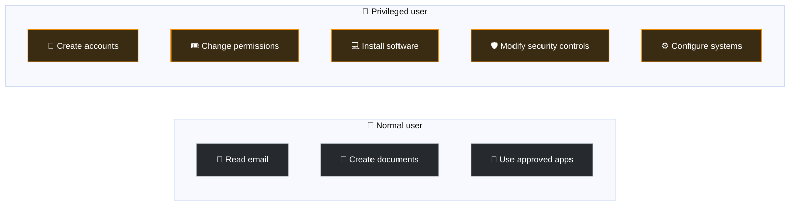
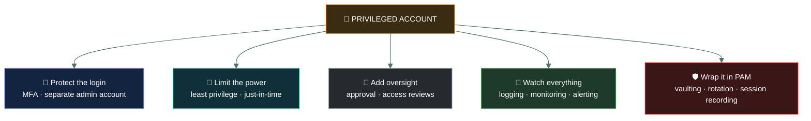
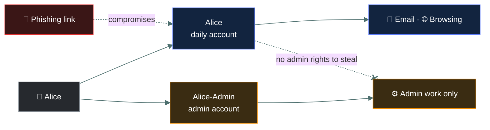
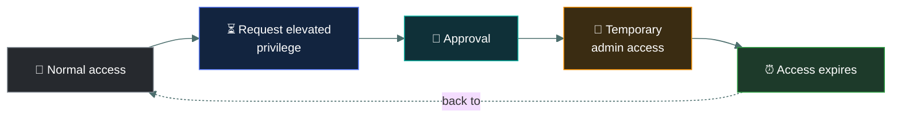
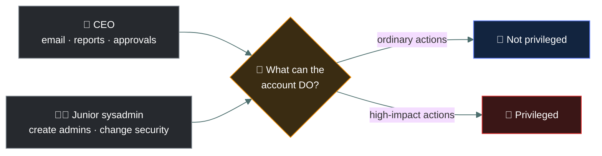

<div align="center">


# 🔐 Privileged Access

### *The accounts that can do anything — and why they need controls ordinary accounts do not*

[](../README.md)
[](../README.md)
[](#)

📌 *What makes an account privileged, why attackers want one above all else, and the control set the exam expects around them.*

</div>

---

A **privileged account** is an account that has **more power than a normal user account**.

The exam's main idea is:

> **Privileged = can perform powerful or security-sensitive actions.**

Think:

> 👤 **Normal caveman** → can eat food.

> 👑 **Chief caveman** → can open treasure cave, change rules, and control other cavemen.

---

# 👑 What Makes an Account Privileged?

An account is privileged when it can perform **high-impact administrative or security-sensitive actions**.

Examples include the ability to:

- 👥 Create, delete, or modify user accounts
- 🔑 Reset passwords or credentials
- 🛡️ Change security settings
- 💻 Install software
- ⚙️ Change system configuration
- 📁 Access sensitive files
- 🗄️ Modify databases
- 🔥 Change firewall rules
- 👮 Grant permissions to other users
- 🖥️ Administer servers or operating systems

> [!IMPORTANT]
> **A privileged account isn't necessarily called "Administrator."**
>
> A database administrator, cloud administrator, network administrator, security administrator, or application administrator can all have privileged access.

---

# 🪨 Normal vs Privileged

### 👤 Normal user

May be able to:

- Read email
- Create documents
- Use approved applications

But usually **cannot**:

- Change security settings
- Create administrators
- Modify the operating system

### 👑 Privileged user

May be able to:

- Create accounts
- Change permissions
- Install software
- Modify security controls
- Configure systems

Therefore:

> **Privileged access = powerful access that could significantly affect security or operations.**



---

# 🛡️ What Controls Does the Exam Expect?

The big idea is:

> **Privileged accounts need stronger controls and tighter monitoring than ordinary accounts.**

Here are the important ones.



---

## 1. 🔐 MFA

Privileged accounts should use **multi-factor authentication**.

Instead of:

> Password only 🔑

Use:

> Password + authenticator/token/biometric 🔑➕📱

Why?

> Because compromising a privileged account can cause **much more damage**.

### 🪨 Memory

> **Powerful account → stronger login protection.**

---

## 2. 👤 Separate Admin and Normal Accounts

Don't use one account for everything.

For example:

```
Alice       → normal daily account
Alice-Admin → administrative account
```

Alice uses the normal account for email and browsing.

She uses the admin account **only when performing administrative work**.

Why?

> If Alice's everyday account gets compromised, the attacker doesn't automatically get administrator privileges.



### 🧠 Exam clue

> **Separate standard and privileged accounts.**

---

## 3. 🔑 Least Privilege

Give the administrator **only the privileges actually required**.

Don't give:

> 🏆 God-level access to everyone.

If someone only administers databases, they shouldn't automatically receive unrestricted access to every server.

> **Minimum privilege necessary.**

---

## 4. ⏳ Just-in-Time / Temporary Privilege

A powerful account doesn't necessarily need powerful access **all the time**.

Instead:



This is often called **just-in-time (JIT) access**.

### 🪨 Caveman version

> **"Grog gets big club only when fighting bear."**

After the fight:

> **Club goes away.**

---

## 5. 📝 Logging and Monitoring

Privileged activity should be **logged and monitored**.

For example:

- Who logged in?
- When?
- What system did they access?
- What configuration did they change?
- What accounts did they create?

This is especially important because privileged accounts can make major changes.

### 🧠 Memory

> **Powerful actions → keep records.**

---

## 6. 🚨 Alerting

It's not enough to collect logs.

Important privileged activities may **generate alerts**.

For example:

- 🚨 Administrator account logs in at an unusual time.
- 🚨 Administrator creates a new administrator.
- 🚨 Privileged user disables security logging.

These events may require investigation.

---

## 7. 👥 Approval / Authorization

High-risk privileged actions may **require approval**.

For example:

> Admin requests permission to disable a security control.

> Another authorized person approves it.

This helps prevent one person from making dangerous changes without oversight.

---

## 8. 🔄 Periodic Access Review

Organizations should regularly ask:

> **"Does this person still need privileged access?"**

If someone changes jobs:

> 👨‍💻 Developer → 📊 Manager

They may no longer need their old administrative privileges.

> **Remove unnecessary access.**

### 🧠 Memory

> **No longer needed = remove it.**

---

## 9. 🛡️ Privileged Access Management (PAM)

**PAM** is the broader security approach/tooling used to control privileged accounts and sessions.

PAM can help with:

- 🔐 Credential protection
- 👤 Privileged account management
- ⏳ Temporary elevation
- 📝 Session logging
- 👀 Monitoring
- 🔄 Password rotation
- 🚨 Detection of suspicious activity

Think:

> **PAM = security system around the powerful accounts.**

---

# 🔄 Credential Rotation

Privileged credentials are especially sensitive.

Organizations may use systems that automatically:

> 🔑 **Change privileged passwords**

and securely store them.

This reduces the risk of a stolen or long-lived privileged password being reused.

---

# 🎯 Exam Scenarios

### Scenario 1

> A system administrator can create new user accounts and change security settings.

**Privileged account ✅**

Because the account can perform security-sensitive administrative actions.

---

### Scenario 2

> Administrators use MFA when logging into servers.

**Good privileged-access control ✅**

---

### Scenario 3

> Employees use their administrator account for email, web browsing, and administrative work.

**Bad practice ❌**

Better:

> **Separate standard and privileged accounts.**

---

### Scenario 4

> An administrator receives elevated permissions for 30 minutes to perform a specific maintenance task.

**Just-in-time / temporary privileged access ✅**

---

### Scenario 5

> Every action performed by a privileged administrator is logged.

**Privileged activity monitoring/auditing ✅**

---

### Scenario 6

> A former administrator still has domain administrator privileges six months after moving to another department.

**Problem:** excessive/unused privileged access.

Apply:

> **Access review + least privilege + timely removal.**

---

# ⚠️ Privileged Account ≠ Just "Important Person"

This is an exam trap.

A **CEO** might be extremely important to the organization but not necessarily have technical privileged access.

Conversely:

> **A junior system administrator** could have enormous technical privileges.

The question is:

> ✅ **"What can the account DO?"**

Not:

> ❌ **"How important is the person?"**



---

# 🧠 Ultimate Cheat Sheet

### 👑 What makes an account privileged?

> **Ability to perform powerful administrative, security-sensitive, or high-impact actions.**

### 🛡️ Controls to remember:

- 🔐 MFA
- 👤 Separate admin and standard accounts
- 🔑 Least privilege
- ⏳ Just-in-time / temporary elevation
- 📝 Logging and auditing
- 👀 Monitoring
- 🚨 Alerting
- 👥 Approval for sensitive actions
- 🔄 Regular access reviews
- 🛡️ PAM
- 🔑 Credential/password protection and rotation

### 🪨 One-line exam memory:

> **Privileged account = BIG POWER, so use STRONG AUTHENTICATION, MINIMUM PRIVILEGE, SEPARATE ACCOUNTS, TEMPORARY ACCESS where possible, and LOG/MONITOR EVERYTHING IMPORTANT.**

---

# ✅ Check You Actually Got It

Answer all seven before expanding anything.

**Q1.** Which of the following accounts is the best example of a **privileged** account?

- **A.** The CEO's email account
- **B.** A service account that can modify firewall rules
- **C.** A sales manager's account with access to the CRM
- **D.** A guest Wi-Fi account

<details>
<summary><b>Answer</b></summary>

**B.** Changing firewall rules is a high-impact, security-sensitive action.

- **A** is the trap: the CEO is important, but privilege is about what the *account can do*, not who owns it.
- **C** is ordinary business access.
- **D** is the least-privileged account of the lot.

</details>

**Q2.** A system administrator uses the same account to read email, browse the web and manage domain controllers. What is the best recommendation?

- **A.** Enable a stronger password on that account
- **B.** Create separate standard and administrative accounts
- **C.** Block web browsing for all employees
- **D.** Give the administrator a second laptop

<details>
<summary><b>Answer</b></summary>

**B — separate standard and admin accounts.** If the everyday account is phished, the attacker shouldn't get admin rights along with it.

- **A** helps a little but doesn't fix the exposure of admin rights to email and web threats.

</details>

**Q3.** An engineer requests administrator rights, a manager approves, and the rights are removed automatically after two hours. What is this called?

- **A.** Segregation of duties
- **B.** Just-in-time (temporary) privileged access
- **C.** Discretionary access control
- **D.** Credential rotation

<details>
<summary><b>Answer</b></summary>

**B — just-in-time access.** Elevated privilege is granted only when needed, and expires on its own.

</details>

**Q4.** An administrator moved to a non-technical role eight months ago but still holds domain admin rights. Which control would most likely have caught this?

- **A.** MFA
- **B.** Credential rotation
- **C.** Periodic access review
- **D.** Alerting on unusual logins

<details>
<summary><b>Answer</b></summary>

**C — periodic access review.** Regularly asking "does this person still need this?" is how leftover privilege gets found and removed.

- **A** and **B** protect the login and the password but don't remove access that is no longer needed.

</details>

**Q5.** Which control most directly helps an organization **detect** that an administrator created a new admin account at 3 a.m.?

- **A.** Least privilege
- **B.** Logging, monitoring and alerting
- **C.** Separate admin accounts
- **D.** Password complexity rules

<details>
<summary><b>Answer</b></summary>

**B.** Privileged activity must be logged, and high-risk events like creating an admin should raise an alert. The other options are preventive, not detective.

</details>

**Q6.** What is Privileged Access Management (PAM)?

- **A.** A type of firewall that blocks admin traffic
- **B.** A security approach and tooling that controls, protects and monitors privileged accounts and sessions
- **C.** A policy that forbids anyone from having admin rights
- **D.** An access control model based on job roles

<details>
<summary><b>Answer</b></summary>

**B.** PAM wraps privileged accounts with credential vaulting and rotation, temporary elevation, session logging and monitoring.

- **D** describes RBAC.

</details>

**Q7.** Why do privileged accounts require stronger controls than ordinary accounts?

- **A.** Because they are used more often
- **B.** Because they belong to senior staff
- **C.** Because compromising them can cause far greater damage
- **D.** Because regulations forbid ordinary accounts from using MFA

<details>
<summary><b>Answer</b></summary>

**C.** Their power to change security settings, create accounts and access sensitive systems makes them the attacker's top target — and the biggest blast radius if stolen.

</details>
