# 👑 Privileged Access

### *The master key — keep it temporary, traceable, and watched*

📌 *Know why privilege is different, the separate-admin-account rule, JIT over standing privilege, and how break-glass and service accounts are handled.*

---

## 🧸 The big idea

Steal **one office key** and you get one office. Steal the building's **master key** and you get
every door — including the security room, where you can **wipe the CCTV recordings** of yourself.

That master key is a **privileged account**: it can **change the system itself**, not just use it —
install software, change configuration, create accounts, read anyone's data, **and switch off the
logging that would record it.**

> 🎯 **Privileged accounts are the main objective of most intrusions.** An attacker who phishes an
> ordinary user isn't finished — they're hunting for a route to privilege.

Every control on this page follows one idea: **privileged access should be temporary, individually
traceable, and watched.**

---

## 📖 Words you will keep seeing

| Word | What it means on this exam |
|---|---|
| **Privileged account** | Can perform system-level actions beyond ordinary use. |
| **Administrator / root** | Built-in accounts with full control. |
| **Service account** | A non-human account an application runs as. |
| **Standing privilege** | Privileged rights held **permanently**, in use or not. |
| **Just-in-time (JIT) access** | Privilege granted only when needed, for a limited time, then removed. |
| **PAM** | Privileged Access Management — the discipline and tools for privileged accounts. |
| **Credential vault** | Secure store privileged credentials are checked out of (logged). |
| **Session recording** | Capturing what was done during a privileged session. |
| **Break-glass account** | Emergency high-privilege account for when normal access fails. |

---

## 🔍 The explanation

### The controls the exam expects

| Control | Why |
|---|---|
| **Separate admin account** | Everyday work happens on an unprivileged account — so phishing lands somewhere harmless |
| **Just-in-time access** | Privilege exists only while in use — no permanent target |
| **MFA on every privileged account** | The most valuable credential gets the strongest authentication |
| **Named individual accounts** | Never a shared `admin` — actions must trace to a person |
| **Session recording + logs admins can't edit** | The evidence survives, even from the account that did the damage |
| **More frequent reviews** | Privileged access reviewed on a shorter cycle |
| **Credential vaulting** | Credentials checked out per use, each checkout logged |

### The most-examined rule: separate admin accounts

> [!IMPORTANT]
> **Admin accounts don't read email or browse the web.** That's where compromise arrives.

### Just-in-time beats standing privilege

> ⚠️ **Privileged logs must go somewhere privileged users can't edit** — otherwise the account that
> did the damage erases the record.

### Service accounts

Non-human accounts are a recurring weak spot because they're created once and forgotten.

| Problem | Control |
|---|---|
| Password never changes | Rotate it, ideally automatically |
| Over-privileged "to make it work" | Scope to the minimum the service needs |
| Shared among admins | Vault it; check out per use, logged |
| Can be logged into interactively | **Deny interactive logon** |
| Service retired, account left behind | Include in reviews; **disable** when the service goes |

### Break-glass accounts

An emergency account for when normal access fails — the identity system is down, or every admin is
locked out:

> ⚠️ It's a **deliberate, monitored exception** — exempt from controls that might block it, which is
> exactly why using it must be impossible to do quietly.

---

## ⚖️ Told apart

| | Means | Not to be confused with |
|---|---|---|
| **Privileged account** | Can change the **system**. | An account with lots of **data** access. |
| **Standing privilege** | Held permanently. | **JIT** — granted when needed, then removed. JIT is the answer. |
| **Separate admin account** | Used only to administer. | One account with elevation prompts for everything. |
| **Service account** | Non-human, runs an app. Legit when scoped and vaulted. | A **shared human account** — always wrong. |
| **Break-glass** | Monitored emergency exception; use triggers an alert. | A convenient backdoor. |
| **Privilege escalation** | Attacker gains rights never granted. | **Privilege creep** — legit rights piling up. |

---

## ⚠️ Where your instinct is wrong

> [!WARNING]
> **In the job:** admins keep standing access because JIT adds friction under pressure.
>
> **On the exam:** **standing privilege is the weakness; JIT is the answer.**

> [!WARNING]
> **In the job:** a vaulted shared account is well-managed and normal.
>
> **On the exam:** shared credentials **destroy individual accountability**. Named accounts win.

> [!WARNING]
> **In the job:** admins need email and a browser in the same session to get anything done.
>
> **On the exam:** **separate administrative accounts.** The single most expected control here.

---

## 🧠 How to remember it

**Privilege should be Temporary, Traceable and Taped** — JIT, named accounts, logged and recorded.

**Admin accounts don't read email.**

**Break the glass and the alarm sounds.**

---

## ✅ Check you actually got it

Answer all five before expanding anything.

**Q1.** A sysadmin uses their domain administrator account to read email and browse the web. What
is the PRIMARY concern?

- **A.** Productivity is reduced by security prompts
- **B.** A phishing email or malicious website would compromise a fully privileged account
- **C.** Email systems cannot support administrative accounts
- **D.** Administrative accounts have limited mailbox storage

<b>Answer</b>

**B.** Everyday activity is where compromise arrives.

- **A** is an annoyance, not a security issue.
- **C** is false — which is exactly why the practice is common and dangerous.
- **D** is irrelevant.

**Q2.** Which approach BEST reduces the risk of privileged accounts?

- **A.** Granting permanent administrative rights to a small, trusted group
- **B.** Providing just-in-time elevation for the duration of the task, with approval and logging
- **C.** Sharing a single administrator account with a strong password
- **D.** Requiring administrators to change their password monthly

<b>Answer</b>

**B.** No permanent target; every elevation is auditable.

- **A** still leaves standing privilege.
- **C** destroys accountability.
- **D** is minor hygiene that doesn't touch standing privilege.

**Q3.** Why should privileged activity be logged to storage administrators cannot modify?

- **A.** To improve log query performance
- **B.** Because a privileged user could otherwise delete the record of their own actions
- **C.** To comply with data retention limits
- **D.** Because local disks have insufficient capacity

<b>Answer</b>

**B.**

- **A**, **C** and **D** are operational side issues, not the security reason.

**Q4.** A service account was given domain admin rights during troubleshooting two years ago and
never reduced. What should happen?

- **A.** Leave it, since the application is working correctly
- **B.** Reduce the account's privileges to the minimum the service requires
- **C.** Convert it to a shared account so administrators can also use it
- **D.** Delete the account and run the service as a named administrator

<b>Answer</b>

**B.** A textbook least-privilege failure; this is the direct fix.

- **A** — "nothing broke yet" is how this happens.
- **C** adds shared human use on top.
- **D** ties a service to a person and their rights — worse on every count.

**Q5.** Which statement about break-glass accounts is correct?

- **A.** They should be used routinely to avoid elevation delays
- **B.** Their use should trigger an alert and be reviewed afterwards
- **C.** They should have the same controls as ordinary administrative accounts
- **D.** They should be shared among all administrators for availability

<b>Answer</b>

**B.**

- **A** turns an emergency exception into a routine bypass.
- **C** — it's deliberately exempt from blocking controls, so it needs *stronger* monitoring.
- **D** spreads an unmonitored powerful credential around.

---

## 🎓 The grown-up version

<b>Extra depth — open this on a second read, never needed for the pass</b>

**The attack this defends against.** Tools like Mimikatz read **LSASS** memory on a Windows machine,
which caches credential hashes for anyone who logged in there. With **pass-the-hash**, the attacker
reuses the hash directly — no cracking needed. Log a domain admin into one infected laptop and you've
handed over the directory.

**Tiered administration:** tier 0 (identity infrastructure), tier 1 (servers), tier 2
(workstations). Higher-tier credentials are **never** used on lower-tier machines.

**Vaults defeat stolen hashes.** CyberArk / HashiCorp Vault rotate a password after each checkout;
Vault's **dynamic secrets** don't exist until requested and expire automatically.

**Kill the service-account password.** Managed service accounts rotate their own credentials;
workload identities get short-lived tokens and hold no static secret at all.

**Break-glass in the cloud:** a bad conditional-access policy can lock every admin out of the
tenant — so providers recommend emergency accounts excluded from it, with long random credentials
and alerts on any use.

---

## 📝 Cram lines

Destined for [`EXAM-DAY.md`](../../EXAM-DAY.md):

- **Privileged = can change the SYSTEM — including disabling the logs.** The main target of intrusions.
- **SEPARATE admin account** — admins don't do email/browsing on it. Most-examined control.
- **JIT beats standing privilege.** MFA on every privileged account. Named accounts, never shared.
- **Log privileged activity where admins CAN'T edit it.** Review privileged access more often.
- **Service accounts:** minimum scope, rotate, deny interactive logon, disable when retired.
- **Break-glass:** sealed, use triggers an **alert**, reviewed, credentials changed after.

---

<a href="../README.md">← back to 03 · IAM Concepts</a> &nbsp;·&nbsp; <a href="../identity-lifecycle/">next: Identity lifecycle →</a>

