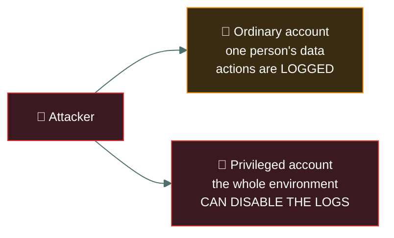
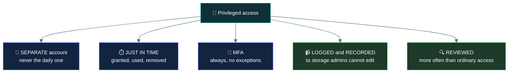

# 👑 Privileged access

### *The accounts that can do anything — and why they need controls ordinary accounts do not*

📌 *What makes an account privileged, why attackers want one above all else, and the control set the exam expects around them.*

---

## 🧸 The big idea

A **privileged account** can change the system itself, rather than merely use it. Install
software, change configuration, create other accounts, read anyone's data, **and switch off the
logging that would record any of it**.

That last capability is what makes privilege categorically different. An ordinary compromised
account gives an attacker one person's access. A compromised privileged account gives them the
environment — and the ability to hide what they did.

> 🎯 **Privileged accounts are the primary objective of most intrusions.** An attacker who phishes
> an ordinary user is not finished; they are looking for a route to privilege.

The controls in this topic all follow from one idea: **privileged access should be temporary,
individually attributable, and watched.**

---

## 📖 Words you will keep seeing

| Word | What it means on this exam |
|---|---|
| **Privileged account** | An account able to perform system-level actions beyond ordinary use. |
| **Administrator / root** | The built-in accounts with full system control. |
| **Service account** | A non-human account used by an application or service. |
| **Standing privilege** | Privileged rights held permanently, whether in use or not. |
| **Just-in-time (JIT) access** | Privilege granted only when needed, for a limited period, then removed. |
| **PAM** — Privileged Access Management | The discipline and tooling for controlling privileged accounts. |
| **Credential vault** | A secure store from which privileged credentials are checked out. |
| **Session recording** | Capturing what was done during a privileged session. |
| **Break-glass account** | An emergency account with high privilege, used only when normal access fails. |
| **Privilege escalation** | An attacker gaining rights they were never granted. |
| **Separate admin account** | A distinct privileged account, kept apart from the person's everyday account. |

---

## 🔍 Why privilege is different

Read it as a sentence: **an ordinary account loses you data, and a privileged account loses you
the environment and the evidence.**

**What a privileged account can typically do:**

- Install and remove software
- Change system and security configuration
- Create, modify and delete accounts — including its own successors
- Read, alter or destroy any data on the system
- **Disable auditing and delete logs**
- Grant privilege to others

---

## 🛡️ The controls the exam expects

| Control | Why |
|---|---|
| **Separate administrative account** | An administrator browses the web and reads email as an ordinary user, and elevates only to administer. A phishing email then compromises an unprivileged account |
| **Just-in-time access** | Privilege exists only while in use, so there is no permanently available target |
| **MFA on every privileged account** | The highest-value credential gets the strongest authentication |
| **Individual accountability** | Named accounts, never a shared `admin`, so actions trace to a person |
| **Session recording** | What was actually done during the session, not just that a login occurred |
| **Logging to separate storage** | Logs shipped somewhere administrators cannot alter, so the evidence survives |
| **More frequent access reviews** | Privileged entitlements reviewed on a shorter cycle than ordinary ones |
| **Credential vaulting** | Credentials checked out per use, with the checkout logged |

> [!IMPORTANT]
> **The separate-admin-account rule is the most examined control here.** Administrative
> credentials must not be used for everyday work — email, browsing, documents. Those activities
> are where compromise arrives, and they must land on an account that cannot do much.

> ⚠️ **Privileged logs must go somewhere privileged users cannot edit.** Otherwise the account
> that did the damage can erase the record, and accountability collapses.

---

## 🤖 Service accounts

Non-human accounts used by applications, and a recurring weak point because they tend to be
created once and never revisited.

| Problem | Control |
|---|---|
| Passwords never change | Rotate them, ideally automatically |
| Excessive privilege "to make it work" | Scope to the minimum the service requires |
| Shared among administrators | Vault the credential; check out per use, logged |
| Interactive login possible | Deny interactive logon — the account should only run the service |
| Forgotten when the service is retired | Include them in access reviews and decommissioning |

> 🎯 **A service account that no longer serves a running service should be disabled.** Orphaned
> service accounts with standing privilege are a classic finding.

---

## 🚨 Break-glass accounts

An emergency account with high privilege, for when normal access paths fail — the identity
provider is down, or every administrator is locked out.

The recognised handling:

- Credentials **sealed and stored securely**, physically or in a vault
- **Use triggers an immediate alert**
- Every use is **documented and reviewed afterwards**
- Credentials **changed after each use**
- **Excluded from the controls that might block it** in an emergency, which is precisely why its
  use must be so visible

> ⚠️ **A break-glass account is a deliberate, monitored exception** — not a convenience. It exists
> because an organisation locked entirely out of its own systems is an availability disaster.

---

## ⚖️ Told apart

| | Means | Not to be confused with |
|---|---|---|
| **Privileged account** | Can change the system itself. | A **user account with a lot of data access**. Privilege is about system-level capability, not volume of data. |
| **Standing privilege** | Held permanently. | **Just-in-time access**, granted only when needed and then removed. JIT is the expected answer. |
| **Separate admin account** | A distinct account used only to administer. | Using one account with elevation prompts for everything, which leaves the daily account privileged. |
| **Service account** | Non-human, runs an application. | A **shared human account**, which is always wrong. A service account is legitimate when scoped and vaulted. |
| **Break-glass** | A monitored emergency exception. | A convenient backdoor for administrators. Its use must trigger an alert. |
| **Privilege escalation** | An attacker gains rights never granted. | **Privilege creep**, rights accumulating legitimately over role changes. |

---

## ⚠️ Where your instinct is wrong

> [!WARNING]
> **In the job:** administrators hold standing privileged access, because JIT elevation adds
> friction to work that is already under time pressure.
>
> **On the exam:** **standing privilege is the weakness and JIT is the answer.** Privilege should
> exist only while it is being used.

> [!WARNING]
> **In the job:** a shared service account with a vaulted password is well-managed and normal.
>
> **On the exam:** shared credentials **destroy individual accountability**. Where a question
> offers individual named accounts against a shared one, individual wins.

> [!WARNING]
> **In the job:** administrators need email and a browser on the same session to get anything
> done.
>
> **On the exam:** **separate administrative accounts**, with everyday activity on an unprivileged
> one. This is the single most expected control in the topic.

---

## 🧠 How to remember it

🧠 **Privilege should be Temporary, Traceable and Taped.**
Temporary — just in time. Traceable — individual named accounts. Taped — logged and recorded to
storage admins cannot touch.

🧠 **Admin accounts don't read email.** Everyday work on an everyday account.

🧠 **Break the glass and the alarm sounds.** If its use is silent, it is not break-glass.

---

## ✅ Check you actually got it

Answer all five before expanding anything.

**Q1.** A system administrator uses their domain administrator account to read email and browse
the web. What is the PRIMARY concern?

- **A.** Productivity is reduced by security prompts
- **B.** A phishing email or malicious website would compromise a fully privileged account
- **C.** Email systems cannot support administrative accounts
- **D.** Administrative accounts have limited mailbox storage

<b>Answer</b>

**B — a phishing email or malicious website would compromise a fully privileged account.**
Everyday activities are where compromise typically arrives, and they must land on an account that
cannot do much.

- **A** is an operational annoyance and not a security concern.
- **C** is factually wrong — administrative accounts can use email perfectly well, which is exactly
  why the practice is common and dangerous.
- **D** invents a technical limitation that is irrelevant to security.

**Q2.** Which approach BEST reduces the risk associated with privileged accounts?

- **A.** Granting permanent administrative rights to a small, trusted group
- **B.** Providing just-in-time elevation for the duration of the task, with approval and logging
- **C.** Sharing a single administrator account with a strong password
- **D.** Requiring administrators to change their password monthly

<b>Answer</b>

**B — just-in-time elevation with approval and logging.** Privilege exists only while it is being
used, so there is no permanently available target, and each elevation is an auditable event.

- **A** reduces the number of holders and leaves standing privilege in place, which remains the
  core weakness.
- **C** destroys individual accountability entirely, and the password's strength does nothing about
  that.
- **D** is a minor hygiene measure that does not address standing privilege, and aggressive
  rotation is no longer considered strong practice.

**Q3.** Why should privileged account activity be logged to storage that administrators cannot
modify?

- **A.** To improve log query performance
- **B.** Because a privileged user could otherwise delete the record of their own actions
- **C.** To comply with data retention limits
- **D.** Because local disks have insufficient capacity

<b>Answer</b>

**B — because a privileged user could otherwise delete the record of their own actions.**
Privileged accounts can typically disable auditing and remove logs, so accountability requires the
evidence to sit beyond their reach.

- **A** is an operational benefit of centralised logging and not the security reason.
- **C** concerns how long logs are kept, not who can alter them.
- **D** is a capacity consideration unrelated to the control's purpose.

**Q4.** An application uses a service account that was granted domain administrator rights during
troubleshooting two years ago. What should happen?

- **A.** Leave it, since the application is working correctly
- **B.** Reduce the account's privileges to the minimum the service requires
- **C.** Convert it to a shared account so administrators can also use it
- **D.** Delete the account and run the service as a named administrator

<b>Answer</b>

**B — reduce the account's privileges to the minimum the service requires.** Elevated rights
granted for troubleshooting and never revoked are a textbook least privilege failure, and this is
the direct remedy.

- **A** accepts a high-value permanently privileged account because nothing has broken yet, which
  is how this situation arises in the first place.
- **C** makes it worse by adding shared human use to an over-privileged account, destroying
  accountability as well.
- **D** replaces a scoped non-human identity with a named person's privileged account, which is
  worse on every count — it ties a service to an individual and gives it their rights.

**Q5.** Which statement about break-glass accounts is correct?

- **A.** They should be used routinely to avoid elevation delays
- **B.** Their use should trigger an alert and be reviewed afterwards
- **C.** They should have the same controls as ordinary administrative accounts
- **D.** They should be shared among all administrators for availability

<b>Answer</b>

**B — their use should trigger an alert and be reviewed afterwards.** A break-glass account is a
deliberate exception to normal controls, and the compensating control is that using it is
impossible to do quietly.

- **A** turns an emergency exception into a routine bypass, which defeats the entire purpose.
- **C** misunderstands why it exists. It is deliberately exempt from controls that might block it
  in an emergency — which is precisely why it needs *stronger* monitoring, not the same.
- **D** would put an unmonitored high-privilege credential in many hands, and shared credentials
  destroy accountability.

---

## 🎓 The grown-up version

<b>Extra depth — open this on a second read, never needed for the pass</b>

**Why attackers hunt privilege specifically.** Almost every significant intrusion follows the same
arc: initial access through phishing or an exposed service, then privilege escalation, then
lateral movement using the new rights, then objectives. The middle step is where defence has the
most leverage, because an attacker confined to an ordinary user's rights on one machine has
limited options. This is why credential theft tooling exists and why protections against
extracting credentials from memory matter so much.

**The tiered administration model.** Mature environments separate administrative accounts into
tiers by the sensitivity of what they control: tier 0 for identity infrastructure such as domain
controllers, tier 1 for servers and applications, tier 2 for user workstations. The rule is that
credentials from a higher tier are never used on lower-tier machines, because a compromised
workstation can capture any credential used on it. Without tiering, an administrator logging into
an infected laptop with domain administrator rights hands over the entire directory.

**Service account rotation is genuinely hard.** Changing a service account password means
updating it everywhere the service runs, in configuration files, scheduled tasks and application
settings, and anything missed fails at an unpredictable moment. This is why service account
passwords go unchanged for years. The modern answer is to eliminate the password entirely —
managed service accounts that rotate their own credentials, or workload identities that obtain
short-lived tokens from the platform and never hold a static secret.

**Session recording has limits and costs.** Recording what an administrator did is powerful for
investigation and creates a large store of highly sensitive material — the recording of someone
configuring a system contains everything they saw. It also raises legitimate monitoring concerns
that vary by jurisdiction. It is a control that works best when clearly disclosed, tightly
protected, and used for investigation rather than routine supervision.

**Break-glass in the cloud.** Cloud platforms make this concrete: if conditional access policies
are misconfigured, an organisation can lock every administrator out of its own tenant with no
physical console to fall back on. Providers therefore recommend maintaining emergency access
accounts excluded from conditional access, with long random credentials, monitored for any sign
of use. It is one of the clearest cases of an availability control accepted as a deliberate
confidentiality risk.

---

## 📝 Cram lines

Destined for [`EXAM-DAY.md`](../../EXAM-DAY.md):

- **Privileged = can change the SYSTEM, not just use it — including DISABLING THE LOGS.**
- **Privileged accounts are the main objective of most intrusions.**
- **SEPARATE admin account.** Admins do email and browsing on an ordinary account. Most-examined control here.
- **Just-in-time beats standing privilege.** Granted, used, removed.
- **MFA on every privileged account.** No exceptions.
- **Individual named accounts, never a shared `admin`** — shared destroys accountability.
- **Log privileged activity to storage admins CANNOT edit.**
- **Review privileged access MORE often than ordinary access.**
- **Service accounts:** scope to minimum, rotate credentials, deny interactive logon, disable when the service retires.
- **Break-glass = monitored emergency exception.** Use triggers an **alert**, is documented, and credentials change after.

---

<a href="../README.md">← back to 03 · IAM Concepts</a> &nbsp;·&nbsp; <a href="../identity-lifecycle/">next: Identity lifecycle →</a>

