# 🌐&nbsp; 04 · Networking and Cloud Security Concepts

### *How networks and clouds are built, attacked and defended.*

---

## 👋 01 · Read this first

The second-heaviest domain at **21.3%** under the live outline, and the one most likely to be
familiar territory. It has also picked up three sub-areas the old outline didn't name
explicitly: **wireless/Bluetooth, embedded/ICS/IoT, and the formal cloud characteristics list**
— plus **defence in depth**, which moved here from the old Domain 3.

That familiarity is the problem, and it is worth being blunt about it before you start.

This domain is largely **straight recall**: which layer a device operates at, which port a
protocol uses, what an IDS does that an IPS does not. Where Domain 1 tested whether you could
tell two definitions apart, this one tests whether you can produce a fact on demand. The
material is not hard. The failure mode is different.

**If you work with networks, you will lose marks by knowing too much.** ISC2 teaches a
simplified model, and the exam grades against the simplification. An IPS blocks — full stop,
regardless of how many you have seen deployed in monitor-only mode. A firewall operates at
layer 3 and 4 in the basic model, regardless of what a next-generation appliance actually
inspects. Answering from deployment experience leads you to distractors built out of exactly
that nuance.

So read this domain for **phrasing**, not for concepts. You are learning how ISC2 words things
you already understand.

Two things to work hardest on:

- **The port numbers.** They are pure memorisation and they are free marks. Make them
  automatic.
- **The OSI layers.** Knowing which layer a device, protocol or attack belongs to answers a
  large share of this domain's questions.

---

## 📂 02 · The 14 topics

Work top to bottom. The early topics build the vocabulary the attack and defence topics use.

| | Topic | What you will be able to do afterwards |
|:--:|---|---|
| &#9745; | 🕸️ [`network-fundamentals/`](network-fundamentals/) | Name the network types and topologies, and say what each device on a network actually does. |
| &#9745; | 🪜 [`osi-and-tcpip/`](osi-and-tcpip/) | Place any protocol, device or attack at the right layer, in both models. |
| &#9745; | 🔢 [`ip-addressing/`](ip-addressing/) | Tell public from private, IPv4 from IPv6, and say what NAT, DHCP and DNS each do. |
| &#9745; | 🚪 [`ports-and-protocols/`](ports-and-protocols/) | Recognise the port numbers the exam expects on sight, and their secure equivalents. |
| &#9745; | ☠️ [`network-threats/`](network-threats/) | Name the threat categories in ISC2's own terms. |
| &#9745; | 💥 [`common-attacks/`](common-attacks/) | Identify an attack from its description, and tell the near-identical ones apart. |
| &#9745; | 🔥 [`network-defence-devices/`](network-defence-devices/) | Say what a firewall, IDS, IPS and proxy each do — and what each cannot do. |
| &#9745; | 🧱 [`segmentation-and-dmz/`](segmentation-and-dmz/) | Explain VLANs, DMZ, screened subnets and micro-segmentation, and why segmentation limits damage. |
| &#9745; | 🔐 [`vpn-and-remote-access/`](vpn-and-remote-access/) | Distinguish site-to-site from remote access, and say what a tunnel actually protects. |
| &#9745; | ☁️ [`cloud-and-virtualisation/`](cloud-and-virtualisation/) | Recognise the five cloud characteristics, and place responsibility correctly across IaaS/PaaS/SaaS. |
| &#9745; | 🚦 [`zero-trust/`](zero-trust/) | State the model's core assumption, and recognise the service-agreement terms beside it. |
| &#9745; | 🛡️ [`defence-in-depth/`](defence-in-depth/) | Explain layered control strategy, and why layers must be independent. |
| &#9745; | 📶 [`wireless-and-bluetooth/`](wireless-and-bluetooth/) | Tell rogue AP from evil twin, and rank bluejacking/bluesnarfing/bluebugging by severity. |
| &#9745; | 🏭 [`iot-and-ics/`](iot-and-ics/) | Explain why ICS/embedded/IoT devices break normal patch-and-reboot assumptions. |

---

## 🎯 03 · The trap in this domain

Three examples of the simplification you are being graded against:

| The exam's model | What you know in practice |
|---|---|
| IDS detects and alerts; IPS detects and blocks | Most IPS deployments run in detect-only mode for months |
| A firewall filters on addresses and ports | Next-generation firewalls do application and TLS inspection |
| A VPN encrypts traffic between two points | What a VPN protects depends entirely on where it terminates |

In each case, **answer the left-hand column.**

---

## ⏭️ 04 · Where to go next

When all fourteen boxes are ticked, go to
[`03-access-control/`](../03-access-control/README.md) — 20%, and the most definition-dense
domain on the paper.

---

<a href="../README.md">← back to the repo index</a>

