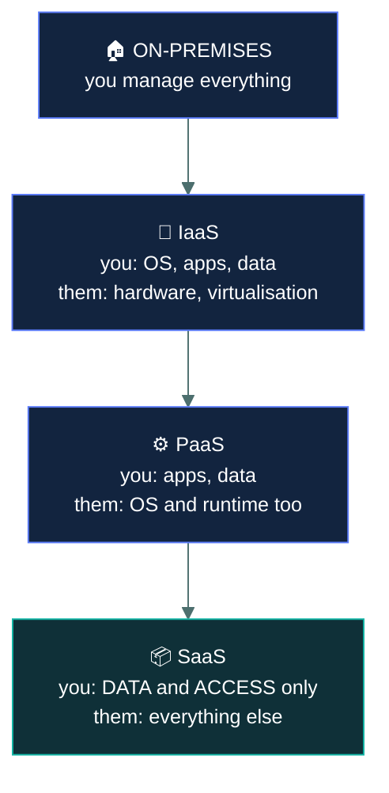
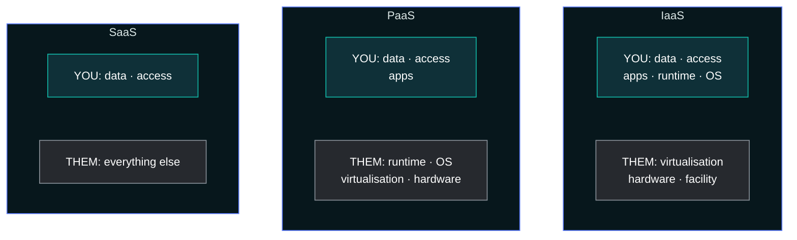
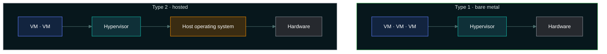
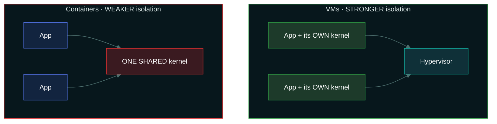
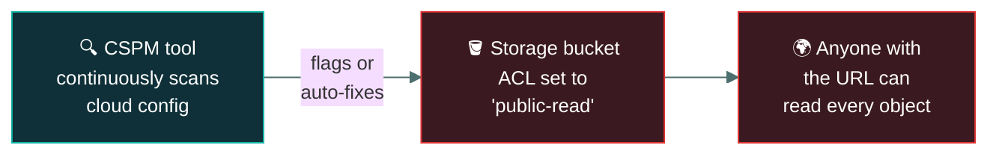

# ☁️ Cloud and virtualisation

### *Three service models, four deployment models, and who is responsible for what*

📌 *The shared responsibility model is the most examined idea here. The rule that resolves it: the more the provider manages, the less you do — but the data is always yours.*

---

## 🧸 The big idea

Instead of carving your own cave out of the mountainside, your tribe rents space inside a
neighbouring tribe's enormous shared mountain-warehouse. How much work you still do depends
entirely on what kind of deal you struck.

Rent a bare, empty chamber and you still bring your own shelves, organise your own storage, and
guard your own grain yourself — the mountain-owner just dug the room and keeps the roof from
caving in. Rent a chamber that already comes fitted with shelves and you only need to bring the
grain. Or pay for a fully-run pantry service, where the mountain-owner does everything —
building, shelving, even stocking — and all you decide is who's allowed to take grain out and how
much.

**One thing never changes across any of those three deals: it is still your grain, and only you
decide who eats it.** The mountain-owner never becomes responsible for that, no matter how much
of the building work they take on.

That's the whole idea. Cloud computing is renting someone else's computing instead of owning it.
What changes for security is **who is responsible for which layer**, and that depends entirely
on how much you rent.

Three service models, in order of how much the provider takes on:

| | You get | You still manage |
|---|---|---|
| **IaaS** | Infrastructure — virtual machines, storage, networking | The OS, patching, applications, **data** |
| **PaaS** | A platform — a runtime to deploy code onto | Your applications and **data** |
| **SaaS** | Finished software | Your **data**, your users, your access settings |

The pattern is a sliding scale. **Move from IaaS to SaaS and the provider takes over more, layer
by layer.**

> [!IMPORTANT]
> **It is still your grain.** In every model, you remain responsible for your data, your users,
> and who has access. The provider never becomes responsible for those. This is the single most
> reliable answer in the whole topic.

---

## 📖 Words you will keep seeing

| Word | What it means on this exam |
|---|---|
| **Cloud computing** | On-demand access to shared, configurable computing resources over a network. |
| **IaaS** — Infrastructure as a Service | Virtualised infrastructure: compute, storage, networking. |
| **PaaS** — Platform as a Service | A managed platform for deploying applications. |
| **SaaS** — Software as a Service | Complete applications delivered over the internet. |
| **Shared responsibility model** | The division of security duties between provider and customer. |
| **Public cloud** | Shared infrastructure, available to anyone. |
| **Private cloud** | Infrastructure dedicated to one organisation. |
| **Hybrid cloud** | A combination of public and private, with some integration. |
| **Community cloud** | Shared by organisations with common requirements. |
| **Multi-tenancy** | Multiple customers sharing the same physical infrastructure, logically separated. |
| **Virtualisation** | Running multiple virtual machines on one physical host. |
| **Hypervisor** | The software creating and managing virtual machines. |
| **VM escape** | An attack breaking out of a virtual machine to reach the host or other VMs. |
| **Vendor lock-in** | Difficulty moving away from a provider once committed. |
| **CASB** — Cloud Access Security Broker | A control point enforcing policy between users and cloud services. |

---

## 🔍 The shared responsibility model

| Layer | On-prem | IaaS | PaaS | SaaS |
|---|:--:|:--:|:--:|:--:|
| **Data and access** | You | **You** | **You** | **You** |
| Applications | You | You | You | Provider |
| Runtime / middleware | You | You | Provider | Provider |
| Operating system | You | **You** | Provider | Provider |
| Virtualisation | You | Provider | Provider | Provider |
| Physical hardware | You | Provider | Provider | Provider |
| Physical facility | You | Provider | Provider | Provider |

> 🎯 **Read down the "data and access" row.** It says *You* four times. That is the examined point.

### Where the responsibility line sits

The teal box shrinks as you move down — but **it never empties.** Data and access stay yours.

**The IaaS trap:** with IaaS you rent a virtual machine, and **patching its operating system is
yours**. Candidates assume the provider patches because the provider owns the hardware. They do
not.

> ⚠️ **Accountability never transfers.** Even in SaaS, where the provider runs everything, the
> organisation remains accountable to its regulators and customers for the data. Outsourcing the
> processing does not outsource the responsibility.

---

## 🧬 The five characteristics of cloud computing

Before service and deployment models, the exam expects you to recognise **what makes something
"cloud" at all** — a fixed list of five characteristics, commonly traced to NIST's definition of
cloud computing.

| Characteristic | Means |
|---|---|
| **On-demand self-service** | A customer provisions resources (a VM, storage) without needing a human at the provider to act on the request. |
| **Broad network access** | Resources are reachable over standard networks from varied devices — laptop, phone, anywhere. |
| **Resource pooling** | The provider's physical resources serve multiple customers (multi-tenancy), dynamically assigned by demand. |
| **Rapid elasticity** | Capacity can scale up or down quickly, often automatically, to match demand. |
| **Measured service** | Usage is metered, monitored, and reported — the basis for pay-as-you-go billing. |

> 🎯 **If a scenario describes automatic scaling with usage-based billing and no human
> provisioning step, it is describing cloud computing** — even if the question never uses the
> word "cloud". These five traits are the definition the exam is testing against.

---

## 🏗️ Deployment models

| Model | Means | Trade-off |
|---|---|---|
| **Public** | Shared infrastructure, open to any customer | Cheapest and most scalable; least control; multi-tenant |
| **Private** | Dedicated to one organisation, on-premises or hosted | Most control, meets strict regulatory needs; most expensive |
| **Hybrid** | Public and private combined, with integration between them | Flexible — sensitive data private, burst capacity public; complex to secure |
| **Community** | Shared by organisations with common requirements — several hospitals, several agencies | Shared cost among parties with aligned needs |

> 🎯 **"Community" is the one people forget.** If a question describes several organisations with
> the same regulatory requirements sharing an environment, that is community cloud.

---

## 🖥️ Virtualisation

A **hypervisor** runs multiple virtual machines on one physical host, each believing it has its
own hardware.

| | Runs on | Also called | Used for |
|---|---|---|---|
| **Type 1** | **Bare metal**, directly on hardware | Native | Data centres, production. More efficient and more secure |
| **Type 2** | On top of a host operating system | Hosted | Desktops, testing, labs |

> 🧠 **Type 1 is closer to the metal** — one fewer layer, smaller attack surface.

The extra amber layer in Type 2 is the host operating system — one more thing to attack, and one
more thing to patch.

**Virtualisation risks the exam expects:**

| Risk | Means |
|---|---|
| **VM escape** | Breaking out of a guest VM to reach the hypervisor or other VMs. The most serious virtualisation threat |
| **VM sprawl** | Unmanaged virtual machines proliferating, unpatched and unmonitored |
| **Hypervisor compromise** | Control of the hypervisor means control of **every** VM on it |
| **Snapshot exposure** | Snapshots contain memory and disk contents, including secrets, and are often poorly protected |

> ⚠️ **The hypervisor is a single point of failure.** Compromising it compromises every guest, which
> is why its patching and access control matter more than any individual VM's.

**Containers** share the host operating system kernel rather than virtualising hardware, making
them lighter but providing **weaker isolation** than a virtual machine.

Read it as a sentence: **each VM has its own kernel, so escaping means defeating the hypervisor —
while every container shares one kernel, so a single kernel flaw is reachable from all of them.**

---

## ☁️ Cloud security concerns

| Concern | Means |
|---|---|
| **Multi-tenancy** | Sharing physical infrastructure with other customers, separated logically |
| **Data residency** | Which country the data physically sits in — often a legal requirement |
| **Vendor lock-in** | Difficulty and cost of moving to another provider |
| **Loss of visibility** | Less insight into the underlying infrastructure than on-premises |
| **Misconfiguration** | **The leading cause of cloud breaches** — publicly exposed storage, over-permissive access |
| **Account compromise** | Cloud administrative credentials are extremely high value |

> 🎯 **Misconfiguration, not provider failure, is the expected answer to "what causes most cloud
> breaches".** Publicly readable storage buckets are the canonical example, and they are a customer
> error, squarely on the customer's side of the responsibility line.

**A CASB** sits between users and cloud services to enforce policy — visibility of what is being
used, data protection, threat detection, compliance.

---

## 🔬 A real misconfiguration, and the tool that catches it

**The canonical cloud breach starts with one wrong setting on a storage bucket.**

A bucket's access-control setting is often a single field — `public-read` instead of `private` —
and there's no physical barrier stopping it, unlike unplugging a cable on-premises: click the
wrong option once, and every object in that bucket is instantly reachable by anyone with the
URL, indexed by search engines within hours. **CSPM (Cloud Security Posture Management)** tools
exist specifically to catch this: they continuously query the cloud provider's own API asking
"what's actually configured right now," compare it against a ruleset of known-bad patterns
(public buckets, overly permissive IAM policies, unencrypted volumes), and either alert a human
or auto-remediate the setting back to safe — running the exact same kind of check, all day
every day, that would otherwise depend on someone remembering to look.

**A managed database service is the concrete case of the responsibility line sitting oddly.**
With Amazon RDS, AWS patches the underlying database engine itself — genuinely a provider
responsibility most people assume is PaaS-like — while the customer still owns the schema, the
actual data, and every access permission granted to it. It's neither a clean IaaS row nor a
clean SaaS row on the table above; real cloud security work means checking the specific
service's own documentation rather than assuming the generic three-tier model applies exactly.

---

## ⚖️ Told apart

| | Means | Not to be confused with |
|---|---|---|
| **IaaS** | You manage the **OS**, applications and data. | **PaaS**, where the provider manages the OS and runtime. OS patching is the dividing line. |
| **PaaS** | You manage applications and data. | **SaaS**, where you manage only data and access. |
| **SaaS** | You manage **data and access only**. | The idea that you manage nothing. Your data and your users remain yours. |
| **Public cloud** | Shared, open to anyone. | **Community cloud**, shared among organisations with **common requirements**. |
| **Private cloud** | Dedicated to one organisation. | **On-premises** — a private cloud may be hosted by a third party. |
| **Type 1 hypervisor** | Bare metal. More secure. | **Type 2**, running on a host OS. |
| **VM** | Virtualised **hardware**; each guest has its own OS. | **Container**, which shares the host kernel — lighter, **weaker isolation**. |
| **Responsibility** | Can shift to the provider by model. | **Accountability**, which never leaves the customer. |

---

## ⚠️ Where your instinct is wrong

> [!WARNING]
> **In the job:** "the cloud provider handles the infrastructure" is the working shorthand.
>
> **On the exam:** in **IaaS the operating system is yours** — patching, hardening, configuration.
> The provider's responsibility stops at the virtualisation layer.

> [!WARNING]
> **In the job:** using a reputable provider means data protection is largely handled.
>
> **On the exam:** **you are always responsible for your data and access controls**, in every
> model. And accountability to regulators never transfers, whatever the contract says.

> [!WARNING]
> **In the job:** containers are the default deployment unit and the isolation is good enough.
>
> **On the exam:** containers share the host kernel and therefore provide **weaker isolation than
> virtual machines**. If a question asks which provides stronger isolation, it is the VM.

---

## 🧠 How to remember it

🧠 **"I · P · S" — Infrastructure, Platform, Software.** Each step, the provider takes over more.

🧠 **You always own the data.** Whatever the model, the data row says *you*.

🧠 **IaaS = I patch the OS.** The I does double duty.

🧠 **Type 1 is on the metal, Type 2 is on an OS.** Lower number, lower layer.

🧠 **Misconfiguration, not the provider.** The leading cause of cloud breaches.

---

## ✅ Check you actually got it

Answer all five before expanding anything.

**Q1.** An organisation runs virtual machines in a public cloud under an IaaS model. Who is
responsible for applying operating system security patches?

- **A.** The cloud provider, since they own the underlying hardware
- **B.** The customer organisation
- **C.** Responsibility is shared equally between both parties
- **D.** The hypervisor applies them automatically

<b>Answer</b>

**B — the customer organisation.** Under IaaS the provider's responsibility ends at the
virtualisation layer. Everything from the guest operating system upwards belongs to the customer.

- **A** is the common misconception this question exists to correct. Owning the hardware does not
  extend the provider's duties into your virtual machine.
- **C** invents a split that the shared responsibility model does not describe. The boundary is
  defined, not shared, at each layer.
- **D** is not a hypervisor function. Hypervisors allocate resources to guests; they do not manage
  what runs inside them.

**Q2.** Under a SaaS model, what remains the customer's responsibility?

- **A.** Nothing — the provider is responsible for all aspects of security
- **B.** Operating system patching and network configuration
- **C.** Data, user accounts and access permissions
- **D.** Physical security of the data centre

<b>Answer</b>

**C — data, user accounts and access permissions.** Even where the provider runs the entire stack,
the customer decides who has access, what permissions they hold, and what data goes in.

- **A** is wrong in every service model, and it is the assumption behind a great many real cloud
  incidents.
- **B** is the provider's responsibility under SaaS. Those are customer duties under IaaS.
- **D** is the provider's responsibility in every cloud model.

**Q3.** Several hospitals with identical regulatory requirements share a cloud environment built
for their sector. Which deployment model is this?

- **A.** Public cloud
- **B.** Private cloud
- **C.** Community cloud
- **D.** Hybrid cloud

<b>Answer</b>

**C — community cloud.** It is shared between multiple organisations with **common requirements**,
which is precisely the definition.

- **A** would be open to any customer, with no shared requirement binding the tenants.
- **B** would be dedicated to a single organisation. Here several organisations share it.
- **D** would combine public and private infrastructure with integration between them, which the
  stem does not describe.

Community is the most-forgotten of the four models, which is exactly why it appears.

**Q4.** What is the MOST common cause of cloud security breaches?

- **A.** Cloud provider infrastructure failures
- **B.** Customer misconfiguration, such as publicly exposed storage
- **C.** Hypervisor vulnerabilities allowing VM escape
- **D.** Physical compromise of cloud data centres

<b>Answer</b>

**B — customer misconfiguration.** Publicly readable storage, over-permissive access policies and
exposed management interfaces account for the great majority of cloud incidents — and all sit on
the customer's side of the responsibility line.

- **A** is rare. Major providers invest enormously in infrastructure security, and it is not where
  incidents concentrate.
- **C** is a genuine and serious risk, and is uncommon in practice. VM escape vulnerabilities are
  significant news precisely because they are unusual.
- **D** is very rare — data centre physical security is among the strongest controls providers
  operate.

**Q5.** Which provides STRONGER isolation between workloads?

- **A.** Containers, because they start faster and use fewer resources
- **B.** Virtual machines, because each has its own operating system kernel
- **C.** They provide identical isolation
- **D.** Containers, because they share the host kernel

<b>Answer</b>

**B — virtual machines, because each has its own operating system kernel.** A VM virtualises
hardware and runs a separate kernel, so escaping to another workload requires defeating the
hypervisor.

- **A** states real advantages of containers — speed and efficiency — which are not isolation
  properties. The question asks about isolation specifically.
- **C** is wrong. The difference in isolation strength is the central security distinction between
  the two technologies.
- **D** correctly describes how containers work and draws the wrong conclusion from it. Sharing the
  host kernel is exactly what makes container isolation *weaker*: a kernel vulnerability is
  reachable from every container on the host.

---

## 🎓 The grown-up version

<b>Extra depth — open this on a second read, never needed for the pass</b>

**The shared responsibility model is a contract, not a law of nature.** Each provider publishes its
own version and they differ in detail, particularly around managed services that sit awkwardly
between PaaS and SaaS. A managed database, for example, has the provider patching the database
engine while the customer owns schema, access and data — which is neither the textbook PaaS nor the
textbook SaaS row. Real cloud security work involves reading the specific service's documentation
rather than applying the generic diagram, and disputes after an incident usually turn on exactly
this boundary.

**Why misconfiguration dominates.** Cloud platforms expose an enormous configuration surface
through APIs, defaults have historically favoured convenience, and a single permissive setting can
expose an entire dataset to the internet instantly. There is no physical constraint standing in
the way as there would be on-premises, where exposing a file share to the world requires several
deliberate steps. This is why cloud security posture management tooling exists and why
infrastructure as code matters so much — configuration in a repository is reviewable, testable and
diffable in a way that a console click is not.

**Multi-tenancy is better isolated than intuition suggests.** Sharing physical hardware with
strangers sounds alarming, and hypervisor isolation combined with provider investment makes
cross-tenant compromise genuinely rare. The more realistic concerns are side-channel attacks
against shared CPU resources — the Spectre family demonstrated cross-VM information leakage — and
resource contention from noisy neighbours. Both are real; neither is the everyday risk that
misconfiguration is.

**Data residency has become a board-level issue.** Where data physically sits determines whose
laws apply to it, and some jurisdictions assert access rights over data held by their companies
regardless of where it is stored. This is why sovereign cloud regions exist and why the location
of a storage bucket can be a compliance decision rather than a latency one.

**Vendor lock-in and the exit plan.** Moving between providers is hard in proportion to how much
provider-specific functionality you have adopted. Lift-and-shift VMs move relatively easily;
applications built on a provider's serverless, database and identity services do not. The security
relevance is concentration risk and continuity: if the contract ends badly or the provider has a
prolonged outage, what is the plan? Frequently there is not one, which is a risk acceptance nobody
has formally documented.

---

## 📝 Cram lines

Destined for [`EXAM-DAY.md`](../../EXAM-DAY.md):

- **IaaS → PaaS → SaaS: the provider takes over more at each step.**
- **IaaS** = you manage **OS + apps + data**. ***In IaaS, YOU patch the OS.***
- **PaaS** = you manage **apps + data**. **SaaS** = you manage **data + access only**.
- **In EVERY model you are responsible for your DATA, USERS and ACCESS.**
- **Responsibility can shift to the provider. ACCOUNTABILITY never does.**
- **Deployment models: public · private · hybrid · community.** Community = **shared by orgs with common requirements** (the forgotten one).
- **Type 1 hypervisor = bare metal** (more secure). **Type 2 = on a host OS.**
- **VM escape** = breaking out of a guest. **Hypervisor compromise = every VM on it.**
- **Containers share the host kernel → WEAKER isolation than VMs.**
- **Misconfiguration is the leading cause of cloud breaches** — not provider failure.
- **Five cloud characteristics:** on-demand self-service, broad network access, resource
  pooling, rapid elasticity, measured service.

---

<a href="../README.md">← back to 04 · Networking and Cloud Security Concepts</a> &nbsp;·&nbsp; <a href="../zero-trust/">next: Zero trust →</a>

