# ☁️ Cloud and Virtualisation

### *What makes something "cloud", who is responsible for what, and how virtual machines share a box*

📌 *Know the five cloud characteristics, the three service models and four deployment models. Master shared responsibility: the provider takes over more as you go IaaS → PaaS → SaaS, but your data and access are always yours.*

---

## 🧸 The big idea

Think about where you live:

- **Own a house**, and you fix everything, from the roof to the locks.
- **Rent an empty flat**, and the landlord keeps the building standing, but you bring the
  furniture and maintain it.
- **Rent a furnished flat**, and the furniture comes with it. You just bring your belongings.
- **Stay in a hotel**, and everything is done for you.

Cloud computing works the same way: you rent someone else's computers instead of owning them. The
more you rent, the more the provider looks after. That's the **shared responsibility model**.

But notice what never changes. **Your belongings, and who you give a key to, are always your
problem.** Even in a hotel, if you leave the door open or hand your key card to a stranger, the
hotel isn't to blame. In the cloud, **your data and who can access it are always yours**, whatever
you rent.

---

## 📖 Words you will keep seeing

| Word | What it means on this exam |
|---|---|
| **Cloud computing** | Renting shared computing resources on demand, over a network. |
| **IaaS** (Infrastructure as a Service) | Renting raw infrastructure: virtual machines, storage, networking. |
| **PaaS** (Platform as a Service) | Renting a ready-made platform to run your own code on. |
| **SaaS** (Software as a Service) | Renting finished software that you use over the internet. |
| **Shared responsibility model** | How security duties are split between the provider and the customer. |
| **Public cloud** | Shared infrastructure, open to any customer. |
| **Private cloud** | Infrastructure dedicated to one organisation. |
| **Hybrid cloud** | Public and private combined, and connected. |
| **Community cloud** | Shared by several organisations with the same requirements. |
| **Multi-tenancy** | Many customers sharing the same hardware, kept apart by software. |
| **Virtualisation** | Running several virtual machines on one physical computer. |
| **Hypervisor** | The software that creates and runs virtual machines. |
| **VM escape** | Breaking out of a virtual machine to reach the hypervisor or other VMs. |
| **Container** | A lightweight package for an app that shares the host's operating system kernel. |
| **Vendor lock-in** | When moving away from a provider becomes hard and expensive. |
| **CASB** (Cloud Access Security Broker) | A checkpoint between users and cloud services that enforces policy. |

---

## 🔍 The explanation

### What makes something "cloud"

| Characteristic | Means |
|---|---|
| **On-demand self-service** | You create resources (a server, some storage) yourself. Nobody at the provider has to act on your request. |
| **Broad network access** | You can reach it over ordinary networks, from a laptop, a phone, anywhere. |
| **Resource pooling** | The provider's hardware serves many customers at once, handed out as demand changes. |
| **Rapid elasticity** | Capacity grows or shrinks quickly, often automatically. |
| **Measured service** | Usage is metered and reported. That's what makes pay-as-you-go billing possible. |

> 🎯 **A scenario with automatic scaling, usage-based billing and no human setup step is describing
> cloud computing**, even if the question never says "cloud". These five traits are the definition
> the exam tests against.

### The three service models, and who does what

The three models are steps on one scale. **From IaaS to PaaS to SaaS, the provider takes over more,
layer by layer.**

The "you" box shrinks from left to right, but **it never empties.** Data and access stay yours.

| Layer | On-premises | IaaS | PaaS | SaaS |
|---|:--:|:--:|:--:|:--:|
| **Data and access** | You | **You** | **You** | **You** |
| Applications | You | You | You | Provider |
| Runtime and middleware | You | You | Provider | Provider |
| Operating system | You | **You** | Provider | Provider |
| Virtualisation | You | Provider | Provider | Provider |
| Physical hardware | You | Provider | Provider | Provider |
| The building | You | Provider | Provider | Provider |

> 🎯 **Read along the "data and access" row.** It says *You* in every column. That is the point
> being examined.

> [!IMPORTANT]
> **The IaaS trap:** with IaaS you rent a virtual machine, and **patching its operating system is
> your job**. People assume the provider patches it because the provider owns the hardware. The
> provider doesn't.

> ⚠️ **Accountability never transfers.** Even in SaaS, where the provider runs everything, your
> organisation is still answerable to its regulators and customers for the data. You can outsource
> the work, but not the accountability.

### The four deployment models

| Model | Means | Trade-off |
|---|---|---|
| **Public** | Shared infrastructure, open to any customer | Cheapest and most scalable; least control |
| **Private** | Dedicated to one organisation, on its own site or hosted by someone else | Most control, suits strict regulation; most expensive |
| **Hybrid** | Public and private combined, and connected | Flexible (sensitive data private, extra capacity public), but complex to secure |
| **Community** | Shared by organisations with the same requirements, such as several hospitals | The cost is shared among organisations with the same needs |

> 🎯 **"Community" is the one people forget.** If several organisations with the same regulatory
> requirements share an environment, that's a community cloud.

### 🖥️ Virtualisation

A **hypervisor** runs several virtual machines on one physical computer, and each VM behaves as if
it had the hardware to itself.

| | Runs on | Also called | Used for |
|---|---|---|---|
| **Type 1** | **Bare metal**, directly on the hardware | Native | Data centres and production. More efficient and more secure |
| **Type 2** | On top of a normal operating system | Hosted | Desktops, testing, labs |

> 🧠 **Type 1 sits on the metal.** One layer fewer means less to attack and less to patch.

**Virtualisation risks the exam expects you to know:**

| Risk | Means |
|---|---|
| **VM escape** | Breaking out of a VM to reach the hypervisor or other VMs. The most serious virtualisation threat |
| **VM sprawl** | Forgotten virtual machines piling up, unpatched and unwatched |
| **Hypervisor compromise** | Whoever controls the hypervisor controls **every** VM on it |
| **Snapshot exposure** | Snapshots hold memory and disk contents, secrets included, and are often poorly protected |

> ⚠️ **The hypervisor is a single point of failure.** Compromise it and every VM on it is
> compromised. That's why its patching and access control matter more than any single VM's.

**Containers** are lighter than VMs because they share the host's operating system kernel instead
of each getting their own. The price is **weaker isolation**:

To escape a VM, an attacker has to beat the hypervisor. Every container shares one kernel, so a
single flaw in that kernel can be reached from all of them.

### ☁️ Cloud security concerns

| Concern | Means |
|---|---|
| **Multi-tenancy** | Sharing hardware with other customers, kept apart only by software |
| **Data residency** | Which country the data physically sits in. Often a legal requirement |
| **Vendor lock-in** | How hard and expensive it is to move to another provider |
| **Loss of visibility** | You see less of the underlying infrastructure than you would on your own site |
| **Misconfiguration** | **The leading cause of cloud breaches**: storage left public, access set too wide |
| **Account compromise** | Cloud admin accounts are extremely valuable targets |

> 🎯 **Misconfiguration, not provider failure, is the answer to "what causes most cloud
> breaches".** Storage that anyone on the internet can read is the classic example. It's a customer
> mistake, squarely on the customer's side of the responsibility line.

A **CASB** sits between users and cloud services to enforce policy. It shows which cloud services
are in use, protects data, spots threats and supports compliance.

---

## ⚖️ Told apart

| | Means | Not to be confused with |
|---|---|---|
| **IaaS** | You manage the **OS**, applications and data. | **PaaS** — the provider manages the OS and runtime. OS patching is the dividing line. |
| **PaaS** | You manage applications and data. | **SaaS** — you manage only data and access. |
| **SaaS** | You manage **data and access only**. | Managing nothing. Your data and your users are still yours. |
| **Public cloud** | Shared, open to anyone. | **Community cloud** — shared by organisations with the **same requirements**. |
| **Private cloud** | Dedicated to one organisation. | **On-premises** — a private cloud can be hosted by someone else. |
| **Type 1 hypervisor** | Bare metal. More secure. | **Type 2** — runs on a host operating system. |
| **VM** | Virtual **hardware**; each VM has its own operating system. | **Container** — shares the host kernel. Lighter, **weaker isolation**. |
| **Responsibility** | Can move to the provider, depending on the model. | **Accountability** — never leaves the customer. |

---

## ⚠️ Where your instinct is wrong

> [!WARNING]
> **In the job:** "the cloud provider handles the infrastructure" is the everyday shorthand.
>
> **On the exam:** in **IaaS the operating system is yours**: patching, hardening, configuration.
> The provider's job stops at the virtualisation layer.

> [!WARNING]
> **In the job:** using a big-name provider feels like data protection is taken care of.
>
> **On the exam:** **you are always responsible for your data and access controls**, in every
> model. Accountability to regulators never transfers, whatever the contract says.

> [!WARNING]
> **In the job:** containers are the normal way to deploy, and their isolation feels good enough.
>
> **On the exam:** containers share the host kernel, so they give **weaker isolation than virtual
> machines**. If a question asks which isolates better, it's the VM.

---

## 🧠 How to remember it

**House → empty flat → furnished flat → hotel = on-premises → IaaS → PaaS → SaaS.** Your belongings
and your keys are yours in all four.

**I · P · S: Infrastructure, Platform, Software.** At each step the provider takes over more.

**IaaS = I patch the OS.**

**The five traits: self-serve, anywhere, shared, stretchy, metered.**

**Type 1 is on the metal, Type 2 is on an OS.** Lower number, lower layer.

**Misconfiguration, not the provider**, causes most cloud breaches.

---

## ✅ Check you actually got it

Answer all five before expanding anything.

**Q1.** An organisation runs virtual machines in a public cloud under an IaaS model. Who is
responsible for applying operating system security patches?

- **A.** The cloud provider, since they own the underlying hardware
- **B.** The customer organisation
- **C.** Responsibility is shared equally between both parties
- **D.** The hypervisor applies them automatically

<b>Answer</b>

**B — the customer organisation.** Under IaaS, the provider's job ends at the virtualisation layer.
Everything from the VM's operating system upwards belongs to the customer.

- **A** is the misconception this question exists to correct. Owning the hardware doesn't stretch
  the provider's duties into your virtual machine.
- **C** invents a split the model doesn't have. Each layer has a defined owner; it isn't shared.
- **D** isn't something a hypervisor does. It hands out resources to VMs; it doesn't manage what
  runs inside them.

**Q2.** Under a SaaS model, what remains the customer's responsibility?

- **A.** Nothing — the provider is responsible for all aspects of security
- **B.** Operating system patching and network configuration
- **C.** Data, user accounts and access permissions
- **D.** Physical security of the data centre

<b>Answer</b>

**C — data, user accounts and access permissions.** Even when the provider runs the whole stack, the
customer decides who gets access, what they can do, and what data goes in.

- **A** is wrong in every model, and it's the assumption behind a great many real cloud incidents.
- **B** belongs to the provider under SaaS. Those are customer jobs under IaaS.
- **D** belongs to the provider in every cloud model.

**Q3.** Several hospitals with identical regulatory requirements share a cloud environment built
for their sector. Which deployment model is this?

- **A.** Public cloud
- **B.** Private cloud
- **C.** Community cloud
- **D.** Hybrid cloud

<b>Answer</b>

**C — community cloud.** It's shared by several organisations with **the same requirements**, which
is exactly the definition.

- **A** would be open to any customer, with no shared requirement tying the users together.
- **B** would be dedicated to one organisation. Here, several share it.
- **D** would combine public and private infrastructure and connect them, which the question
  doesn't describe.

Community is the most forgotten of the four, which is exactly why it gets asked.

**Q4.** What is the MOST common cause of cloud security breaches?

- **A.** Cloud provider infrastructure failures
- **B.** Customer misconfiguration, such as publicly exposed storage
- **C.** Hypervisor vulnerabilities allowing VM escape
- **D.** Physical compromise of cloud data centres

<b>Answer</b>

**B — customer misconfiguration.** Storage anyone can read, access policies set too wide and exposed
admin interfaces cause most cloud incidents. All of them sit on the customer's side of the
responsibility line.

- **A** is rare. Big providers spend enormous sums on their infrastructure, and incidents don't
  cluster there.
- **C** is a real and serious risk, but uncommon. VM escape flaws make headlines precisely because
  they're unusual.
- **D** is very rare. Data-centre physical security is among the strongest controls providers run.

**Q5.** Which provides STRONGER isolation between workloads?

- **A.** Containers, because they start faster and use fewer resources
- **B.** Virtual machines, because each has its own operating system kernel
- **C.** They provide identical isolation
- **D.** Containers, because they share the host kernel

<b>Answer</b>

**B — virtual machines, because each has its own kernel.** A VM gets virtual hardware and its own
kernel, so reaching another workload means beating the hypervisor.

- **A** lists real advantages of containers, speed and efficiency, but they aren't isolation. The
  question asks about isolation.
- **C** is wrong. The difference in isolation is the key security difference between the two.
- **D** describes containers correctly but draws the wrong conclusion. Sharing the host kernel is
  exactly what makes containers *weaker*: one kernel flaw can be reached from every container.

---

## 🎓 The grown-up version

<b>Extra depth — open this on a second read, never needed for the pass</b>

**The shared responsibility model is a contract, not a law of nature.** Each provider publishes its
own version, and they differ in the details, especially for managed services that sit between PaaS
and SaaS. With a managed database such as Amazon RDS, the provider patches the database engine,
while the customer owns the design, the data and every permission. That's neither the textbook PaaS
row nor the SaaS row. Real cloud security means reading the specific service's documentation rather
than trusting the generic table, and arguments after an incident usually turn on exactly this line.

**Why misconfiguration dominates.** Cloud platforms expose a huge number of settings, defaults have
often favoured convenience, and one wrong setting can expose a whole dataset to the internet
instantly. On your own site, exposing a file share to the world takes several deliberate steps; in
the cloud it can be one click. **Cloud Security Posture Management (CSPM)** tools exist to catch
this. They constantly ask the provider's API what is actually configured, compare it with known-bad
patterns (public storage, over-wide permissions, unencrypted disks), and alert someone or fix it
automatically. It's also why **infrastructure as code** matters: settings kept in a repository can
be reviewed and tested in a way a console click can't.

**Multi-tenancy is safer than it sounds.** Sharing hardware with strangers sounds alarming, but
hypervisor isolation plus the providers' investment make cross-customer compromise genuinely rare.
The more realistic worries are side-channel attacks on shared processors (the Spectre family showed
data leaking between VMs) and "noisy neighbours" hogging resources. Both are real; neither is the
everyday risk that misconfiguration is.

**Data residency is now a board-level issue.** Where data physically sits decides whose laws apply
to it, and some countries claim access to data held by their companies wherever it's stored. That's
why "sovereign cloud" regions exist, and why choosing a storage location can be a compliance
decision rather than a speed one.

**Lock-in and the exit plan.** Moving providers gets harder the more provider-specific features you
use. Plain VMs move fairly easily; applications built on a provider's own serverless, database and
identity services don't. The security angle is concentration and continuity: if the contract ends
badly or the provider has a long outage, what's the plan? Often there isn't one, which is a risk
acceptance nobody ever wrote down.

---

## 📝 Cram lines

Destined for [`EXAM-DAY.md`](../../EXAM-DAY.md):

- **Five cloud characteristics:** on-demand self-service · broad network access · resource pooling · rapid elasticity · measured service.
- **IaaS → PaaS → SaaS: the provider takes over more at each step.**
- **IaaS** = you manage **OS + apps + data** (*in IaaS, YOU patch the OS*). **PaaS** = **apps + data**. **SaaS** = **data + access only**.
- **In EVERY model, your DATA, USERS and ACCESS are yours.** Responsibility can shift; **ACCOUNTABILITY never does.**
- **Deployment: public · private · hybrid · community.** Community = shared by orgs with **the same requirements** (the forgotten one).
- **Type 1 hypervisor = bare metal** (more secure). **Type 2 = on a host OS.**
- **VM escape** = breaking out of a VM. **Hypervisor compromise = every VM on it.**
- **Containers share the host kernel → WEAKER isolation than VMs.**
- **Misconfiguration is the leading cause of cloud breaches**, not provider failure.

---

<a href="../README.md">← back to 04 · Networking and Cloud Security Concepts</a> &nbsp;·&nbsp; <a href="../zero-trust/">next: Zero trust →</a>

