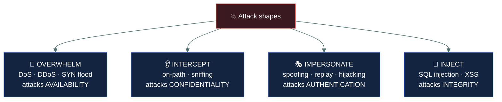
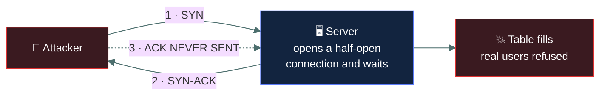
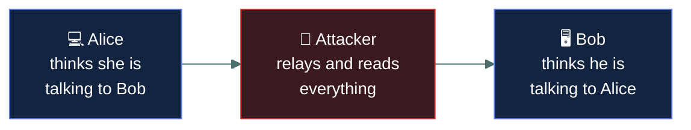
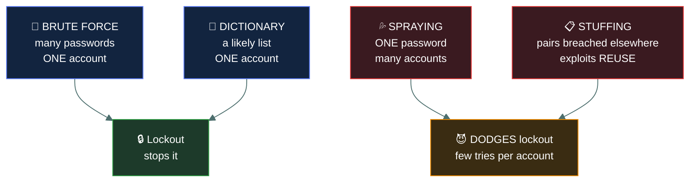

# 💥 Common attacks

### *Identifying an attack from its description — and telling the near-identical ones apart*

📌 *The attack catalogue. Most questions describe a scenario and ask you to name it, so the distinguishing detail of each one is what matters.*

---

## 🧸 The big idea

Attacks against networks fall into a small number of shapes, and each has **one detail that
identifies it**. Learn the detail rather than the description, because the exam will paraphrase.

Four broad shapes cover most of what you will see:

| Shape | The attacker is… |
|---|---|
| **Overwhelm** | Sending more than the target can handle — DoS, DDoS |
| **Intercept** | Getting into the middle of a conversation — on-path, eavesdropping |
| **Impersonate** | Pretending to be something else — spoofing, replay |
| **Inject** | Putting hostile input where data was expected — SQL injection, XSS |

When a scenario appears, ask which shape it is first. That eliminates most options immediately.

---

## 📖 Words you will keep seeing

| Word | What it means on this exam |
|---|---|
| **DoS** — Denial of Service | Making a resource unavailable to legitimate users. |
| **DDoS** — Distributed DoS | The same, from **many** sources at once, usually a botnet. |
| **On-path attack** | The attacker positions between two parties and relays their traffic. Formerly "man-in-the-middle". |
| **Spoofing** | Falsifying an identifier — an IP address, a MAC address, an email sender. |
| **Replay attack** | Capturing valid data and re-sending it later to repeat the effect. |
| **Session hijacking** | Taking over an authenticated session, usually by stealing its token. |
| **Eavesdropping / sniffing** | Passively capturing traffic in transit. |
| **SQL injection** | Inserting database commands into an input field. |
| **XSS** — Cross-Site Scripting | Injecting script into a web page that other users then run. |
| **Privilege escalation** | Gaining rights beyond those granted. |
| **Brute force** | Trying every possible credential until one works. |
| **Dictionary attack** | Trying likely passwords from a prepared list. |
| **Side-channel attack** | Deducing secrets from physical characteristics — timing, power draw, emissions. |
| **Amplification** | Using a service that returns a large reply to a small request, to magnify a flood. |

---

## 🔍 The four shapes

---

## 🌊 Denial of service

**DoS** makes a resource unavailable. **DDoS** does it from many compromised machines at once.

> ⚠️ **The distinguishing word is "distributed".** One source is DoS; many sources are DDoS. If a
> stem mentions a botnet or thousands of IP addresses, it is DDoS.

| Variant | How it works |
|---|---|
| **SYN flood** | Sends many SYN packets and never completes the handshake, filling the server's half-open connection table |
| **Amplification / reflection** | Sends small spoofed requests to services that reply with far larger responses, aimed at the victim |
| **Volumetric** | Simply saturates the available bandwidth |

The SYN flood in one picture: **start thousands of handshakes, finish none, and the server runs
out of room for the people who would have finished theirs.**

**DoS attacks target availability** — not data. Nothing is stolen or changed.

**Defences:** rate limiting, traffic filtering, DDoS protection services, over-provisioned
capacity, blackholing.

---

## 👂 Interception

### On-path attack

The attacker sits between two parties, relaying and possibly altering traffic while both sides
believe they are talking directly to each other.

**Defence:** strong encryption in transit, and certificate validation — which is what makes the
attacker unable to impersonate either endpoint convincingly.

### Eavesdropping / sniffing

**Passive** capture of traffic. The attacker changes nothing and is therefore very hard to
detect.

> 🎯 **Passive means no modification.** Sniffing is passive; an on-path attack is active because
> the attacker is relaying and can alter.

**Defence:** encrypt data in transit. If traffic is encrypted, capturing it achieves little.

---

## 🎭 Impersonation

| Attack | The identifying detail |
|---|---|
| **IP spoofing** | Forging the **source IP address** of packets |
| **MAC spoofing** | Forging a **hardware address**, often to bypass MAC filtering |
| **ARP spoofing / poisoning** | Sending false ARP replies so traffic for the gateway comes to the attacker instead — how an on-path attack is often achieved on a LAN |
| **DNS spoofing / cache poisoning** | Corrupting DNS so a name resolves to an attacker's address |
| **Email spoofing** | Forging the sender address of a message |
| **Replay attack** | Capturing valid traffic and **re-sending it later** |
| **Session hijacking** | Stealing a session token to take over an **already authenticated** session |

> [!IMPORTANT]
> **Replay attacks are defeated by making each transaction unique** — timestamps, sequence
> numbers, nonces, or one-time tokens. Encryption alone does not stop a replay, because the
> attacker re-sends the encrypted data without ever needing to read it. This is a favourite exam
> point.

> ⚠️ **Session hijacking versus replay.** Hijacking takes over a *live* session using a stolen
> token. Replay re-sends *captured data* to repeat an action. Both reuse something valid; one
> takes over a conversation, the other repeats a message.

---

## 💉 Injection

| Attack | How it works | Defence |
|---|---|---|
| **SQL injection** | Database commands entered into an input field, executed by the back end | **Input validation** and parameterised queries |
| **Cross-site scripting (XSS)** | Script injected into a page and executed in **other users'** browsers | Input validation and output encoding |
| **Command injection** | Operating system commands passed through an application input | Input validation |
| **Buffer overflow** | More data written than the allocated memory holds, overwriting adjacent memory | Bounds checking, safe languages, ASLR/DEP |

> 🎯 **Input validation is the defence for the whole injection family.** If a question describes
> any injection attack and offers input validation, that is very likely the answer.

> ⚠️ **SQL injection versus XSS.** SQLi attacks the **database** behind the application. XSS
> attacks **other users** of the application, by running script in their browsers. Same technique,
> different victim.

---

## 🔑 Password attacks

| Attack | Means |
|---|---|
| **Brute force** | Tries **every** possible combination. Guaranteed eventually; slow |
| **Dictionary attack** | Tries a **prepared list** of likely passwords. Much faster, relies on poor choices |
| **Credential stuffing** | Uses username/password pairs **breached elsewhere**, exploiting reuse |
| **Password spraying** | Tries **one common password across many accounts**, to avoid lockout thresholds |
| **Rainbow table** | Uses precomputed hash lookups to reverse hashes. **Defeated by salting** |

The top two hammer one account and lockout stops them. The bottom two spread across many
accounts, which is **exactly why they exist** — few enough attempts each that no threshold trips.

> 🎯 **Account lockout defeats brute force** on a single account. **Password spraying exists
> specifically to evade lockout**, by trying one password against many accounts rather than many
> passwords against one.

> ⚠️ **Rainbow tables are defeated by salting** — adding unique random data to each password before
> hashing, so precomputed tables do not match. That is a reliable exam pairing.

---

## ⚡ Side-channel attacks

Deducing secret information from the **physical behaviour** of a system rather than by breaking
its cryptography: how long an operation takes, how much power it draws, the sounds or
electromagnetic emissions it produces.

> 🎯 If a question describes deducing a key from **timing or power consumption**, the answer is
> side-channel.

---

## ⚖️ Told apart

| | Means | Not to be confused with |
|---|---|---|
| **DoS** | One source. | **DDoS**, many sources. "Distributed" is the whole distinction. |
| **On-path attack** | **Active** — relays and can alter traffic. | **Eavesdropping**, which is **passive** and modifies nothing. |
| **Replay** | Re-sends captured data later. | **Session hijacking**, which takes over a live authenticated session. |
| **SQL injection** | Attacks the **database**. | **XSS**, which attacks **other users** via their browsers. |
| **Brute force** | Every combination. | **Dictionary attack**, a list of likely passwords. |
| **Password spraying** | One password, many accounts — evades lockout. | **Credential stuffing**, which uses pairs breached elsewhere. |
| **Privilege escalation** | An attacker gains rights never granted. | **Privilege creep**, rights legitimately accumulated over role changes. |
| **ARP spoofing** | Layer 2, within a LAN, IP-to-MAC lies. | **DNS spoofing**, which corrupts name-to-IP resolution. |

---

## ⚠️ Where your instinct is wrong

> [!WARNING]
> **In the job:** encryption is the general answer to traffic-based attacks.
>
> **On the exam:** **encryption does not stop a replay attack.** The attacker re-sends the
> encrypted data without reading it. The answer is timestamps, sequence numbers or nonces.

> [!WARNING]
> **In the job:** you would call almost any credential attack "brute force".
>
> **On the exam:** the four are distinct and the distinguishing detail is in the stem. *Every
> combination* = brute force. *A list* = dictionary. *One password across many accounts* =
> spraying. *Pairs from another breach* = credential stuffing.

> [!WARNING]
> **In the job:** "man-in-the-middle" is the term everyone uses.
>
> **On the exam:** expect **on-path attack**, the current terminology. Recognise both; if only
> "man-in-the-middle" appears, it means the same thing.

---

## 🧠 How to remember it

🧠 **Four shapes: Overwhelm · Intercept · Impersonate · Inject.**
And each maps to a CIA property — availability, confidentiality, authentication, integrity.

🧠 **The extra D in DDoS is Distributed** — many sources.

🧠 **Sniffing is silent** (passive). **On-path relays** (active).

🧠 **Salt defeats rainbow tables. Nonces defeat replay. Input validation defeats injection.**

🧠 **Spraying spreads wide** — one password, many accounts, to dodge lockout.

---

## ✅ Check you actually got it

Answer all five before expanding anything.

**Q1.** An attacker captures an encrypted authentication message and re-transmits it later to
gain access. What kind of attack is this, and what defends against it?

- **A.** Eavesdropping; defended by stronger encryption
- **B.** Replay attack; defended by timestamps, sequence numbers or nonces
- **C.** On-path attack; defended by certificate validation
- **D.** Brute force; defended by account lockout

<b>Answer</b>

**B — a replay attack, defended by timestamps, sequence numbers or nonces.** The attacker never
needs to decrypt anything; they simply repeat a valid message, so uniqueness per transaction is
what breaks it.

- **A** describes passive capture only. Here the attacker actively re-sends, and stronger
  encryption changes nothing — this is the key misconception the question targets.
- **C** would involve relaying traffic between two parties in real time. The stem describes
  capture and later re-transmission.
- **D** would involve guessing credentials. The attacker already has a valid message and guesses
  nothing.

**Q2.** Thousands of compromised hosts simultaneously flood a web server with traffic, making it
unavailable. What is this?

- **A.** DoS attack
- **B.** DDoS attack
- **C.** SYN flood
- **D.** Amplification attack

<b>Answer</b>

**B — a DDoS attack.** Many compromised sources acting together is the definition of
*distributed*.

- **A** would come from a single source. The stem specifies thousands of hosts.
- **C** names a specific technique — exhausting the half-open connection table — which the stem
  does not describe. It could be the method, but DDoS is what the scenario names.
- **D** requires a third-party service returning oversized replies to spoofed requests, which is
  not described here.

**Q3.** An attacker enters `' OR '1'='1` into a website's login field and gains access. What
attack is this, and what is the PRIMARY defence?

- **A.** Cross-site scripting; defended by output encoding
- **B.** SQL injection; defended by input validation and parameterised queries
- **C.** Buffer overflow; defended by bounds checking
- **D.** Command injection; defended by disabling shell access

<b>Answer</b>

**B — SQL injection, defended by input validation and parameterised queries.** The input is
crafted database syntax intended to alter the query the application builds.

- **A** would inject script executed in **other users'** browsers. Here the target is the database
  behind the application.
- **C** would involve writing more data than a memory buffer holds. The payload is a logic
  manipulation, not an overflow.
- **D** would pass operating system commands rather than SQL syntax. The `OR '1'='1` construction
  is unmistakably SQL.

**Q4.** An attacker tries the password `Summer2026!` against every account in an organisation.
What is this called, and why is it used?

- **A.** Brute force, because it tries many combinations
- **B.** Dictionary attack, because it uses a common password
- **C.** Password spraying, because it avoids triggering account lockout
- **D.** Credential stuffing, because it reuses breached credentials

<b>Answer</b>

**C — password spraying, used to avoid triggering account lockout.** Trying one password against
many accounts keeps the failed-attempt count low on each individual account, which is the entire
reason the technique exists.

- **A** would try many passwords against an account. Here there is a single password.
- **B** would work through a list of likely passwords against a target. One password across many
  accounts is the inversion of that, and that inversion has its own name.
- **D** would use username and password *pairs* obtained from a breach elsewhere. This password is
  guessed, not breached.

**Q5.** Which attack is PASSIVE, making it particularly difficult to detect?

- **A.** On-path attack
- **B.** Network eavesdropping
- **C.** SYN flood
- **D.** ARP poisoning

<b>Answer</b>

**B — network eavesdropping.** The attacker only captures traffic, sending nothing and modifying
nothing, so there is no anomaly for a defender to observe.

- **A** is active: the attacker relays traffic between the parties and can alter it.
- **C** is highly active and immediately visible — the service stops working.
- **D** is active, since the attacker must send falsified ARP replies onto the network, which
  monitoring can detect.

---

## 🎓 The grown-up version

<b>Extra depth — open this on a second read, never needed for the pass</b>

**Why the terminology changed.** "Man-in-the-middle" has been steadily replaced by "on-path
attack" and "adversary-in-the-middle" in standards and vendor documentation, for gender-neutral
naming. Similar renaming has affected other terms across the field. Exams follow standards
bodies, so expect the newer terms, but recognise the old ones — a great deal of existing material
still uses them.

**Amplification arithmetic.** The reason reflection attacks are so effective is the amplification
factor: a small spoofed query to a misconfigured DNS or NTP server can generate a reply tens or
hundreds of times larger, all directed at the spoofed source. An attacker with modest bandwidth
can therefore generate an enormous flood. The defence is largely other people's problem — closing
open resolvers, and network operators implementing source address validation so spoofed packets
never leave their networks in the first place.

**SQL injection should be a solved problem.** Parameterised queries — where the query structure is
fixed and user input can only ever be data, never syntax — eliminate the class entirely. It
persists because of string-concatenated queries in legacy code, dynamic query building for
flexible search, and ORM escape hatches used carelessly. Input validation helps, but it is a
filter that can be evaded; parameterisation is structural, and that is why it is the stronger
answer where both appear.

**Salting in one paragraph.** Hashing a password produces a fixed output for a given input, so
identical passwords produce identical hashes and a precomputed table maps hashes back to
passwords. A salt is unique random data added to each password before hashing, so the same
password produces a different hash for every user, and no precomputed table can cover the space.
Modern practice goes further with deliberately slow, memory-hard algorithms — bcrypt, scrypt,
Argon2 — so that even a targeted attack computes hashes too slowly to be practical.

**Side channels are more practical than they sound.** Timing attacks against naive string
comparison in authentication code are genuinely exploitable over a network, which is why
constant-time comparison functions exist. Power analysis has extracted keys from smart cards.
Spectre and Meltdown were side-channel attacks against CPU speculative execution that affected
essentially every modern processor. The category sounds academic and is not.

---

## 📝 Cram lines

Destined for [`EXAM-DAY.md`](../../EXAM-DAY.md):

- **Four shapes: Overwhelm (availability) · Intercept (confidentiality) · Impersonate (authentication) · Inject (integrity).**
- **DDoS = many sources.** The extra D is Distributed.
- **SYN flood** = incomplete handshakes fill the half-open connection table.
- **Eavesdropping = PASSIVE** (hard to detect). **On-path = ACTIVE** (relays, can alter). Also called man-in-the-middle.
- **Encryption does NOT stop replay.** Use **timestamps, sequence numbers, nonces**.
- **Session hijacking** = takes over a live session with a stolen token. **Replay** = re-sends captured data.
- **SQLi attacks the DATABASE. XSS attacks OTHER USERS' browsers.**
- **Input validation defeats the whole injection family.**
- **Brute force** = every combination · **dictionary** = a list · **spraying** = one password across many accounts (dodges lockout) · **credential stuffing** = pairs breached elsewhere.
- **Salting defeats rainbow tables.**
- **Side-channel** = deducing secrets from timing, power or emissions.
- **Privilege escalation = attack. Privilege creep = admin failure.**

---

<a href="../README.md">← back to 04 · Networking and Cloud Security Concepts</a> &nbsp;·&nbsp; <a href="../network-defence-devices/">next: Network defence devices →</a>

