# 💥 Common Attacks

### *Name the attack from its one tell-tale detail*

📌 *Sort any attack into one of four shapes, then name it from its tell-tale detail. Know the one defence that beats each: nonces beat replay, input validation beats injection, salting beats rainbow tables.*

---

## 🧸 The big idea

Picture a restaurant. There are really only four ways to cause trouble there:

- **Fill every table** with people who never order, so real diners are turned away. That's
  **overwhelming** it.
- **Pose as a waiter** carrying orders between the table and the kitchen, reading every order and
  changing some. That's **intercepting**.
- **Walk in wearing a staff uniform**, so nobody asks who you are. That's **impersonating**.
- **Add a line to an order slip**, such as "…and empty the till". A kitchen that does whatever the
  slip says will do it. That's **injecting**.

Network attacks come in the same four shapes. Each named attack has **one tell-tale detail**. The
exam words its scenarios differently every time, so learn the detail rather than the wording.
When a scenario appears, **name the shape first**. That alone rules out most of the options.

---

## 📖 Words you will keep seeing

| Word | What it means on this exam |
|---|---|
| **DoS** (Denial of Service) | Making a service unavailable to the people who should be able to use it. |
| **DDoS** (Distributed DoS) | The same attack from **many** sources at once, usually a botnet. |
| **On-path attack** | The attacker sits **between** two parties and relays their traffic. The older name is "man-in-the-middle". |
| **Eavesdropping / sniffing** | **Passively** copying traffic as it travels. |
| **Spoofing** | Faking an identifier, such as an IP address, a MAC address or an email sender. |
| **Replay attack** | Capturing a valid message and **sending it again later** to repeat its effect. |
| **Session hijacking** | Taking over a session that is **already logged in**, usually by stealing its token. |
| **SQL injection** | Typing database commands into an input field. |
| **XSS** (Cross-Site Scripting) | Planting a script in a web page that **other users'** browsers then run. |
| **Brute force** | Trying **every** possible password. |
| **Dictionary attack** | Trying likely passwords from a **prepared list**. |
| **Password spraying** | Trying **one** common password against **many** accounts. |
| **Credential stuffing** | Trying username and password pairs **leaked from another breach**. |
| **Rainbow table** | A precomputed lookup that turns password hashes back into passwords. |
| **Side-channel attack** | Working out a secret from physical clues, such as timing, power use or emissions. |

---

## 🔍 The explanation

### Step one: name the shape

Every attack on this page sits in one of those four boxes. Find the box, then find the detail.

### 🌊 Overwhelm: denial of service

A **DoS** attack makes a service unavailable. A **DDoS** attack does the same thing from many
machines at once, usually thousands of infected computers in a botnet.

> ⚠️ **"Distributed" is the whole difference.** One source means DoS; many sources mean DDoS. If the
> question mentions a botnet or thousands of IP addresses, the answer is DDoS.

| Variant | How it works |
|---|---|
| **SYN flood** | Starts thousands of connections and never finishes any, until the server runs out of room |
| **Amplification / reflection** | Sends small requests with the victim's address forged as the sender, to services that send back much bigger replies. The replies all land on the victim |
| **Volumetric** | Simply fills all the available bandwidth |

The **SYN flood** abuses TCP's three-step handshake:

The server keeps a slot open for every handshake it has started. The attacker starts thousands of
handshakes and never finishes one, so there is no room left for real users.

**A DoS attack hits availability only.** Nothing is stolen and nothing is changed.

**Defences:** rate limiting, traffic filtering, DDoS protection services and spare capacity.

### 👂 Intercept: on-path and sniffing

- **On-path attack** (formerly called man-in-the-middle): the attacker sits **in** the line. Both
  sides believe they are talking directly to each other, while the attacker relays every message
  and **can change** any of them. That makes it **active**.
  **Defence:** encryption in transit **plus certificate checks**, so the attacker cannot pass for
  either end.
- **Eavesdropping / sniffing**: the attacker only **copies** traffic and changes nothing. That
  makes it **passive**, and very hard to detect.
  **Defence:** encrypt data in transit, so a captured copy is unreadable.

> 🎯 **Passive = changes nothing.** Sniffing is passive. An on-path attack is active, because the
> attacker relays traffic and can alter it.

### 🎭 Impersonate: spoofing, replay and hijacking

| Attack | The tell-tale detail |
|---|---|
| **IP spoofing** | A forged **source IP address** on packets |
| **MAC spoofing** | A forged **hardware address**, often to get past MAC filtering |
| **ARP spoofing** | Fake ARP replies on a local network, so traffic meant for the gateway reaches the attacker instead. This is a common way to set up an on-path attack |
| **DNS spoofing** | A corrupted DNS answer, so a name leads to the attacker's server |
| **Email spoofing** | A forged **sender address** |
| **Replay** | A valid message captured and **sent again later** |
| **Session hijacking** | A stolen session token used to take over a session that is **already logged in** |

**Replay** is the one the exam loves. Here is why encryption does not stop it:

> [!IMPORTANT]
> **Encryption does not stop a replay attack.** The attacker never needs to read the message. They
> just send the same encrypted copy again. What stops it is making every message **unique**, with a
> **timestamp, a sequence number, a nonce** (a number used once) or a one-time token.

> ⚠️ **Replay versus session hijacking.** Both reuse something valid. **Replay** repeats one captured
> message. **Hijacking** takes over a whole session that is still running.

### 💉 Inject: hostile input where data belongs

| Attack | How it works | Defence |
|---|---|---|
| **SQL injection** | Database commands typed into an input field, then run by the application | **Input validation** and parameterised queries |
| **Cross-site scripting (XSS)** | A script planted in a page, which then runs in **other users'** browsers | Input validation and output encoding |
| **Command injection** | Operating system commands passed in through an application's input | Input validation |
| **Buffer overflow** | More data written than the memory space holds, overwriting what sits next to it | Bounds checking and memory-safe languages |

SQL injection and XSS use the same trick against different victims:

> 🎯 **Input validation beats the whole injection family.** If a question describes any injection
> attack and input validation is an option, it is very likely the answer.

### 🔑 Password attacks

| Attack | What it does |
|---|---|
| **Brute force** | Tries **every** combination. It always succeeds in the end, but it is slow |
| **Dictionary** | Tries a **list** of likely passwords. Much faster, but it only works on weak choices |
| **Password spraying** | Tries **one** common password against **many** accounts |
| **Credential stuffing** | Tries username and password pairs **leaked from another site**, relying on people reusing passwords |
| **Rainbow table** | Looks stolen password hashes up in a precomputed table. **Salting defeats it** |

The left-hand pair hammer one account, so lockout stops them. The right-hand pair make only a few
attempts on each account. That is **exactly why they exist**: no single account ever reaches the
lockout limit.

> ⚠️ **Salting defeats rainbow tables.** A salt is random data added to each password before it is
> hashed. The same password then gives a different hash for every user, so a precomputed table
> matches nothing.

### ⚡ Side-channel attacks

A side-channel attack works a secret out from **how a system physically behaves**, not by breaking
its encryption. The clues include how long an operation takes, how much power it draws, and the
sound or radio emissions it gives off.

> 🎯 If a question describes working out a key from **timing or power use**, the answer is
> side-channel.

---

## ⚖️ Told apart

| | Means | Not to be confused with |
|---|---|---|
| **DoS** | One source. | **DDoS** — many sources. "Distributed" is the whole difference. |
| **On-path attack** | **Active**: relays traffic and can alter it. | **Eavesdropping** — **passive**, changes nothing. |
| **Replay** | Sends a captured message again later. | **Session hijacking** — takes over a live, logged-in session. |
| **SQL injection** | Victim: the **database**. | **XSS** — victims: **other users**, through their browsers. |
| **Brute force** | Every combination. | **Dictionary attack** — a list of likely passwords. |
| **Password spraying** | One password, many accounts, to avoid lockout. | **Credential stuffing** — pairs leaked from another breach. |
| **Privilege escalation** | An attacker gains rights that were never granted. | **Privilege creep** — rights that pile up legitimately as a person changes roles. |
| **ARP spoofing** | Lies about IP-to-MAC mappings on a local network (layer 2). | **DNS spoofing** — lies about name-to-IP answers. |

---

## ⚠️ Where your instinct is wrong

> [!WARNING]
> **In the job:** encryption is the usual answer to attacks on traffic.
>
> **On the exam:** **encryption does not stop replay.** The attacker resends the encrypted copy
> without reading it. The answer is timestamps, sequence numbers or nonces.

> [!WARNING]
> **In the job:** people call almost any password attack "brute force".
>
> **On the exam:** the four are separate, and the question gives you the detail. *Every
> combination* = brute force. *A list* = dictionary. *One password, many accounts* = spraying.
> *Pairs from another breach* = credential stuffing.

> [!WARNING]
> **In the job:** everyone says "man-in-the-middle".
>
> **On the exam:** expect **on-path attack**, the current name. Both names mean the same attack.

---

## 🧠 How to remember it

**Four shapes: Overwhelm · Intercept · Impersonate · Inject.** Fill the tables, pose as the waiter,
wear the uniform, write on the slip.

**The extra D in DDoS is Distributed.**

**Sniffing is silent. On-path is in the path.**

**Salt beats rainbow tables. Nonces beat replay. Input validation beats injection.**

**Spraying spreads wide:** one password, many accounts.

---

## ✅ Check you actually got it

Answer all five before expanding anything.

**Q1.** An attacker captures an encrypted authentication message and re-transmits it later to gain
access. What kind of attack is this, and what defends against it?

- **A.** Eavesdropping; defended by stronger encryption
- **B.** Replay attack; defended by timestamps, sequence numbers or nonces
- **C.** On-path attack; defended by certificate validation
- **D.** Brute force; defended by account lockout

<b>Answer</b>

**B — a replay attack, beaten by timestamps, sequence numbers or nonces.** The attacker never
decrypts anything. They repeat a valid message, so making each message unique is what stops it.

- **A** is only passive copying, but this attacker actively resends. Stronger encryption would
  change nothing. That misconception is exactly what the question is testing.
- **C** would mean relaying traffic between two parties in real time. The question describes
  capturing a message and sending it again later.
- **D** would mean guessing passwords. This attacker already holds a valid message and guesses
  nothing.

**Q2.** Thousands of compromised hosts simultaneously flood a web server with traffic, making it
unavailable. What is this?

- **A.** DoS attack
- **B.** DDoS attack
- **C.** SYN flood
- **D.** Amplification attack

<b>Answer</b>

**B — a DDoS attack.** Many compromised machines attacking together is what "distributed" means.

- **A** comes from a single source, and the question says thousands of hosts.
- **C** is one specific technique that fills the half-open connection table. The question doesn't
  describe it. It could be the method used, but DDoS is what the question describes.
- **D** needs third-party services sending oversized replies to forged requests. The question
  describes nothing like that.

**Q3.** An attacker enters `' OR '1'='1` into a website's login field and gains access. What attack
is this, and what is the PRIMARY defence?

- **A.** Cross-site scripting; defended by output encoding
- **B.** SQL injection; defended by input validation and parameterised queries
- **C.** Buffer overflow; defended by bounds checking
- **D.** Command injection; defended by disabling shell access

<b>Answer</b>

**B — SQL injection, stopped by input validation and parameterised queries.** The input is database
syntax designed to change the query the application builds.

- **A** would plant script that runs in **other users'** browsers. Here the target is the database.
- **C** would mean writing more data than a memory buffer holds. This input changes the query's
  logic and overflows nothing.
- **D** would pass operating system commands. `OR '1'='1` is unmistakably SQL.

**Q4.** An attacker tries the password `Summer2026!` against every account in an organisation. What
is this called, and why is it used?

- **A.** Brute force, because it tries many combinations
- **B.** Dictionary attack, because it uses a common password
- **C.** Password spraying, because it avoids triggering account lockout
- **D.** Credential stuffing, because it reuses breached credentials

<b>Answer</b>

**C — password spraying, used to avoid account lockout.** One password tried once on each account
keeps every account well under its failed-attempt limit. That is the whole reason the technique
exists.

- **A** would try many passwords against one account. Here there is only one password.
- **B** would work through a list of passwords against one target. One password across many
  accounts is the reverse, and it has its own name.
- **D** would use username and password *pairs* leaked in another breach. This password is a
  guess.

**Q5.** Which attack is PASSIVE, making it particularly difficult to detect?

- **A.** On-path attack
- **B.** Network eavesdropping
- **C.** SYN flood
- **D.** ARP poisoning

<b>Answer</b>

**B — network eavesdropping.** The attacker only copies traffic. They send nothing and change
nothing, so defenders have nothing unusual to spot.

- **A** is active: the attacker relays traffic between the two parties and can change it.
- **C** is very active and obvious at once, because the service stops working.
- **D** is active, because the attacker has to send fake ARP replies onto the network, which
  monitoring can catch.

---

## 🎓 The grown-up version

<b>Extra depth — open this on a second read, never needed for the pass</b>

**Why "man-in-the-middle" became "on-path".** Standards and vendor documents now use gender-neutral
names such as "on-path attack" and "adversary-in-the-middle". Exams follow the standards, so expect
the new names. You still need to recognise the old ones, because plenty of material uses them.

**Why amplification is so effective.** A small forged query to a badly configured DNS or NTP server
can produce a reply tens or hundreds of times bigger, all aimed at the victim. An attacker with
little bandwidth can generate a huge flood. The fix is largely in other people's hands: closing
open resolvers, and internet providers dropping packets with forged source addresses before they
leave their networks.

**SQL injection is a solved problem that won't go away.** With parameterised queries the structure
of the query is fixed, so user input can only ever be data, never commands. That removes the whole
class of attack. It survives in old code that glues queries together from strings, and in careless
dynamic query building. Input validation is a filter that can sometimes be dodged. Parameterisation
removes the attack by design, so it is the stronger answer when both appear.

**XSS comes in three flavours.** **Stored XSS** saves the script in the site's database, where it
hits every later visitor. That makes it the most dangerous. **Reflected XSS** hides the script in
a crafted link, so it only fires for someone who clicks that link. **DOM-based XSS** never reaches
the server: the page's own JavaScript copies attacker-controlled input into the page. Modern sites
add a **Content-Security-Policy** header on top of output encoding. It tells the browser to refuse
scripts that the page didn't approve, so even an injected script never runs.

**Salting, and then slowing down.** Without a salt, the same password always gives the same hash,
so one precomputed table cracks every copy of it. A unique salt per user makes every hash
different. Modern systems also use deliberately slow hashing algorithms (bcrypt, scrypt, Argon2),
so even a targeted guessing attack runs too slowly to be practical.

**Side channels are practical, not academic.** Timing attacks against password checks that stop at
the first wrong character really do work over a network. That is why constant-time comparison
functions exist. Power analysis has pulled keys out of smart cards. Spectre and Meltdown were side-
channel attacks on processor features, and they affected almost every modern CPU.

---

## 📝 Cram lines

Destined for [`EXAM-DAY.md`](../../EXAM-DAY.md):

- **Four shapes: Overwhelm (availability) · Intercept (confidentiality) · Impersonate (authentication) · Inject (integrity).**
- **DDoS = many sources.** The extra D is Distributed. **SYN flood** = unfinished handshakes fill the half-open table.
- **Eavesdropping = PASSIVE** (hard to detect). **On-path = ACTIVE** (relays, can alter). Old name: man-in-the-middle.
- **Encryption does NOT stop replay.** Timestamps, sequence numbers, nonces do. **Hijacking** = takes over a live session.
- **SQLi hits the DATABASE. XSS hits OTHER USERS' browsers. Input validation beats the whole injection family.**
- **Brute force** = every combination · **dictionary** = a list · **spraying** = one password, many accounts (dodges lockout) · **stuffing** = leaked pairs.
- **Salting beats rainbow tables. Side-channel** = secrets from timing, power or emissions.
- **Privilege escalation = an attack. Privilege creep = an admin failure.**

---

<a href="../README.md">← back to 04 · Networking and Cloud Security Concepts</a> &nbsp;·&nbsp; <a href="../network-defence-devices/">next: Network defence devices →</a>

