# 🛡️ Defence in Depth

### *Layers, so that no single failure is fatal*

📌 *Layer independent controls so one failure isn't fatal. The tested subtlety: layers must fail independently, and more controls is not the same as more depth.*

---

## 🧸 The big idea

Think about protecting a house: a locked gate, a locked front door, a burglar alarm, and a safe in
the bedroom. A burglar has to beat **all four**. You only need **one** of them to hold.

Every control fails sometimes. A password gets phished, a patch gets missed, a door gets propped
open, a rule gets set wrong. **Defence in depth** accepts that, and arranges things so a single
failure is survivable. **No single control should be the only thing between an attacker and an
asset.**

But there's a catch. If the gate, the front door and the safe all open with keys on **the same key
ring**, stealing that key ring beats all three at once. That was never three locks, just one lock
counted three times.

> [!IMPORTANT]
> **The layers must be independent.** Three controls that all fail when the same directory service
> fails are one control, not three. That's the point the exam tests, and it's what separates real
> depth from an expensive stack of products.

---

## 📖 Words you will keep seeing

| Word | What it means on this exam |
|---|---|
| **Defence in depth** | Layering several independent controls so that no single failure is fatal. |
| **Layered security** | The same idea. The two terms are used interchangeably. |
| **Single point of failure** | One part whose failure defeats the whole arrangement. |
| **Independent layers** | Controls that don't share a cause of failure. |
| **Common mode failure** | One cause that defeats several controls at once (the stolen key ring). |
| **Redundancy** | Duplicating a part, so the function carries on if one copy fails. |
| **Diversity of defence** | Using **different kinds** of control, not more of the same kind. |
| **Compensating control** | A substitute used when the main control isn't possible. |
| **Attack surface** | All the points where an attacker could try to get in. |

---

## 🔍 The explanation

### What the layers look like

To reach the asset, an attacker has to get into the building, past the procedures, through the
perimeter, across the internal segments, onto the host, and through the encryption. **Any one of
those holding is enough.**

**Mix the kinds of control on purpose.** A good set of layers includes technical, administrative
and physical controls, and preventive, detective and corrective ones, because controls of the same
kind tend to fail for the same reasons.

| Layer | Example |
|---|---|
| **Physical** | A locked server room |
| **Administrative** | Background checks, security training |
| **Technical: perimeter** | Firewall, DMZ |
| **Technical: internal** | Segmentation, least privilege |
| **Technical: host** | Hardening, patching, endpoint protection |
| **Technical: data** | Encryption, access control |
| **Detective, across all of them** | Logging, monitoring, alerting |

### Independence is the whole point

**Top: three controls, one failure, and everything opens.** That isn't depth; it's one control
counted three times. **Bottom: the same failure, and two layers still hold**, because they don't
depend on the directory.

> 🎯 **Ask of any layered design: what single event defeats more than one layer?** That question
> finds common mode failures, and it's the real skill behind the principle.

**Shared dependencies to watch for:**

| One shared… | …defeats |
|---|---|
| Identity provider | Single sign-on, file access, VPN, applications |
| Administrator's credentials | Everything that administrator manages |
| Vendor's product line | Every control from that vendor |
| Network path | Every control downstream of it |
| Key management system | All the encryption that relies on it |

### Diversity of defence

**Diversity** means using **different kinds** of control, not more of the same kind. Three firewalls
in a row from the same vendor, set up the same way, fall to one flaw in that product. A firewall
plus segmentation plus host hardening plus encryption needs four different kinds of attack.

> ⚠️ **More controls isn't more depth.** Adding a fourth technical control to three existing ones
> adds far less than adding an administrative or physical control, because it probably fails in the
> same ways.

### Depth is not redundancy

**Redundancy duplicates one part** so the service keeps running if a copy dies. **Depth puts
different obstacles in sequence**, each of which an attacker must beat in turn. Two clustered
servers keep a website up, but an attacker faces the same single obstacle twice.

### How it shows up on the exam

- **One control failed and the damage was total.** The answer is that more independent layers
  should have been there.
- **A choice between adding more of what's already there and adding something different.** The
  different kind of control is the better answer.

---

## ⚖️ Told apart

| | Means | Not to be confused with |
|---|---|---|
| **Defence in depth** | Several **independent** layers. | Several controls of the same type, which fail the same way. |
| **Defence in depth** | Obstacles an attacker must pass **in turn**. | **Redundancy** — a duplicate part so the function survives a failure. |
| **Diversity of defence** | Different **kinds** of control. | Simply **more** controls. Quantity isn't depth. |
| **Independent layers** | No shared cause of failure. | Layers that all rely on the same directory, vendor or network path. |
| **Compensating control** | A substitute when the main control isn't possible. | An **extra** layer for depth. Compensating means replacing, not adding. |

---

## ⚠️ Where your instinct is wrong

> [!WARNING]
> **In the job:** buying another security product is how you add a layer.
>
> **On the exam:** a layer only counts if it **fails independently**. Another agent on the same
> laptop, run from the same console, logging in through the same directory, isn't a new layer.

> [!WARNING]
> **In the job:** defence in depth and redundancy blur together, because both are about surviving
> failure.
>
> **On the exam:** **redundancy duplicates a part** so the function carries on; **defence in depth
> layers different controls** that an attacker must pass in turn. Two servers in a cluster are
> redundancy, not depth.

> [!WARNING]
> **In the job:** you put your effort into your strongest control.
>
> **On the exam:** putting everything into one very strong control is exactly what the principle
> exists to prevent. A perfect perimeter with a flat internal network is the classic example.

---

## 🧠 How to remember it

**The burglar must beat every lock. You need only one to hold.**

**One key ring = one lock.** Ask: *what single event beats more than one layer?*

**Different kinds, not more of the same:** technical, administrative and physical together.

**Redundancy duplicates. Depth layers.**

---

## ✅ Check you actually got it

Answer all five before expanding anything.

**Q1.** An organisation has a strong perimeter firewall but a flat internal network with no
segmentation. What principle is violated?

- **A.** Least privilege
- **B.** Defence in depth
- **C.** Segregation of duties
- **D.** Need to know

<b>Answer</b>

**B — defence in depth.** Everything rests on one control. An attacker who gets past the perimeter
by any route (phishing, a VPN password, a contractor's laptop) meets nothing else.

- **A** is about how much access each person has, which the question doesn't describe.
- **C** is about splitting a sensitive process between people, which is unrelated.
- **D** is about restricting access to specific information, again not what's described.

**Q2.** Which set of controls BEST demonstrates defence in depth?

- **A.** Three firewalls from the same vendor in series
- **B.** A firewall, network segmentation, host hardening and data encryption
- **C.** Two identical intrusion prevention systems on the same segment
- **D.** A single next-generation firewall with every feature enabled

<b>Answer</b>

**B — a firewall, segmentation, host hardening and encryption.** Four different kinds of control at
four different layers, each failing for different reasons.

- **A** stacks the same control three times. One flaw in that product beats all three: a textbook
  common mode failure.
- **C** is redundancy of one type of control, not depth. It helps if one device dies, but adds
  nothing against an attack that fools the detection logic.
- **D** puts everything into one device. Thorough, but still a single point of failure.

**Q3.** Why must layers in a defence-in-depth strategy be independent?

- **A.** To reduce the cost of licensing multiple products
- **B.** So that a single event cannot defeat several layers at once
- **C.** Because regulators require controls from different vendors
- **D.** To ensure each layer is managed by a different team

<b>Answer</b>

**B — so that one event can't defeat several layers at once.** Layers that share a dependency share
a way of failing, so the depth is an illusion.

- **A** is a cost consideration, unrelated to the principle.
- **C** invents a requirement. Using different vendors can help independence, but it isn't
  mandated.
- **D** is an organisational choice that may help in practice, but it isn't why independence
  matters.

**Q4.** What distinguishes defence in depth from redundancy?

- **A.** They are the same principle
- **B.** Defence in depth layers different controls an attacker must pass; redundancy duplicates a component so the function survives a failure
- **C.** Redundancy applies to security controls; defence in depth applies to hardware
- **D.** Defence in depth is preventive; redundancy is detective

<b>Answer</b>

**B — depth layers different controls in turn; redundancy duplicates a part.** Two clustered servers
keep a service running if one dies, but an attacker faces the same single obstacle twice.

- **A** merges two related but different ideas.
- **C** swaps the two around, and is wrong both ways.
- **D** invents a mapping. Defence in depth deliberately mixes preventive, detective and corrective
  controls.

**Q5.** An organisation protects a database with single sign-on authentication, directory-based
file permissions, and a VPN authenticated by the same directory. What is the weakness?

- **A.** Nothing — three independent layers are in place
- **B.** All three depend on the directory, so compromising it defeats every layer
- **C.** Single sign-on should never be used with a VPN
- **D.** The database should also be behind a firewall from a different vendor

<b>Answer</b>

**B — all three depend on the directory, so hacking it beats every layer.** It's a common mode
failure: three controls, one shared dependency, one event that opens them all.

- **A** counts the controls instead of testing whether they're independent, which is exactly the
  mistake this topic exists to correct.
- **C** is wrong as a general rule: single sign-on with a VPN is standard practice. The problem is
  that no layer works *without* the directory.
- **D** suggests a fourth control that would help, but it names vendor variety rather than the
  real problem. The better fix is a layer with a different dependency altogether, such as
  encryption with separately managed keys.

---

## 🎓 The grown-up version

<b>Extra depth — open this on a second read, never needed for the pass</b>

**The Swiss cheese model.** Borrowed from safety engineering, it pictures each control as a slice of
cheese with holes: the gaps where that control fails. Stack enough slices and the holes rarely line
up, so some layer stops the incident. The real insight is about the holes. Incidents happen when
gaps in several layers line up, so reviewing a breach means looking at every layer that should have
caught it, not only the one that visibly failed.

**A real common mode failure: the poisoned software update.** In a **supply chain attack**, attackers
break into a trusted vendor and ship malware inside that vendor's own, properly signed update. The
antivirus allow-list trusts the vendor's signature. The firewall allows the vendor's known
addresses. The change process approves "a routine vendor update". Three layers that looked
different all shared one hidden assumption: that "signed by this vendor" meant safe. With the
vendor's signing key compromised, all three passed the malware at once. Any single root of trust
(a signing key, a directory, a vendor relationship) that several layers quietly rely on turns them
back into one layer.

**Depth has diminishing returns and real costs.** Every extra layer adds licences, workload, delay,
and its own attack surface: security products are software, and they have had serious flaws of their
own. At some point another layer costs more than the risk it covers, and that's a risk decision,
not a technical one. Depth is a principle to apply in proportion, not a score to maximise.

**Identity is the key ring of modern IT.** As organisations moved to single sign-on and cloud
identity providers, the directory became the thing everything depends on. That's mostly an
improvement (consistent policy, MFA everywhere, one place to revoke access), but it concentrates
risk enormously. It's why identity systems get the strictest administration, why emergency
"break-glass" accounts exist, and why attacks on identity providers do so much damage.

**Depth applies to detection too.** The layers people list are usually preventive, but a good
programme layers detection as well: network data, endpoint detection, identity signals, application
logs. If an attacker slips past one detection source, another may still catch them. The assumption
is that the preventive layers will all be passed eventually, so the question becomes how quickly you
notice.

---

## 📝 Cram lines

Destined for [`EXAM-DAY.md`](../../EXAM-DAY.md):

- **Defence in depth = several INDEPENDENT layers.** The attacker must beat them all; you need one to hold.
- **Independence is the tested point.** Ask: *what single event defeats more than one layer?*
- **More controls ≠ more depth.** Three firewalls from one vendor = ONE control, three times.
- **Diversity of defence = DIFFERENT KINDS** of control: technical, administrative, physical; preventive, detective, corrective.
- **Common mode failures:** one identity provider, one admin's credentials, one vendor, one network path, one key store.
- **Redundancy DUPLICATES a part. Depth LAYERS different controls.**
- **A strong perimeter with a flat internal network is the classic violation.**
- **Layered security = defence in depth** on this exam.

---

<a href="../README.md">← back to 04 · Networking and Cloud Security Concepts</a> &nbsp;·&nbsp; <a href="../wireless-and-bluetooth/">next: Wireless and Bluetooth →</a>

