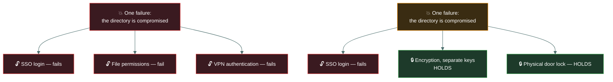
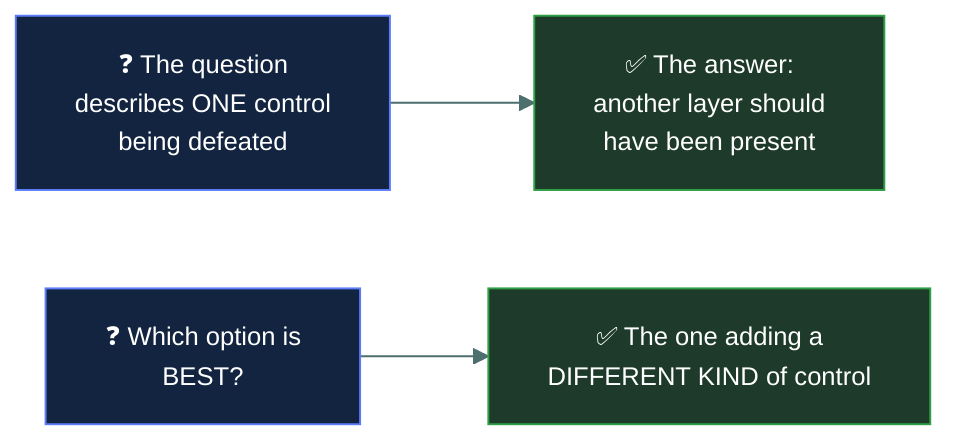

<div align="center">


# 🛡️ Defence in depth

### *Layers, so that no single failure is fatal*

[](../README.md)
[](../README.md)
[](#)

📌 *The principle that ties the whole domain together. The examined subtlety is that layers must be independent — and that more controls is not the same as more depth.*

</div>

---

## 🧸 The big idea

Reaching the tribe's most sacred treasure means beating the outer fence, then the gate guard,
then the inner village walls, then the treasure hut's own door, then the locked chest inside it —
five separate obstacles, each a genuinely different kind of thing. **No single control should be
the only thing between an attacker and an asset.**

Every control fails eventually. A password gets phished, a patch gets missed, a door gets
propped open, a rule gets misconfigured. Defence in depth assumes each individual control will
fail at some point and arranges matters so that one failure is survivable.

```
Get past the fence · get past the door · get past the password ·
get past the permissions · get past the encryption
```

An attacker must defeat **every** layer. A defender needs only **one** to hold.

> [!IMPORTANT]
> **The layers must be independent.** If the gate guard and the treasure hut's door both rely on
> the exact same secret whistle, tricking that one whistle defeats both "layers" at once — it was
> never really two obstacles, just one obstacle wearing two hats. Three controls that all fail when
> the same directory service fails are the same thing. This is the examined subtlety, and it is
> what separates genuine depth from an expensive stack of products.

---

## 📖 Words you will keep seeing

| Word | What it means on this exam |
|---|---|
| **Defence in depth** | Layering multiple independent controls so no single failure is fatal. |
| **Layered security** | The same idea, used interchangeably on this exam. |
| **Single point of failure** | A component whose failure defeats the whole arrangement. |
| **Independent layers** | Controls that do not share a common failure cause. |
| **Common mode failure** | One cause defeating several controls at once. |
| **Redundancy** | Duplicating a component so a failure does not stop the function. |
| **Diversity of defence** | Using **different kinds** of control, not more of the same. |
| **Compensating control** | An alternative where the primary control is not feasible. |
| **Attack surface** | The total set of points where an attacker could attempt entry. |

---

## 🔍 What the layers look like


Read it as a sentence: **the attacker must get into the building, past the process, through the
perimeter, across the segment, onto the host, and then through the encryption — and any one of
those holding is enough.**

**Mix the control types deliberately.** A good set of layers spans technical, administrative and
physical, and spans preventive, detective and corrective — because controls of the same kind tend
to fail for the same reasons.

| Layer type | Example |
|---|---|
| **Physical** | Locked server room |
| **Administrative** | Background checks, security training |
| **Technical — perimeter** | Firewall, DMZ |
| **Technical — internal** | Segmentation, least privilege |
| **Technical — host** | Hardening, patching, endpoint protection |
| **Technical — data** | Encryption, access control |
| **Detective across all** | Logging, monitoring, alerting |

---

## ⚠️ Independence is the whole point



**Top: three controls, one failure, everything opens.** That is not depth — it is one control
counted three times.

**Bottom: the same failure, and two layers still hold**, because they do not depend on the
directory.

> 🎯 **Ask of any layered design: what single event defeats more than one layer?** That question
> finds common mode failures, and it is the real skill behind the principle.

**Common mode failures to watch for:**

| Shared dependency | Defeats |
|---|---|
| One identity provider | SSO, file access, VPN, applications |
| One administrator's credentials | Everything that administrator manages |
| One vendor's product line | Every control from that vendor |
| One network path | Every control downstream of it |
| One key management system | All encryption relying on it |

---

## 🔀 Diversity of defence

Closely related and worth separating: **diversity** means using **different kinds** of control,
not more of the same kind.

Three firewalls in a row from the same vendor, with the same configuration, are defeated by one
vulnerability in that product. A firewall, plus segmentation, plus host hardening, plus
encryption, requires four different kinds of attack.

> ⚠️ **More controls is not more depth.** Adding a fourth technical control to three existing
> technical controls adds far less than adding an administrative or physical one, because it
> probably shares their failure modes.

---

## 🎯 How it appears on the exam



Two recurring shapes:

- **A scenario where one control failed and the damage was total.** The answer is that additional
  independent layers should have existed.
- **A choice between adding more of what is already there and adding something different.** The
  different kind of control is the better answer.

---

## ⚖️ Told apart

| | Means | Not to be confused with |
|---|---|---|
| **Defence in depth** | Multiple **independent** layers. | Multiple controls of the same type, which share failure modes. |
| **Defence in depth** | Layers an attacker must pass **in sequence**. | **Redundancy**, which duplicates one component so a failure does not stop the function. |
| **Diversity of defence** | Different **kinds** of control. | Simply **more** controls. Quantity is not depth. |
| **Independent layers** | No shared failure cause. | Layers that all depend on the same directory, vendor or network path. |
| **Compensating control** | An alternative where the primary is infeasible. | An **additional** layer for depth. Compensating implies substitution. |
| **Layered security** | The same idea as defence in depth. | A distinct concept — the terms are used interchangeably here. |

---

## ⚠️ Where your instinct is wrong

> [!WARNING]
> **In the job:** buying another security product is how you add a layer.
>
> **On the exam:** a layer only counts if it **fails independently**. Another agent on the same
> endpoint, managed by the same console, authenticated by the same directory, is not a new layer.

> [!WARNING]
> **In the job:** defence in depth and redundancy blur together — both are about surviving failure.
>
> **On the exam:** **redundancy duplicates a component** so the function continues; **defence in
> depth layers different controls** an attacker must pass in turn. Two servers in a cluster are
> redundancy, not depth.

> [!WARNING]
> **In the job:** the strongest control is where you concentrate effort.
>
> **On the exam:** concentrating everything in one very strong control is the failure mode the
> principle exists to prevent. A perfect perimeter with a flat internal network is the classic
> example.

---

## 🧠 How to remember it

🧠 **The attacker must beat every layer. You only need one to hold.**

🧠 **Ask: what one event defeats more than one layer?** That is the test for independence.

🧠 **Different kinds, not more of the same.** Technical, administrative and physical together.

🧠 **Redundancy duplicates. Depth layers.**

---

## ✅ Check you actually got it

Answer all five before expanding anything.

**Q1.** An organisation has a strong perimeter firewall but a flat internal network with no
segmentation. What principle is violated?

- **A.** Least privilege
- **B.** Defence in depth
- **C.** Segregation of duties
- **D.** Need to know

<details>
<summary><b>Answer</b></summary>

**B — defence in depth.** Everything rests on one control. An attacker who gets past the perimeter
by any means — phishing, a VPN credential, a contractor's laptop — meets nothing further.

- **A** concerns how much access individuals hold, which the stem does not describe.
- **C** concerns splitting a sensitive process between people, which is unrelated.
- **D** concerns restricting access to specific information, again not what is described.

</details>

**Q2.** Which set of controls BEST demonstrates defence in depth?

- **A.** Three firewalls from the same vendor in series
- **B.** A firewall, network segmentation, host hardening and data encryption
- **C.** Two identical intrusion prevention systems on the same segment
- **D.** A single next-generation firewall with every feature enabled

<details>
<summary><b>Answer</b></summary>

**B — a firewall, segmentation, host hardening and encryption.** Four different kinds of control
at four different layers, each failing for different reasons.

- **A** stacks the same control three times. One vulnerability in that product line defeats all
  three — a textbook common mode failure.
- **C** is redundancy of one control type, not depth. It improves availability if one device dies
  and adds nothing against an attack that defeats the detection logic.
- **D** concentrates everything in one device. Comprehensive, and still a single point of failure.

</details>

**Q3.** Why must layers in a defence-in-depth strategy be independent?

- **A.** To reduce the cost of licensing multiple products
- **B.** So that a single event cannot defeat several layers at once
- **C.** Because regulators require controls from different vendors
- **D.** To ensure each layer is managed by a different team

<details>
<summary><b>Answer</b></summary>

**B — so that a single event cannot defeat several layers at once.** Layers sharing a dependency
share a failure mode, and the apparent depth is illusory.

- **A** is a commercial consideration with no bearing on the principle.
- **C** invents a requirement. Vendor diversity can support independence and is not mandated.
- **D** describes an organisational arrangement that may help in practice but is not the reason
  independence matters.

</details>

**Q4.** What distinguishes defence in depth from redundancy?

- **A.** They are the same principle
- **B.** Defence in depth layers different controls an attacker must pass; redundancy duplicates a component so the function survives a failure
- **C.** Redundancy applies to security controls; defence in depth applies to hardware
- **D.** Defence in depth is preventive; redundancy is detective

<details>
<summary><b>Answer</b></summary>

**B — depth layers different controls in sequence; redundancy duplicates a component.** Two
clustered servers keep a service running if one dies; they present an attacker with the same
single obstacle twice.

- **A** conflates two related but distinct ideas.
- **C** reverses the domains and is wrong in both directions.
- **D** invents a control-function mapping. Defence in depth deliberately spans preventive,
  detective and corrective controls.

</details>

**Q5.** An organisation protects a database with single sign-on authentication, directory-based
file permissions, and a VPN authenticated by the same directory. What is the weakness?

- **A.** Nothing — three independent layers are in place
- **B.** All three depend on the directory, so compromising it defeats every layer
- **C.** Single sign-on should never be used with a VPN
- **D.** The database should also be behind a firewall from a different vendor

<details>
<summary><b>Answer</b></summary>

**B — all three depend on the directory, so compromising it defeats every layer.** This is a
common mode failure: three controls, one shared dependency, one event that opens all of them.

- **A** counts the controls rather than testing their independence, which is exactly the error the
  topic exists to correct.
- **C** is wrong as a general claim — SSO with VPN is standard practice. The issue is the absence
  of any layer *not* relying on the directory.
- **D** suggests a fourth control that would genuinely help, and names vendor diversity rather than
  the actual problem. The better remedy is a layer with a different dependency altogether, such as
  encryption with separately managed keys.

</details>

---

## 🎓 The grown-up version

<details>
<summary><b>Extra depth — open this on a second read, never needed for the pass</b></summary>

**The Swiss cheese model.** Borrowed from safety engineering, it pictures each control as a slice
of cheese with holes — the gaps where that control fails. Stack enough slices and the holes rarely
line up, so an incident is stopped by some layer. The model's real insight is about the holes:
incidents happen when gaps in several layers align, which is why analysing a breach means looking
at every layer that should have caught it rather than only the one that visibly failed.

**Depth has diminishing returns and real costs.** Each additional layer adds licensing, operational
burden, latency, and its own attack surface — a security product is software, and security products
have had serious vulnerabilities of their own. There is a point at which another layer costs more
than the risk it addresses, which is a risk treatment decision rather than a technical one. The
honest position is that depth is a principle to apply proportionately, not a virtue to maximise.

**Identity has become the common mode failure of modern architecture.** As organisations
consolidated on single sign-on and cloud identity providers, the directory became the thing
everything depends on. This is a genuine improvement in most respects — consistent policy, MFA
everywhere, central revocation — and it concentrates risk enormously. It is why identity
infrastructure is treated as the highest tier of administration, why break-glass accounts exist,
and why attacks against identity providers are so damaging.

**Depth applies to detection, not only prevention.** The layers people list are usually preventive,
and a well-designed programme layers detection too: network telemetry, endpoint detection,
identity signals, application logs. If an attacker evades one detection source, another may still
see them. This is why "assume breach" leads directly to investment in monitoring — the assumption
that prevention layers will eventually all be passed, and the question becomes how quickly you
notice.

</details>

---

## 📝 Cram lines

Destined for [`EXAM-DAY.md`](../../EXAM-DAY.md):

- **Defence in depth = multiple INDEPENDENT layers.** The attacker must beat all of them; you need one to hold.
- **Independence is the examined point.** Ask: *what single event defeats more than one layer?*
- **More controls ≠ more depth.** Three firewalls from one vendor is ONE control, three times.
- **Diversity of defence = DIFFERENT KINDS** of control — technical, administrative, physical; preventive, detective, corrective.
- **Common mode failures:** one identity provider, one admin's credentials, one vendor, one network path, one key store.
- **Redundancy DUPLICATES a component. Depth LAYERS different controls.**
- **A strong perimeter with a flat internal network is the classic violation.**
- **Layered security = the same thing** as defence in depth on this exam.

---

<div align="center">
<sub><a href="../README.md">← back to 04 · Networking and Cloud Security Concepts</a> &nbsp;·&nbsp; <a href="../wireless-and-bluetooth/">next: Wireless and Bluetooth →</a></sub>
</div>
