# 🏭 Embedded Systems, ICS and IoT

### *When the "computer" is a thermostat, a factory controller or a doorbell*

📌 *These devices break the usual patch-and-reboot rules, and in ICS the CIA order flips: availability and integrity come first. When you can't patch, segment. Always change default passwords.*

---

## 🧸 The big idea

Your laptop updates itself overnight and restarts. If an update goes wrong, you lose some work.

A city's **traffic lights** are computers too, but they're a different kind of computer. You can't
restart them at rush hour. They may run the same software for fifteen years. And if they go wrong
and show green in both directions, **people get hurt**.

Most security advice quietly assumes the laptop: modern software, regular patches, a harmless
reboot. **Embedded systems, industrial control systems (ICS) and IoT devices break every one of
those assumptions.** The threats are the same as anywhere else, but the usual fixes often aren't
available.

---

## 📖 Words you will keep seeing

| Word | What it means on this exam |
|---|---|
| **Embedded system** | A computer built into a bigger device for one job, such as a router, a medical pump or a car's engine controller. |
| **ICS** (Industrial Control System) | Systems that monitor and control physical processes: power grids, water treatment, production lines. |
| **SCADA** | A common type of ICS that controls equipment spread across many distant sites. |
| **PLC** (Programmable Logic Controller) | A tough industrial computer that runs the control logic for machinery. |
| **IoT** (Internet of Things) | Everyday devices with network connections added: cameras, thermostats, smart locks. |
| **OT** (Operational Technology) | Technology that controls physical things. ICS is part of OT. **IT**, by contrast, handles data. |
| **IT/OT convergence** | Connecting once-isolated OT networks to the company's IT network, for remote monitoring and data. |
| **Air gap** | Complete physical isolation: no network connection to anything else. |
| **Default credentials** | The factory-set username and password, often printed in the manual or listed online. |
| **Botnet** | A large group of hijacked devices controlled together by an attacker. |

---

## 🔍 The explanation

### Why these devices need different handling

| Normal IT assumption | What breaks in ICS, embedded and IoT |
|---|---|
| Patch regularly | Patching may mean stopping a live physical process, or the vendor may no longer exist |
| Reboot to fix things | A reboot can halt a physical process, sometimes unsafely |
| Devices are replaced every few years | ICS and embedded hardware often runs for **10–20+ years** |
| A breach is a data problem | An ICS breach can cause **physical harm and safety incidents** |
| Devices run modern, updatable software | Many IoT and embedded devices ship with minimal, outdated firmware that can't be updated |

### In ICS, the CIA order flips

Office IT usually worries first about **confidentiality**: keeping data from leaking. In an
industrial plant, the thing being protected is a **live physical process**, so priorities change:

| Priority | Typical office IT | Typical ICS / OT |
|---|---|---|
| **Availability** | Important, but a short outage is usually recoverable | **Often first**: a stopped process can halt production or leave a plant unsafe |
| **Integrity** | Important | **Critical**: a controller obeying a wrong command can damage equipment or injure people |
| **Confidentiality** | Usually the first concern | Still matters, but a leaked sensor reading does less harm than a tampered command |

> 🎯 **If a question asks what an ICS operator protects first, "keep the process running safely"
> (availability and integrity) beats "keep the data secret" (confidentiality).** That's the reverse
> of the usual IT instinct.

### When you can't patch

**Controls that fit these devices:**

- **Segmentation or an air gap**: keep ICS and IoT networks apart from the office network, so a
  compromise on one side can't reach the other directly.
- **Compensating controls** when patching isn't possible: filter the network around the device,
  monitor it, and tightly restrict who can reach it.
- **Knowing the support lifecycle**: track when a device reaches end of life and will never get
  another security update.
- **Changing default credentials** on every device. It's the cheapest, most valuable IoT control,
  and the one most often skipped.

> [!IMPORTANT]
> **For ICS, "apply the patch immediately" is often the wrong answer.** Patching can be unsafe for
> a live process, or impossible without vendor support. The textbook answer is **segmentation,
> monitoring or another compensating control** until a safe maintenance window.

### Why default passwords matter so much

The **Mirai** botnet is the clearest example in the whole syllabus. It needed no clever exploit at
all:

Every camera and router whose owner never changed the factory password joined the botnet
automatically. Changing that password wasn't one defence among many. It would have stopped the
**entire attack**.

---

## ⚖️ Told apart

| | Means | Not to be confused with |
|---|---|---|
| **ICS / SCADA** | Controls **physical industrial processes**. | **IoT** — everyday consumer and commercial connected devices. |
| **Air gap** | No network path at all. | **Segmentation** — restricts traffic between zones that are still connected. |
| **Embedded system** | A single-purpose computer inside a bigger device. | A general **endpoint** (laptop, server), which runs many programs and is patched on a normal schedule. |
| **ICS priority (often A-I-C)** | Availability and integrity of the process come first. | **Office IT priority (often C-I-A)** — confidentiality usually leads. |
| **OT** | Technology controlling physical things. | **IT** — technology handling data. |

---

## ⚠️ Where your instinct is wrong

> [!WARNING]
> **In the job:** "just patch it" is the default answer to a known flaw.
>
> **On the exam:** for ICS and embedded systems, the correct answer is often **segmentation,
> monitoring or a compensating control**, because immediate patching can be unsafe or unsupported.

> [!WARNING]
> **In the job:** security means protecting data, so confidentiality comes first.
>
> **On the exam:** in ICS, **availability and integrity of the physical process** usually come
> before confidentiality.

> [!WARNING]
> **In the job:** "the factory network isn't on the internet, so it's safe."
>
> **On the exam:** IT/OT convergence has connected many of those networks, often without anyone
> noticing. Isolation has to be checked, never assumed.

---

## 🧠 How to remember it

**Old, unpatchable, and dangerous to touch.** Why these devices get different treatment.

**Office: C-I-A. Factory floor: A-I-C.**

**Can't patch? Wall it off and watch it.**

**Mirai needed only the password from the manual.** Change the defaults.

---

## ✅ Check you actually got it

Answer all five before expanding anything.

**Q1.** A known vulnerability is found in the firmware of a PLC controlling a manufacturing line
that cannot be taken offline. What is the MOST appropriate immediate response?

- **A.** Apply the patch immediately regardless of the production schedule
- **B.** Apply network segmentation and monitoring as compensating controls until a safe patch window exists
- **C.** Ignore the vulnerability since ICS devices are not real security concerns
- **D.** Replace the PLC immediately

<b>Answer</b>

**B — segmentation and monitoring as compensating controls.** They reduce the risk without forcing
an unsafe, unplanned stop of a live physical process.

- **A** risks an unsafe or costly unplanned outage of the process.
- **C** dismisses a real category of risk that the exam specifically tests.
- **D** is out of proportion and impractical as an *immediate* response, and ignores that interim
  controls exist.

**Q2.** Which of the following BEST distinguishes ICS/SCADA systems from typical IoT devices?

- **A.** ICS/SCADA control physical industrial processes; IoT is typically consumer or commercial connected devices
- **B.** IoT devices are always more secure than ICS
- **C.** ICS systems never connect to any network
- **D.** There is no meaningful distinction between the two categories

<b>Answer</b>

**A.** ICS and SCADA control physical industrial processes; IoT covers everyday connected devices.
That's the core distinction the exam draws.

- **B** is an unsupported generalisation in either direction.
- **C** is wrong: many ICS environments are networked, which is exactly why segmentation and air
  gaps matter.
- **D** ignores a distinction the exam outline draws on purpose.

**Q3.** In a typical industrial control system, which of the following is MOST likely to be
prioritised ahead of confidentiality?

- **A.** Non-repudiation
- **B.** Availability and integrity of the physical process
- **C.** Anonymisation of operator data
- **D.** Encryption key length

<b>Answer</b>

**B — availability and integrity of the physical process.** ICS environments often flip the usual IT
order, because what's being protected is a live physical process rather than stored data.

- **A** and **D** are real security concerns, but they aren't the priorities that flip in ICS.
- **C** is a privacy idea, unrelated to keeping a physical process running correctly.

**Q4.** An organisation isolates its ICS network with no physical network connection to any other
network, including the internet. What is this control called?

- **A.** Segmentation
- **B.** Air gap
- **C.** Zero trust
- **D.** Micro-segmentation

<b>Answer</b>

**B — an air gap.** Complete physical isolation, with no network path at all.

- **A** and **D** both restrict traffic between zones that are still *connected*. They don't remove
  the connection.
- **C** is an approach to access ("never trust, always verify") for connected systems, not physical
  isolation.

**Q5.** A botnet spreads by logging into internet-connected cameras using their factory-set
passwords. Which control MOST directly prevents a camera from being recruited?

- **A.** Changing the default credentials on every camera
- **B.** Upgrading the office Wi-Fi to WPA3
- **C.** Installing antivirus software on each camera
- **D.** Encrypting the cameras' stored footage

<b>Answer</b>

**A — changing the default credentials.** The attack is simply logging in with the factory password.
Take that away and the attack has nothing left.

- **B** protects the office's radio link. The attacker reaches the cameras over the internet and
  logs in; Wi-Fi encryption doesn't touch that.
- **C** usually isn't possible on small IoT devices, and it wouldn't stop someone logging in with a
  valid password anyway.
- **D** protects stored footage (data at rest). It does nothing to stop someone logging in and
  taking over the device.

---

## 🎓 The grown-up version

<b>Extra depth — open this on a second read, never needed for the pass</b>

**The Purdue Model.** Industrial sites often follow a layered reference design, usually called the
Purdue Model, that separates the physical process, the control systems and the business IT network
into distinct levels with controlled gateways between them. The CC exam doesn't require the name,
but the idea behind it is exactly the point here: the business network and the process-control
network must not be flatly connected.

**Why IoT firmware quality varies so much.** Consumer IoT is often built by hardware makers with no
dedicated security engineers, competing on price and features rather than on updates. That's why
unpatched, internet-facing IoT devices keep turning up as the raw material for huge botnets.

**Old industrial protocols trust everyone.** **Modbus**, common on older equipment, was designed for
a physically isolated network that nobody expected an attacker to reach. A Modbus message is just a
function code, an address and a value: code `05` means "switch this relay on or off", code `06`
means "set this number", such as a target temperature or pressure. There's no username, password or
signature. Any device that can send a packet to the controller can give it orders, and it will obey.
You can't retrofit authentication onto a protocol from 1979, so the **network** has to decide who is
allowed to talk to the controller at all. That is why segmentation is the answer, and why IT/OT
convergence is risky: it exposes a trusting old protocol to a network its designers never imagined.

**Air gaps are rarer than people think.** Many "isolated" plants turn out to have a forgotten
remote-support link, a vendor's modem, or a laptop that moves between networks. Stuxnet crossed a
real air gap on removable media. Treat isolation as something to verify regularly, not a fact you
wrote down once.

---

## 📝 Cram lines

Destined for [`EXAM-DAY.md`](../../EXAM-DAY.md):

- **ICS/SCADA control physical processes. IoT = everyday connected devices.**
- **These devices break normal assumptions: long lifespan, hard to patch, reboots can be unsafe.** A breach can be **physical and safety-related**, not just a data problem.
- **ICS often flips CIA to A-I-C:** availability and integrity of the process before confidentiality.
- **Can't patch? Segmentation, monitoring and other compensating controls** until a safe maintenance window.
- **Air gap = no connection at all. Segmentation = still connected, but restricted.**
- **Change default credentials:** the cheapest, most valuable IoT control, and the most skipped (Mirai).

---

<a href="../README.md">← back to 04 · Networking and Cloud Security Concepts</a>

