# 🏭 Embedded systems, ICS and IoT

### *When the "computer" is a thermostat, a PLC, or a doorbell*

📌 *Why embedded devices, industrial control systems, and consumer IoT get their own line on the live outline — they break the usual security assumptions, including the CIA priority order itself.*

---

## 🧸 The big idea

A scribe's writing tablet can be wiped clean and rewritten any time, with no consequence beyond
the ink. The village's water-wheel, controlling the gates that flood or drain the fields, is a
completely different kind of tool: it was built once for exactly one physical job, it can't be
"paused for an update" without stopping the mill and losing a day's grinding, and if you get its
mechanism wrong, the gate can swing wildly and actually hurt whoever's standing near it.

That's the whole idea. Most security guidance assumes a device that can run modern software,
receive patches regularly, and be rebooted without real-world consequences. **Embedded systems,
ICS and IoT devices routinely violate every one of those assumptions.** A programmable logic
controller (PLC) on a factory floor may run for a decade without a reboot, cannot always be
patched without a scheduled outage, and controlling it incorrectly can cause physical harm — not
just a data breach.

This is why the exam names them separately from "network security" in general: **the same
threats apply, but the usual fixes often do not.**

---

## 📖 Words you will keep seeing

| Word | What it means on this exam |
|---|---|
| **Embedded system** | A computer built into a larger device for a dedicated purpose (a router, a medical pump, a car's engine controller) rather than general-purpose computing. |
| **ICS (Industrial Control System)** | Systems that monitor and control physical industrial processes — power grids, water treatment, manufacturing lines. |
| **SCADA** | A common type of ICS, coordinating control across geographically distributed sites. |
| **PLC (Programmable Logic Controller)** | A ruggedised industrial computer running control logic for machinery. |
| **IoT (Internet of Things)** | Everyday consumer or commercial devices with network connectivity added — cameras, thermostats, smart locks. |
| **Air gap** | Physically isolating a network from other networks, including the internet, so there is no direct connection to attack. |
| **OT (Operational Technology)** | The broader category ICS/SCADA sits under — hardware and software that monitors or controls physical devices and processes, as distinct from **IT**, which handles data. |
| **IT/OT convergence** | The trend of connecting previously isolated OT networks to corporate IT networks (for remote monitoring, data collection), which is exactly what erodes the old assumption that ICS was "safe because it wasn't networked." |
| **Default credentials** | Factory-set usernames/passwords, often published in a vendor manual or well-known online — a leading cause of IoT compromise when never changed. |

---

## 🔄 Why the CIA priority order often flips in ICS

The scribe cares most about keeping what he's written secret. But for the water-wheel gate, what
matters most is that it keeps turning reliably and does exactly what it's told, correctly — a
leaked secret about how the gate mechanism works matters far less than the gate suddenly jamming
or swinging the wrong way. Standard IT security tends to prioritise **confidentiality** first —
protecting data from disclosure. **In ICS/OT environments, the priority commonly flips to
availability and integrity first**, because the "data" being protected is a live physical
process.

| Priority | Typical IT reasoning | Typical ICS/OT reasoning |
|---|---|---|
| **Availability** | Important, but a brief outage is usually recoverable | **Often the top priority** — a stopped process can mean a halted production line or an unsafe plant state |
| **Integrity** | Important | **Critical** — a controller executing incorrect commands can cause physical damage or injury |
| **Confidentiality** | Usually the first concern | Still matters, but a leaked sensor reading is rarely as damaging as a manipulated control command |

> 🎯 **If a question asks what an ICS operator prioritises first, "keeping the process running
> safely" (availability + integrity) usually beats "keeping the data secret" (confidentiality)**
> — the reverse of the default IT instinct.

---

## 🔍 Why these need different handling

| Assumption in normal IT | What breaks in ICS/embedded/IoT |
|---|---|
| Patch regularly | Patching may require a scheduled outage of a live physical process, or the vendor may no longer support the device |
| Reboot to remediate | A reboot can halt a physical process — sometimes unsafely |
| Long device lifespan is unusual | ICS/embedded hardware routinely runs **10–20+ years** — far past normal IT refresh cycles |
| A compromise is a data problem | ICS compromise can cause **physical, safety-relevant consequences**, not just data loss |
| Devices run modern, updatable software | Many IoT/embedded devices ship with minimal, outdated, or unpatchable firmware |

**Common mitigations, at CC depth:**

- **Segmentation / air-gapping** ICS and IoT networks away from general corporate IT, so a
  compromise on one side does not directly reach the other.
- **Compensating controls** where patching isn't possible — network-level filtering,
  monitoring, and strict access control around the device rather than fixing the device
  itself.
- **Vendor support lifecycle awareness** — knowing when a device reaches end-of-life and can no
  longer receive security updates at all (see asset lifecycle and EOL, Domain 5).
- **Changing default credentials** on every deployed device — the single cheapest, highest-value
  IoT control, and the one most often skipped at scale.

---

## 🔬 Mirai and Modbus: the two textbook mechanisms, concretely

**Mirai needed no exploit, no vulnerability research, nothing clever at all** — it simply
scanned the whole internet for devices with Telnet open and tried a hard-coded list of around
sixty factory default username/password pairs (`admin`/`admin`, `root`/`12345`, and similar).
Every device where nobody had ever changed the default password joined the botnet automatically.
This is the single most concrete illustration in the entire syllabus of why "change default
credentials" is called the cheapest, highest-value IoT control: it is *the entire attack*,
start to finish, for one of the largest botnets ever recorded.

**Modbus shows what "no built-in authentication" actually means at the command level.** A
Modbus message is just a **function code** plus an address plus a value — function code `05`
means "write a single coil" (flip a physical relay on or off), function code `06` means "write a
single register" (set a numeric value like a target temperature or pressure). There is no
username, no password, no signature — **any device that can route a packet to the PLC can send
that command, and the PLC will execute it**, because the protocol was designed decades ago for a
network nobody expected an attacker to ever reach. This is exactly why segmentation is the
answer instead of "add authentication to Modbus": you can't patch a 1979 protocol, so the
network itself has to be the thing that decides who's allowed to send it a command at all.

---

## ⚖️ Told apart

| | Means | Not to be confused with |
|---|---|---|
| **ICS / SCADA** | Systems controlling physical industrial processes. | **IoT**, which is typically consumer or commercial connected devices, not industrial process control. |
| **Air gap** | Physical isolation — no network path exists at all. | **Segmentation**, which restricts traffic between connected network zones but does not eliminate the connection entirely. |
| **Embedded system** | A dedicated-purpose computer built into a larger device. | A general-purpose **endpoint** (laptop, server), which runs varied software and is patched on a normal IT cadence. |
| **ICS priority order (often A-I-C)** | Availability and integrity of the physical process typically come first. | Standard **IT priority order (often C-I-A)**, where confidentiality is usually the leading concern. |

---

## ⚠️ Where your instinct is wrong

> [!WARNING]
> **In the job:** "just patch it" is the default response to a known vulnerability.
>
> **On the exam:** for ICS and embedded systems, the textbook-correct answer is often
> **segmentation, monitoring, or a compensating control** — not "apply the patch immediately" —
> because immediate patching can be operationally unsafe or simply unsupported by the vendor.

---

## 🧠 How to remember it

🧠 **"Old, unpatchable, and dangerous to touch."** The three-word summary of why ICS/embedded
devices get different treatment than a normal laptop or server.

---

## ✅ Check you actually got it

Answer all five before expanding anything.

**Q1.** A known vulnerability is found in the firmware of a PLC controlling a manufacturing
line that cannot be taken offline. What is the MOST appropriate immediate response?

- **A.** Apply the patch immediately regardless of the production schedule
- **B.** Apply network segmentation and monitoring as compensating controls until a safe
  patch window exists
- **C.** Ignore the vulnerability since ICS devices are not real security concerns
- **D.** Replace the PLC immediately

<b>Answer</b>

**B — segmentation and monitoring as compensating controls.** This addresses risk without
forcing an unsafe, unscheduled interruption to a live physical process.

- **A** risks an unsafe or costly unplanned outage of a physical process.
- **C** dismisses a real risk category the exam specifically tests.
- **D** is disproportionate and impractical as an "immediate" response, and ignores that
  interim controls exist.

**Q2.** Which of the following BEST distinguishes ICS/SCADA systems from typical IoT devices?

- **A.** ICS/SCADA control physical industrial processes; IoT is typically consumer or
  commercial connected devices
- **B.** IoT devices are always more secure than ICS
- **C.** ICS systems never connect to any network
- **D.** There is no meaningful distinction between the two categories

<b>Answer</b>

**A — ICS/SCADA control physical industrial processes; IoT is broader consumer/commercial
connectivity.** This is the core distinction the exam draws.

- **B** is an unsupported generalisation in either direction.
- **C** is wrong — many ICS environments are networked, which is exactly why segmentation and
  air-gapping matter as controls.
- **D** ignores a distinction the outline specifically separates.

**Q3.** Why is "reboot to remediate" often not a safe default for ICS environments?

- **A.** Because ICS devices reboot faster than normal computers
- **B.** Because a reboot can halt a live physical process, sometimes unsafely
- **C.** Because ICS devices cannot be rebooted under any circumstances
- **D.** Because rebooting always destroys forensic evidence

<b>Answer</b>

**B — a reboot can unsafely halt a live physical process.** This is the operational reason ICS
remediation differs from typical IT remediation.

- **A** is not a security consideration.
- **C** overstates the case — some ICS devices can be rebooted, but only within a scheduled,
  safe maintenance window.
- **D** describes a forensic concern unrelated to why ICS reboots are handled cautiously.

**Q4.** An organisation isolates its ICS network with no physical network connection to any
other network, including the internet. What is this control called?

- **A.** Segmentation
- **B.** Air gap
- **C.** Zero Trust
- **D.** Micro-segmentation

<b>Answer</b>

**B — air gap.** Complete physical isolation, with no network path at all.

- **A** and **D** both describe restricting traffic between *connected* zones, not eliminating
  the connection entirely.
- **C** is an access philosophy ("never trust, always verify") applied to connected systems,
  not a description of physical isolation.

**Q5.** What is the PRIMARY reason embedded, ICS, and IoT devices are treated as a distinct
security category from standard IT endpoints?

- **A.** They are always more expensive
- **B.** They routinely violate normal assumptions about patching, rebooting and lifespan, and
  compromise can have physical consequences
- **C.** They are never connected to a network
- **D.** They are outside the scope of any security framework

<b>Answer</b>

**B — they break normal IT assumptions and compromise can be physically consequential.** This
is exactly why the live outline names them separately.

- **A** is not a security consideration.
- **C** is factually wrong for most IoT and many ICS deployments.
- **D** is wrong — they are explicitly in scope on this exam's own outline.

**Q6.** In a typical industrial control system, which of the following is MOST likely to be
prioritised ahead of confidentiality?

- **A.** Non-repudiation
- **B.** Availability and integrity of the physical process
- **C.** Anonymisation of operator data
- **D.** Encryption key length

<b>Answer</b>

**B — availability and integrity of the physical process.** ICS environments commonly flip the
usual IT priority order, because the asset being protected is a live physical process rather
than data at rest.

- **A** and **D** are real security concerns but not the priority the exam tests as flipped in
  ICS contexts.
- **C** is a privacy concept, unrelated to the ICS availability/integrity priority.

---

## 🎓 The grown-up version

<b>Extra depth — open this on a second read, never needed for the pass</b>

**Purdue Model.** Industrial environments commonly reference a layered reference architecture
(often called the Purdue Model) separating the physical process, control systems, and
enterprise IT into distinct levels with controlled gateways between them. CC does not require
naming this model, but the underlying idea — the enterprise network and the process-control
network should not be flatly connected — is exactly the segmentation principle tested here.

**Why IoT firmware quality varies so widely.** Consumer IoT is frequently built by hardware
manufacturers without dedicated security engineering, competing primarily on price and features
rather than patchability — which is why unpatched, internet-facing IoT devices are a
recurring source of large-scale botnets in the wild. The historical Mirai botnet is the
textbook example: it spread almost entirely by trying a short list of factory-default
credentials against internet-exposed devices, needing no software vulnerability at all.

**Legacy ICS protocols were never designed with an attacker in mind.** Protocols such as
Modbus, common in older industrial equipment, were built assuming a physically isolated,
trusted network, and so carry no built-in authentication or encryption — any device that can
reach one on the network can issue commands to it. This is precisely why IT/OT convergence is
risky: connecting that trusting old protocol to a broader, less-trusted network exposes an
assumption the protocol's designers never expected to be tested.

---

## 📝 Cram lines

Destined for [`EXAM-DAY.md`](../../EXAM-DAY.md):

- **ICS/SCADA control physical processes. IoT is broader consumer/commercial connectivity.**
- ICS/embedded devices break normal assumptions: **long lifespan, hard to patch, reboot can be unsafe.**
- Compromise can be **physical, safety-relevant** — not just a data problem.
- **Segmentation / air-gapping** is the go-to control when patching isn't practical.
- **ICS often flips CIA to A-I-C** — availability and integrity of the process before confidentiality.
- **Change default credentials.** The cheapest, highest-value IoT control — and the most skipped.

---

<a href="../README.md">← back to 04 · Networking and Cloud Security Concepts</a> &nbsp;·&nbsp; <a href="../../03-access-control/README.md">next domain: 03 · IAM Concepts →</a>

</content>
