# 🔢 IP addressing

### *Public and private, IPv4 and IPv6, and the three services that make addressing usable*

📌 *Recognise a private address range on sight, and say what NAT, DHCP and DNS each do. That is most of the marks here.*

---

## 🧸 The big idea

Every hut inside the village has a nickname — "third hut by the stream" — that only means
something to people already inside the village. Nobody in another valley has ever heard of it,
and it would mean nothing to them anyway, since a hundred other villages each have their own
"third hut by the stream."

The village as a whole, though, has exactly one name known to the outside world, and that's what
gets used on anything travelling to another valley.

That's the whole idea. Every device on a network needs an address so traffic can find it. That
is an **IP address**, and it lives at layer 3.

Two things the exam cares about:

**Public versus private.** The internal hut nicknames are the **private** addresses. Some
address ranges are reserved for use inside private networks. They are not routable on the
internet — no router on the public internet will forward them. Any organisation can use them
internally, which is why the same `192.168.1.1` exists in millions of homes simultaneously.
Recognising these ranges on sight is worth guaranteed marks.

**Three supporting services**, each doing one job, each commonly confused with the others: when a
new family moves into the village, the elder assigns them a hut nickname automatically rather
than making them invent one — that's **DHCP**. The village directory-keeper remembers that
"Grog's hut" actually means "third hut by the stream," so nobody has to memorise numbers — that's
**DNS**. And the gate-keeper relabels every outgoing message with the village's one shared
outside-facing name before it leaves for another valley, so outsiders never see the internal
nicknames at all — that's **NAT**.

- **DHCP** hands out addresses automatically.
- **DNS** translates names into addresses.
- **NAT** translates private addresses into a public one on the way out.

If you can state those three in one line each, you have the core of this topic.

---

## 📖 Words you will keep seeing

| Word | What it means on this exam |
|---|---|
| **IP address** | The layer 3 address identifying a host on a network. |
| **IPv4** | 32-bit addressing, written as four decimal numbers: `192.0.2.15`. |
| **IPv6** | 128-bit addressing, written as hexadecimal groups: `2001:db8::1`. |
| **Public address** | Globally routable on the internet. Must be unique worldwide. |
| **Private address** | Reserved for internal use. Not routable on the internet. |
| **Subnet** | A subdivision of a network. |
| **Subnet mask** | Defines which part of an address is the network and which is the host. |
| **Default gateway** | The router a device sends traffic to when the destination is outside its own network. |
| **NAT** — Network Address Translation | Translating private addresses to a public one, and back. |
| **DHCP** — Dynamic Host Configuration Protocol | Automatically assigns IP configuration to devices. |
| **DNS** — Domain Name System | Resolves names such as `example.com` to IP addresses. |
| **Loopback** | The address a device uses to refer to itself — `127.0.0.1`, or `::1` in IPv6. |
| **Static address** | Manually configured and fixed. |
| **Dynamic address** | Assigned automatically by DHCP and subject to change. |

---

## 🔍 IPv4 and IPv6

| | **IPv4** | **IPv6** |
|---|---|---|
| Size | **32 bits** | **128 bits** |
| Format | Four decimal octets: `192.0.2.15` | Eight hex groups: `2001:db8::8a2e:370:7334` |
| Separator | Dots | Colons |
| Address space | ~4.3 billion | Effectively inexhaustible |
| NAT | Widely needed | Not needed — enough addresses for everything |
| IPSec | Optional | Designed in as part of the protocol |

**IPv6 exists because IPv4 ran out of addresses.** That is the reason to remember; the exam asks
for it directly.

> 🎯 **The two numbers to know: IPv4 is 32-bit, IPv6 is 128-bit.** Almost every IPv6 question
> starts there.

---

## 🏠 Private address ranges — memorise these

| Range | CIDR | Typical use |
|---|---|---|
| `10.0.0.0` – `10.255.255.255` | `/8` | Large enterprise networks |
| `172.16.0.0` – `172.31.255.255` | `/12` | Medium networks |
| `192.168.0.0` – `192.168.255.255` | `/16` | Home and small office |

> [!CAUTION]
> **The `172` range is the one people get wrong.** It is `172.16` to `172.31` — **not** all of
> `172`. So `172.15.0.1` and `172.32.0.1` are **public** addresses, while `172.20.0.1` is private.
> Exam questions deliberately offer an address just outside the range.

**Other reserved addresses worth recognising:**

| Address | Meaning |
|---|---|
| `127.0.0.1` | **Loopback** — this device itself. The whole `127.0.0.0/8` range is loopback. |
| `169.254.x.x` | **APIPA** — self-assigned when DHCP fails. Seeing one means DHCP is not working. |
| `0.0.0.0` | Unspecified, or "all addresses" in a listening context. |
| `255.255.255.255` | Broadcast to the local network. |

> 🎯 **An address starting `169.254` is a diagnostic signal.** The device tried to get an address
> from DHCP, failed, and assigned itself one. If a question describes a client with a `169.254`
> address unable to reach the network, the answer concerns DHCP failure.

Run any address in a question down this tree. **Watch the third question — `172.15` and `172.32`
come out the bottom as public.**

---

## 🔧 The three services

### 📋 DHCP — hands out addresses

Automatically assigns a device its IP address, subnet mask, default gateway and DNS servers
when it joins a network. Without it, every device would need manual configuration.

**Security relevance:** a **rogue DHCP server** can hand clients a malicious default gateway or
DNS server, putting an attacker in the traffic path. DHCP snooping on switches defends against
this.

### 🔤 DNS — turns names into addresses

Resolves `example.com` into an IP address. It is what makes the internet usable by humans.

**Security relevance:** DNS is a high-value target.

- **DNS spoofing / cache poisoning** — corrupting a resolver's records so a name resolves to an
  attacker's address, silently sending users to a malicious site.
- **DNS tunnelling** — smuggling data out inside DNS queries, because DNS is rarely blocked.
- **DNSSEC** adds cryptographic signatures so responses can be verified as authentic.

> ⚠️ **DNSSEC provides authenticity and integrity, not confidentiality.** It proves a DNS answer
> is genuine and unmodified; it does not encrypt the query. This distinction is examined.

### 🔀 NAT — swaps private for public

Translates internal private addresses into a public address as traffic leaves, and reverses the
translation on the way back. Many internal hosts can share one public address.

**Two benefits, and the exam wants both:**

1. **Address conservation** — the reason it was invented. One public address serves many hosts.
2. **A degree of obscurity** — internal addressing is hidden, and unsolicited inbound connections
   have nowhere to go by default.

Read it as a sentence: **many private hosts leave through one public address, and the NAT device
remembers who was who so replies get home.** That is address conservation — the purpose. The fact
that outsiders cannot see the private addresses is a side effect, not a control.

> [!IMPORTANT]
> **NAT is not a security control, and it is not a firewall.** It provides incidental obscurity
> as a side effect of address translation. It does not inspect traffic, enforce a policy, or stop
> anything a user initiates. If an option says NAT secures a network or replaces a firewall, it
> is wrong.

---

## 🔬 How a DNS lookup actually travels, and how poisoning it works

A single DNS query is actually a **chain of referrals**: your resolver asks a root server which
doesn't know the answer but knows who does — the `.com` TLD server — which in turn points to the
specific authoritative server that actually holds `example.com`'s real IP. The answer then gets
**cached** by your resolver for a defined time (its TTL) so the whole chain isn't repeated for
every request.

**Cache poisoning exploits exactly that caching step.** Each DNS query carries a 16-bit random
**transaction ID**, and a resolver accepts the *first* reply that matches it — it has no way to
know a reply is fake versus genuine beyond that number matching. In the classic Kaminsky-style
attack, an attacker floods the resolver with hundreds of forged replies guessing different
transaction IDs, racing to land a match before the real authoritative server's genuine reply
arrives. Win that race once, and the resolver caches the attacker's fake IP address for every
subsequent user of that resolver until the TTL expires — silently redirecting an entire
organisation or ISP's traffic. **DNSSEC** closes this specific hole by having each authoritative
answer carry a cryptographic signature (an `RRSIG` record, verified against a published
`DNSKEY`) that a forged reply simply cannot produce without the private key — which is precisely
why DNSSEC is described as providing authenticity rather than confidentiality: it doesn't hide
the query, it makes the answer unforgeable.

---

## ⚖️ Told apart

| | Does | Not to be confused with |
|---|---|---|
| **DHCP** | **Assigns** an IP address automatically. | **DNS**, which **resolves names** to addresses. DHCP gives you an address; DNS finds someone else's. |
| **DNS** | Name → IP address. | **ARP**, which resolves IP → MAC within a local network. Different pair, different layer. |
| **NAT** | Translates private ↔ public addresses. | **A firewall**, which inspects and filters against a ruleset. NAT translates; it does not decide. |
| **Private address** | Reserved, not internet-routable. | **Public address**, globally unique and routable. |
| **Static** | Manually set and fixed. | **Dynamic**, assigned by DHCP and liable to change. |
| **`127.0.0.1`** | Loopback — this device. | A private address. Loopback is its own reserved category and never leaves the host. |
| **`169.254.x.x`** | APIPA — DHCP failed. | A normal private range. It is a fault symptom. |
| **DNSSEC** | Authenticity and integrity of DNS answers. | **Encryption.** DNSSEC signs; it does not conceal. |

---

## ⚠️ Where your instinct is wrong

> [!WARNING]
> **In the job:** NAT does meaningfully reduce exposure — an unsolicited inbound packet has
> nowhere to go, and that is real.
>
> **On the exam:** **NAT is not a security control.** The expected answer is address conservation
> as the purpose, with obscurity as a side effect. Never select an option describing NAT as a
> substitute for a firewall.

> [!WARNING]
> **In the job:** `172.` addresses read as private at a glance.
>
> **On the exam:** only `172.16` through `172.31` are private. `172.15.x.x` and `172.32.x.x` are
> **public**, and questions are written specifically to catch this.

> [!WARNING]
> **In the job:** IPv6 is something you disable to avoid surprises.
>
> **On the exam:** what matters is 128-bit addressing, that it solves IPv4 exhaustion, and that
> IPSec is built into the protocol rather than bolted on.

---

## 🧠 How to remember it

🧠 **The three private ranges: 10 · 172.16–31 · 192.168.**
*"Ten, seventeen-two-sixteen-to-thirty-one, one-ninety-two-one-sixty-eight."* Say it until the
`172` boundaries are automatic.

🧠 **The three services in one line each:**
**DHCP gives** you an address · **DNS finds** an address · **NAT swaps** an address.

🧠 **32 and 128.** IPv4 and IPv6 bit lengths.

🧠 **169.254 means DHCP died.**

---

## ✅ Check you actually got it

Answer all five before expanding anything.

**Q1.** Which of the following is a **public** IP address?

- **A.** `10.15.200.4`
- **B.** `172.20.5.1`
- **C.** `172.35.5.1`
- **D.** `192.168.50.10`

<b>Answer</b>

**C — `172.35.5.1`.** The private `172` range runs from `172.16` to `172.31` only. `172.35` falls
outside it, so the address is public and internet-routable.

- **A** is inside `10.0.0.0/8`, private.
- **B** is inside `172.16.0.0/12` because 20 is between 16 and 31 — private.
- **D** is inside `192.168.0.0/16`, private.

The whole question is the `172` boundary, which is exactly why it is worth memorising the numbers
16 and 31 rather than "the 172 range".

**Q2.** A workstation cannot reach network resources and has been assigned the address
`169.254.12.88`. What is the MOST likely cause?

- **A.** The workstation has been assigned a public address in error
- **B.** The DHCP server is unavailable, so the workstation self-assigned an APIPA address
- **C.** DNS resolution has failed
- **D.** The default gateway is misconfigured

<b>Answer</b>

**B — the DHCP server is unavailable.** The `169.254.x.x` range is APIPA, which a host assigns to
itself only when it cannot obtain an address from DHCP. The address is the diagnostic.

- **A** is wrong: `169.254` is a reserved self-assignment range, not a public one.
- **C** would prevent name resolution while the host still held a valid DHCP address and could
  reach resources by IP. The symptom here is the address itself.
- **D** would break traffic leaving the local network, but the host would still hold a normal
  DHCP-assigned address rather than an APIPA one.

**Q3.** What is the PRIMARY purpose of NAT?

- **A.** To encrypt traffic leaving the internal network
- **B.** To conserve public IP addresses by allowing many hosts to share one
- **C.** To filter inbound traffic according to a security policy
- **D.** To resolve domain names to IP addresses

<b>Answer</b>

**B — to conserve public IP addresses.** NAT was created to address IPv4 exhaustion by letting
many internal hosts share a small number of public addresses.

- **A** is wrong — NAT performs no encryption whatsoever. It rewrites address fields.
- **C** describes a firewall. NAT does provide incidental obscurity, which makes this the most
  tempting distractor, but translating is not filtering and NAT enforces no policy.
- **D** describes DNS.

**Q4.** Which service automatically provides a client with its IP address, subnet mask, default
gateway and DNS server?

- **A.** DNS
- **B.** NAT
- **C.** DHCP
- **D.** ARP

<b>Answer</b>

**C — DHCP.** It supplies the whole IP configuration bundle when a device joins a network.

- **A** resolves names to addresses. DHCP tells the client *which* DNS server to ask — the two are
  adjacent, which is why they get swapped.
- **B** translates private addresses to public ones at the network edge. It assigns nothing to
  clients.
- **D** resolves an IP address to a MAC address within the local network.

**Q5.** Which statement about IPv6 is correct?

- **A.** IPv6 uses 64-bit addresses written in decimal
- **B.** IPv6 uses 128-bit addresses and was developed to address IPv4 exhaustion
- **C.** IPv6 requires NAT to function on the public internet
- **D.** IPv6 cannot support encryption

<b>Answer</b>

**B — 128-bit addresses, developed to address IPv4 exhaustion.** That is the core fact, and the
address space is effectively inexhaustible.

- **A** gets both details wrong: IPv6 is 128-bit and written in hexadecimal groups separated by
  colons.
- **C** inverts the position. IPv6's whole point is that there are enough addresses to give every
  device a globally unique one, so NAT is unnecessary.
- **D** is wrong in the opposite direction — IPSec support is built into IPv6 rather than being an
  optional addition as in IPv4.

---

## 🎓 The grown-up version

<b>Extra depth — open this on a second read, never needed for the pass</b>

**NAT's security reputation is genuinely contested.** The exam's line — NAT is not a security
control — is the correct answer and slightly overstated as a claim about reality. A host behind
NAT with no port forwarding cannot receive unsolicited inbound connections, because the
translation table has no entry to map them to. That is a real reduction in attack surface, and it
is why home networks are less exposed than they would otherwise be. The reason it does not count
as a security control is that it is a side effect rather than a policy: it cannot be configured,
audited or reasoned about as a rule set, it does nothing about outbound connections or anything a
user initiates, and relying on it produces a flat internal network where one compromised host
reaches everything. Defence in depth, not NAT.

**The IPv6 privacy wrinkle.** Early IPv6 autoconfiguration derived the host portion of the address
from the interface's MAC address, which meant a device carried a globally unique, trackable
identifier across every network it joined. Privacy extensions were introduced to generate
temporary randomised addresses instead, and are now the default on major operating systems. It is
a neat illustration of a design decision that was technically elegant and a privacy problem.

**Why DNS is such an attractive target.** It is the first step of almost every connection, it is
traditionally unauthenticated and unencrypted, and it is rarely blocked at the perimeter because
blocking it breaks everything. That combination makes it useful for redirection, for command and
control, and for exfiltration via tunnelling. DNSSEC addresses authenticity; DNS over HTTPS and
DNS over TLS address confidentiality, and they are a mixed blessing for defenders because they
also hide DNS queries from the organisation's own monitoring.

**CIDR in one paragraph.** The `/24` notation says how many leading bits are the network portion.
A `/24` leaves 8 bits for hosts, giving 256 addresses of which 254 are usable — one is the network
address and one the broadcast. Smaller numbers mean bigger networks: `/8` is enormous, `/30` gives
just two usable addresses for a point-to-point link. CC does not require subnetting arithmetic,
but recognising that `/8` is larger than `/24` occasionally helps.

---

## 📝 Cram lines

Destined for [`EXAM-DAY.md`](../../EXAM-DAY.md):

- **Private ranges: `10.0.0.0/8` · `172.16–172.31` · `192.168.0.0/16`.**
- **The 172 range is 16 to 31 ONLY.** `172.15` and `172.32` are **public**. Classic trap.
- **`127.0.0.1`** = loopback (this device). **`169.254.x.x`** = APIPA = **DHCP failed**.
- **IPv4 = 32-bit, dotted decimal. IPv6 = 128-bit, hex with colons.** IPv6 exists because IPv4 ran out. IPSec is built into IPv6.
- **DHCP gives you an address. DNS finds an address. NAT swaps an address.**
- **NAT's purpose = address conservation.** Obscurity is a side effect. **NAT is NOT a security control and NOT a firewall.**
- **DNSSEC = authenticity + integrity, NOT confidentiality.** It signs; it doesn't encrypt.
- **DNS** = name → IP. **ARP** = IP → MAC.

---

<a href="../README.md">← back to 04 · Networking and Cloud Security Concepts</a> &nbsp;·&nbsp; <a href="../ports-and-protocols/">next: Ports and protocols →</a>

