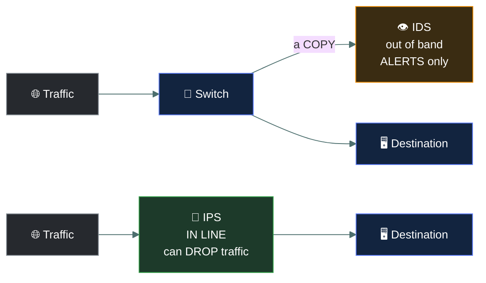

# 🔥 Network defence devices

### *Firewalls, IDS, IPS and proxies — what each does, and what each cannot do*

📌 *The highest-traffic distinction in Domain 4 is IDS versus IPS. Answer the textbook, not your deployment experience.*

---

## 🧸 The big idea

Four devices, and each answers a different question.

| Device | Its job |
|---|---|
| **Firewall** | Decides what traffic is **allowed through** |
| **IDS** | **Watches** and **tells you** about suspicious traffic |
| **IPS** | Watches and **stops** suspicious traffic |
| **Proxy** | Sits in the middle and **makes requests on your behalf** |

The one the exam cares most about is the IDS/IPS pair, and the difference is a single letter
doing a lot of work:

> **IDS = Detection. It sees and alerts. It does not block.**
> **IPS = Prevention. It sees and blocks.**

That is the whole distinction, and it follows from where each sits. An IDS receives a **copy** of
traffic, so it is off to one side and cannot interfere. An IPS sits **in the traffic path**, so
everything must pass through it — which is what gives it the power to drop a packet.

---

## 📖 Words you will keep seeing

| Word | What it means on this exam |
|---|---|
| **Firewall** | A device or software that permits or denies traffic against a ruleset. |
| **Packet-filtering firewall** | Examines each packet's addresses and ports independently. **Stateless.** |
| **Stateful firewall** | Tracks the state of connections and evaluates packets in that context. |
| **Next-generation firewall (NGFW)** | Adds application awareness and deeper inspection. |
| **IDS** — Intrusion Detection System | Monitors traffic and **alerts**. Passive; out of band. |
| **IPS** — Intrusion Prevention System | Monitors traffic and **blocks**. Active; in line. |
| **NIDS / NIPS** | Network-based, monitoring network segments. |
| **HIDS / HIPS** | Host-based, monitoring a single system. |
| **Signature-based detection** | Matches against known patterns of attack. |
| **Anomaly-based detection** | Flags deviation from a learned baseline of normal. |
| **False positive** | Legitimate activity wrongly flagged as an attack. |
| **False negative** | A real attack **missed**. The dangerous error. |
| **Proxy** | An intermediary that makes requests on a client's behalf. |
| **Reverse proxy** | An intermediary in front of **servers**, receiving requests on their behalf. |
| **WAF** — Web Application Firewall | Filters HTTP traffic to protect web applications. Layer 7. |

---

## 🔥 Firewalls

A firewall permits or denies traffic according to a ruleset. In the exam's basic model it
operates at **layers 3 and 4**, filtering on IP addresses and port numbers.

| Type | Examines | Notes |
|---|---|---|
| **Packet-filtering** | Each packet alone — source, destination, port | **Stateless.** Fast, simple, easily evaded |
| **Stateful inspection** | Packets in the context of the connection they belong to | Knows an inbound packet is a reply to an outbound request |
| **Proxy / application-level** | The full application-layer content | Slowest, most thorough |
| **Next-generation (NGFW)** | Applications, users, content, plus traditional filtering | Combines several functions |

> 🎯 **Stateful versus stateless is a recurring question.** A **stateless** firewall judges each
> packet in isolation. A **stateful** firewall remembers connections, so it can permit return
> traffic for a session your host legitimately started.

**Default deny** is the expected posture: block everything, then permit only what is explicitly
required. If an option offers "deny by default and permit by exception", it is almost certainly
correct.

> ⚠️ **A firewall cannot inspect what it cannot read.** Encrypted traffic passing through a basic
> firewall is opaque to it. This is why an attacker using HTTPS on port 443 for command and
> control frequently passes straight through.

---

## 🚨 IDS versus IPS

| | **IDS** | **IPS** |
|---|---|---|
| Position | **Out of band** — receives a copy | **In line** — all traffic passes through |
| Action | **Detects and alerts** | **Detects and blocks** |
| Nature | **Passive** | **Active** |
| Control function | **Detective** | **Preventive** |
| If it fails | Traffic is unaffected | Can interrupt traffic |
| Risk of a false positive | An unnecessary alert | **Legitimate traffic blocked** |

> [!IMPORTANT]
> **An IDS cannot block. An IPS can.** That is the answer to most questions on this pair. An IDS
> that "blocks" is not an IDS.

> 🎯 **The false-positive consequence differs, and it is examined.** On an IDS a false positive
> wastes an analyst's time. On an **IPS** it **blocks legitimate business traffic** — which is the
> real reason organisations are cautious about enabling blocking.

### Network-based versus host-based

| | Monitors | Sees | Blind to |
|---|---|---|---|
| **NIDS / NIPS** | A network segment | Traffic across many hosts | Encrypted payloads; anything not crossing that segment |
| **HIDS / HIPS** | One host | That host's files, processes, logs and local activity | Everything happening on other machines |

### Detection methods

| Method | How | Strength | Weakness |
|---|---|---|---|
| **Signature-based** | Matches known attack patterns | Accurate on known attacks; few false positives | **Cannot detect anything new**, including zero-days |
| **Anomaly-based** | Compares against a learned baseline | **Can detect unknown attacks** | **More false positives**; requires a clean baseline |

> 🎯 **Only anomaly-based detection can catch a zero-day**, because there is no signature for an
> attack nobody has seen. Its price is a higher false-positive rate.

> ⚠️ **A false negative is the dangerous error** — a real attack went unnoticed. A false positive
> is merely expensive.

---

## 🔄 Proxies

A proxy makes requests on someone's behalf, so the two parties never connect directly.

| Type | Sits in front of | Purpose |
|---|---|---|
| **Forward proxy** | **Clients** | Content filtering, caching, anonymity, monitoring outbound use |
| **Reverse proxy** | **Servers** | Load balancing, TLS termination, hiding server details, caching |

> ⚠️ **Forward protects/serves the client; reverse protects/serves the server.** That is the whole
> distinction, and it is a reliable question.

**A WAF** is a specialised reverse proxy filtering HTTP traffic at **layer 7**, to defend web
applications against injection, XSS and similar. A normal firewall cannot do this, because it
does not inspect application content.

---

## ⚖️ Told apart

| | Does | Not to be confused with |
|---|---|---|
| **IDS** | Detects and **alerts**. Passive, out of band, detective. | **IPS**, which **blocks**. Active, in line, preventive. |
| **Stateless firewall** | Judges each packet alone. | **Stateful**, which tracks connections and permits return traffic. |
| **Firewall** | Permits or denies by ruleset, layers 3–4. | **IDS/IPS**, which inspect for attack *patterns* rather than enforcing an allow/deny policy. |
| **Signature-based** | Known patterns. Misses new attacks. | **Anomaly-based**, which catches the unknown at the cost of false positives. |
| **False positive** | Legitimate activity flagged. Costly. | **False negative**, a missed attack. **Dangerous.** |
| **Forward proxy** | In front of clients. | **Reverse proxy**, in front of servers. |
| **WAF** | Layer 7, protects web applications. | A network firewall at layers 3–4, which cannot see application content. |
| **NIDS** | Watches a network segment. | **HIDS**, which watches one host. |

---

## ⚠️ Where your instinct is wrong

> [!WARNING]
> **In the job:** most IPS deployments sit in detect-only mode for months, so the practical
> difference from an IDS is a licence key.
>
> **On the exam:** **IDS alerts, IPS blocks.** Answer the clean model every time. An option
> pointing out that an IPS may be configured not to block is a distractor.

> [!WARNING]
> **In the job:** modern firewalls do TLS inspection, application identification and threat
> intelligence, so calling them layer 3/4 devices is out of date.
>
> **On the exam:** a **firewall is layers 3 and 4** unless the question explicitly describes
> next-generation or application-layer capability.

> [!WARNING]
> **In the job:** false positives are the problem that consumes the SOC, and false negatives are
> invisible.
>
> **On the exam:** **a false negative is the more serious error**, because an attack succeeded
> undetected. False positives are costly; false negatives are dangerous.

---

## 🧠 How to remember it

🧠 **The middle letter is the answer.**
I**D**S = **D**etect. I**P**S = **P**revent.

🧠 **IDS is out of band and gets a copy. IPS is in line and everything goes through it.** Position
explains capability.

🧠 **Signature knows the past. Anomaly notices the strange.** Only anomaly catches a zero-day.

🧠 **Forward faces clients, reverse faces servers.**

🧠 **Negative is nastier.** A false negative means an attack got through.

---

## ✅ Check you actually got it

Answer all five before expanding anything.

**Q1.** Which statement correctly distinguishes an IDS from an IPS?

- **A.** An IDS operates at layer 7; an IPS operates at layers 3 and 4
- **B.** An IDS detects and alerts; an IPS detects and can block traffic
- **C.** An IDS is host-based; an IPS is network-based
- **D.** An IDS uses anomaly detection; an IPS uses signature detection

<b>Answer</b>

**B — an IDS detects and alerts; an IPS detects and can block.** The IDS sits out of band with a
copy of traffic, so it has no ability to interfere; the IPS sits in line, so it can drop packets.

- **A** invents a layer distinction. Both operate across layers depending on the product.
- **C** is wrong: both come in host-based and network-based forms — HIDS/NIDS and HIPS/NIPS.
- **D** is wrong: both can use either detection method, and many use both together.

**Q2.** An organisation wants to detect attacks that have never been seen before. Which detection
method is required?

- **A.** Signature-based detection
- **B.** Anomaly-based detection
- **C.** Stateful inspection
- **D.** Packet filtering

<b>Answer</b>

**B — anomaly-based detection.** It compares activity against a baseline of normal, so it can flag
something unusual even with no prior knowledge of that specific attack. The cost is a higher false
positive rate.

- **A** matches against known patterns, so by definition it cannot detect an attack for which no
  signature exists. This is precisely why zero-days evade signature-based tools.
- **C** is a firewall capability for tracking connection state, not a detection method for novel
  attacks.
- **D** is the most basic firewall function, examining addresses and ports without any concept of
  attack detection.

**Q3.** Which error type represents the GREATEST security risk?

- **A.** False positive, because it wastes analyst time
- **B.** False positive, because it may block legitimate traffic
- **C.** False negative, because a real attack goes undetected
- **D.** Both are equally serious in all circumstances

<b>Answer</b>

**C — a false negative, because a real attack goes undetected.** The attack succeeds and nobody
knows, which is the worst possible outcome for a detection system.

- **A** is a genuine operational cost and causes alert fatigue, which can indirectly lead to
  missed detections. It is not itself the greater risk.
- **B** describes a real business impact on an in-line IPS, and it is why organisations tune
  carefully before enabling blocking. Still not as serious as an undetected compromise.
- **D** is a false equivalence. One wastes resources; the other means you have been breached
  without knowing.

**Q4.** A device sits in front of an organisation's web servers, distributing incoming requests
and terminating TLS connections. What is it?

- **A.** A forward proxy
- **B.** A reverse proxy
- **C.** An IDS
- **D.** A packet-filtering firewall

<b>Answer</b>

**B — a reverse proxy.** It sits in front of **servers**, receiving requests on their behalf, and
load balancing and TLS termination are its classic functions.

- **A** sits in front of **clients**, making outbound requests for them — content filtering,
  caching and monitoring of user browsing.
- **C** monitors traffic and alerts. It does not receive and distribute requests.
- **D** permits or denies packets by address and port. It does not terminate TLS or distribute
  requests among servers.

**Q5.** What distinguishes a stateful firewall from a packet-filtering firewall?

- **A.** A stateful firewall inspects application-layer content
- **B.** A stateful firewall tracks connections and evaluates packets in that context
- **C.** A stateful firewall operates at layer 2
- **D.** A stateful firewall cannot filter on port numbers

<b>Answer</b>

**B — it tracks connections and evaluates packets in that context.** This lets it recognise that
an inbound packet is a legitimate reply to a connection an internal host initiated, which a
stateless filter cannot determine.

- **A** describes an application-level or next-generation firewall. Stateful inspection concerns
  connection tracking, not content.
- **C** is wrong — firewalls operate at layers 3 and 4 in the basic model.
- **D** is wrong, and inverted: stateful firewalls filter on ports as well as tracking state.

---

## 🎓 The grown-up version

<b>Extra depth — open this on a second read, never needed for the pass</b>

**Why IPS blocking is used cautiously.** An in-line device that drops traffic is a device that can
take your business offline through a bad signature update or a poorly tuned rule. The failure
mode also has to be decided in advance: **fail-open** keeps traffic flowing when the device dies,
preserving availability at the cost of losing protection; **fail-closed** blocks everything,
preserving security at the cost of an outage. That choice is a business decision about which CIA
property matters more for that segment — the triad in tension, made concrete.

**Encrypted traffic is the central problem.** The great majority of web traffic is now encrypted,
which means a device inspecting only network headers sees very little. TLS inspection — where the
device terminates the connection, inspects the plaintext and re-encrypts — restores visibility
and introduces real problems: it breaks certificate pinning, creates a high-value decryption point
holding everyone's plaintext, may be legally constrained for banking and health traffic, and costs
significant processing. Many organisations inspect selectively for this reason.

**The cost of alert volume.** A network IDS on a busy segment can generate enormous alert volumes,
and the dominant failure is not that the tool missed the attack but that the alert was in a queue
nobody reached. This is why detection engineering has shifted towards fewer, higher-fidelity
detections, and why "we deployed an IDS" says almost nothing about whether attacks would be
noticed. The tool is the cheap part; the analyst capacity is not.

**Where these functions went.** The distinct appliances of the classic model have largely merged.
NGFW platforms include IPS. Endpoint detection and response has absorbed the HIDS role with far
greater capability. Cloud-native environments use security groups, service meshes and provider
services in place of physical devices. The CC model describes distinct boxes because the
*functions* remain distinct and testable, even where one product performs several.

**Defence in depth reasoning.** Each device has a defined blind spot: the network firewall cannot
see inside encrypted sessions, the NIDS cannot see what never crosses its segment, the HIDS sees
only one host, the WAF sees only HTTP. Knowing each device's blind spot is precisely how you
decide what the next layer needs to cover — which is what defence in depth actually means in
practice, as opposed to simply buying more products.

---

## 📝 Cram lines

Destined for [`EXAM-DAY.md`](../../EXAM-DAY.md):

- **I-D-S = Detect (alerts only). I-P-S = Prevent (blocks).** The middle letter is the answer.
- **IDS = out of band, gets a copy, PASSIVE, DETECTIVE control.**
- **IPS = IN LINE, all traffic passes through, ACTIVE, PREVENTIVE control.**
- **IPS false positive = legitimate business traffic blocked.** That's why blocking is enabled cautiously.
- **False NEGATIVE is the dangerous error** — a real attack missed.
- **Signature-based** = known patterns, few false positives, **cannot catch zero-days**.
- **Anomaly-based** = baseline deviation, **catches unknown attacks**, more false positives.
- **NIDS** = a network segment. **HIDS** = one host.
- **Firewall = layers 3+4** (IP + port) unless the question says NGFW/application-layer.
- **Stateless** = each packet alone. **Stateful** = tracks connections, allows return traffic.
- **Default deny** — block all, permit by exception.
- **Forward proxy faces CLIENTS. Reverse proxy faces SERVERS.** WAF = layer 7, protects web apps.

---

<a href="../README.md">← back to 04 · Network Security</a> &nbsp;·&nbsp; <a href="../segmentation-and-dmz/">next: Segmentation and DMZ →</a>

