# 🛡️ Network Defence Devices

### *Firewalls, IDS, IPS and proxies — and why where each one stands decides what it can do*

📌 *IDS alerts, IPS blocks. Know stateless vs stateful, signature vs anomaly, that a false negative is the dangerous error, and that forward proxies face clients while reverse proxies face servers.*

---

## 🧸 The big idea

Think about how an office building is protected:

- A **receptionist with a visitor list** decides who may come in at all. That's a **firewall**.
- A **CCTV camera** watches the doorway and raises the alarm when it sees trouble, but it can't
  stop anyone. It only ever sees a picture. That's an **IDS**.
- A **guard standing in the doorway** checks everyone who walks through and can physically stop
  them. That's an **IPS**.
- An **assistant who runs errands for you** deals with the shops on your behalf, so the shops never
  deal with you directly. That's a **proxy**.

**Where each one stands explains what it can do.** The camera gets only a copy of what happens, so
it can alert but never block. The guard stands in the path, so everyone has to go past, and that is
what makes stopping them possible.

---

## 📖 Words you will keep seeing

| Word | What it means on this exam |
|---|---|
| **Firewall** | Allows or denies traffic according to a set of rules. |
| **Stateless (packet-filtering) firewall** | Judges each packet on its own. |
| **Stateful firewall** | Remembers connections and judges each packet as part of one. |
| **NGFW** (next-generation firewall) | A firewall that also understands applications, users and content. |
| **UTM** (Unified Threat Management) | One box that bundles firewall, IPS, antivirus, content filtering and more. |
| **IDS** (Intrusion Detection System) | Watches traffic and **alerts**. It sits beside the path, so it is passive. |
| **IPS** (Intrusion Prevention System) | Watches traffic and **blocks**. It sits in the path, so it is active. |
| **NIDS / NIPS** | Network-based: watches a network segment. |
| **HIDS / HIPS** | Host-based: watches one computer. |
| **Signature-based detection** | Matches traffic against **known** attack patterns. |
| **Anomaly-based detection** | Flags anything that strays from a learned **normal**. |
| **False positive** | Normal activity wrongly flagged as an attack. |
| **False negative** | A real attack that was **missed**. The dangerous error. |
| **Proxy** | A go-between that makes requests on someone's behalf. |
| **Reverse proxy** | A go-between in front of **servers**, taking requests for them. |
| **WAF** (Web Application Firewall) | Filters web (HTTP) traffic to protect web applications. Layer 7. |

---

## 🔍 The explanation

### 🔥 Firewalls

A firewall allows or denies traffic according to its rules. In the exam's basic model it works at
**layers 3 and 4**, filtering on IP addresses and port numbers.

| Type | What it looks at | Notes |
|---|---|---|
| **Packet filter** | Each packet on its own: source, destination, port | **Stateless.** Fast and simple, but easy to fool |
| **Stateful** | Each packet as part of its connection | Knows an incoming packet is the reply to a request from inside |
| **Application level (proxy firewall)** | The full content of the request | Slowest and most thorough |
| **Next generation (NGFW)** | Applications, users and content, plus everything above | Combines several functions |

Left to right, each type **sees more, and takes more work** to run.

#### Stateless versus stateful

A **stateless** firewall has no memory. Each packet is judged alone. A **stateful** firewall keeps a
table of the connections that inside machines have opened, so it can recognise the replies:

> 🎯 **Stateful versus stateless comes up again and again.** Stateless = each packet alone.
> Stateful = remembers connections, so return traffic for a conversation that started inside is
> let back in.

#### Default deny

**Default deny** is the expected setting: block everything, then allow only what is explicitly
needed. If an option says "deny by default, permit by exception", it is almost certainly right.

#### NGFW versus UTM

Both add extra functions to a firewall. The difference is the goal:

- An **NGFW** is about **depth**: very detailed inspection of applications, built around the
  firewall itself.
- A **UTM** is about **breadth and simplicity**: many separate functions (firewall, IPS, antivirus,
  content filtering, sometimes VPN) in one box, aimed at smaller organisations that want one
  appliance instead of a rack of them.

> ⚠️ **A UTM's convenience is also its risk.** With every function in one box, that box is a
> single point of failure. If it goes down, every function goes with it.

> ⚠️ **A firewall can't inspect what it can't read.** Encrypted traffic is opaque to a basic
> firewall. That is why attackers who hide their command traffic inside HTTPS on port 443 often
> pass straight through.

### 🚨 IDS versus IPS

| | **IDS** | **IPS** |
|---|---|---|
| Where it sits | **Beside the path** (out of band): gets a copy | **In the path** (in line): everything passes through |
| What it does | **Detects and alerts** | **Detects and blocks** |
| Nature | **Passive** | **Active** |
| Type of control | **Detective** | **Preventive** |
| If it breaks | Traffic carries on as normal | Traffic can stop |
| Cost of a false positive | An unnecessary alert | **Legitimate traffic blocked** |

> [!IMPORTANT]
> **An IDS cannot block. An IPS can.** That answers most questions about this pair. An IDS that
> "blocks" is not an IDS.

> 🎯 **A false positive costs something different on each.** On an IDS it wastes an analyst's time.
> On an **IPS** it **blocks real business traffic**, and that is why organisations switch blocking
> on carefully.

#### Network-based or host-based

| | Watches | Can see | Can't see |
|---|---|---|---|
| **NIDS / NIPS** | A network segment | Traffic between many machines | Inside encrypted traffic, or anything that never crosses that segment |
| **HIDS / HIPS** | One computer | That computer's files, processes, logs and activity | Anything happening on other machines |

#### Signature or anomaly

| Method | How it works | Strength | Weakness |
|---|---|---|---|
| **Signature-based** | Matches known attack patterns | Accurate on known attacks, few false alarms | **Can't spot anything new**, including zero-days |
| **Anomaly-based** | Compares activity with a learned normal | **Can spot attacks never seen before** | **More false alarms**, and needs a clean baseline |

> 🎯 **Only anomaly-based detection can catch a zero-day.** Nobody can write a signature for an
> attack nobody has seen. The price is more false positives.

#### The four outcomes

**A false positive costs time. A false negative costs you the breach.** The attack succeeded and
nobody noticed, so the false negative is the more serious error.

### 🔄 Proxies

A proxy makes requests on someone's behalf, so the two sides never connect directly.

| Type | Sits in front of | Used for |
|---|---|---|
| **Forward proxy** | **Clients** (your users) | Content filtering, caching, privacy, monitoring what users visit |
| **Reverse proxy** | **Servers** | Load balancing, handling TLS, hiding server details, caching |

> ⚠️ **Forward serves the client; reverse serves the server.** That is the whole difference, and it
> is a reliable question.

A **WAF** is a special reverse proxy that filters web traffic at **layer 7**, protecting web
applications from injection, XSS and similar attacks. An ordinary firewall can't do this, because
it never looks at application content.

---

## ⚖️ Told apart

| | Does | Not to be confused with |
|---|---|---|
| **IDS** | Detects and **alerts**. Passive, beside the path, detective. | **IPS** — **blocks**. Active, in the path, preventive. |
| **Stateless firewall** | Judges each packet alone. | **Stateful** — remembers connections and lets replies back in. |
| **Firewall** | Allows or denies by rules, layers 3–4. | **IDS/IPS** — look for attack *patterns* rather than enforce an allow/deny list. |
| **Signature-based** | Known patterns. Misses new attacks. | **Anomaly-based** — catches the unknown, at the cost of more false positives. |
| **False positive** | Normal activity flagged. Costly. | **False negative** — a missed attack. **Dangerous.** |
| **Forward proxy** | In front of clients. | **Reverse proxy** — in front of servers. |
| **WAF** | Layer 7, protects web applications. | A network firewall at layers 3–4, which can't see application content. |
| **NIDS** | Watches a network segment. | **HIDS** — watches one computer. |
| **UTM** | One box, many functions, built for simplicity. | **NGFW** — built for deep inspection around the firewall itself. |

---

## ⚠️ Where your instinct is wrong

> [!WARNING]
> **In the job:** many IPS devices run in alert-only mode for months, so in practice they behave
> just like an IDS.
>
> **On the exam:** **IDS alerts, IPS blocks.** Answer with the clean model every time. An option
> pointing out that an IPS can be set not to block is a distractor.

> [!WARNING]
> **In the job:** modern firewalls decrypt traffic, identify applications and use threat
> intelligence, so calling them layer 3/4 devices sounds out of date.
>
> **On the exam:** a **firewall works at layers 3 and 4** unless the question clearly describes a
> next-generation or application-layer firewall.

> [!WARNING]
> **In the job:** false positives are what wear a SOC down, and false negatives are invisible.
>
> **On the exam:** **a false negative is the more serious error**, because an attack succeeded
> without anyone knowing. False positives are costly; false negatives are dangerous.

---

## 🧠 How to remember it

**The middle letter is the answer.** I**D**S = **D**etect. I**P**S = **P**revent.

**The camera gets a copy; the guard stands in the doorway.** Where it stands decides what it can do.

**Signature knows the past. Anomaly notices the strange.** Only anomaly catches a zero-day.

**Forward faces clients, reverse faces servers.**

**Negative is nastier.** A false negative means the attack got through.

---

## ✅ Check you actually got it

Answer all five before expanding anything.

**Q1.** Which statement correctly distinguishes an IDS from an IPS?

- **A.** An IDS operates at layer 7; an IPS operates at layers 3 and 4
- **B.** An IDS detects and alerts; an IPS detects and can block traffic
- **C.** An IDS is host-based; an IPS is network-based
- **D.** An IDS uses anomaly detection; an IPS uses signature detection

<b>Answer</b>

**B — an IDS detects and alerts; an IPS detects and can block.** The IDS sits beside the path with a
copy of the traffic, so it can't interfere. The IPS sits in the path, so it can drop packets.

- **A** invents a layer difference. Both work across layers, depending on the product.
- **C** is wrong: both come in host-based and network-based forms (HIDS/NIDS and HIPS/NIPS).
- **D** is wrong: either one can use either detection method, and many use both.

**Q2.** An organisation wants to detect attacks that have never been seen before. Which detection
method is required?

- **A.** Signature-based detection
- **B.** Anomaly-based detection
- **C.** Stateful inspection
- **D.** Packet filtering

<b>Answer</b>

**B — anomaly-based detection.** It compares activity with a baseline of normal, so it can flag
something unusual without knowing that specific attack. The price is more false positives.

- **A** matches known patterns, so it can't detect an attack that has no signature yet. That is
  exactly why zero-days slip past signature-based tools.
- **C** is a firewall feature for tracking connections. It doesn't detect new attacks.
- **D** is the most basic firewall function. It checks addresses and ports and has no idea what an
  attack looks like.

**Q3.** Which error type represents the GREATEST security risk?

- **A.** False positive, because it wastes analyst time
- **B.** False positive, because it may block legitimate traffic
- **C.** False negative, because a real attack goes undetected
- **D.** Both are equally serious in all circumstances

<b>Answer</b>

**C — a false negative, because a real attack goes undetected.** The attack succeeds and nobody
knows. That is the worst possible outcome for a detection tool.

- **A** is a real cost, and alert fatigue can indirectly lead to missed attacks. On its own it is
  still the smaller risk.
- **B** is a real business impact on an IPS, and it is why blocking is tuned carefully. It is still
  less serious than an unnoticed breach.
- **D** treats them as equal, but they are not. One wastes effort; the other means you have been
  breached without knowing.

**Q4.** A device sits in front of an organisation's web servers, distributing incoming requests
and terminating TLS connections. What is it?

- **A.** A forward proxy
- **B.** A reverse proxy
- **C.** An IDS
- **D.** A packet-filtering firewall

<b>Answer</b>

**B — a reverse proxy.** It sits in front of **servers** and takes requests for them. Spreading the
load and handling TLS are its classic jobs.

- **A** sits in front of **clients**, making outbound requests for them: filtering, caching and
  monitoring users' browsing.
- **C** watches traffic and alerts. It doesn't take requests or share them out.
- **D** allows or denies packets by address and port. It doesn't handle TLS or balance load.

**Q5.** What distinguishes a stateful firewall from a packet-filtering firewall?

- **A.** A stateful firewall inspects application-layer content
- **B.** A stateful firewall tracks connections and evaluates packets in that context
- **C.** A stateful firewall operates at layer 2
- **D.** A stateful firewall cannot filter on port numbers

<b>Answer</b>

**B — it tracks connections and judges packets in that context.** That lets it recognise an
incoming packet as the reply to a connection an inside machine opened. A stateless filter can't
tell.

- **A** describes an application-level or next-generation firewall. Stateful inspection is about
  tracking connections, not reading content.
- **C** is wrong: in the basic model, firewalls work at layers 3 and 4.
- **D** has it backwards: stateful firewalls filter on ports as well as tracking state.

---

## 🎓 The grown-up version

<b>Extra depth — open this on a second read, never needed for the pass</b>

**Fail-open or fail-closed.** An in-line device that drops traffic can also take the business
offline, through a bad signature update or a badly tuned rule. You have to decide in advance what
happens when it dies. **Fail-open** lets traffic keep flowing, so you keep availability but lose
protection. **Fail-closed** blocks everything, so you keep security but suffer an outage. That is a
business decision about which matters more for that part of the network.

**Encryption is the central problem.** Most web traffic is now encrypted, so a device that reads
only headers sees very little. **TLS inspection** (the device decrypts, inspects and re-encrypts)
brings visibility back but creates new problems. It breaks apps that pin their certificates. It
creates one very valuable point where everyone's plaintext can be read. It may be legally limited
for banking and health traffic. And it costs a lot of processing power. That is why many
organisations inspect only selected traffic.

**What "stateful" looks like for real.** On Linux the connection table is a real, readable table
called **conntrack**, part of the netfilter framework that `iptables` and `nftables` use. Each row is
one connection, with a state such as `NEW`, `ESTABLISHED` or `RELATED`. One rule, "allow
established connections", lets every reply back in without a rule for each reply port.

**A WAF reads what a firewall never sees.** The open-source **OWASP Core Rule Set** is a real,
widely deployed set of WAF rules that inspects form fields, headers and cookies for patterns that
look like SQL injection or XSS. That only works because a WAF, as a layer 7 reverse proxy, reads
the whole web request.

**Alert volume is the real bottleneck.** A network IDS on a busy segment can raise huge numbers of
alerts. The usual failure isn't that the tool missed an attack; it's that the alert sat in a queue
nobody reached. That is why detection teams now aim for fewer, higher-quality alerts. The tool is
the cheap part; analyst time is not.

**Where the boxes went.** The separate appliances of the classic model have largely merged. NGFWs
include IPS. Endpoint detection and response (EDR) has taken over the HIDS role, with far more
capability. Cloud environments use security groups and provider services instead of physical
boxes. The exam still describes separate boxes because the **functions** are still separate and
testable, even when one product does several.

**Every device has a blind spot.** The firewall can't see inside encrypted sessions. The NIDS can't
see traffic that never crosses its segment. The HIDS sees only its own machine. The WAF sees only
web traffic. Knowing each blind spot is how you decide what the next layer of defence must cover.

---

## 📝 Cram lines

Destined for [`EXAM-DAY.md`](../../EXAM-DAY.md):

- **I-D-S = Detect (alerts only). I-P-S = Prevent (blocks).** The middle letter is the answer.
- **IDS = beside the path (out of band), gets a copy, PASSIVE, DETECTIVE. IPS = IN the path (in line), ACTIVE, PREVENTIVE.**
- **IPS false positive = real business traffic blocked.** That's why blocking is switched on carefully.
- **False NEGATIVE is the dangerous error:** a real attack missed.
- **Signature** = known patterns, few false positives, **can't catch zero-days**. **Anomaly** = strays from normal, **catches the unknown**, more false positives.
- **NIDS** = a network segment. **HIDS** = one computer.
- **Firewall = layers 3+4** (IP + port) unless the question says NGFW / application layer. **Default deny:** block all, permit by exception.
- **Stateless** = each packet alone. **Stateful** = remembers connections, lets replies back in.
- **UTM = one box, many functions, simplicity. NGFW = deep inspection built around the firewall.**
- **Forward proxy faces CLIENTS. Reverse proxy faces SERVERS.** WAF = layer 7, protects web apps.

---

<a href="../README.md">← back to 04 · Networking and Cloud Security Concepts</a> &nbsp;·&nbsp; <a href="../segmentation-and-dmz/">next: Segmentation and DMZ →</a>

