# 🌐 Network Fundamentals

### *How big a network is, and what sits in the middle of it*

📌 *Order PAN → WAN, tell hub / switch / router apart (and why hubs are a security risk), and know star is common while mesh is resilient.*

---

## 🧸 The big idea

A network is just places connected so they can exchange messages — like a postal system. Two
questions organise this whole topic:

1. **How big is it?** A note passed across a desk, internal mail in one building, a city's post,
   international post. Those are **PAN, LAN, MAN, WAN** — just distance labels.
2. **What's in the middle?** Switches, routers, access points, firewalls — each does one job.

The security point hides in the second question. A **hub** is like a town crier who shouts every
letter to the whole street — everyone hears everything. A **switch** is a mail sorter who hands each
letter only to its addressee. That difference is **confidentiality** — and it's why hubs died out.

---

## 📖 Words you will keep seeing

| Word | What it means on this exam |
|---|---|
| **PAN / LAN / MAN / WAN** | Personal / Local / Metropolitan / Wide Area Network — smallest to largest. |
| **WLAN** | A wireless LAN. |
| **Intranet** | Private internal network — staff only. |
| **Extranet** | A controlled slice extended to **named outsiders** — suppliers, partners. |
| **Topology** | How devices are arranged and connected. |
| **Node** | Any device on the network. |
| **MAC address** | Hardware address of a network interface. Used **within** a LAN. |
| **Frame** | Unit of data at **layer 2**, addressed by MAC. |
| **Packet** | Unit of data at **layer 3**, addressed by IP. |
| **Bandwidth** | **How much** data a link can carry. |
| **Latency** | **How long** data takes to arrive. |

---

## 🔍 The explanation

### Networks by size

**Intranet vs extranet is about *who*, not size:** intranet = staff only · extranet = controlled
access for named outsiders · internet = public.

### The devices

| Device | What it does | Layer |
|---|---|---|
| **Hub** | Repeats every frame to **every** port. Obsolete. | 1 |
| **Repeater** | Regenerates a signal to go further. | 1 |
| **Switch** | Sends each frame only to the port where the destination MAC is. | 2 |
| **Bridge** | Joins two segments — an early, simple switch. | 2 |
| **Router** | Moves packets **between** networks using IP addresses. | 3 |
| **Firewall** | Permits or blocks traffic against rules. | 3–4 |
| **Access point** | Connects wireless devices into a wired network. | 1–2 |
| **Modem** | Converts between digital and the carrier's signal. | 1 |
| **Gateway** | Connects networks using different protocols, translating between them. | varies |

### Hub vs switch — the security point

> 🎯 **"Why did switches replace hubs, from a security view?"** → a hub broadcasts all traffic to all
> ports, allowing **eavesdropping**. (Hubs are also slower — but that's performance, not security.)

### Switch vs router

> 🧠 **Switches work *inside* a network (MAC, layer 2). Routers work *between* networks (IP, layer 3).**

### Topologies

| Topology | Shape | Key fact |
|---|---|---|
| **Bus** | One shared cable | One break kills everything |
| **Star** | Everything to a central point | **Most common**; centre = single point of failure |
| **Ring** | Each device to two neighbours, a loop | One break can stop it (unless dual-ring) |
| **Mesh** | Multiple interconnecting paths | **Most resilient**, most expensive |
| **Tree** | Stars linked in a hierarchy | Scales well |

---

## ⚖️ Told apart

| | Means | Not to be confused with |
|---|---|---|
| **Hub** | Floods every frame everywhere (layer 1). | **Switch** — forwards only to the right port. |
| **Switch** | **Within** a network, MAC, layer 2. | **Router** — **between** networks, IP, layer 3. |
| **LAN** | One limited area. | **WAN** — wide geographic area. |
| **Intranet** | Staff only. | **Extranet** — named outsiders get controlled access. |
| **Bandwidth** | How **much**. | **Latency** — how **long**. |
| **Frame** | Layer 2, MAC. | **Packet** — layer 3, IP. |
| **Star** | Most **common**. | **Mesh** — most **resilient**. |

---

## ⚠️ Where your instinct is wrong

> [!WARNING]
> **In the job:** switches and routers blur — plenty of switches route too.
>
> **On the exam:** strictly separate. **Switch = layer 2 = MAC = within. Router = layer 3 = IP =
> between.**

> [!WARNING]
> **In the job:** hubs are museum pieces.
>
> **On the exam:** they're examined *because* of why they died — **eavesdropping**.

---

## 🧠 How to remember it

**PAN · LAN · MAN · WAN** — smallest to largest.

**Switches work inside; routers work between.**

**Hub = Hears everything.**

**Star is common; mesh is resilient.**

---

## ✅ Check you actually got it

Answer all five before expanding anything.

**Q1.** From a security perspective, what is the PRIMARY disadvantage of a hub compared with a
switch?

- **A.** Hubs are slower and create network congestion
- **B.** Hubs transmit all traffic to all connected ports, allowing eavesdropping
- **C.** Hubs cannot be assigned an IP address for management
- **D.** Hubs do not support wireless connections

<b>Answer</b>

**B.**

- **A** is true — but it's performance, and the question says *security*.
- **C** is manageability, not security.
- **D** — neither does wireless; an access point does.

**Q2.** Which device forwards traffic between two different networks based on IP addresses?

- **A.** Switch
- **B.** Hub
- **C.** Router
- **D.** Repeater

<b>Answer</b>

**C — router.**

- **A** works within one network by MAC.
- **B** just repeats signals.
- **D** extends distance; routes nothing.

**Q3.** An organisation gives selected suppliers controlled access to part of its internal
systems. What is this called?

- **A.** An intranet
- **B.** An extranet
- **C.** A WAN
- **D.** A VPN

<b>Answer</b>

**B — an extranet.**

- **A** is staff only.
- **C** describes size, not who may access.
- **D** is a technology that might *carry* the connection.

**Q4.** Which topology gives the HIGHEST resilience through redundant paths?

- **A.** Bus
- **B.** Star
- **C.** Ring
- **D.** Mesh

<b>Answer</b>

**D — mesh.**

- **A** is the *least* resilient.
- **B** is the most *common* — the superlative people confuse.
- **C** breaks with one failure unless dual-ring.

**Q5.** Within a LAN, a network interface is identified by which type of address?

- **A.** IP address
- **B.** MAC address
- **C.** Port number
- **D.** Subnet mask

<b>Answer</b>

**B — MAC address.** It's what a switch forwards on.

- **A** is layer 3 — used *between* networks.
- **C** identifies a service on a host.
- **D** marks the network part of an IP address.

---

## 🎓 The grown-up version

<b>Extra depth — open this on a second read, never needed for the pass</b>

**Switches aren't a security boundary.** A switch keeps a size-limited **CAM table** (MAC → port).
**MAC flooding** fills it with fake addresses until the switch fails open and floods like a hub.
**ARP spoofing** lies about which MAC owns the gateway's IP. Defences: **port security** (cap MACs
per port), **DHCP snooping**, **Dynamic ARP Inspection**.

**Physical vs logical topology differ.** Modern Ethernet is physically a star into a switch but
behaves like a private link per port — which is why "collisions" are history on switched networks.

**"Gateway" is vague** — default gateway, protocol translator, email/API gateway. For connecting
two IP networks, "router" is the more precise answer.

**Full mesh doesn't scale:** n(n−1)/2 links — 50 nodes need 1,225. Real networks use partial mesh.

---

## 📝 Cram lines

Destined for [`EXAM-DAY.md`](../../EXAM-DAY.md):

- **PAN → LAN → MAN → WAN.** Intranet = staff; extranet = named outsiders; internet = public.
- **Hub floods every port → eavesdropping** (why switches replaced them).
- **Switch = layer 2, MAC, within. Router = layer 3, IP, between.**
- **Star = most common. Mesh = most resilient. Bus = one break kills it.**
- **Frame = layer 2 (MAC); packet = layer 3 (IP). Bandwidth = how much; latency = how long.**

---

<a href="../README.md">← back to 04 · Networking and Cloud Security Concepts</a> &nbsp;·&nbsp; <a href="../osi-and-tcpip/">next: OSI and TCP/IP →</a>

