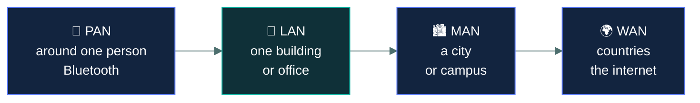
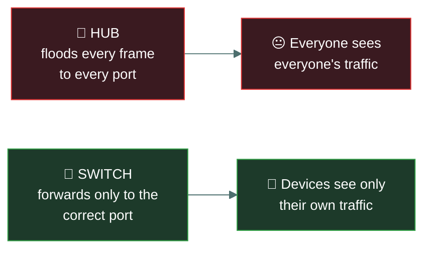
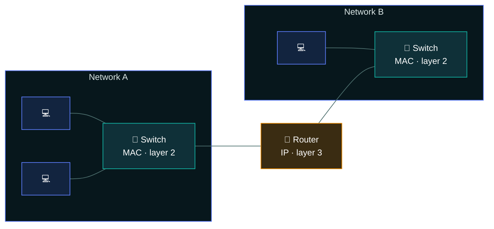
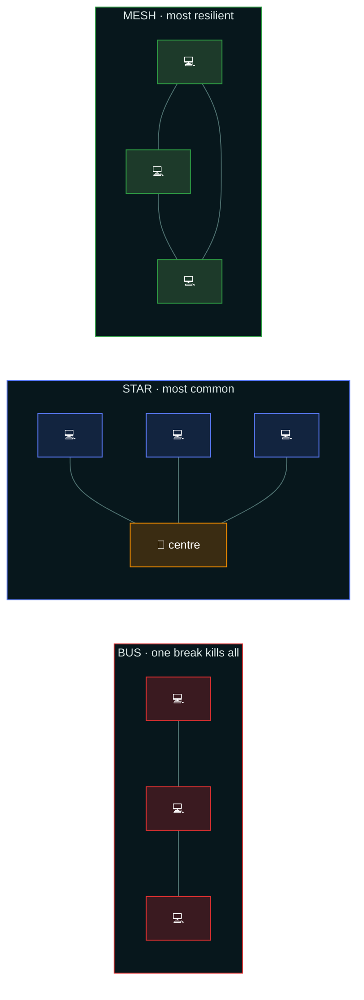

# 🕸️ Network fundamentals

### *What a network is made of, and what each box in the diagram actually does*

📌 *Network types, topologies, and the device list. Mostly recall — and the hub-versus-switch distinction is a security question, not a performance one.*

---

## 🧸 The big idea

A network is two or more devices connected so they can exchange data. Everything else is
detail about **how far apart they are** and **what sits in the middle**.

Two questions organise the whole topic:

- **How big is it?** A network inside one building is a LAN. One spanning cities is a WAN.
  The names are just distance labels.
- **What is in the middle?** Switches, routers, access points, firewalls. Each does one job,
  and the exam wants you to name it.

The security content hides inside the second question. A **hub** and a **switch** both connect
devices and look identical in a diagram — but a hub sends every frame to every port, so anyone
plugged in can see everyone's traffic. A switch sends each frame only where it belongs. That is
a confidentiality difference, and it is why hubs are obsolete.

---

## 📖 Words you will keep seeing

| Word | What it means on this exam |
|---|---|
| **LAN** — Local Area Network | A network in one limited area: a building, an office, a home. |
| **WAN** — Wide Area Network | A network spanning a large geographic area. The internet is the largest WAN. |
| **MAN** — Metropolitan Area Network | A network across a city or campus. Between LAN and WAN. |
| **PAN** — Personal Area Network | A very short-range network around one person — Bluetooth, for example. |
| **WLAN** — Wireless LAN | A LAN using wireless rather than cable. |
| **Intranet** | An organisation's private internal network, using internet technologies. |
| **Extranet** | A controlled extension of the intranet to specific outside parties — partners, suppliers. |
| **Topology** | The arrangement of how devices are connected. |
| **Node** | Any device on the network. |
| **Packet** | A unit of data at the network layer. |
| **Frame** | A unit of data at the data link layer. |
| **MAC address** | A hardware address burned into a network interface. Used within a LAN. |
| **Bandwidth** | The amount of data a link can carry. |
| **Latency** | The delay before data reaches its destination. |

---

## 🔍 Network types by size

**Smallest to largest: PAN → LAN → MAN → WAN.** That is the whole classification.

**Intranet and extranet** are about *who may reach it*, not size:

- **Intranet** — internal only. Staff.
- **Extranet** — a controlled slice extended to named outsiders. Suppliers, partners, customers.
- **Internet** — public.

---

## 🔧 The devices

The list the exam expects, and what each one does.

| Device | What it does | Layer |
|---|---|---|
| **Hub** | Repeats every incoming frame to **every** port. Obsolete. | 1 — Physical |
| **Repeater** | Regenerates a signal to extend cable distance. | 1 — Physical |
| **Switch** | Forwards frames only to the port where the destination MAC lives. | 2 — Data Link |
| **Bridge** | Connects two network segments. An early, simpler switch. | 2 — Data Link |
| **Router** | Moves packets **between** different networks, using IP addresses. | 3 — Network |
| **Firewall** | Permits or blocks traffic against a ruleset. | 3–4 (basic model) |
| **Access point** | Provides wireless connection into a wired network. | 1–2 |
| **Modem** | Converts between digital and the carrier's signal format. | 1 |
| **Gateway** | Connects networks using different protocols; translates between them. | varies |
| **Endpoint** | Any user device — laptop, phone, workstation. | — |

### 🔌 Hub versus switch — the security point

A **hub** is a repeater with several ports. A frame arriving on one port is sent out of **every**
other port. Every device on the hub receives every frame, and a device in promiscuous mode can
read all of it.

A **switch** learns which MAC address sits on which port and forwards each frame **only to that
port**.

> 🎯 **This is a confidentiality question in disguise.** If a question asks why hubs were replaced
> by switches for security reasons, the answer is that a hub broadcasts all traffic to all
> connected devices, allowing eavesdropping.

### 🔀 Switch versus router

- A **switch** connects devices **within** one network, using **MAC** addresses, at layer 2.
- A **router** connects **different** networks to each other, using **IP** addresses, at layer 3.

> 🧠 *Switches work inside; routers work between.*

The switches live **inside** the boxes. The router is the only thing spanning **between** them.

---

## 🗺️ Topologies

How devices are physically or logically arranged.

| Topology | Shape | Key property |
|---|---|---|
| **Bus** | All devices on one shared cable | Cheap; a break in the cable kills the whole network |
| **Star** | Every device connects to a central point | **The most common today.** One device failing affects only itself; the central device is a single point of failure |
| **Ring** | Each device connects to two neighbours, forming a loop | A break can bring down the ring unless it is dual-ring |
| **Mesh** | Devices interconnect with multiple paths | Most resilient and most expensive. **Full mesh** connects every node to every other |
| **Tree / hierarchical** | Stars connected into a hierarchy | Scales well; used in large networks |

Count the paths between any two nodes: **bus has one, star has one through an amber single point
of failure, mesh has several.** That count is the resilience.

> 🎯 Two facts carry most topology questions: **star is the most common**, and **mesh is the most
> resilient** because of its redundant paths.

---

## ⚖️ Told apart

| | Means | Not to be confused with |
|---|---|---|
| **Hub** | Floods every frame to every port. Layer 1. | **Switch**, which forwards only to the destination port. The difference is a security one. |
| **Switch** | Connects devices **within** a network using MAC addresses. Layer 2. | **Router**, which connects **between** networks using IP addresses. Layer 3. |
| **LAN** | One limited area. | **WAN**, spanning a wide geographic area. Distance is the only distinction. |
| **Intranet** | Internal, staff only. | **Extranet**, which extends controlled access to named external parties. |
| **Bandwidth** | How much data a link can carry. | **Latency**, how long data takes to get there. A high-bandwidth link can still be slow. |
| **Frame** | The unit at layer 2, addressed by MAC. | **Packet**, the unit at layer 3, addressed by IP. |
| **Star topology** | Most common. | **Mesh topology**, most resilient. Different superlatives. |

---

## ⚠️ Where your instinct is wrong

> [!WARNING]
> **In the job:** "switch" and "router" blur together — most access switches do layer 3, and the
> distinction is a licensing question.
>
> **On the exam:** they are strictly separate. **Switch = layer 2 = MAC = within a network.
> Router = layer 3 = IP = between networks.** Answer the clean model.

> [!WARNING]
> **In the job:** hubs are a museum piece not worth thinking about.
>
> **On the exam:** the hub is examined precisely *because* of why it died — it broadcasts all
> traffic to all ports, which is an eavesdropping exposure. Know the security reason, not just
> that it is obsolete.

> [!WARNING]
> **In the job:** topology is a physical cabling detail nobody discusses.
>
> **On the exam:** the names and their properties are tested directly. Star is most common; mesh
> is most resilient; bus fails entirely if the shared cable breaks.

---

## 🧠 How to remember it

🧠 **PAN · LAN · MAN · WAN** — smallest to largest, and they almost rhyme.

🧠 **Switches work inside, routers work between.** MAC inside, IP between.

🧠 **Hub = Hears everything.** Every port gets every frame.

🧠 **Star is common, mesh is resilient.** Two superlatives, two different topologies.

---

## ✅ Check you actually got it

Answer all five before expanding anything.

**Q1.** From a security perspective, what is the PRIMARY disadvantage of a hub compared with a
switch?

- **A.** Hubs are slower and create network congestion
- **B.** Hubs transmit all traffic to all connected ports, allowing eavesdropping
- **C.** Hubs cannot be assigned an IP address for management
- **D.** Hubs do not support wireless connections

<b>Answer</b>

**B — hubs transmit all traffic to all ports, allowing eavesdropping.** Any device connected to a
hub can capture every other device's traffic, which is a confidentiality exposure.

- **A** is true and is a real disadvantage, but it is a *performance* problem. The question asks
  specifically from a security perspective.
- **C** is a manageability limitation, not a security one, and unmanaged switches share it.
- **D** is irrelevant — neither hubs nor switches provide wireless connectivity; an access point
  does.

**Q2.** Which device forwards traffic between two different networks based on IP addresses?

- **A.** Switch
- **B.** Hub
- **C.** Router
- **D.** Repeater

<b>Answer</b>

**C — a router.** Routers operate at layer 3 and move packets between separate networks using IP
addressing.

- **A** operates within a single network at layer 2, forwarding frames by MAC address.
- **B** repeats signals within one segment at layer 1 and makes no forwarding decisions at all.
- **D** regenerates a signal to extend distance. It does not route anything.

**Q3.** An organisation gives selected suppliers controlled access to a portion of its internal
systems. What is this called?

- **A.** An intranet
- **B.** An extranet
- **C.** A WAN
- **D.** A VPN

<b>Answer</b>

**B — an extranet.** It is a controlled extension of internal resources to specific named external
parties.

- **A** is internal only, restricted to the organisation's own staff. Extending it to suppliers is
  precisely what makes this something else.
- **C** describes geographic scale, not who is permitted access. An extranet may or may not span a
  wide area.
- **D** names a *technology* that might be used to provide the connection securely. The question
  asks what the arrangement is called, not how it is implemented.

**Q4.** Which topology provides the HIGHEST resilience through redundant paths?

- **A.** Bus
- **B.** Star
- **C.** Ring
- **D.** Mesh

<b>Answer</b>

**D — mesh.** Multiple interconnections mean traffic can take an alternative path when a link
fails, which is what makes it the most resilient and also the most expensive.

- **A** is the least resilient of all: one break in the shared cable takes down the whole network.
- **B** is the most *common*, which is the superlative most often confused with this one. A star
  still has a single point of failure at the centre.
- **C** offers some resilience in dual-ring configurations, but a single ring breaks with one
  failure and it does not match mesh.

**Q5.** A network interface is identified within a LAN by which type of address?

- **A.** IP address
- **B.** MAC address
- **C.** Port number
- **D.** Subnet mask

<b>Answer</b>

**B — MAC address.** The MAC address is the hardware address used for layer 2 forwarding within a
local network, and it is what a switch builds its forwarding table from.

- **A** identifies a host at layer 3 and is what routers use to move traffic **between** networks.
- **C** identifies a service or application on a host at layer 4, not the interface itself.
- **D** defines which portion of an IP address is the network portion. It is not an identifier for
  an interface.

---

## 🎓 The grown-up version

<b>Extra depth — open this on a second read, never needed for the pass</b>

**Switches are not a security boundary.** The clean story — a switch only sends frames where they
belong — has well-known limits. **MAC flooding** fills the switch's address table until it fails
open and begins flooding like a hub, which is exactly what makes the attack worth doing. **ARP
spoofing** convinces hosts to send traffic to the attacker's MAC instead of the gateway's,
defeating the switch's correct forwarding by lying about who is where. Port security, dynamic
ARP inspection and DHCP snooping exist to close these. CC treats the switch as simply better than
a hub; the fuller picture is that it raises the cost of eavesdropping rather than eliminating it.

**Physical versus logical topology.** These frequently differ, and the distinction confuses people
looking at cabling. Classic Token Ring was wired as a physical star into a central unit while
operating as a logical ring. Modern Ethernet is physically a star into a switch, and logically
behaves like a point-to-point link per port rather than the shared bus that early Ethernet
actually was — which is why collisions and CSMA/CD are historical concepts on a switched network.

**Where "gateway" gets vague.** The term is used for at least three different things: the default
gateway (a router's address on your subnet), a protocol gateway that translates between
incompatible protocols, and application gateways such as email or API gateways. CC uses it loosely
for a device connecting dissimilar networks. If it appears as an option opposite "router" in a
question about connecting two IP networks, router is the more precise answer.

**Full mesh does not scale.** Connecting every node to every other requires n(n−1)/2 links, so ten
nodes need 45 connections and fifty nodes need 1,225. This is why full mesh appears in small
critical cores and almost nowhere else, and why partial mesh — redundant paths between important
nodes only — is what real resilient networks look like.

---

## 📝 Cram lines

Destined for [`EXAM-DAY.md`](../../EXAM-DAY.md):

- **PAN → LAN → MAN → WAN**, smallest to largest.
- **Intranet** = internal. **Extranet** = controlled access for named outsiders. **Internet** = public.
- **Hub** = layer 1, floods every frame to every port → **eavesdropping risk**. That's why switches replaced them.
- **Switch** = layer 2, **MAC**, forwards **within** a network.
- **Router** = layer 3, **IP**, forwards **between** networks.
- *Switches work inside, routers work between.*
- **Star = most common. Mesh = most resilient** (redundant paths). **Bus = one cable break kills it.**
- **Frame** = layer 2 unit (MAC). **Packet** = layer 3 unit (IP).
- **Bandwidth** = how much. **Latency** = how long.

---

<a href="../README.md">← back to 04 · Network Security</a> &nbsp;·&nbsp; <a href="../osi-and-tcpip/">next: OSI and TCP/IP →</a>

