# ☠️ Network threats

### *Who attacks networks, why, and the malware categories ISC2 names*

📌 *Threat actor types, the insider problem, and the malware taxonomy — where virus, worm and Trojan are separated by how they spread, not by what they do.*

---

## 🧸 The big idea

Along the trade road, danger comes from very different kinds of people, and from very different
kinds of tricks.

A rowdy youth copying a raid he saw someone else pull off is not the same problem as a rival
kingdom's trained spy network, patiently embedded for years without being noticed — and the
defences that stop one are useless against the other. Before the attacks themselves come the
**actors** and the **tools**, and actors are sorted by **motivation and capability**.

The tricks themselves are sorted differently — by **how they spread and hide**, not by what harm
they eventually cause — and this is the part candidates get wrong. A cursed trinket, a plague,
and a gift horse can all end the same way, with the village overrun. What separates them:

- A **cursed trinket** only spreads its curse when a person picks it up and carries it somewhere
  new themselves. That's a **virus** — it needs a human to run it.
- A **plague** spreads hut to hut on its own, through the air, with no person doing anything to
  help it along. That's a **worm** — it spreads by itself across a network.
- A **gift horse** left at the gate looks helpful, so the village willingly brings it inside —
  only for what's hidden inside it to come out once it's already past the walls. That's a
  **Trojan** — it pretends to be something useful so the human installs it willingly.

**The categories are about propagation, not payload.** Fix that and most malware questions
resolve themselves.

---

## 📖 Words you will keep seeing

| Word | What it means on this exam |
|---|---|
| **Threat actor** | The entity carrying out a threat. |
| **Insider threat** | A threat originating from someone with legitimate access. |
| **APT** — Advanced Persistent Threat | A well-resourced actor maintaining long-term covert access, usually state-linked. |
| **Script kiddie** | An unskilled attacker using tools written by others. |
| **Hacktivist** | An attacker motivated by a political or social cause. |
| **Malware** | Any software written to cause harm. The umbrella term. |
| **Virus** | Malware that attaches to a file and requires **user action** to spread. |
| **Worm** | Malware that spreads **by itself** over a network. |
| **Trojan** | Malware disguised as legitimate software. |
| **Ransomware** | Malware that encrypts data and demands payment. |
| **Spyware** | Malware that covertly gathers information. |
| **Rootkit** | Malware that hides itself and others, usually at a deep system level. |
| **Logic bomb** | Malicious code that triggers when a condition is met. |
| **Backdoor** | A concealed route into a system, bypassing normal authentication. |
| **Botnet** | A network of compromised machines under one attacker's control. |
| **Zero-day** | A vulnerability with no patch available, unknown to the vendor. |
| **Social engineering** | Manipulating people rather than technology. |

---

## 👤 Threat actors

The road's various troublemakers, ranked.

| Actor | Motivation | Capability |
|---|---|---|
| **Script kiddie** | Curiosity, notoriety, boredom | **Low** — uses others' tools without understanding them |
| **Hacktivist** | Political or social cause | Low to moderate; often defacement and DDoS |
| **Organised crime** | **Money** | High, well funded, professional — ransomware and fraud |
| **Insider** | Grievance, money, or pure accident | **Varies — but already has access** |
| **Nation state / APT** | Espionage, disruption, strategic advantage | **Highest** — patient, funded, persistent |
| **Competitor** | Commercial advantage | Varies |

> 🎯 **Ranked by capability, nation-state actors are the top and script kiddies the bottom.** If a
> question describes long-term stealthy access with substantial resources, it wants **APT**.

The insider sits outside the ladder deliberately: their capability varies enormously, and it
hardly matters, because they start past every perimeter control you own.

### 🕵️ The insider threat

The category the exam treats most seriously, because insiders bypass the perimeter entirely.
They are already authenticated and already authorised.

| Type | Means |
|---|---|
| **Malicious insider** | Deliberately causes harm — theft, sabotage, sale of data |
| **Negligent insider** | Careless: falls for phishing, misconfigures, emails the wrong person |
| **Compromised insider** | A legitimate user whose account an attacker controls |

> ⚠️ **Most insider incidents are accidental rather than malicious.** If a question asks for the
> most common form of insider threat, negligence is the expected answer.

**Controls the exam expects against insiders:** least privilege, segregation of duties, access
reviews, monitoring and logging, background checks, mandatory holidays and job rotation, and a
proper leaver process.

---

## 🦠 The malware taxonomy

### The three that get confused

| | Spreads how | Needs a human? | Attaches to a file? |
|---|---|:--:|:--:|
| **Virus** | Attaches to files; travels when the file travels | ✅ **Yes** | ✅ Yes |
| **Worm** | **Self-propagates** across networks | ❌ **No** | ❌ No — standalone |
| **Trojan** | Disguised as legitimate software | ✅ Yes — installs it | ❌ No |

Two questions separate all three. Run any scenario through them.

> [!IMPORTANT]
> **Worm = self-spreading, no user action.** This is the single most tested malware distinction.
> If a question describes malware spreading across a network without anyone doing anything, it is
> a worm. If a user had to open something, it is a virus or a Trojan.

### The rest

| Malware | Does |
|---|---|
| **Ransomware** | Encrypts data and demands payment. Recall: this is an **availability** attack. |
| **Spyware** | Covertly collects information — keystrokes, browsing, credentials |
| **Adware** | Displays unwanted advertising; often bundled with other software |
| **Rootkit** | Conceals itself and other malware, often below the operating system. Very hard to detect and usually requires rebuilding the host |
| **Logic bomb** | Dormant code triggered by a condition — a date, or a name disappearing from payroll |
| **Backdoor** | A hidden access route bypassing authentication |
| **Keylogger** | Records keystrokes. Can be software or a physical device |
| **Botnet** | Many compromised hosts controlled together, typically used for DDoS or spam |
| **Fileless malware** | Runs in memory using legitimate system tools, leaving little on disk |

> 🎯 **A logic bomb is defined by its trigger.** A disgruntled administrator leaving code that
> deletes records if their account is disabled is the textbook example.

---

## 🎣 Social engineering

Attacking the person rather than the technology. It appears in Domain 4 and again in Domain 5.

| Attack | Means |
|---|---|
| **Phishing** | Fraudulent email sent broadly, seeking credentials or action |
| **Spear phishing** | Phishing **targeted** at a specific individual or organisation |
| **Whaling** | Spear phishing aimed at **senior executives** |
| **Vishing** | Phishing by **voice** — a phone call |
| **Smishing** | Phishing by **SMS** |
| **Pretexting** | Inventing a scenario to establish false legitimacy |
| **Baiting** | Leaving infected media where someone will pick it up and use it |
| **Tailgating** | Following an authorised person through a controlled door |
| **Piggybacking** | Same, but with the authorised person's **consent** |
| **Shoulder surfing** | Watching someone enter credentials |
| **Dumpster diving** | Retrieving useful information from discarded material |

> ⚠️ **Tailgating versus piggybacking** is a tested pair. Both are following someone through a
> door. **Piggybacking has consent** — the person held the door. **Tailgating does not** — they
> did not know.

Going down the middle, the target narrows: **anyone → one person → one important person.** The
two branches change the *channel*, not the targeting.

> 🎯 **The defence against social engineering is security awareness training**, because the
> vulnerability is human, not technical. This is a reliable answer pattern.

---

## 🔬 How detection actually catches (or misses) this

The grown-up section mentions fileless, living-off-the-land techniques. Here's concretely why
they slip past one kind of defence and not another.

**Traditional signature-based antivirus hashes a file and checks that hash against a database of
known-bad hashes.** This is exactly why it's blind to fileless, living-off-the-land attacks:
there's no new file to hash at all when the "malware" is just PowerShell — a program already
signed and trusted by Microsoft — being told to download and run something in memory.

**Behavioural EDR (Endpoint Detection and Response) instead watches the *chain of actions*
regardless of what's a "file."** A rule flags something like "a Word document spawned
PowerShell, which then made an outbound network connection and executed base64-encoded
commands" — a sequence that's suspicious *in itself*, independent of any signature ever existing
for it. Vendors describe these chains using the shared vocabulary of **MITRE ATT&CK technique
IDs** (e.g. `T1059.001` for malicious PowerShell), which is the real, industry-standard naming
system behind terms like "living off the land" — it's a specific, catalogued, numbered technique
that defenders across the industry track and share detection rules for.

---

## ⚖️ Told apart

| | Means | Not to be confused with |
|---|---|---|
| **Virus** | Attaches to a file; a **user must run it**. | **Worm**, which spreads on its own with no user action. |
| **Worm** | Self-propagating, standalone. | **Virus**, which needs a host file and a human. |
| **Trojan** | Disguised as legitimate software; the user installs it. | **Virus**, which hides in a file the user already wanted. |
| **Rootkit** | **Hides** the presence of malware. | **Backdoor**, which provides **access**. They often appear together, doing different jobs. |
| **Logic bomb** | Triggered by a **condition**. | **Time bomb**, a logic bomb whose condition is a date — a subset, not a separate category. |
| **Spear phishing** | Targeted at a specific person. | **Whaling**, targeted at a **senior executive**, and plain **phishing**, which is broad. |
| **Tailgating** | Following through a door **without consent**. | **Piggybacking**, where the authorised person knowingly lets you in. |
| **Zero-day** | No patch exists; the vendor does not know. | An **unpatched** vulnerability, where a patch exists but has not been applied. |

> [!CAUTION]
> **Zero-day does not mean "unpatched".** It means no patch exists to apply. A server missing six
> months of updates is not facing a zero-day; it is simply unpatched. Questions exploit this.

---

## ⚠️ Where your instinct is wrong

> [!WARNING]
> **In the job:** the categories blur — modern malware is modular, and a single sample is a
> dropper, a worm and ransomware depending on the stage.
>
> **On the exam:** the taxonomy is clean and defined by **propagation method**. Answer on how it
> spreads: self-propagating is a worm, needs a user to run a file is a virus, disguised as
> something desirable is a Trojan.

> [!WARNING]
> **In the job:** insider threat means the malicious insider — the person exfiltrating data on
> their way out.
>
> **On the exam:** **most insider incidents are negligent**, not malicious. Careless staff cause
> more incidents than disloyal ones, and awareness training is the expected control.

> [!WARNING]
> **In the job:** "APT" is used loosely for any competent intrusion.
>
> **On the exam:** APT means a **well-resourced, persistent, usually state-linked** actor
> maintaining long-term covert access. Look for "sustained", "stealthy" and "sophisticated" in the
> stem.

---

## 🧠 How to remember it

🧠 **The three, by how they travel:**
**Virus** needs a ride (a file) and a driver (a user).
**Worm** walks by itself.
**Trojan** is invited in.

🧠 **Rootkit Hides, Backdoor Opens.**

🧠 **Zero-day = zero patches exist.** Not "we haven't patched it".

🧠 **Piggybacking has Permission.** Both start with P. Tailgating does not.

---

## ✅ Check you actually got it

Answer all five before expanding anything.

**Q1.** Malware spreads across an organisation's network within minutes, infecting hundreds of
systems without any user interaction. What type of malware is this MOST likely to be?

- **A.** Virus
- **B.** Worm
- **C.** Trojan
- **D.** Spyware

<b>Answer</b>

**B — a worm.** Self-propagation across a network with no user action is the defining
characteristic, and it explains the speed described.

- **A** requires a user to open or run an infected file. That would not produce hundreds of
  infections in minutes with nobody doing anything.
- **C** relies on the user being deceived into installing it, so it also requires human action at
  each host.
- **D** describes what malware *does* — covert information gathering — rather than how it spreads.
  Spyware could be delivered by any of the three mechanisms.

**Q2.** A departing administrator leaves code that will delete database records if their user
account is ever disabled. What is this?

- **A.** A rootkit
- **B.** A backdoor
- **C.** A logic bomb
- **D.** A worm

<b>Answer</b>

**C — a logic bomb.** It is dormant code awaiting a trigger condition, and the account being
disabled is that condition. This is the textbook example.

- **A** conceals the presence of malware. Nothing here is described as hiding anything.
- **B** provides covert access for later use. This code destroys data rather than granting entry.
- **D** would spread itself across the network, which this does not do.

**Q3.** Which statement about insider threats is correct?

- **A.** Insider threats are almost always deliberate acts of sabotage
- **B.** Most insider incidents result from negligence rather than malice
- **C.** Insider threats can be eliminated through perimeter firewalls
- **D.** Only privileged users can constitute an insider threat

<b>Answer</b>

**B — most insider incidents result from negligence.** Falling for phishing, misconfiguring a
system, emailing data to the wrong recipient — carelessness causes more incidents than
deliberate harm.

- **A** overstates the malicious category and is the common misconception this question targets.
- **C** is wrong by definition: an insider is already inside, so a perimeter control is
  irrelevant. Note the absolute "eliminated" as well.
- **D** is too narrow. Any user with legitimate access can be an insider threat; privilege
  increases the potential impact, not the eligibility.

**Q4.** An attacker exploits a flaw for which the vendor has not yet released a patch and of
which they were unaware. What is this called?

- **A.** An unpatched vulnerability
- **B.** A zero-day vulnerability
- **C.** A logic bomb
- **D.** A backdoor

<b>Answer</b>

**B — a zero-day vulnerability.** No patch exists and the vendor does not know about the flaw,
which is precisely what the term means.

- **A** is the important distractor. An unpatched vulnerability is one where a fix **exists** but
  has not been applied — an operational failure. A zero-day gives defenders nothing to apply.
- **C** is malicious code awaiting a trigger, not a flaw in software.
- **D** is a concealed access route, not an unknown vulnerability.

**Q5.** An employee holds a secure door open for someone they believe to be a colleague, who is
in fact unauthorised. What is this?

- **A.** Tailgating
- **B.** Piggybacking
- **C.** Pretexting
- **D.** Baiting

<b>Answer</b>

**B — piggybacking.** The authorised person knowingly allowed the other individual through. The
consent is what distinguishes it, even though that consent was obtained by deception.

- **A** is the same physical outcome **without** the authorised person's knowledge — slipping
  through behind them unnoticed. The stem explicitly describes the door being held open.
- **C** would describe an invented backstory used to establish false legitimacy. That may well have
  preceded this, but the act described is the entry itself.
- **D** involves leaving infected media for someone to find and use.

Some material uses these two terms interchangeably. Where a question distinguishes them,
**consent means piggybacking.**

---

## 🎓 The grown-up version

<b>Extra depth — open this on a second read, never needed for the pass</b>

**The taxonomy predates modern malware.** Virus, worm and Trojan were meaningful distinctions when
a sample did one thing. Contemporary intrusions use modular toolkits: an initial access broker
sells a foothold obtained by phishing, a loader pulls down modules on demand, one module moves
laterally using stolen credentials rather than an exploit, and ransomware deploys only at the end
after exfiltration. Asking "is this a worm or a Trojan" of such an operation has no clean answer.
The categories persist in teaching because they describe propagation mechanisms that still exist,
and in exams because they are testable.

**Living off the land.** Modern operations increasingly avoid malware entirely, using tools already
present on the system — PowerShell, WMI, PsExec, certutil — because they generate no malicious
file for antivirus to find and blend into normal administrative traffic. This is why endpoint
detection moved from signature matching towards behavioural analysis, and why "fileless" is a
category at all. CC touches this only lightly.

**Why rootkits are so serious.** A rootkit operating below the operating system — in the kernel, a
bootloader, or firmware — can lie to every tool running above it, including the antivirus asking
whether it is there. Once a rootkit is suspected, the only trustworthy response is to rebuild the
host from known-good media, because you cannot use a compromised system to verify whether it is
compromised. Secure Boot and measured boot exist to make this class of attack harder.

**The insider problem is structurally hard.** Every other threat can be addressed by keeping
someone out. Insiders are already in, and their harmful actions look a great deal like their
legitimate ones — a database administrator querying the database is doing their job until the
volume or timing looks wrong. This is why insider controls are heavily procedural rather than
technical: segregation of duties, mandatory holidays that force someone else into the role, job
rotation, and dual control for the most sensitive operations. These exist because no purely
technical control distinguishes a valid action from a valid action with bad intent.

**Attribution is genuinely difficult.** Public naming of nation-state actors rests on infrastructure
overlap, tooling similarities, working-hours analysis and language artefacts — all of which can be
deliberately faked. Confident attribution from technical evidence alone is rare, which is worth
remembering whenever a report names a culprit with certainty.

---

## 📝 Cram lines

Destined for [`EXAM-DAY.md`](../../EXAM-DAY.md):

- **Malware categories are about HOW IT SPREADS, not what it does.**
- **Virus** = attaches to a file, **needs a user to run it**. **Worm** = **self-spreading, no user action**. **Trojan** = disguised as legitimate, user installs it.
- **Rootkit HIDES. Backdoor OPENS.**
- **Logic bomb** = triggered by a **condition** (date, account disabled).
- **Zero-day = NO PATCH EXISTS.** Not the same as "unpatched", where a fix exists but wasn't applied.
- **Most insider incidents are NEGLIGENT**, not malicious.
- **APT** = well-resourced, persistent, long-term covert access, usually state-linked.
- **Phishing** broad · **spear phishing** targeted · **whaling** = executives · **vishing** = voice · **smishing** = SMS.
- **Piggybacking has Permission. Tailgating doesn't.**
- **Defence against social engineering = awareness training.**

---

<a href="../README.md">← back to 04 · Networking and Cloud Security Concepts</a> &nbsp;·&nbsp; <a href="../common-attacks/">next: Common attacks →</a>

