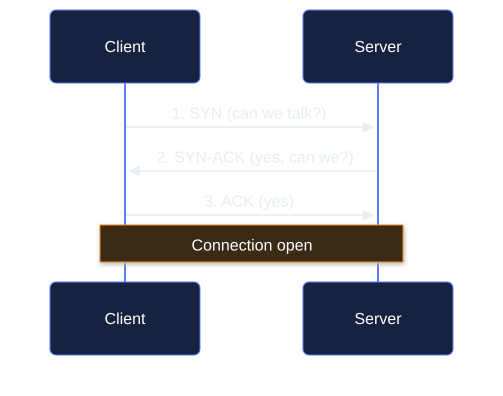

<div align="center">


# 🌐 OSI & TCP/IP Models — Caveman Style

### *Seven layers, four layers, and knowing which one anything belongs to*

[](../README.md)
[](../README.md)
[](#)

📌 *The highest-leverage page in this domain. A large share of Domain 4 questions reduce to "which layer is this?" — for a protocol, a device, or an attack.*

</div>

---

Think of networking like sending a message from Grog's cave to another cave.

The network has **layers**, and each layer has a different job.

For exams, you need to know:

- 🧱 The **7 OSI layers**
- 🧱 The **4 TCP/IP layers**
- 🔗 How the two models map to each other
- 🎯 Which technology/protocol belongs to which layer

---

# 🏔️ The 7 OSI Layers

Memorize these **from Layer 7 down to Layer 1**:

> **A P S T N D P**

### 7️⃣ Application

### 6️⃣ Presentation

### 5️⃣ Session

### 4️⃣ Transport

### 3️⃣ Network

### 2️⃣ Data Link

### 1️⃣ Physical

A useful sentence:

> **A**ll **P**eople **S**eem **T**o **N**eed **D**ata **P**rocessing.

<p align="center"></p>

---

# 🪨 Caveman Version

Imagine Grog sending:

> 🗣️ "MEAT!"

Each layer handles a different part of the journey.

---

# 7️⃣ Application — "What network service does the app need?"

This is closest to the user/application.

Examples:

- 🌐 HTTP / HTTPS
- 📧 SMTP
- 📬 IMAP
- 📁 FTP
- 🌐 DNS
- 🔐 SSH

Think:

> **"What network service is the application using?"**

### 🪨 Caveman

> "Grog wants webpage!"

---

# 6️⃣ Presentation — "How is the data represented?"

Handles things such as:

- 🔤 Data formatting
- 🔐 Encryption/decryption
- 🗜️ Compression

Think:

> **"What does the data look like, and how is it encoded/protected?"**

Examples often associated with this layer conceptually include:

- Encryption
- Compression
- Character encoding

> [!NOTE]
> In real modern networks, many of these functions don't fit neatly into a single OSI layer.

---

# 5️⃣ Session — "Keep the conversation going"

The Session layer deals with establishing, managing, and ending communication sessions.

Think:

> 🗣️ **"Start conversation → keep conversation → end conversation."**

Again, modern protocols often combine these functions with other layers.

---

# 4️⃣ Transport — "End-to-end delivery"

This is a **very important exam layer**.

Main protocols:

> 🔵 **TCP**

> 🟢 **UDP**

Transport handles things such as:

- Segmentation
- Reliability
- Flow control
- Port numbers
- End-to-end communication

### TCP

> Reliable, connection-oriented transport.

### UDP

> Connectionless, lower-overhead transport.

<p align="center"></p>

### 🪨 Caveman

> **"Get message from this application to that application."**

---

# 3️⃣ Network — "Where is the destination?"

Main idea:

> 🌐 **IP addressing and routing**

Important protocols:

- IPv4
- IPv6
- ICMP

Common device:

> 🛣️ **Router**

Think:

> **"Which network should this packet travel through?"**

### 🪨 Caveman

> "Which cave?"

---

# 2️⃣ Data Link — "Get it across this local network"

This layer deals with **frames** and local network delivery.

Examples:

- Ethernet
- Wi-Fi / IEEE 802.11
- MAC addresses
- ARP is often discussed around the boundary between Layer 2 and Layer 3, depending on the model/treatment.

Common devices:

> 🔀 **Switch**

Think:

> **"Which device on this local network should get this frame?"**

---

# 1️⃣ Physical — "Bits become signals"

This is the actual physical transmission.

Examples:

- 🔌 Copper cable
- 💡 Fiber-optic cable
- 📡 Radio signals
- Electrical/optical/radio signaling
- Connectors and physical media

Think:

> **"How do 1s and 0s physically travel?"**

---

# 🧠 The Seven Layers at a Glance

| OSI | Layer | Think |
| --- | --- | --- |
| 7 | 🟣 Application | Network services |
| 6 | 🔵 Presentation | Format/encryption/compression |
| 5 | 🟢 Session | Manage conversations |
| 4 | 🟡 Transport | TCP/UDP, ports |
| 3 | 🟠 Network | IP, routing |
| 2 | 🔴 Data Link | Frames, MAC, Ethernet/Wi-Fi |
| 1 | ⚫ Physical | Cables/signals/bits |

---

# 🌐 Now the TCP/IP Model

The TCP/IP model is commonly taught as **4 layers**:

### 4️⃣ Application

### 3️⃣ Transport

### 2️⃣ Internet

### 1️⃣ Network Access / Link

---

# 🔗 OSI → TCP/IP Mapping

This is **extremely important**.

<p align="center"></p>

```
OSI                         TCP/IP

7 Application ───────┐
6 Presentation ──────┼──→ 4 Application
5 Session ───────────┘

4 Transport ─────────────→ 3 Transport

3 Network ───────────────→ 2 Internet

2 Data Link ──────────┐
1 Physical ───────────┴──→ 1 Network Access / Link
```

### 🧠 Memorize:

> **OSI 7 + 6 + 5 → TCP/IP Application**

> **OSI 4 → TCP/IP Transport**

> **OSI 3 → TCP/IP Internet**

> **OSI 2 + 1 → TCP/IP Network Access**

---

# 🎯 The Big Exam Trick

If they ask:

> **"What layer is TCP?"**

Answer:

> **OSI Layer 4 — Transport**

TCP/IP model:

> **Transport layer**

---

If they ask:

> **"What layer is IP?"**

Answer:

> **OSI Layer 3 — Network**

TCP/IP:

> **Internet layer**

---

If they ask:

> **"What layer is Ethernet?"**

Answer:

> **OSI Layer 2 — Data Link**

TCP/IP:

> **Network Access/Link**

---

# 📦 Common Things and Their Layers

## 🟣 Layer 7 — Application

Think:

> **HTTP, HTTPS, DNS, SMTP, FTP, SSH**

| Technology | OSI |
| --- | --- |
| HTTP | 7 |
| HTTPS | 7 |
| DNS | 7 |
| SMTP | 7 |
| FTP | 7 |
| SSH | 7 |

---

## 🟡 Layer 4 — Transport

> **TCP / UDP**

| Technology | OSI |
| --- | --- |
| TCP | 4 |
| UDP | 4 |
| Port numbers | 4 |

Examples:

> TCP 443

> UDP 53

The **port number** points toward a service/application endpoint, but ports are a **Transport-layer** concept.

---

## 🟠 Layer 3 — Network

> **IP / routing**

| Technology | OSI |
| --- | --- |
| IPv4 | 3 |
| IPv6 | 3 |
| ICMP | 3 |
| IP address | 3 |
| Router | 3 |

Example:

> `192.168.1.10`

That's an **IP address**.

Think:

> 🌍 **Layer 3 = Which network/device destination?**

---

## 🔴 Layer 2 — Data Link

> **MAC / Ethernet / Wi-Fi**

| Technology | OSI |
| --- | --- |
| Ethernet | 2 |
| Wi-Fi (802.11) | 2 |
| MAC address | 2 |
| Switch | 2 |

Example:

> `00:1A:2B:3C:4D:5E`

That's a **MAC address**.

Think:

> 🏠 **Layer 2 = Local network delivery**

---

## ⚫ Layer 1 — Physical

Think:

> **Cable, fiber, radio, signals**

Examples:

- Ethernet cable as physical media
- Fiber
- Radio transmission
- Connectors
- Electrical signals

---

# 🧠 IP vs MAC — Don't Mix Them

This is a classic exam question.

### 🌐 IP address

> **Layer 3 — Network**

Used for:

> **Routing between networks**

Think:

> "Which cave/network?"

---

### 🏠 MAC address

> **Layer 2 — Data Link**

Used for:

> **Local network delivery**

Think:

> "Which device on this local network?"

---

# 🔀 Router vs Switch

### 🛣️ Router

Primarily:

> **Layer 3**

Uses:

> **IP addresses**

Routes traffic between networks.

---

### 🔀 Switch

Primarily:

> **Layer 2**

Uses:

> **MAC addresses**

Forwards frames within a local network.

<p align="center"></p>

---

# 📦 PDU Names — Extra Exam Points

Each layer has a common name for the data unit.

From upper layers downward:

> **Data → Segment → Packet → Frame → Bits**

### Layer 7/6/5

> 📄 **Data**

### Layer 4

> 📦 **Segment** — TCP

> 📦 **Datagram** — UDP

### Layer 3

> 📦 **Packet**

### Layer 2

> 🖼️ **Frame**

### Layer 1

> 01010101 **Bits**

<p align="center"></p>

---

# 🪨 Caveman Journey

Suppose Grog visits a website.

## 7️⃣ Application

Grog's browser uses:

> **HTTPS**

---

## 4️⃣ Transport

HTTPS traffic uses:

> **TCP**

and a port such as:

> **443**

---

## 3️⃣ Network

The packet gets:

> **IP addresses**

Routers use those addresses to move it between networks.

---

## 2️⃣ Data Link

The local network uses:

> **Ethernet/Wi-Fi + MAC addresses**

---

## 1️⃣ Physical

The bits travel through:

> 🔌 Cable / 📡 Wi-Fi / 💡 Fiber

---

# 🎯 Scenario Recognition

### "The device needs to find the destination network."

→ **Layer 3 — Network**

---

### "The application needs reliable delivery."

→ **Layer 4 — Transport / TCP**

---

### "A switch forwards traffic using MAC addresses."

→ **Layer 2 — Data Link**

---

### "A signal travels through fiber."

→ **Layer 1 — Physical**

---

### "A browser requests a webpage."

→ **Layer 7 — Application / HTTP(S)**

---

# 🧠 The Ultimate Memory Ladder

From **7 → 1**:

> 🟣 **Application** = What service?

> 🔵 **Presentation** = What format?

> 🟢 **Session** = What conversation?

> 🟡 **Transport** = Which application endpoint / how delivered?

> 🟠 **Network** = Which network?

> 🔴 **Data Link** = Which local device?

> ⚫ **Physical** = What signals?

And the **TCP/IP shortcut**:

> **OSI 7-6-5 → TCP/IP Application**

> **OSI 4 → Transport**

> **OSI 3 → Internet**

> **OSI 2-1 → Network Access**

### 🪨 One-line exam cheat code:

> **HTTP/DNS = 7, TCP/UDP/ports = 4, IP/router = 3, Ethernet/MAC/switch = 2, cables/signals = 1.**

---

# ✅ Check You Actually Got It

Answer all eight before expanding anything.

**Q1.** At which OSI layer does TCP operate?

- **A.** Layer 3 — Network
- **B.** Layer 4 — Transport
- **C.** Layer 5 — Session
- **D.** Layer 7 — Application

<details>
<summary><b>Answer</b></summary>

**B — Layer 4, Transport.** TCP and UDP are the transport protocols; ports live here too.

</details>

**Q2.** A network device forwards traffic between two different networks by examining destination IP addresses. What device is it and at which OSI layer does it primarily work?

- **A.** Switch — Layer 2
- **B.** Hub — Layer 1
- **C.** Router — Layer 3
- **D.** Firewall — Layer 7

<details>
<summary><b>Answer</b></summary>

**C — router, Layer 3.** Routing between networks using IP addresses is the Network layer's job.

- **A** — a switch forwards within a local network using MAC addresses.

</details>

**Q3.** Which pair of OSI layers maps to the TCP/IP **Network Access (Link)** layer?

- **A.** Layers 7, 6 and 5
- **B.** Layers 4 and 3
- **C.** Layers 3 and 2
- **D.** Layers 2 and 1

<details>
<summary><b>Answer</b></summary>

**D — Data Link (2) and Physical (1).**

- **A** maps to the TCP/IP Application layer.
- Layer 4 maps to Transport, and Layer 3 to Internet.

</details>

**Q4.** An address such as `00:1A:2B:3C:4D:5E` is used at which layer?

- **A.** Layer 2 — Data Link
- **B.** Layer 3 — Network
- **C.** Layer 4 — Transport
- **D.** Layer 1 — Physical

<details>
<summary><b>Answer</b></summary>

**A — Layer 2.** That's a MAC address, used for local network delivery. IP addresses are Layer 3.

</details>

**Q5.** A user types a website address into a browser, and a DNS query is sent. At which OSI layer does DNS operate?

- **A.** Layer 3
- **B.** Layer 4
- **C.** Layer 6
- **D.** Layer 7

<details>
<summary><b>Answer</b></summary>

**D — Layer 7, Application.** DNS is an application-layer service, even though it rides on UDP (Layer 4) port 53.

- **B** is the trap: the *port* is Layer 4, but the *protocol* is Layer 7.

</details>

**Q6.** What is the correct order of PDU names from the upper layers down?

- **A.** Bits → Frame → Packet → Segment → Data
- **B.** Data → Segment → Packet → Frame → Bits
- **C.** Data → Packet → Segment → Frame → Bits
- **D.** Segment → Data → Frame → Packet → Bits

<details>
<summary><b>Answer</b></summary>

**B.** Data (L7-5) → Segment (L4) → Packet (L3) → Frame (L2) → Bits (L1). **A** is the same list in reverse (bottom-up).

</details>

**Q7.** Which OSI layer is most associated with data formatting, encryption and compression?

- **A.** Session
- **B.** Presentation
- **C.** Transport
- **D.** Data Link

<details>
<summary><b>Answer</b></summary>

**B — Presentation (Layer 6).** "What does the data look like, and how is it encoded or protected?"

</details>

**Q8.** An attacker cuts a fiber-optic cable between two buildings. Which OSI layer is being attacked?

- **A.** Layer 1 — Physical
- **B.** Layer 2 — Data Link
- **C.** Layer 3 — Network
- **D.** Layer 7 — Application

<details>
<summary><b>Answer</b></summary>

**A — Physical.** The cable, fiber, radio and signals themselves are Layer 1.

</details>
