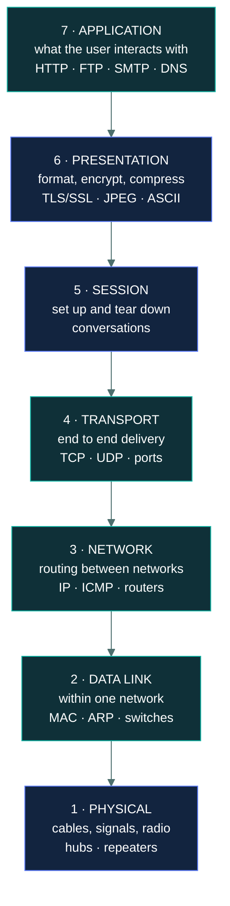
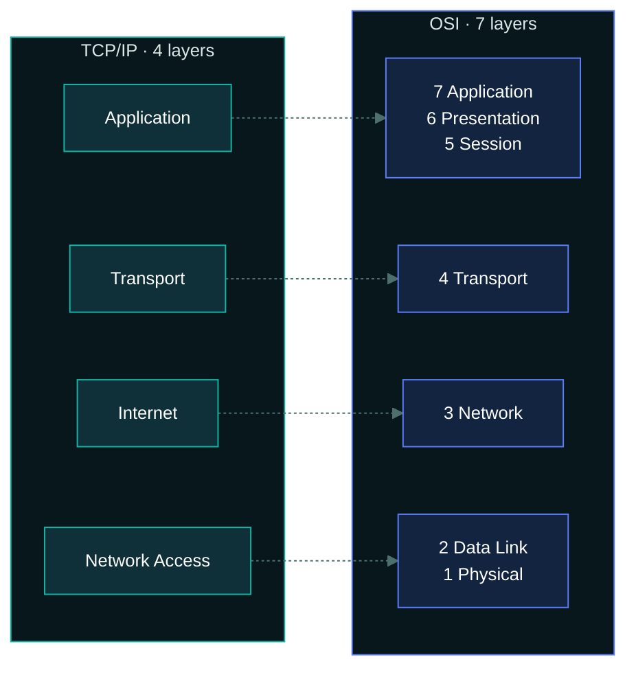
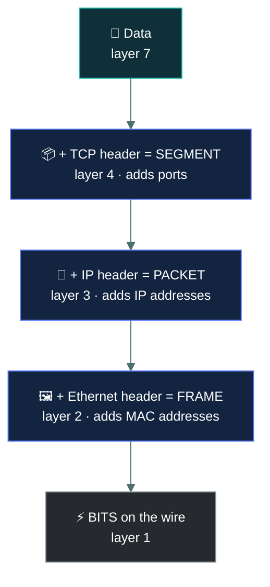

# 🪜 The OSI and TCP/IP models

### *Seven layers, four layers, and knowing which one anything belongs to*

📌 *The highest-leverage page in this domain. A large share of Domain 4 questions reduce to "which layer is this?" — for a protocol, a device, or an attack.*

---

## 🧸 The big idea

Sending a trade proposal from one chief to another actually takes seven separate jobs, each
handled by a different specialist, each one only caring about their own piece:

The chief decides *what* to say — the actual trade offer. A scribe translates it into a shared
symbol system both villages understand. A negotiator opens the "conversation" between the two
chiefs and keeps track of where it's up to. A courier splits a long message into numbered
pieces and makes sure every single one arrives, resending any that go missing. A route-master
works out which villages the message must pass through to get there at all. A local runner in
each village only needs to know which hut to hand it to next. And underneath all of that, the
actual road, drums, or smoke signal physically carries it.

That's the whole idea. Networking is complicated, so it is broken into **layers**. Each layer
does one job and hands its result to the layer below, which does its own job and hands it down
again. At the far end the stack runs in reverse.

The advantage of layering is independence: the route-master can be swapped for someone using a
completely different set of trade roads, and the chief never even notices — because you can
change the wireless card without rewriting the web browser, since each layer only needs to know
how to talk to its neighbours.

There are two models, and the exam uses both:

- **OSI** — seven layers. A conceptual reference model. This is the one that gets tested.
- **TCP/IP** — four layers. The model the internet actually runs on.

**Learn OSI properly and map TCP/IP onto it.** The overwhelming majority of layer questions are
OSI questions.

---

## 📖 Words you will keep seeing

| Word | What it means on this exam |
|---|---|
| **OSI model** | Open Systems Interconnection. A seven-layer conceptual reference model. |
| **TCP/IP model** | The four-layer model the internet is built on. Sometimes shown as five layers. |
| **Encapsulation** | Each layer wrapping the data from the layer above with its own header. |
| **PDU** — Protocol Data Unit | The name for the data unit at a given layer: bits, frames, packets, segments, data. |
| **TCP** | Transmission Control Protocol. Connection-oriented and reliable. |
| **UDP** | User Datagram Protocol. Connectionless and fast, with no delivery guarantee. |
| **Three-way handshake** | How TCP establishes a connection: **SYN → SYN-ACK → ACK**. |
| **Segment** | The layer 4 PDU in TCP. |
| **Packet** | The layer 3 PDU. |
| **Frame** | The layer 2 PDU. |

---

## 🪜 The seven OSI layers

The chief's trade proposal, laid out top to bottom: the chief (7 · Application), the scribe (6 ·
Presentation), the negotiator (5 · Session), the courier numbering the pieces (4 · Transport),
the route-master (3 · Network), the local runner (2 · Data Link), and the road itself (1 ·
Physical).

Numbered from the bottom up. Layer 1 is the cable; layer 7 is the application.

| # | Layer | Does | PDU | Protocols | Devices |
|:--:|---|---|---|---|---|
| **7** | **Application** | Interfaces with the user's software | Data | HTTP, HTTPS, FTP, SMTP, DNS, SNMP, DHCP | Application gateway, WAF |
| **6** | **Presentation** | Formats, encrypts, compresses | Data | TLS/SSL, JPEG, ASCII, MPEG | — |
| **5** | **Session** | Establishes, manages, ends sessions | Data | NetBIOS, RPC, PPTP | — |
| **4** | **Transport** | End-to-end delivery, **ports** | **Segment** | **TCP, UDP** | Basic firewall (with L3) |
| **3** | **Network** | Routing between networks, **IP** | **Packet** | **IP, ICMP**, IPSec | **Router**, layer 3 switch |
| **2** | **Data Link** | Delivery within one network, **MAC** | **Frame** | **ARP**, Ethernet, PPP | **Switch**, bridge, NIC |
| **1** | **Physical** | Bits as electrical, light or radio signals | **Bit** | — | **Hub**, repeater, cable, modem |

### The four layers that carry the marks

Most exam questions live in **1, 2, 3 and 4**. Fix these and the rest follows:

| Layer | Address | Device | Unit |
|---|---|---|---|
| **4 · Transport** | **Port number** | — | Segment |
| **3 · Network** | **IP address** | **Router** | Packet |
| **2 · Data Link** | **MAC address** | **Switch** | Frame |
| **1 · Physical** | none | **Hub** | Bit |

> 🎯 **Address type identifies the layer.** MAC → 2. IP → 3. Port → 4. That single rule answers a
> great many questions.

---

## 🌐 The TCP/IP model

Four layers, mapping onto OSI like this:

| TCP/IP layer | Absorbs OSI layers |
|---|---|
| **Application** | 7 + 6 + 5 |
| **Transport** | 4 |
| **Internet** | 3 |
| **Network Access** (or Link) | 2 + 1 |

> ⚠️ **The TCP/IP layer is called "Internet", not "Network".** OSI layer 3 is Network; the
> equivalent TCP/IP layer is Internet. This naming difference is examined.

---

## 🔄 TCP versus UDP

Both live at layer 4. The distinction comes up repeatedly.

| | **TCP** | **UDP** |
|---|---|---|
| Connection | **Connection-oriented** — handshake first | **Connectionless** — just sends |
| Reliability | **Guaranteed delivery**, acknowledged, retransmits | **No guarantee**, no acknowledgement |
| Ordering | Reassembles in order | No ordering |
| Speed | Slower — more overhead | **Faster** — minimal overhead |
| Used for | Web, email, file transfer — anything that must arrive intact | Streaming, voice, video, DNS queries, gaming |

**The three-way handshake** establishes a TCP connection:

**SYN → SYN-ACK → ACK.** Know this sequence: it is the basis of the SYN flood attack, where an
attacker sends many SYNs and never completes the handshake, exhausting the server's table of
half-open connections.

---

## 📦 Encapsulation

As data moves down the stack, each layer adds its own header. Coming back up, each layer strips
its own header off.

> 🧠 **Data → Segment → Packet → Frame → Bits**, going down. Reverse coming up.

---

## ⚖️ Told apart

| | Layer | Not to be confused with |
|---|---|---|
| **Switch** | 2 — Data Link, uses MAC | **Router**, layer 3, uses IP |
| **Hub** | 1 — Physical, no addressing at all | **Switch**, layer 2, which makes forwarding decisions |
| **IP** | 3 — Network | **TCP/UDP**, layer 4. IP gets it to the host; ports get it to the application |
| **ARP** | **2 — Data Link** | Commonly misplaced at layer 3 because it resolves IP to MAC. It operates at layer 2 |
| **TLS/SSL** | **6 — Presentation** | Often assumed to be layer 7 or 4. ISC2 places encryption at Presentation |
| **TCP** | Connection-oriented, reliable, slower | **UDP**, connectionless, unreliable, faster |
| **OSI layer 3** | Called **Network** | **TCP/IP layer 2**, called **Internet**. Same function, different name |
| **Packet** | Layer 3 PDU | **Frame** (layer 2) and **segment** (layer 4) |

> [!CAUTION]
> **The two most-missed placements are ARP and TLS.**
> **ARP is layer 2** — it resolves an IP address to a MAC address, and it operates within the
> local network at the data link layer.
> **TLS/SSL is layer 6, Presentation**, because encryption and formatting are what that layer
> does. Some material argues for other placements; on this exam, answer Presentation.

---

## ⚠️ Where your instinct is wrong

> [!WARNING]
> **In the job:** TLS is a transport-security protocol that rides on TCP, and you would place it
> at layer 4 or call the whole question academic.
>
> **On the exam:** **TLS/SSL is layer 6, Presentation.** Encryption is a presentation-layer
> function in the OSI model. Answer the model, not the implementation.

> [!WARNING]
> **In the job:** the OSI model is a teaching artefact nobody uses; real work happens in the
> TCP/IP stack.
>
> **On the exam:** OSI is the primary model and seven-layer questions dominate. Learn it
> thoroughly and treat TCP/IP as a mapping exercise.

> [!WARNING]
> **In the job:** a modern firewall inspects application content, so calling it a layer 3/4 device
> is out of date.
>
> **On the exam:** a basic **firewall is layer 3 and 4**, filtering on IP addresses and ports.
> Application-aware inspection is described separately, as an application-layer or
> next-generation capability.

---

## 🧠 How to remember it

🧠 **Layer 7 down to 1:**
**A**ll **P**eople **S**eem **T**o **N**eed **D**ata **P**rocessing
*Application, Presentation, Session, Transport, Network, Data Link, Physical.*

🧠 **Layer 1 up to 7:**
**P**lease **D**o **N**ot **T**hrow **S**ausage **P**izza **A**way

🧠 **The address rule:** **MAC = 2, IP = 3, Port = 4.**

🧠 **The PDU chain going down:** **D**o **S**ome **P**eople **F**ear **B**irthdays —
Data, Segment, Packet, Frame, Bits.

🧠 **Handshake:** **SYN → SYN-ACK → ACK.**

---

## ✅ Check you actually got it

Answer all five before expanding anything.

**Q1.** At which OSI layer does a switch primarily operate?

- **A.** Layer 1 — Physical
- **B.** Layer 2 — Data Link
- **C.** Layer 3 — Network
- **D.** Layer 4 — Transport

<b>Answer</b>

**B — layer 2, Data Link.** A switch forwards frames using MAC addresses, and MAC addressing is a
layer 2 function.

- **A** is where a hub operates. Hubs repeat signals without examining any address.
- **C** is where a router operates, forwarding packets by IP address. Layer 3 switches exist, but
  the exam's basic model places a switch at layer 2.
- **D** is where ports and TCP/UDP live. Switches do not examine port numbers.

**Q2.** Which protocol resolves an IP address to a MAC address, and at which layer does it
operate?

- **A.** DNS, at layer 7
- **B.** ARP, at layer 2
- **C.** ARP, at layer 3
- **D.** ICMP, at layer 3

<b>Answer</b>

**B — ARP, at layer 2.** Address Resolution Protocol maps a known IP address to the MAC address
needed to deliver a frame within the local network, and it operates at the data link layer.

- **A** describes DNS, which resolves *names* to IP addresses — a different job entirely, at the
  application layer.
- **C** is the single most common error on this topic. ARP *involves* IP addresses, which makes
  layer 3 feel right, but it functions at layer 2 to enable local frame delivery.
- **D** names ICMP, which carries error and diagnostic messages such as those used by ping. It
  does not resolve addresses.

**Q3.** Which statement correctly distinguishes TCP from UDP?

- **A.** TCP is faster because it has less overhead
- **B.** UDP guarantees delivery through acknowledgements
- **C.** TCP is connection-oriented and reliable; UDP is connectionless and unreliable
- **D.** TCP operates at layer 3 and UDP at layer 4

<b>Answer</b>

**C — TCP is connection-oriented and reliable; UDP is connectionless and unreliable.** TCP
establishes a session with a handshake, acknowledges data and retransmits what is lost; UDP
simply sends.

- **A** is reversed. UDP is the faster one, precisely because it lacks TCP's overhead.
- **B** is reversed. Acknowledged, guaranteed delivery is TCP's defining feature, and its absence
  is UDP's.
- **D** is wrong — both operate at layer 4, the transport layer.

**Q4.** A firewall filtering traffic based on source IP address and destination port number is
operating at which layers?

- **A.** Layers 1 and 2
- **B.** Layers 3 and 4
- **C.** Layers 5 and 6
- **D.** Layer 7 only

<b>Answer</b>

**B — layers 3 and 4.** IP addresses are layer 3 and port numbers are layer 4, so a firewall
examining both operates across those two layers.

- **A** covers physical signalling and MAC addressing, neither of which is mentioned in the stem.
- **C** covers session management and formatting or encryption. Not relevant to address and port
  filtering.
- **D** would describe an application-layer firewall inspecting content such as HTTP requests —
  a genuine capability, but not what this stem describes.

**Q5.** What is the correct order of the TCP three-way handshake?

- **A.** ACK → SYN → SYN-ACK
- **B.** SYN → ACK → SYN-ACK
- **C.** SYN → SYN-ACK → ACK
- **D.** SYN-ACK → SYN → ACK

<b>Answer</b>

**C — SYN → SYN-ACK → ACK.** The client requests a connection with SYN, the server acknowledges
and requests in return with SYN-ACK, and the client confirms with ACK.

- **A**, **B** and **D** all scramble the sequence. The logic is fixed: a request cannot be
  acknowledged before it is made, so any order not beginning with SYN is impossible.

Worth knowing cleanly, because the SYN flood attack works by sending many SYNs and never sending
the final ACK, leaving the server holding half-open connections.

---

## 🎓 The grown-up version

<b>Extra depth — open this on a second read, never needed for the pass</b>

**OSI never shipped.** The model was developed as part of a full protocol suite intended to be
*the* standard for networking. The protocols lost to TCP/IP comprehensively, and what survived was
the reference model — a vocabulary rather than an implementation. This is why real protocols map
onto it awkwardly: they were never designed against it. TLS is the obvious case, sitting between
transport and application and satisfying nobody's clean placement.

**Session and Presentation barely exist in practice.** In the TCP/IP world their functions are
absorbed into applications. There is no distinct session-layer protocol in a normal web request —
the application manages its own sessions, often with cookies, and does its own content
negotiation. These two layers are largely why practitioners call OSI academic, and also why exam
questions about layers 5 and 6 are comparatively rare.

**Layer 8.** An informal joke term for the user, occasionally extended to layers 9 and 10 for
politics and money. It appears in security writing as shorthand for "the problem is not
technical". Never a correct exam answer, but worth recognising.

**Why layer placement matters for defence.** The layer at which a control operates determines what
it can and cannot see. A layer 3/4 firewall sees addresses and ports but not content, so it cannot
tell legitimate HTTPS from an attack inside the tunnel. A WAF at layer 7 sees the request body but
must terminate TLS to do it, creating its own exposure. Understanding layer placement is
therefore not trivia — it tells you the blind spot of every device in the path, which is exactly
the reasoning defence in depth is built on.

**Encapsulation and tunnelling.** A VPN works by encapsulating whole packets inside other packets,
which is why the same PDU vocabulary applies twice over in a tunnelled connection — an inner
packet carrying the real addresses, wrapped in an outer packet carrying the tunnel endpoints. This
is also why tunnelling can bypass filtering: a firewall inspecting the outer headers sees only
traffic to the VPN endpoint.

---

## 📝 Cram lines

Destined for [`EXAM-DAY.md`](../../EXAM-DAY.md):

- **All People Seem To Need Data Processing** — Application, Presentation, Session, Transport, Network, Data Link, Physical (7→1).
- **MAC = layer 2. IP = layer 3. Port = layer 4.** The address tells you the layer.
- **Hub = 1. Switch = 2. Router = 3. Basic firewall = 3+4.**
- **PDUs going down: Data → Segment → Packet → Frame → Bits.**
- **ARP is LAYER 2**, not 3. Most-missed placement.
- **TLS/SSL is LAYER 6 (Presentation)** on this exam.
- **TCP** = connection-oriented, reliable, acknowledged, slower. **UDP** = connectionless, unreliable, faster.
- **Handshake: SYN → SYN-ACK → ACK.**
- **TCP/IP has 4 layers:** Application (7+6+5), Transport (4), **Internet** (3), Network Access (2+1).
- **TCP/IP calls layer 3 "Internet", OSI calls it "Network".**

---

<a href="../README.md">← back to 04 · Networking and Cloud Security Concepts</a> &nbsp;·&nbsp; <a href="../ip-addressing/">next: IP addressing →</a>

